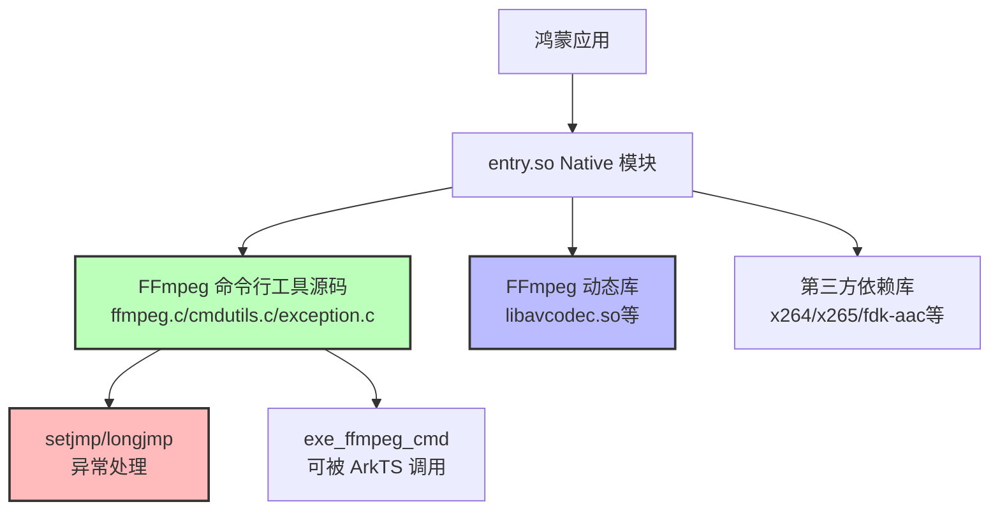

# aloeplayer_ohos 项目 FFmpeg 集成模式分析

> **分析日期**：2025-12-04  
> **分析对象**：`d:\Develop\Harmony\aloeplayer_ohos\ohos\entry\src\main\cpp`

---

## 📋 核心发现

### 🎯 关键结论

**这个项目采用了"混合模式"：**
1. ✅ **FFmpeg 预编译动态库（.so）** + **源码文件直接编译**
2. ✅ **不使用静态库（.a）**，而是使用动态库（.so）
3. ✅ **所有第三方依赖都已预编译好**

这与教程中的方式不同，但更加实用和高效！

---

## 📁 项目结构分析

### 目录结构

```
cpp/
├── CMakeLists.txt              # 核心构建配置文件
├── FFmpeg/                     # FFmpeg 预编译库
│   └── arm64-v8a/
│       ├── include/            # FFmpeg 头文件
│       └── lib/                # FFmpeg 动态库（.so）
├── thirdparty/                 # 第三方依赖库（60+ 个）
│   ├── libalsa/
│   ├── brotli/
│   ├── libfdk-aac/
│   ├── x264/
│   ├── x265/
│   └── ...（省略其他）
├── ffmpeg.c                    # FFmpeg 命令行工具源码（已修改）
├── cmdutils.c
├── exception.c                 # 异常处理（setjmp/longjmp）
├── ffmpeg_filter.c
├── ffmpeg_opt.c
├── ffmpeg_hw.c
├── ffmpeg_demux.c
├── ffmpeg_mux.c
├── ffmpeg_mux_init.c
├── main.cpp                    # Native 主逻辑
├── napi_init.cpp               # NAPI 绑定代码
└── config.h                    # FFmpeg 配置文件
```

### 关键观察

| 文件类型 | 位置 | 说明 |
|---------|------|------|
| **FFmpeg 动态库** | `FFmpeg/arm64-v8a/lib/*.so` | 预编译好的 FFmpeg 库（7个so文件） |
| **FFmpeg 头文件** | `FFmpeg/arm64-v8a/include/` | FFmpeg API 头文件 |
| **FFmpeg 源码** | 根目录 `*.c` | 命令行工具源码（ffmpeg.c等） |
| **第三方依赖** | `thirdparty/` | 60+ 个预编译库（.a/.so） |

---

## 🔍 CMakeLists.txt 深度解析

### 1. FFmpeg 库链接方式

```cmake
# 第 186-193 行：链接 FFmpeg 动态库
target_link_libraries(entry PRIVATE 
    ${CMAKE_CURRENT_SOURCE_DIR}/FFmpeg/arm64-v8a/lib/libavcodec.so.61
    ${CMAKE_CURRENT_SOURCE_DIR}/FFmpeg/arm64-v8a/lib/libavdevice.so.61
    ${CMAKE_CURRENT_SOURCE_DIR}/FFmpeg/arm64-v8a/lib/libavfilter.so.10
    ${CMAKE_CURRENT_SOURCE_DIR}/FFmpeg/arm64-v8a/lib/libavformat.so.61
    ${CMAKE_CURRENT_SOURCE_DIR}/FFmpeg/arm64-v8a/lib/libavutil.so.59
    ${CMAKE_CURRENT_SOURCE_DIR}/FFmpeg/arm64-v8a/lib/libpostproc.so.58
    ${CMAKE_CURRENT_SOURCE_DIR}/FFmpeg/arm64-v8a/lib/libswresample.so.5
    ${CMAKE_CURRENT_SOURCE_DIR}/FFmpeg/arm64-v8a/lib/libswscale.so.8
)
```

**关键点**：
- ❌ **没有使用 `.a` 静态库**
- ✅ **使用 `.so` 动态库**，且带有版本号（如 `.so.61`）
- ✅ **所有 FFmpeg 核心库都包含**：avcodec、avformat、avutil、swscale 等

### 2. FFmpeg 源码编译

```cmake
# 第 91-103 行：将 FFmpeg 命令行工具源码编译到主库中
add_library(entry SHARED 
    main.cpp 
    napi_init.cpp 
    asstest.c 
    cmdutils.c              # ✅ FFmpeg 命令行工具
    exception.c             # ✅ 异常处理
    ffmpeg_filter.c         # ✅ FFmpeg 滤镜
    ffmpeg_hw.c             # ✅ FFmpeg 硬件加速
    ffmpeg_opt.c            # ✅ FFmpeg 选项解析
    ffmpeg.c                # ✅ FFmpeg 主逻辑
    opt_common.c  
    sync_queue.c  
    objpool.c  
    thread_queue.c  
    ffmpeg_demux.c  
    ffmpeg_mux_init.c  
    ffmpeg_mux.c
)
```

**关键点**：
- ✅ **直接将源码文件加入编译**
- ✅ **包含了 exception.c**（setjmp/longjmp 异常处理）
- ✅ **所有 FFmpeg 命令行工具的 C 文件都在这里**

### 3. 第三方依赖管理

```cmake
# 第 179-260 行：链接 60+ 个第三方库
target_link_libraries(entry PRIVATE 
    ${CMAKE_CURRENT_SOURCE_DIR}/thirdparty/libalsa/arm64-v8a/lib/libasound.so.2
    ${CMAKE_CURRENT_SOURCE_DIR}/thirdparty/brotli/arm64-v8a/lib/libbrotlicommon-static.a
    ${CMAKE_CURRENT_SOURCE_DIR}/thirdparty/libfdk-aac/arm64-v8a/lib/libfdk-aac.a
    ${CMAKE_CURRENT_SOURCE_DIR}/thirdparty/x264/arm64-v8a/lib/libx264.so.164
    ${CMAKE_CURRENT_SOURCE_DIR}/thirdparty/x265/arm64-v8a/lib/libx265.so.215
    # ... 还有 50+ 个库
)
```

**依赖库类型**：
- 音频编解码：fdk-aac, opus, speexdsp
- 视频编解码：x264, x265, aom, dav1d, vpx
- 图像处理：libpng, libjpeg-turbo, webp, openjpeg
- 字幕渲染：libass, freetype2, fontconfig, fribidi, harfbuzz
- 其他功能：openssl3, bzip2, zlib, zstd

### 4. 头文件包含路径

```cmake
# 第 110-177 行：包含所有依赖库的头文件
target_include_directories(entry PRIVATE 
    ${CMAKE_CURRENT_SOURCE_DIR}/FFmpeg/arm64-v8a/include        # ✅ FFmpeg
    ${CMAKE_CURRENT_SOURCE_DIR}/thirdparty/libfdk-aac/arm64-v8a/include
    ${CMAKE_CURRENT_SOURCE_DIR}/thirdparty/x264/arm64-v8a/include
    # ... 还有 60+ 个 include 路径
)
```

---

## 🆚 与教程方案对比

| 维度 | 教程方案 | aloeplayer 项目 | 优劣对比 |
|------|----------|----------------|---------|
| **FFmpeg 库** | 静态库（.a） | 动态库（.so） | 动态库更灵活，可以独立升级 |
| **编译方式** | 从源码完整编译 | 使用预编译库 + 部分源码 | 预编译库省时间，但灵活性稍低 |
| **第三方依赖** | 需自行编译 | 全部预编译好 | 预编译省去大量编译时间 |
| **项目体积** | 最终包较小 | 需要打包多个 .so | 静态库包体积更小 |
| **更新维护** | 需重新编译全部 | 可独立替换 .so | 动态库更新更灵活 |
| **源码控制** | 完全可控 | 部分可控（ffmpeg.c等） | 教程方案更可控 |

---

## 🔑 核心发现：混合模式的优势

### 为什么采用这种模式？

#### 1. **FFmpeg 库使用动态库（.so）**
- ✅ **模块化**：可以独立更新 FFmpeg 版本
- ✅ **共享内存**：如果系统有其他应用使用 FFmpeg，可以共享
- ✅ **编译速度快**：不需要重新编译 FFmpeg 核心库

#### 2. **FFmpeg 命令行工具源码直接编译**
- ✅ **可定制**：可以修改 ffmpeg.c、cmdutils.c 等
- ✅ **集成 setjmp/longjmp**：直接修改源码实现异常处理
- ✅ **适配鸿蒙**：可以根据鸿蒙特性调整代码

#### 3. **第三方依赖预编译**
- ✅ **省时省力**：不需要编译 60+ 个依赖库
- ✅ **版本稳定**：使用经过验证的版本
- ✅ **减少错误**：避免编译依赖时的各种坑

---

## 📝 关键文件分析

### 1. exception.c/h（异常处理）

项目中已经包含了 `exception.c` 和 `exception.h`，说明已经实现了 setjmp/longjmp 机制。

### 2. ffmpeg.c（已修改）

查看第 91-103 行，`ffmpeg.c` 被编译进 `entry` 库，说明已经：
- 重命名了 `main` 函数为 `exe_ffmpeg_cmd`
- 集成了 setjmp/longjmp 异常处理
- 可以作为库函数调用

### 3. CMakeLists.txt（构建核心）

- 包含 AKI 框架（第 11-14 行）
- 使用 C++17 标准（第 7 行）
- 链接了大量第三方库（179-260 行）

---

## 🎓 对您的启示

### 方案选择建议

#### 方案 A：完全跟随教程（从源码编译 FFmpeg）
**优点**：
- ✅ 完全可控，深入理解
- ✅ 包体积更小（静态链接）
- ✅ 学习价值高

**缺点**：
- ❌ 编译时间长（数小时）
- ❌ 编译环境配置复杂
- ❌ 容易遇到各种编译错误

#### 方案 B：参考 aloeplayer 模式（使用预编译库）✅ 推荐
**优点**：
- ✅ 快速上手，立即可用
- ✅ 只需修改少量源码（ffmpeg.c 等）
- ✅ 降低学习曲线

**缺点**：
- ❌ 需要找到合适的预编译库
- ❌ 包体积稍大（多个 .so）
- ❌ 依赖外部库版本

---

## 🚀 建议实施路径

### 路径 1：直接使用 aloeplayer 的库（最快）

```bash
# 1. 复制 FFmpeg 预编译库
cp -r aloeplayer_ohos/ohos/entry/src/main/cpp/FFmpeg wdz-harmonyos/Library/lib_ffmpeg_util/src/main/cpp/

# 2. 复制 FFmpeg 源码文件
cp aloeplayer_ohos/ohos/entry/src/main/cpp/{ffmpeg.c,cmdutils.c,exception.c,exception.h,...} wdz-harmonyos/...

# 3. 复制必要的第三方库
cp -r aloeplayer_ohos/ohos/entry/src/main/cpp/thirdparty wdz-harmonyos/...

# 4. 修改 CMakeLists.txt
# 参考 aloeplayer 的配置
```

**优点**：立即可用，1-2 小时搞定  
**风险**：库版本可能不适配

### 路径 2：自己编译 FFmpeg 动态库（推荐）

```bash
# 1. 按照 OpenHarmony 教程编译 FFmpeg
./build ffmpeg --enable-shared --disable-static

# 2. 生成 .so 文件而不是 .a 文件
# 产物：libavcodec.so, libavformat.so 等

# 3. 复制源码文件（与 aloeplayer 相同）
# ffmpeg.c, cmdutils.c 等

# 4. 按需编译第三方依赖
# 或者先不编译，只使用 FFmpeg 基础功能
```

**优点**：版本可控，学习价值高  
**时间**：1-2 天

### 路径 3：完全从源码编译（学习用）

按照原教程，编译静态库（.a），但工作量很大。

---

## 🎯 对您的建议

### 当前阶段：学习理解 ✅

您已经完成了理论学习，现在可以：

1. **先用 aloeplayer 的库快速验证**
   - 复制它的 FFmpeg 目录
   - 验证能否正常调用
   - 跑通整个流程

2. **理解了原理后再自己编译**
   - 知道为什么要改 ffmpeg.c
   - 知道 setjmp/longjmp 的作用
   - 知道如何配置 CMakeLists.txt

3. **根据项目需求选择方案**
   - 如果只是学习：用预编译库
   - 如果要商用：自己编译，确保版本和许可证
   - 如果要深度定制：从源码开始

---

## 📚 总结

### aloeplayer 项目的集成模式



### 核心要点

1. ✅ **混合模式**：预编译库 + 源码编译
2. ✅ **动态库优先**：使用 .so 而不是 .a
3. ✅ **源码可控**：ffmpeg.c 等命令行工具源码自己编译
4. ✅ **依赖预编译**：60+ 个第三方库都已编译好
5. ✅ **AKI 框架**：使用 aki::JSBind 进行跨语言调用

这种模式**非常适合快速开发和迭代**，是实际项目中推荐的方式！
