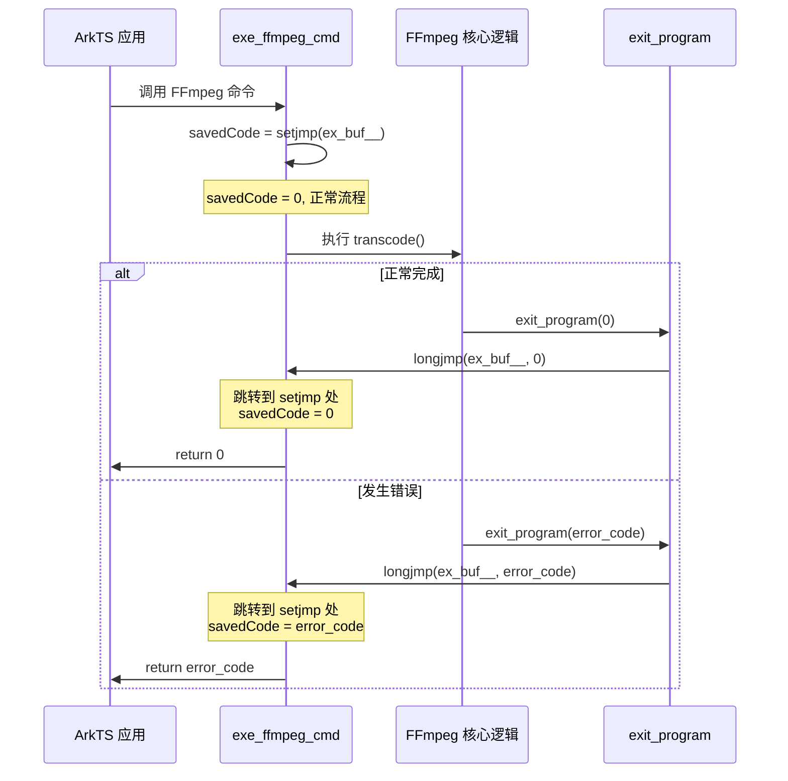
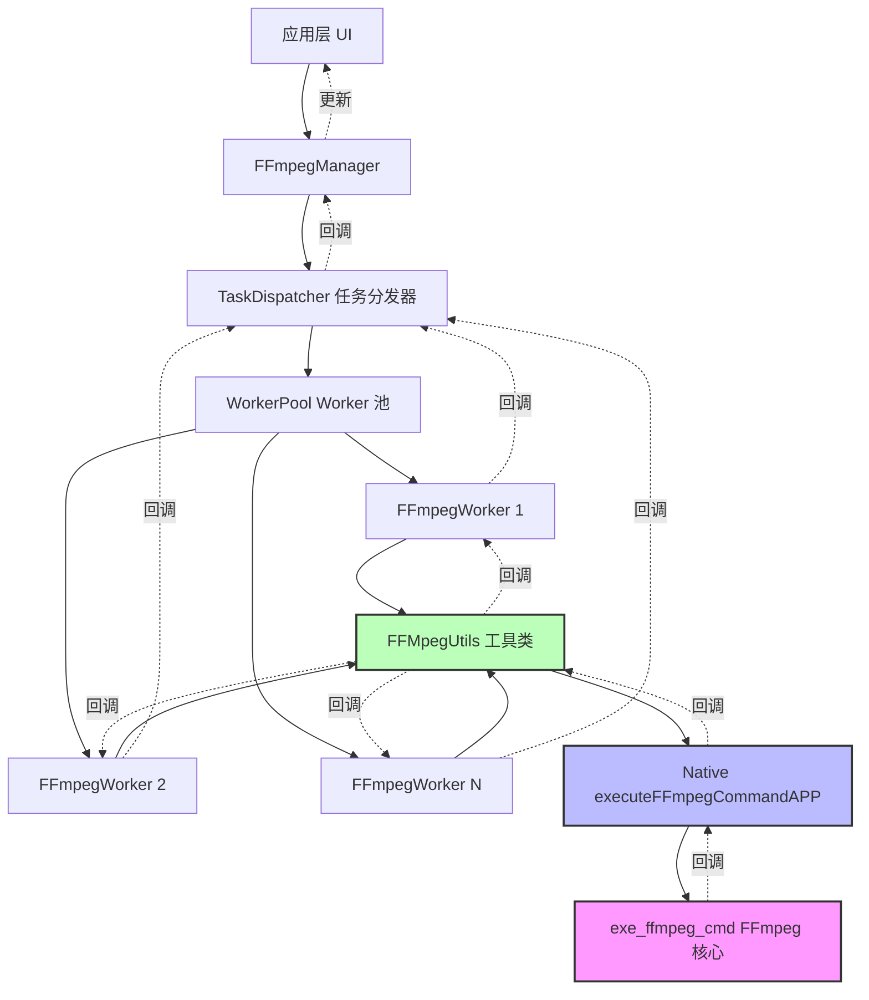
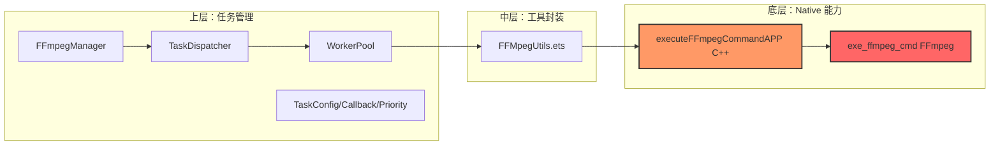

# 鸿蒙 Next FFmpeg 命令行集成完整指南

> **作者视角**：Android 架构师  
> **学习目标**：从底层原理到架构设计，系统化理解 FFmpeg 在鸿蒙中的集成方案  
> **参考来源**：[掘金文章 - 爱拼才会赢007](https://juejin.cn/post/7398467468875743272)

---

## 📚 目录

- [第一章：核心原理 - setjmp/longjmp 异常处理机制](#第一章核心原理---setjmplongjmp-异常处理机制)
- [第二章：源码改造策略](#第二章源码改造策略)
- [第三章：编译与集成流程](#第三章编译与集成流程)
- [第四章：跨语言交互 - aki::JSBind 深入解析](#第四章跨语言交互---akijsbind-深入解析)
- [第五章：ArkTS 封装层设计](#第五章arkts-封装层设计)
- [第六章：架构思考与最佳实践](#第六章架构思考与最佳实践)

---

## 第一章：核心原理 - setjmp/longjmp 异常处理机制

### 1.1 问题背景：为什么需要 setjmp/longjmp？

在标准的 FFmpeg 命令行程序中，遇到错误或执行完毕后会调用 `exit(ret)` 直接退出进程。这在独立的命令行工具中没问题，但在鸿蒙应用中集成时会导致：

```c
// FFmpeg 原始代码
void exit_program(int ret) {
    if (program_exit)
        program_exit(ret);
    
    exit(ret);  // ❌ 直接退出进程 → 应用闪退！
}
```

**问题**：
- ❌ 应用直接崩溃，无法优雅处理错误
- ❌ 无法获取 FFmpeg 执行结果
- ❌ 无法进行回调通知

### 1.2 解决方案：setjmp/longjmp 机制

**核心思想**：使用 C 语言的"长跳转"机制，将 `exit()` 替换为跳转回调用点。

#### 什么是 setjmp/longjmp？

```c
#include <setjmp.h>

jmp_buf jump_buffer;  // 保存跳转上下文

// setjmp: 设置跳转点，首次调用返回 0
int saved_value = setjmp(jump_buffer);
if (saved_value == 0) {
    // 正常执行流程
    some_function();
} else {
    // longjmp 跳转后到达这里，saved_value 为 longjmp 传入的值
    printf("从 longjmp 返回，错误码: %d\n", saved_value);
}

// longjmp: 跳转到 setjmp 设置的点，并传入返回值
void some_function() {
    // ...
    if (error) {
        longjmp(jump_buffer, error_code);  // 立即跳转到 setjmp 处
    }
}
```

**类比理解**：
- `setjmp` = 保存游戏存档点
- `longjmp` = 读取存档，从存档点继续执行
- 类似 `goto`，但可以跨函数跳转

### 1.3 在 FFmpeg 中的应用

#### Step 1：定义全局跳转缓冲区（exception.h/c）

```c
// exception.h
#ifndef EXCEPTION_H
#define EXCEPTION_H

#include <setjmp.h>

/** 线程局部存储，避免多线程冲突 */
extern __thread jmp_buf ex_buf__;

#endif
```

```c
// exception.c
#include <setjmp.h>

__thread jmp_buf ex_buf__;  // 每个线程独立的跳转缓冲区
```

> **关键点**：`__thread` 保证多线程安全

#### Step 2：改造 exit_program（cmdutils.c）

```c
// 在 ffmpeg.c 顶部声明
extern __thread volatile int longjmp_value;

// cmdutils.c 中改造
void exit_program(int ret) {
    if (program_exit)
        program_exit(ret);
        
    // ❌ 原代码：exit(ret);
    
    // ✅ 新代码：保存返回值并跳转
    longjmp_value = ret;
    longjmp(ex_buf__, ret);  // 跳转到 setjmp 处，传递 ret
}
```

#### Step 3：主函数设置跳转点（ffmpeg.c）

```c
int exe_ffmpeg_cmd(int argc, char **argv, Callbacks *callback) {
    int ret;
    
    // ✅ 设置跳转点
    int savedCode = setjmp(ex_buf__);
    
    if (savedCode == 0) {
        // ===== 正常执行流程 =====
        init_dynload();
        register_exit(ffmpeg_cleanup);
        setvbuf(stderr, NULL, _IONBF, 0);
        
        // ... FFmpeg 核心逻辑 ...
        ret = ffmpeg_parse_options(argc, argv);
        if (ret < 0)
            exit_program(ret);  // 这里会 longjmp 跳转
        
        ret = transcode();
        if (ret < 0)
            exit_program(ret);
        
        exit_program(received_nb_signals ? 255 : main_return_code);
        
    } else {
        // ===== longjmp 跳转后到达这里 =====
        main_return_code = (received_nb_signals) ? 255 : longjmp_value;
    }
    
    return main_return_code;  // 优雅返回
}
```

### 1.4 执行流程图



### 1.5 关键要点总结

| 要素 | 说明 |
|------|------|
| **`__thread` 关键字** | 保证每个线程有独立的 `jmp_buf`，避免多线程竞态 |
| **`longjmp_value`** | 保存 `exit_program` 的返回值，用于最终返回 |
| **`setjmp` 返回值** | 0 = 正常调用；非 0 = 从 longjmp 跳转回来 |
| **优雅退出** | 不再闪退，而是返回错误码，交给上层处理 |

---

## 第二章：源码改造策略

### 2.1 文件清单

从 FFmpeg 源码中需要复制以下文件到鸿蒙项目：

#### 核心源码文件（fftool 目录）

| 文件 | 作用 |
|------|------|
| `ffmpeg.h` | FFmpeg 主头文件，声明 `exe_ffmpeg_cmd` |
| `ffmpeg.c` | FFmpeg 主逻辑，包含 transcode 等核心功能 |
| `cmdutils.h` | 命令行工具头文件 |
| `cmdutils.c` | 命令行工具实现，包含 `exit_program` |
| `ffmpeg_filter.c` | 滤镜处理 |
| `ffmpeg_opt.c` | 选项解析 |
| `ffmpeg_hw.c` | 硬件加速 |

#### 编译产物

| 文件 | 路径示例 |
|------|----------|
| 静态库 `.a` | `FFmpeg-arm64-v8a-build/lib/*.a` |
| 头文件 `.h` | FFmpeg 源码的 `include` 目录 |
| `config.h` | `FFmpeg-arm64-v8a-build/FFmpeg-n4.1/config.h` |

#### 自定义文件

创建 `exception.h` 和 `exception.c`（见第一章）

### 2.2 代码修改清单

#### 修改 1：重命名 `main` 函数（ffmpeg.c）

```diff
// ffmpeg.h
+ int exe_ffmpeg_cmd(int argc, char **argv, Callbacks *callback);

// ffmpeg.c
- int main(int argc, char **argv) {
+ int exe_ffmpeg_cmd(int argc, char **argv, Callbacks *callback) {
```

**原因**：
- `main` 函数在应用中已被使用
- 重命名为普通函数，便于在 Native 模块中调用

#### 修改 2：声明 longjmp_value（ffmpeg.c 顶部）

```c
extern __thread volatile int longjmp_value;
```

#### 修改 3：改造 exit_program（cmdutils.c）

见第一章 1.3 节

#### 修改 4：主函数添加 setjmp 逻辑（ffmpeg.c）

见第一章 1.3 节

### 2.3 目录结构建议

```
your_project/
├── cpp/
│   ├── include/           # FFmpeg 头文件
│   │   ├── ffmpeg.h
│   │   ├── cmdutils.h
│   │   ├── exception.h
│   │   └── (其他 FFmpeg 头文件)
│   ├── src/               # FFmpeg 源码
│   │   ├── ffmpeg.c
│   │   ├── cmdutils.c
│   │   ├── ffmpeg_filter.c
│   │   ├── ffmpeg_opt.c
│   │   ├── ffmpeg_hw.c
│   │   └── exception.c
│   ├── lib/               # 静态库
│   │   ├── libavcodec.a
│   │   ├── libavformat.a
│   │   ├── libavutil.a
│   │   └── ...
│   └── native-lib.cpp     # JNI 绑定代码
└── ets/
    └── ffmpeg/
        └── FFMpegUtils.ets
```

---

## 第三章：编译与集成流程

### 3.1 编译 FFmpeg

按照 OpenHarmony 官方教程编译：

```bash
./build ffmpeg
```

**产物位置**：
- 静态库：`tpc_c_cplusplus/thirdparty/FFmpeg/FFmpeg-arm64-v8a-build/lib/`
- 头文件：FFmpeg 源码 `include/` 目录
- `config.h`：`FFmpeg-arm64-v8a-build/FFmpeg-n4.1/config.h`

### 3.2 集成到鸿蒙项目

#### Step 1：复制文件

```bash
# 复制静态库到 cpp/lib/
cp FFmpeg-arm64-v8a-build/lib/*.a your_project/cpp/lib/

# 复制必要头文件到 cpp/include/
cp FFmpeg/include/*.h your_project/cpp/include/

# 复制源码文件到 cpp/src/
cp FFmpeg/fftool/{ffmpeg.c,cmdutils.c,...} your_project/cpp/src/

# 复制 config.h
cp FFmpeg-arm64-v8a-build/FFmpeg-n4.1/config.h your_project/cpp/include/
```

#### Step 2：创建 exception 文件

见第一章 1.3 节

#### Step 3：修改源码

按照第二章的修改清单进行改造

### 3.3 CMakeLists 配置（参考）

```cmake
cmake_minimum_required(VERSION 3.4.1)
project(ffmpegutils)

# 设置 C++ 标准
set(CMAKE_CXX_STANDARD 14)

# 包含头文件目录
include_directories(
    ${CMAKE_CURRENT_SOURCE_DIR}/include
)

# 源文件
add_library(ffmpegutils SHARED
    src/ffmpeg.c
    src/cmdutils.c
    src/ffmpeg_filter.c
    src/ffmpeg_opt.c
    src/ffmpeg_hw.c
    src/exception.c
    native-lib.cpp
)

# 链接 FFmpeg 静态库
target_link_libraries(ffmpegutils
    ${CMAKE_CURRENT_SOURCE_DIR}/lib/libavcodec.a
    ${CMAKE_CURRENT_SOURCE_DIR}/lib/libavformat.a
    ${CMAKE_CURRENT_SOURCE_DIR}/lib/libavutil.a
    ${CMAKE_CURRENT_SOURCE_DIR}/lib/libswscale.a
    ${CMAKE_CURRENT_SOURCE_DIR}/lib/libswresample.a
    ${CMAKE_CURRENT_SOURCE_DIR}/lib/libavfilter.a
    # ... 其他需要的库
)
```

---

## 第四章：跨语言交互 - aki::JSBind 深入解析

### 4.1 aki::JSBind 概述

**定义**：鸿蒙提供的轻量级 C++ ⇄ ArkTS/JS 绑定工具

**核心能力**：

| 能力 | 描述 |
|------|------|
| 封装 C++ 类 | 将 C++ 类注册为 ArkTS 可调用的对象 |
| 导出方法 | ArkTS 可调用 C++ 定义的方法 |
| 属性绑定 | ArkTS 可直接访问 C++ 属性 |
| 类型转换 | 自动处理 C++ ⇄ ArkTS 类型互转 |
| 跨线程处理 | 支持异步任务调度，避免 UI 阻塞 |

**类比**：
- Android: JNI + NDK + JSBridge
- Node.js: N-API
- 但在鸿蒙里更现代化、更简化

### 4.2 基础示例

#### C++ 端定义

```cpp
#include "aki/jsbind.h"
using namespace aki;

class Player {
public:
    void play() { 
        // 播放逻辑
    }
    
    int getState() { 
        return current_state; 
    }
    
private:
    int current_state = 0;
};

// 使用 JSBIND 宏注册类
JSBIND_CLASS(Player) {
    JSBIND_METHOD(play);      // 注册 play 方法
    JSBIND_METHOD(getState);  // 注册 getState 方法
}
```

#### ArkTS 端调用

```typescript
import nativePlayer from 'libplayer.so';

let player = new nativePlayer.Player();
player.play();
console.log(player.getState());  // 输出: 0
```

**关键点**：C++ 类就像 ArkTS 的类一样被调用，无缝集成！

### 4.3 FFmpeg 项目中的应用

#### 4.3.1 回调结构体定义

```cpp
// CallBackInfo: ArkTS 传递给 C++ 的回调函数
struct CallBackInfo {
    std::shared_ptr<aki::JSFunction> onFFmpegProgress;  // 进度回调
    std::shared_ptr<aki::JSFunction> onFFmpegFail;      // 失败回调
    std::shared_ptr<aki::JSFunction> onFFmpegSuccess;   // 成功回调
};

// Callbacks: C++ 内部使用的回调函数指针
typedef struct Callbacks {
    void (*onFFmpegProgress)(int progress);
    void (*onFFmpegFail)(int code, const char* msg);
    void (*onFFmpegSuccess)();
} Callbacks;
```

#### 4.3.2 回调实现函数

```cpp
void onFFmpegProgress(int progress) {
    // C++ 调用 ArkTS 函数
    CallBackInfo* info = get_current_callback_info();
    if (info && info->onFFmpegProgress) {
        info->onFFmpegProgress->Invoke<void>(progress);
    }
}

void onFFmpegFail(int code, const char* msg) {
    CallBackInfo* info = get_current_callback_info();
    if (info && info->onFFmpegFail) {
        info->onFFmpegFail->Invoke<void>(code, msg);
    }
}

void onFFmpegSuccess() {
    CallBackInfo* info = get_current_callback_info();
    if (info && info->onFFmpegSuccess) {
        info->onFFmpegSuccess->Invoke<void>();
    }
}
```

#### 4.3.3 主执行函数

```cpp
int executeFFmpegCommandAPP(std::string uuid, int cmdLen, std::vector<std::string> argv) {
    // 1. 转换参数：vector<string> → char**
    char **argv1 = vector_to_argv(argv);
    
    // 2. 通过 UUID 获取 ArkTS 绑定的回调函数
    CallBackInfo onActionListener;
    onActionListener.onFFmpegProgress = aki::JSBind::GetJSFunction(uuid + "_onFFmpegProgress");
    onActionListener.onFFmpegFail = aki::JSBind::GetJSFunction(uuid + "_onFFmpegFail");
    onActionListener.onFFmpegSuccess = aki::JSBind::GetJSFunction(uuid + "_onFFmpegSuccess");
    
    // 3. 准备 C 风格回调
    Callbacks callbacks = {
        .onFFmpegProgress = onFFmpegProgress, 
        .onFFmpegFail = onFFmpegFail, 
        .onFFmpegSuccess = onFFmpegSuccess
    };
    
    // 4. 执行 FFmpeg 命令
    int ret = exe_ffmpeg_cmd(cmdLen, argv1, &callbacks);
    
    // 5. 根据结果调用回调
    if (ret != 0) {
        char err[1024] = {0};
        av_strerror(ret, err, 1024);
        onActionListener.onFFmpegFail->Invoke<void>(ret, err);
    } else {
        onActionListener.onFFmpegSuccess->Invoke<void>();
    }
    
    // 6. 释放内存
    for (int i = 0; i < cmdLen; ++i) {
        free(argv1[i]);
    }
    
    return ret;
}
```

#### 4.3.4 注册到 JSBind

```cpp
JSBIND_ADDON(ffmpegutils)

JSBIND_GLOBAL() {
    JSBIND_PFUNCTION(executeFFmpegCommandAPP);  // 注册主函数
    JSBIND_FUNCTION(showLog);                   // 注册日志函数
}
```

### 4.4 UUID 机制解析

**问题**：多个 FFmpeg 任务并发时，如何区分回调？

**解决方案**：使用 UUID 作为回调函数的唯一标识

#### ArkTS 端绑定（FFMpegUtils.ets）

```typescript
let uuid = RandomUtil.generateUUID32()  // 生成唯一 ID

// 绑定三个回调函数到 uuid
libAddon.JSBind.bindFunction(uuid + "_onFFmpegProgress", options.onFFmpegProgress)
libAddon.JSBind.bindFunction(uuid + "_onFFmpegFail", options.onFFmpegFail)
libAddon.JSBind.bindFunction(uuid + "_onFFmpegSuccess", options.onFFmpegSuccess)

// 调用 C++ 函数，传递 uuid
libAddon.executeFFmpegCommandAPP(uuid, options.cmds.length, options.cmds)
```

#### C++ 端获取

```cpp
// 通过 uuid 获取对应的回调函数
onActionListener.onFFmpegProgress = aki::JSBind::GetJSFunction(uuid + "_onFFmpegProgress");
```

**流程图**：

```mermaid
sequenceDiagram
    participant ArkTS
    participant JSBind as JSBind Registry
    participant C++ as C++ Native
    
    ArkTS->>ArkTS: uuid = generateUUID32()
    ArkTS->>JSBind: bindFunction(uuid+"_onProgress", callback)
    ArkTS->>JSBind: bindFunction(uuid+"_onFail", callback)
    ArkTS->>JSBind: bindFunction(uuid+"_onSuccess", callback)
    
    ArkTS->>C++: executeFFmpegCommandAPP(uuid, cmds)
    C++->>JSBind: GetJSFunction(uuid+"_onProgress")
    JSBind-->>C++: return JSFunction object
    
    C++->>C++: exe_ffmpeg_cmd(...)
    C++->>ArkTS: callback.onProgress.Invoke(50)
    ArkTS->>ArkTS: 更新进度条
```

### 4.5 类型转换：vector<string> → char**

```cpp
char** vector_to_argv(const std::vector<std::string>& argv) {
    char** argv1 = (char**)malloc(sizeof(char*) * argv.size());
    
    for (size_t i = 0; i < argv.size(); ++i) {
        argv1[i] = (char*)malloc(argv[i].size() + 1);
        strcpy(argv1[i], argv[i].c_str());
    }
    
    return argv1;
}

// 使用后记得释放
for (int i = 0; i < cmdLen; ++i) {
    free(argv1[i]);
}
free(argv1);
```

---

## 第五章：ArkTS 封装层设计

### 5.1 接口设计

```typescript
export interface FFmpegCommandOptions {
  cmds: Array<string>;                            // FFmpeg 命令参数数组
  onFFmpegProgress: (progress: number) => void;   // 进度回调 [0-100]
  onFFmpegFail: (code: number, msg: string) => void;  // 失败回调
  onFFmpegSuccess: () => void;                    // 成功回调
}
```

**设计要点**：
- 命令以数组形式传递，方便拆分和构造
- 回调函数明确定义参数类型
- 采用回调模式，符合异步操作习惯

### 5.2 FFMpegUtils 工具类

```typescript
import { executeFFmpegCommandAPP } from '../../../cpp/types/ffmpegutils'
import libAddon from 'libffmpegutils.so'
import { RandomUtil } from '@pura/harmony-utils';

export class FFMpegUtils {
  static executeFFmpegCommand(options: FFmpegCommandOptions): Promise<number> {
    // 1. 生成唯一 UUID
    let uuid = RandomUtil.generateUUID32()
    
    // 2. 绑定回调函数到 JSBind
    libAddon.JSBind.bindFunction(uuid + "_onFFmpegProgress", options.onFFmpegProgress)
    libAddon.JSBind.bindFunction(uuid + "_onFFmpegFail", options.onFFmpegFail)
    libAddon.JSBind.bindFunction(uuid + "_onFFmpegSuccess", options.onFFmpegSuccess)
    
    // 3. 打印命令日志（调试用）
    logE(options.cmds.join(' '))
    
    // 4. Promise 封装异步执行
    return new Promise<number>((resolve, reject) => {
      try {
        libAddon.executeFFmpegCommandAPP(uuid, options.cmds.length, options.cmds)
          .then((code: number) => {
            resolve(code)  // 返回执行结果码
          })
          .catch((err: Error) => {
            reject(err)
          })
      } catch (e) {
        reject(e)
      }
    })
  }
}
```

### 5.3 使用示例

#### 基础用法

```typescript
import { FFMpegUtils } from './ffmpeg/FFMpegUtils'

// 命令：ffmpeg -i input1.mp3 output1.aac
const cmds = ['ffmpeg', '-i', 'input1.mp3', 'output1.aac']

FFMpegUtils.executeFFmpegCommand({
  cmds: cmds,
  
  onFFmpegProgress: (progress: number) => {
    console.log(`进度: ${progress}%`)
    // 更新 UI 进度条
  },
  
  onFFmpegFail: (code: number, msg: string) => {
    console.error(`失败: [${code}] ${msg}`)
    // 显示错误提示
  },
  
  onFFmpegSuccess: () => {
    console.log('转换成功！')
    // 跳转到结果页面
  }
}).then((code) => {
  console.log(`最终返回码: ${code}`)
}).catch((err) => {
  console.error('执行异常:', err)
})
```

#### 高级用法：命令构造器

```typescript
class FFmpegCommandBuilder {
  private args: string[] = ['ffmpeg']
  
  input(path: string): this {
    this.args.push('-i', path)
    return this
  }
  
  output(path: string): this {
    this.args.push(path)
    return this
  }
  
  codec(type: 'video' | 'audio', codec: string): this {
    this.args.push(type === 'video' ? '-c:v' : '-c:a', codec)
    return this
  }
  
  bitrate(type: 'video' | 'audio', rate: string): this {
    this.args.push(type === 'video' ? '-b:v' : '-b:a', rate)
    return this
  }
  
  overwrite(): this {
    this.args.push('-y')
    return this
  }
  
  build(): string[] {
    return this.args
  }
}

// 使用
const cmds = new FFmpegCommandBuilder()
  .input('/sdcard/input.mp4')
  .codec('video', 'libx264')
  .bitrate('video', '1M')
  .codec('audio', 'aac')
  .overwrite()
  .output('/sdcard/output.mp4')
  .build()

FFMpegUtils.executeFFmpegCommand({ cmds, ... })
```

### 5.4 命令行参数拆分规则

**原始命令**：
```bash
ffmpeg -i input.mp3 -c:a aac -b:a 128k output.aac
```

**拆分为数组**：
```typescript
const cmds = [
  'ffmpeg',      // 程序名
  '-i',          // 参数名
  'input.mp3',   // 参数值
  '-c:a',        // 参数名
  'aac',         // 参数值
  '-b:a',        // 参数名
  '128k',        // 参数值
  'output.aac'   // 输出文件
]
```

**核心规则**：
1. 每个空格隔开的部分是一个独立元素
2. 参数名和参数值分开
3. 文件路径作为一个元素（即使包含空格，需加引号处理）

---

## 第六章：架构思考与最佳实践

### 6.1 Android vs 鸿蒙 FFmpeg 集成对比

| 维度 | Android (JNI) | 鸿蒙 (aki::JSBind) |
|------|---------------|-------------------|
| **绑定机制** | JNI 手动注册，代码冗长 | JSBind 宏简化，代码简洁 |
| **类型转换** | 手动转换 `jstring`/`jbyteArray` | 自动处理基础类型，`vector` 等容器需手动转 |
| **回调方式** | `JavaVM`+`JNIEnv` 获取环境，反射调用 | `JSFunction::Invoke` 直接调用 |
| **线程安全** | 需手动 `AttachCurrentThread` | 内置线程调度，但回调需注意线程 |
| **多任务管理** | 需自行实现线程池 | 本项目使用 UUID 区分，可改进为队列 |
| **so 加载** | `System.loadLibrary` | `import from 'lib*.so'` |

### 6.2 现有方案分析

#### 优点 ✅
1. **优雅的异常处理**：setjmp/longjmp 避免闪退
2. **清晰的回调设计**：进度/成功/失败三种状态
3. **UUID 机制**：支持多任务并发回调区分
4. **Promise 封装**：符合 ArkTS 异步编程习惯

#### 可优化点 ⚠️

##### 1. 线程安全问题

**当前代码**：
```cpp
extern __thread volatile int longjmp_value;
extern __thread jmp_buf ex_buf__;
```

**问题**：
- `__thread` 保证了每个线程独立存储
- 但 `CallBackInfo` 的获取需要线程安全保证

**建议**：
```cpp
// 使用线程局部存储 + map 管理
static __thread std::map<std::string, CallBackInfo*> g_callback_map;

void set_current_callback(const std::string& uuid, CallBackInfo* info) {
    g_callback_map[uuid] = info;
}

CallBackInfo* get_current_callback(const std::string& uuid) {
    return g_callback_map[uuid];
}
```

##### 2. 任务队列管理

查看现有项目结构，发现已有任务管理系统：

```
lib_ffmpeg_util/src/main/ets/ffmpeg/
├── TaskDispatcher.ets      # 任务分发器
├── TaskConfig.ets          # 任务配置
├── TaskCallback.ets        # 任务回调
├── TaskPriority.ets        # 任务优先级
├── FFmpegExecutor.ets      # 执行器
├── FFmpegWorker.ets        # Worker 线程
└── WorkerPool.ets          # Worker 池
```

**分析**：
- 上层已有完整的任务管理系统
- 底层 Native 只需提供基础执行能力
- 任务队列、优先级、并发控制由上层 ArkTS 处理

**架构图**：



##### 3. 进度回调精度控制

**问题**：FFmpeg 的进度回调可能非常频繁，导致：
- UI 线程频繁更新，卡顿
- 不必要的 JNI 调用开销

**建议**：
```cpp
// 进度节流：只在进度变化 >= 1% 时回调
static int last_progress = -1;

void onFFmpegProgress(int progress) {
    if (progress - last_progress >= 1 || progress == 100) {
        last_progress = progress;
        CallBackInfo* info = get_current_callback_info();
        if (info && info->onFFmpegProgress) {
            info->onFFmpegProgress->Invoke<void>(progress);
        }
    }
}
```

##### 4. 日志回调性能优化

**当前代码**：
```cpp
void log_call_back(void *ptr, int level, const char *fmt, va_list vl) {
    char line[1024];
    av_log_format_line(ptr, level, fmt, vl, line, sizeof(line), &print_prefix);
    OH_LOG_ERROR(LOG_APP, "========> %{public}s", line);  // 每条都打印
}
```

**问题**：
- FFmpeg 日志量非常大，影响性能
- 开发环境需要详细日志，生产环境不需要

**建议**：
```cpp
void log_call_back(void *ptr, int level, const char *fmt, va_list vl) {
    // 只在 Debug 模式或特定日志级别打印
    if (level > AV_LOG_WARNING && !is_debug_mode) {
        return;
    }
    
    char line[1024];
    av_log_format_line(ptr, level, fmt, vl, line, sizeof(line), &print_prefix);
    
    // 根据日志级别选择不同的打印方式
    switch (level) {
        case AV_LOG_ERROR:
            OH_LOG_ERROR(LOG_APP, "FFmpeg: %{public}s", line);
            break;
        case AV_LOG_WARNING:
            OH_LOG_WARN(LOG_APP, "FFmpeg: %{public}s", line);
            break;
        default:
            if (is_debug_mode) {
                OH_LOG_INFO(LOG_APP, "FFmpeg: %{public}s", line);
            }
    }
}
```

### 6.3 与现有项目的关系

根据您的补充信息：

> 项目中原有的 `lib_ffmpeg_util/src/main/ets/ffmpeg` 只是用来调用 FFmpeg 的命令行。而当前的这个提供了 FFmpeg 命令行的调用，所以这个是底层能力。

**架构分层**：



**当前学习的内容**：
- ✅ 底层 Native 能力（本文重点）
- 🔜 如何与上层任务管理系统结合（后续实践）

### 6.4 推荐的实践流程

基于您的学习阶段，建议按以下步骤实践：

#### 阶段一：理解底层原理（当前）
- [x] setjmp/longjmp 异常处理机制
- [x] FFmpeg 源码改造策略
- [x] aki::JSBind 跨语言交互
- [ ] Native 代码调试技巧

#### 阶段二：集成到项目
1. **编译 FFmpeg**：按教程编译鸿蒙版本
2. **复制文件**：源码、静态库、头文件
3. **改造源码**：按本文第二章修改
4. **编写 Native 层**：参考第四章实现
5. **编写 ArkTS 层**：参考第五章封装

#### 阶段三：与上层系统集成
1. **研究现有任务管理**：`TaskDispatcher`、`WorkerPool` 等
2. **对接底层能力**：替换或补充现有的 FFmpeg 调用方式
3. **优化并发控制**：利用 Worker 池管理多任务
4. **完善错误处理**：统一错误码和异常处理

#### 阶段四：优化与测试
1. **性能测试**：不同命令的执行效率
2. **并发测试**：多任务同时执行的稳定性
3. **内存泄漏检测**：Native 层的内存管理
4. **边界测试**：极端参数、大文件处理

### 6.5 常见问题与解决方案

#### Q1: 如何取消正在执行的 FFmpeg 任务？

**方案**：利用 FFmpeg 的 `received_nb_signals` 机制

```cpp
// 全局变量（线程局部）
static __thread volatile int should_cancel = 0;

// 取消函数
void cancelFFmpegTask(std::string uuid) {
    should_cancel = 1;
}

// 在 exe_ffmpeg_cmd 中检查
int exe_ffmpeg_cmd(...) {
    // 定期检查是否需要取消
    if (should_cancel) {
        should_cancel = 0;
        exit_program(255);  // 模拟 SIGINT
    }
    // ...
}
```

#### Q2: 如何处理 FFmpeg 输出的视频缩略图？

**方案**：使用 FFmpeg 命令生成，然后通过回调返回路径

```typescript
const cmds = [
  'ffmpeg',
  '-i', 'input.mp4',
  '-ss', '00:00:01',      // 第1秒
  '-vframes', '1',         // 只取1帧
  '-f', 'image2',
  'thumbnail.jpg'
]

FFMpegUtils.executeFFmpegCommand({
  cmds,
  onFFmpegSuccess: () => {
    // 缩略图已生成，可以显示
    showImage('thumbnail.jpg')
  }
})
```

#### Q3: 如何获取视频时长、分辨率等信息？

**方案**：使用 `ffprobe` 或解析 FFmpeg 日志

```typescript
// 方案1：使用 ffprobe
const cmds = [
  'ffprobe',
  '-v', 'error',
  '-show_entries', 'format=duration',
  '-of', 'default=noprint_wrappers=1:nokey=1',
  'input.mp4'
]

// 方案2：解析 FFmpeg 日志
// 在日志回调中提取 "Duration: 00:01:23.45"
```

---

## 📖 总结

### 核心知识点

1. **setjmp/longjmp**：优雅处理 FFmpeg 退出，避免闪退
2. **源码改造**：重命名 `main`，改造 `exit_program`，添加异常处理
3. **aki::JSBind**：鸿蒙的跨语言绑定工具，简化 C++ ⇄ ArkTS 交互
4. **UUID 机制**：支持多任务并发回调区分
5. **Promise 封装**：符合 ArkTS 异步编程习惯

### 架构思考

- 分层设计：底层提供基础能力，上层管理任务和并发
- 线程安全：`__thread` + 合理的锁机制
- 性能优化：进度节流、日志分级、内存管理

### 下一步

1. 动手编译 FFmpeg
2. 在测试项目中验证集成流程
3. 研究现有项目的任务管理系统
4. 思考如何优化和扩展

---

**参考资料**：
- [鸿蒙 FFmpeg 编译教程](https://gitee.com/openharmony)
- [原始文章 - 掘金](https://juejin.cn/post/7398467468875743272)
- [setjmp/longjmp 官方文档](https://en.cppreference.com/w/c/program/setjmp)
