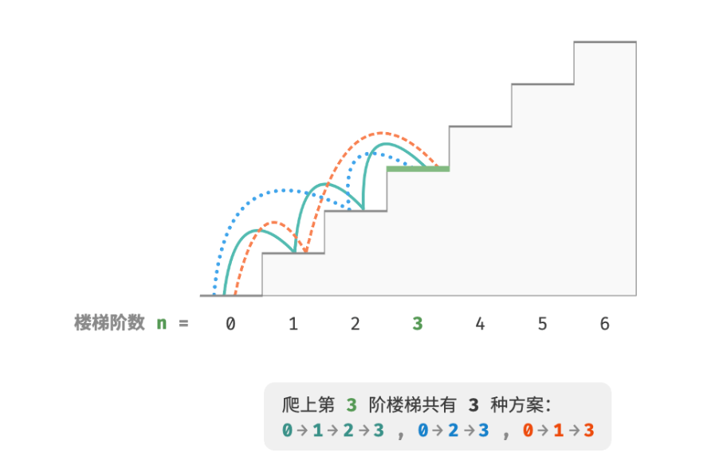

[toc]

## 01. 初探动态规划

动态规划（dynamic programming）是一个重要的算法范式，它将一个问题分解为一系列更小的子问题，并通过存储子问题的解来避免重复计算，从而大幅提升时间效率。

我们从一个经典例题入手，先给出它的暴力回溯解法，观察其中包含的重叠子问题，再逐步导出更高效的动态规划解法。

> 爬楼梯
>
> 给定一个共有 n 阶的楼梯，你每步可以上 1 阶或者 2 阶，请问有多少种方案可以爬到楼顶？

如图 14-1 所示，对于一个 3 阶楼梯，共有 3 种方案可以爬到楼顶。



### 1.1 回溯

本题的目标是求解方案数量，**我们可以考虑通过回溯来穷举所有可能性**。具体来说，将爬楼梯想象为一个多轮选择的过程：从地面出发，每轮选择上 1 阶或 2 阶，每当到达楼梯顶部时就将方案数量加 1 ，当越过楼梯顶部时就将其剪枝。代码如下所示：

```
/* 回溯 */
void backtrack(List<Integer> choices, int state, int n, List<Integer> res) {
    // 当爬到第 n 阶时，方案数量加 1
    if (state == n)
        res.set(0, res.get(0) + 1);
    // 遍历所有选择
    for (Integer choice : choices) {
        // 剪枝：不允许越过第 n 阶
        if (state + choice > n)
            continue;
        // 尝试：做出选择，更新状态
        backtrack(choices, state + choice, n, res);
        // 回退
    }
}

/* 爬楼梯：回溯 */
int climbingStairsBacktrack(int n) {
    List<Integer> choices = Arrays.asList(1, 2); // 可选择向上爬 1 阶或 2 阶
    int state = 0; // 从第 0 阶开始爬
    List<Integer> res = new ArrayList<>();
    res.add(0); // 使用 res[0] 记录方案数量
    backtrack(choices, state, n, res);
    return res.get(0);
}
```

- 这个位置没有return，怎么回退的？
  - 隐式回退，递归函数调用本身就是基于栈帧的机制，递归结束后会自动回退到上一个状态。具体如下：
    - 在 Java 中，每次递归调用都会分配一个新的栈帧，保存当前方法的局部变量、参数和返回地址。
    - 当递归返回时，当前栈帧会被弹出，程序会回到上一个栈帧的返回地址处继续执行。

- 回溯算法通常并不显式地对问题进行拆解，而是将求解问题看作一系列决策步骤，通过试探和剪枝，搜索所有可能的解。

### 1.2 记忆化搜索

**记忆化搜索是一种“从顶至底”的方法**：我们从原问题（根节点）开始，递归地将较大子问题分解为较小子问题，直至解已知的最小子问题（叶节点）。之后，通过回溯逐层收集子问题的解，构建出原问题的解。


我们可以尝试从问题分解的角度分析这道题。设爬到第 i 阶共有 dp[i] 种方案，那么 dp[i] 就是原问题，其子问题包括：

dp[i−1],dp[i−2],…,dp[2],dp[1]

由于每轮只能上 1 阶或 2 阶，因此当我们站在第 i 阶楼梯上时，上一轮只可能站在第 i−1 阶或第 i−2 阶上。换句话说，我们只能从第 i−1 阶或第 i−2 阶迈向第 i 阶。

由此便可得出一个重要推论：**爬到第 i−1 阶的方案数加上爬到第 i−2 阶的方案数就等于爬到第 i 阶的方案数**。公式如下：

dp[i]=dp[i−1]+dp[i−2]

这意味着在爬楼梯问题中，各个子问题之间存在递推关系，**原问题的解可以由子问题的解构建得来**。图 14-2 展示了该递推关系。


与之相反，**动态规划是一种“从底至顶”的方法**：从最小子问题的解开始，迭代地构建更大子问题的解，直至得到原问题的解。

由于动态规划不包含回溯过程，因此只需使用循环迭代实现，无须使用递归。


根据以上内容，我们可以总结出动态规划的常用术语。

- 将数组 `dp` 称为 dp 表，dp[i] 表示状态 i 对应子问题的解。
- 将最小子问题对应的状态（第 1 阶和第 2 阶楼梯）称为初始状态。
- 将递推公式 dp[i]=dp[i−1]+dp[i−2] 称为状态转移方程。


```
/* 回溯 */
void backtrack(List<Integer> choices, int state, int n, List<Integer> res) {
    // 当爬到第 n 阶时，方案数量加 1
    if (state == n)
        res.set(0, res.get(0) + 1);
    // 遍历所有选择
    for (Integer choice : choices) {
        // 剪枝：不允许越过第 n 阶
        if (state + choice > n)
            continue;
        // 尝试：做出选择，更新状态
        backtrack(choices, state + choice, n, res);
        // 回退
    }
}

/* 爬楼梯：回溯 */
int climbingStairsBacktrack(int n) {
    List<Integer> choices = Arrays.asList(1, 2); // 可选择向上爬 1 阶或 2 阶
    int state = 0; // 从第 0 阶开始爬
    List<Integer> res = new ArrayList<>();
    res.add(0); // 使用 res[0] 记录方案数量
    backtrack(choices, state, n, res);
    return res.get(0);
}
```

- 