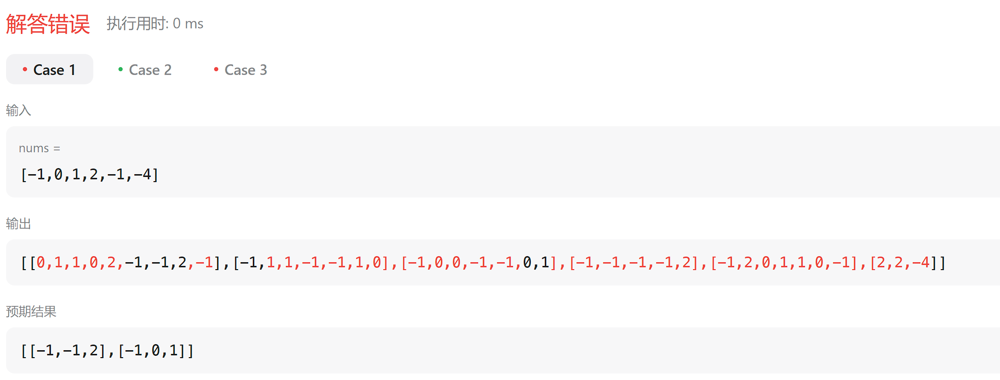

[toc]


## 01. 移动零

### 1.1 题目描述

[283. 移动零](https://leetcode.cn/problems/move-zeroes/)

提示

给定一个数组 `nums`，编写一个函数将所有 `0` 移动到数组的末尾，同时保持非零元素的相对顺序。

**请注意** ，必须在不复制数组的情况下原地对数组进行操作。

 

**示例 1:**

```
输入: nums = [0,1,0,3,12]
输出: [1,3,12,0,0]
```

**示例 2:**

```
输入: nums = [0]
输出: [0]
```

**提示**:

- `1 <= nums.length <= 104`
- `-231 <= nums[i] <= 231 - 1`

**进阶：**你能尽量减少完成的操作次数吗？

### 1.2 解题方法

- 第一次解答

  - ```
    class Solution {
        private void helper(int[] nums, int a, int b) {
            int temp = nums[a];
            nums[a] = nums[b];
            nums[b] = temp;
        }
        public void moveZeroes(int[] nums) {
            int l = 0, r = 0;
            for (; l < nums.length; l++) {
                if (nums[l] == 0) {
                    for (r = l + 1; r < nums.length; r++) {
                        if (nums[r] != 0) {
                            helper(nums, l, r);
                            break;
                        }
                    }
                }
            }
        }
    }
    ```

  - 思路：
    - 使用两个指针 `l` 和 `r`。
    - 外层循环从头到尾遍历数组，找到为 `0` 的位置（`l` 指针）。
    - 内层循环从 `l+1` 开始，寻找第一个非 `0` 的元素（`r` 指针），然后进行交换。
    - 逐一移动每个 `0`，效率偏低。

  - 算法复杂度：
    - 外层循环遍历每个元素，内层循环在最坏情况下可能遍历剩余的所有元素。
      - 时间复杂度为 **O(n²)**（最坏情况下数组中大部分元素为 `0`）。

- 优化

  - ```
    class Solution {
        public void moveZeroes(int[] nums) {
            int left = 0;
            for (int right = 0; right < nums.length; right++) {
                if (nums[right] != 0) {
                    // 交换非零元素到左侧
                    int temp = nums[left];
                    nums[left] = nums[right];
                    nums[right] = temp;
                    left++;
                }
            }
        }
    }
    ```

  - 使用双指针，左指针指向当前已经处理好的序列的尾部，右指针指向待处理序列的头部。右指针不断向右移动，每次右指针指向非零数，则将左右指针对应的数交换，同时左指针右移。


## 02.盛最多水的容器

### 2.1 题目描述

[11. 盛最多水的容器](https://leetcode.cn/problems/container-with-most-water/)

给定一个长度为 `n` 的整数数组 `height` 。有 `n` 条垂线，第 `i` 条线的两个端点是 `(i, 0)` 和 `(i, height[i])` 。

找出其中的两条线，使得它们与 `x` 轴共同构成的容器可以容纳最多的水。

返回容器可以储存的最大水量。

**说明：**你不能倾斜容器。

 

**示例 1：**


```
输入：[1,8,6,2,5,4,8,3,7]
输出：49 
解释：图中垂直线代表输入数组 [1,8,6,2,5,4,8,3,7]。在此情况下，容器能够容纳水（表示为蓝色部分）的最大值为 49。
```

**示例 2：**

```
输入：height = [1,1]
输出：1
```

 

**提示：**

- `n == height.length`

- `2 <= n <= 105`

- `0 <= height[i] <= 104`

  

### 2.2 解答

```
class Solution {
    public int maxArea(int[] height) {
        int maxarea = 0;
        int left = 0, right = height.length - 1;

        while (left < right) {
            int area = (right - left) * Math.min(height[right], height[left]);
            maxarea = Math.max(area, maxarea);

            if (height[left] > height[right]) {
                right--;
            } else {
                left++;
            }
        }
        return maxarea;
    }
}
```

- 思路: 一句话，容积等于 底*短板高度 ，底必定缩小，只能移动短板，尝试获取更高的高度。

## *03.三数之和 

### 3.1 题目描述

[15. 三数之和](https://leetcode.cn/problems/3sum/)

给你一个整数数组 `nums` ，判断是否存在三元组 `[nums[i], nums[j], nums[k]]` 满足 `i != j`、`i != k` 且 `j != k` ，同时还满足 `nums[i] + nums[j] + nums[k] == 0` 。请你返回所有和为 `0` 且不重复的三元组。

**注意：**答案中不可以包含重复的三元组。

 

**示例 1：**

```
输入：nums = [-1,0,1,2,-1,-4]
输出：[[-1,-1,2],[-1,0,1]]
解释：
nums[0] + nums[1] + nums[2] = (-1) + 0 + 1 = 0 。
nums[1] + nums[2] + nums[4] = 0 + 1 + (-1) = 0 。
nums[0] + nums[3] + nums[4] = (-1) + 2 + (-1) = 0 。
不同的三元组是 [-1,0,1] 和 [-1,-1,2] 。
注意，输出的顺序和三元组的顺序并不重要。
```

**示例 2：**

```
输入：nums = [0,1,1]
输出：[]
解释：唯一可能的三元组和不为 0 。
```

**示例 3：**

```
输入：nums = [0,0,0]
输出：[[0,0,0]]
解释：唯一可能的三元组和为 0 。
```

 

**提示：**

- `3 <= nums.length <= 3000`
- `-105 <= nums[i] <= 105`

### 3.2 解答

- 第一次解答

  - ```
    class Solution {
        //我们已经做过两数之和，定一数，找另一数。现在三数之和可以看作是定一数，找两数之和。
        private Map<Integer, Integer> map = new HashMap<>();
        private List<Integer> twoSum(int [] nums, int pos, int need) {
            List<Integer> temp = new ArrayList<>();
            for (int i = 0; i < nums.length; i++) {
                if (i == pos) {
                    continue;
                }
                if (map.containsKey(need - nums[i]) && map.get(need - nums[i]) != pos) {             
                    temp.add(nums[i]);
                    temp.add(need - nums[i]);
                }
            }
            return temp;
        }
        public List<List<Integer>> threeSum(int[] nums) {
            List<List<Integer>> ans = new ArrayList<>();
            for (int i = 0; i < nums.length; i++) {
                map.put(nums[i], i);
            }
    
            for (int i = 0; i < nums.length; i++) {
                List<Integer> temp = twoSum(nums, i, -nums[i]);
                if (!temp.isEmpty()) {
                    temp.add(nums[i]);
                    ans.add(temp);
                }
            }
            return ans;
        }
    }
    ```

  - 结果：

- 第二次解答

  - ```
    class Solution {
        public List<List<Integer>> threeSum(int[] nums) {
            List<List<Integer>> ans = new ArrayList<>();
            Arrays.sort(nums);
    
            for (int i = 0; i < nums.length - 2; i++) {
            //跳过重复元素
                if (i >= 1 && nums[i] == nums[i - 1]) {
                    continue;
                }
                int l = i + 1, r = nums.length - 1;
                int need = -nums[i];
                while (l < r) {
                //跳过重复元素
                    if (l > i + 1 && nums[l] == nums[l - 1]) {
                        l++;
                        continue;
                    }
    
                    int sum = nums[l] + nums[r];
                    if (sum < need) {
                        l++;
                    } else if (sum > need) {
                        r--;
                    } else {
                        List<Integer> temp = new ArrayList<>();
                        temp.add(nums[i]);
                        temp.add(nums[l]);
                        temp.add(nums[r]);
                        ans.add(temp);
    
                        l++;
                    }
                }
            }
            return ans;
        }
    }
    ```
    
    