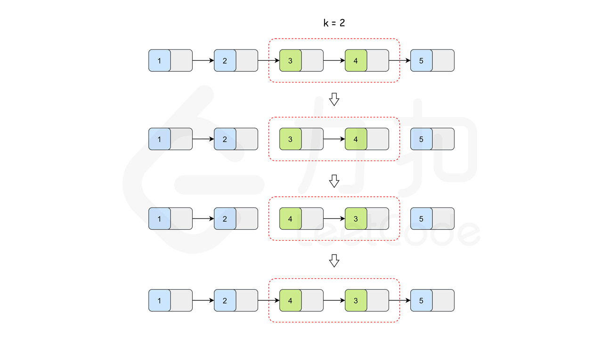

[toc]

## *00.总结

1. 

## 01.相交链表（×√）

### 1.1 题目描述

[160. 相交链表](https://leetcode.cn/problems/intersection-of-two-linked-lists/)

给你两个单链表的头节点 `headA` 和 `headB` ，请你找出并返回两个单链表相交的起始节点。如果两个链表不存在相交节点，返回 `null` 。

图示两个链表在节点 `c1` 开始相交**：**

[](https://assets.leetcode-cn.com/aliyun-lc-upload/uploads/2018/12/14/160_statement.png)

题目数据 **保证** 整个链式结构中不存在环。

**注意**，函数返回结果后，链表必须 **保持其原始结构** 。

**自定义评测：**

**评测系统** 的输入如下（你设计的程序 **不适用** 此输入）：

- `intersectVal` - 相交的起始节点的值。如果不存在相交节点，这一值为 `0`
- `listA` - 第一个链表
- `listB` - 第二个链表
- `skipA` - 在 `listA` 中（从头节点开始）跳到交叉节点的节点数
- `skipB` - 在 `listB` 中（从头节点开始）跳到交叉节点的节点数

评测系统将根据这些输入创建链式数据结构，并将两个头节点 `headA` 和 `headB` 传递给你的程序。如果程序能够正确返回相交节点，那么你的解决方案将被 **视作正确答案** 。

 

**示例 1：**

[](https://assets.leetcode.com/uploads/2018/12/13/160_example_1.png)

```
输入：intersectVal = 8, listA = [4,1,8,4,5], listB = [5,6,1,8,4,5], skipA = 2, skipB = 3
输出：Intersected at '8'
解释：相交节点的值为 8 （注意，如果两个链表相交则不能为 0）。
从各自的表头开始算起，链表 A 为 [4,1,8,4,5]，链表 B 为 [5,6,1,8,4,5]。
在 A 中，相交节点前有 2 个节点；在 B 中，相交节点前有 3 个节点。
— 请注意相交节点的值不为 1，因为在链表 A 和链表 B 之中值为 1 的节点 (A 中第二个节点和 B 中第三个节点) 是不同的节点。换句话说，它们在内存中指向两个不同的位置，而链表 A 和链表 B 中值为 8 的节点 (A 中第三个节点，B 中第四个节点) 在内存中指向相同的位置。
```

 

**示例 2：**

[](https://assets.leetcode.com/uploads/2018/12/13/160_example_2.png)

```
输入：intersectVal = 2, listA = [1,9,1,2,4], listB = [3,2,4], skipA = 3, skipB = 1
输出：Intersected at '2'
解释：相交节点的值为 2 （注意，如果两个链表相交则不能为 0）。
从各自的表头开始算起，链表 A 为 [1,9,1,2,4]，链表 B 为 [3,2,4]。
在 A 中，相交节点前有 3 个节点；在 B 中，相交节点前有 1 个节点。
```

**示例 3：**

[](https://assets.leetcode.com/uploads/2018/12/13/160_example_3.png)

```
输入：intersectVal = 0, listA = [2,6,4], listB = [1,5], skipA = 3, skipB = 2
输出：No intersection
解释：从各自的表头开始算起，链表 A 为 [2,6,4]，链表 B 为 [1,5]。
由于这两个链表不相交，所以 intersectVal 必须为 0，而 skipA 和 skipB 可以是任意值。
这两个链表不相交，因此返回 null 。
```

 

**提示：**

- `listA` 中节点数目为 `m`
- `listB` 中节点数目为 `n`
- `1 <= m, n <= 3 * 104`
- `1 <= Node.val <= 105`
- `0 <= skipA <= m`
- `0 <= skipB <= n`
- 如果 `listA` 和 `listB` 没有交点，`intersectVal` 为 `0`
- 如果 `listA` 和 `listB` 有交点，`intersectVal == listA[skipA] == listB[skipB]`

 

**进阶：**你能否设计一个时间复杂度 `O(m + n)` 、仅用 `O(1)` 内存的解决方案？

### 1.2 解答

- 第一次解答

  - ```java
    /**
     * Definition for singly-linked list.
     * public class ListNode {
     *     int val;
     *     ListNode next;
     *     ListNode(int x) {
     *         val = x;
     *         next = null;
     *     }
     * }
     */
    public class Solution {
        public ListNode getIntersectionNode(ListNode headA, ListNode headB) {
            if (headA == null || headB == null) return null;
    
            ListNode curA = headA, curB = headB;
            while (curA != curB) {
                curA = curA == null ? headB : curA.next;
                curB = curB == null ? headA : curB.next;
            }
            return curA;
        }
    }
    ```
    
  - 思路： 将2个链表在末尾加上对方，碰到第一个相同的点，要么是交点，要么是末尾

    - A: 1 -> 2 -> 3 -> C -> 4 -> 5 -> null

    - B: 6 -> 7 -> C -> 4 -> 5 -> null
  
    - A + B: 1 -> 2 -> 3 -> C -> 4 -> 5 -> 6 -> 7 -> C -> 4 -> 5 -> null
  
    - B + A: 6 -> 7 -> C -> 4 -> 5 -> 1 -> 2 -> 3 -> C -> 4 -> 5 -> null
  
    - ------
  
    - A: 1 -> 2 -> 3 -> 4 -> 5 -> null
  
    - B: 6 -> 7 -> 8 -> 3 -> null
  
    - A + B: 1 -> 2 -> 3 -> 4 -> 5 -> 6 -> 7 -> 8 -> 3 -> null
  
    - B + A: 6 -> 7 -> 8 -> 3 -> 1 -> 2 -> 3 -> 4 -> 5 -> null
  
  
  


##  02.反转链表（√）

### 2.1 题目描述

[206. 反转链表](https://leetcode.cn/problems/reverse-linked-list/)


给你单链表的头节点 `head` ，请你反转链表，并返回反转后的链表。

 

**示例 1：**


```
输入：head = [1,2,3,4,5]
输出：[5,4,3,2,1]
```

**示例 2：**


```
输入：head = [1,2]
输出：[2,1]
```

**示例 3：**

```
输入：head = []
输出：[]
```

 

**提示：**

- 链表中节点的数目范围是 `[0, 5000]`
- `-5000 <= Node.val <= 5000`

 

**进阶：**链表可以选用迭代或递归方式完成反转。你能否用两种方法解决这道题？

### 2.2 解答

- 第一次解答：

  - ```java
    /**
     * Definition for singly-linked list.
     * public class ListNode {
     *     int val;
     *     ListNode next;
     *     ListNode() {}
     *     ListNode(int val) { this.val = val; }
     *     ListNode(int val, ListNode next) { this.val = val; this.next = next; }
     * }
     */
    class Solution {
        public ListNode reverseList(ListNode head) {
            ListNode prev = null, cur = head;
    
            while (cur != null) {
                ListNode temp = cur.next;
    
                cur.next = prev;
                prev = cur;
                cur = temp;
            }
            return prev;
        }
    }
    ```
    
  - 题解：参考这个https://leetcode.cn/problems/reverse-linked-list/solutions/2361282/206-fan-zhuan-lian-biao-shuang-zhi-zhen-r1jel


##  03.环形链表2


### 3.1 题目描述

[142. 环形链表 II](https://leetcode.cn/problems/linked-list-cycle-ii/)

给定一个链表的头节点  `head` ，返回链表开始入环的第一个节点。 *如果链表无环，则返回 `null`。*

如果链表中有某个节点，可以通过连续跟踪 `next` 指针再次到达，则链表中存在环。 为了表示给定链表中的环，评测系统内部使用整数 `pos` 来表示链表尾连接到链表中的位置（**索引从 0 开始**）。如果 `pos` 是 `-1`，则在该链表中没有环。**注意：`pos` 不作为参数进行传递**，仅仅是为了标识链表的实际情况。

**不允许修改** 链表。

**示例 1：**


```
输入：head = [3,2,0,-4], pos = 1
输出：返回索引为 1 的链表节点
解释：链表中有一个环，其尾部连接到第二个节点。
```

**示例 2：**


```
输入：head = [1,2], pos = 0
输出：返回索引为 0 的链表节点
解释：链表中有一个环，其尾部连接到第一个节点。
```

**示例 3：**


```
输入：head = [1], pos = -1
输出：返回 null
解释：链表中没有环。
```

 

**提示：**

- 链表中节点的数目范围在范围 `[0, 104]` 内
- `-105 <= Node.val <= 105`
- `pos` 的值为 `-1` 或者链表中的一个有效索引

 

**进阶：**你是否可以使用 `O(1)` 空间解决此题？

### 3.2 解答

- 第一次解答：

  - ```java
    /**
     * Definition for singly-linked list.
     * class ListNode {
     *     int val;
     *     ListNode next;
     *     ListNode(int x) {
     *         val = x;
     *         next = null;
     *     }
     * }
     */
    public class Solution {
        public ListNode detectCycle(ListNode head) {
            Set<ListNode> set = new HashSet<>();
            ListNode curr = head;
    
            while (curr != null) {
                if (set.contains(curr)) return curr;
    
                set.add(curr);
                curr = curr.next;
            }
            return null;
            
        }
    }
    ```
    
  - 链表中集合的应用

##  04.两数相加


### 4.1 题目描述

给定一个 *n* × *n* 的二维矩阵 `matrix` 表示一个图像。请你将图像顺时针旋转 90 度。

你必须在**[ 原地](https://baike.baidu.com/item/原地算法)** 旋转图像，这意味着你需要直接修改输入的二维矩阵。**请不要** 使用另一个矩阵来旋转图像。

 

**示例 1：**


```
输入：matrix = [[1,2,3],[4,5,6],[7,8,9]]
输出：[[7,4,1],[8,5,2],[9,6,3]]
```

**示例 2：**


```
输入：matrix = [[5,1,9,11],[2,4,8,10],[13,3,6,7],[15,14,12,16]]
输出：[[15,13,2,5],[14,3,4,1],[12,6,8,9],[16,7,10,11]]
```

 

**提示：**

- `n == matrix.length == matrix[i].length`
- `1 <= n <= 20`
- `-1000 <= matrix[i][j] <= 1000`

### 4.2 解答

- 第一次解答：

  - ```java
    /**
     * Definition for singly-linked list.
     * public class ListNode {
     *     int val;
     *     ListNode next;
     *     ListNode() {}
     *     ListNode(int val) { this.val = val; }
     *     ListNode(int val, ListNode next) { this.val = val; this.next = next; }
     * }
     */
    class Solution {
        public ListNode addTwoNumbers(ListNode l1, ListNode l2) {
            ListNode dummy = new ListNode(0, null);
            ListNode curr = dummy;
            int carry = 0;
            
            while (l1 != null && l2 != null) {
                int sum = l1.val + l2.val + carry;
                carry = sum / 10;
                sum = sum % 10;
    
                ListNode temp = new ListNode(sum, null);
                curr.next = temp;
    
                l1 = l1.next;
                l2 = l2.next;
                curr = curr.next;
            }
    
            while (l1 != null) {
                int sum = l1.val + carry;
                carry = sum / 10;
                sum = sum % 10;
    
                ListNode temp = new ListNode(sum, null);
                curr.next = temp;
    
                l1 = l1.next;
                curr = curr.next;
            }
    
            while (l2 != null) {
                int sum = l2.val + carry;
                carry = sum / 10;
                sum = sum % 10;
    
                ListNode temp = new ListNode(sum, null);
                curr.next = temp;
    
                l2 = l2.next;
                curr = curr.next;
            }
    
            if (carry > 0) {
                ListNode temp = new ListNode(carry, null);
                curr.next = temp;
                curr = curr.next;
            }
            return dummy.next;
        }
    }
    ```
    
  - 带个carry位，基本解决问题

- 第二次解答：

  - ```java
    /**
     * Definition for singly-linked list.
     * public class ListNode {
     *     int val;
     *     ListNode next;
     *     ListNode() {}
     *     ListNode(int val) { this.val = val; }
     *     ListNode(int val, ListNode next) { this.val = val; this.next = next; }
     * }
     */
    class Solution {
        public ListNode addTwoNumbers(ListNode l1, ListNode l2) {
            ListNode dummy = new ListNode(0, null);
            ListNode curr = dummy;
            int carry = 0;
    
            while (l1 != null || l2 != null) {
                int sum = (l1 == null ? 0 : l1.val) + (l2 == null ? 0 : l2.val) + carry;
                carry = sum / 10;
                sum = sum % 10;
    
                ListNode temp = new ListNode(sum, null);
                curr.next = temp;
    
                curr = curr.next;
                l1 = l1 == null ? null : l1.next;
                l2 = l2 == null ? null : l2.next;
            }
            
            if (carry > 0) {
                ListNode temp = new ListNode(carry, null);
                curr.next = temp;
            }
            return dummy.next;
        }
    }
    ```

  - 优化了第一次的逻辑，代码包容性更好。

##  05.删除链表的倒数第N个节点


### 5.1 题目描述

[19. 删除链表的倒数第 N 个结点](https://leetcode.cn/problems/remove-nth-node-from-end-of-list/)

给你一个链表，删除链表的倒数第 `n` 个结点，并且返回链表的头结点。

 

**示例 1：**


```
输入：head = [1,2,3,4,5], n = 2
输出：[1,2,3,5]
```

**示例 2：**

```
输入：head = [1], n = 1
输出：[]
```

**示例 3：**

```
输入：head = [1,2], n = 1
输出：[1]
```

 

**提示：**

- 链表中结点的数目为 `sz`
- `1 <= sz <= 30`
- `0 <= Node.val <= 100`
- `1 <= n <= sz`

 

**进阶：**你能尝试使用一趟扫描实现吗？

### 5.2 解答

- 第一次解答：

  - ```java
    /**
     * Definition for singly-linked list.
     * public class ListNode {
     *     int val;
     *     ListNode next;
     *     ListNode() {}
     *     ListNode(int val) { this.val = val; }
     *     ListNode(int val, ListNode next) { this.val = val; this.next = next; }
     * }
     */
    class Solution {
        public ListNode removeNthFromEnd(ListNode head, int n) {
            ListNode dummy = new ListNode(0, head);
            ListNode slow = dummy;
            ListNode fast = dummy;
        
            for (int i = n; i >= 0; i--)
                fast = fast.next;
    
            while (fast != null) {
                slow = slow.next;
                fast = fast.next;
            }
            slow .next = slow.next.next;
            
            return dummy.next;
        }
    }
    ```
    
  - 双指针，fast前进n + 1后，slow出发，此时可以到达标记位

##  06.两两交换链表中的节点


### 6.1 题目描述

[24. 两两交换链表中的节点](https://leetcode.cn/problems/swap-nodes-in-pairs/)


给你一个链表，两两交换其中相邻的节点，并返回交换后链表的头节点。你必须在不修改节点内部的值的情况下完成本题（即，只能进行节点交换）。

 

**示例 1：**


```
输入：head = [1,2,3,4]
输出：[2,1,4,3]
```

**示例 2：**

```
输入：head = []
输出：[]
```

**示例 3：**

```
输入：head = [1]
输出：[1]
```

 

**提示：**

- 链表中节点的数目在范围 `[0, 100]` 内
- `0 <= Node.val <= 100`

### 6.2 解答

- 第一次解答：

  - ```java
    /**
     * Definition for singly-linked list.
     * public class ListNode {
     *     int val;
     *     ListNode next;
     *     ListNode() {}
     *     ListNode(int val) { this.val = val; }
     *     ListNode(int val, ListNode next) { this.val = val; this.next = next; }
     * }
     */
    class Solution {
        public ListNode swapPairs(ListNode head) {
            ListNode dummy = new ListNode(0, head);
            ListNode temp = dummy;
            
            while (temp.next != null && temp.next.next != null) {
                ListNode node1 = temp.next;
                ListNode node2 = node1.next;
                
                temp.next = node2;
                node1.next = node2.next;
                node2.next = node1;
                temp = node1;
            }
            return dummy.next;
        }
    }
    ```


##  06.两两交换链表中的节点


### 6.1 题目描述

[25. K 个一组翻转链表](https://leetcode.cn/problems/reverse-nodes-in-k-group/)

已解答

困难


相关标签

相关企业


给你链表的头节点 `head` ，每 `k` 个节点一组进行翻转，请你返回修改后的链表。

`k` 是一个正整数，它的值小于或等于链表的长度。如果节点总数不是 `k` 的整数倍，那么请将最后剩余的节点保持原有顺序。

你不能只是单纯的改变节点内部的值，而是需要实际进行节点交换。

 

**示例 1：**


```
输入：head = [1,2,3,4,5], k = 2
输出：[2,1,4,3,5]
```

**示例 2：**


```
输入：head = [1,2,3,4,5], k = 3
输出：[3,2,1,4,5]
```

 

**提示：**

- 链表中的节点数目为 `n`
- `1 <= k <= n <= 5000`
- `0 <= Node.val <= 1000`

 

**进阶：**你可以设计一个只用 `O(1)` 额外内存空间的算法解决此问题吗？

### 6.2 解答

- 第一次解答：

  - ```java
    /**
     * Definition for singly-linked list.
     * public class ListNode {
     *     int val;
     *     ListNode next;
     *     ListNode() {}
     *     ListNode(int val) { this.val = val; }
     *     ListNode(int val, ListNode next) { this.val = val; this.next = next; }
     * }
     */
    class Solution {
        public ListNode reverseKGroup(ListNode head, int k) {
            ListNode dummy = new ListNode(0, head);
            ListNode pre = dummy;
    
            while (head != null) {
                ListNode tail = head;
                for (int i = 0; i < k; i++) {
                    tail = tail.next;
                    if (tail == null) 
                        return dummy.next;
                }
                ListNode nex = tail.next;
                ListNode[] temp = reverse(head, tail);
                head = temp[0];
                tail = temp[1];
    
                pre.next = head;
                tail.next = nex;
    
                pre = tail;
                head = tail.next;
            }
            return dummy.next;
        }
    
        private ListNode[] reverse(ListNode head, ListNode tail) {
            ListNode pre = tail.next, curr = head;
    
            while (curr != tail) {
                ListNode nex = curr.next;
    
                curr.next = pre;
                pre = curr;
                curr = nex;
            }
            return new ListNode[]{tail, head};
        }
    }
    ```

  - 

- 第二次解答

  - ```
    /**
     * Definition for singly-linked list.
     * public class ListNode {
     *     int val;
     *     ListNode next;
     *     ListNode() {}
     *     ListNode(int val) { this.val = val; }
     *     ListNode(int val, ListNode next) { this.val = val; this.next = next; }
     * }
     */
    class Solution {
        public ListNode reverseKGroup(ListNode head, int k) {
            ListNode dummy = new ListNode(0, head);
            ListNode pre = dummy;
    
            while (head != null) {
                ListNode tail = pre;
                for (int i = 0; i < k; i++) {
                    tail = tail.next;
                    if (tail == null) 
                        return dummy.next;
                }
                // ListNode nex = tail.next;
                ListNode[] temp = reverse(head, tail);
                head = temp[0];
                tail = temp[1];
    
                pre.next = head;
                // tail.next = nex;
    
                pre = tail;
                head = tail.next;
            }
            return dummy.next;
        }
    
        private ListNode[] reverse(ListNode head, ListNode tail) {
            ListNode pre = tail.next, curr = head;
    
            while (pre != tail) {
                ListNode nex = curr.next;
    
                curr.next = pre;
                pre = curr;
                curr = nex;
            }
            return new ListNode[]{tail, head};
        }
    }
    ```

  - 本题的目标非常清晰易懂，不涉及复杂的算法，但是实现过程中需要考虑的细节比较多，容易写出冗长的代码。主要考查面试者设计的能力。

    我们需要把链表节点按照 k 个一组分组，所以可以使用一个指针 head 依次指向每组的头节点。这个指针每次向前移动 k 步，直至链表结尾。对于每个分组，我们先判断它的长度是否大于等于 k。若是，我们就翻转这部分链表，否则不需要翻转。

    接下来的问题就是如何翻转一个分组内的子链表。翻转一个链表并不难，过程可以参考「206. 反转链表」。但是对于一个子链表，除了翻转其本身之外，还需要将子链表的头部与上一个子链表连接，以及子链表的尾部与下一个子链表连接。如下图所示：

    

    因此，在翻转子链表的时候，我们不仅需要子链表头节点 head，还需要有 head 的上一个节点 pre，以便翻转完后把子链表再接回 pre。

    但是对于第一个子链表，它的头节点 head 前面是没有节点 pre 的。太麻烦了！难道只能特判了吗？答案是否定的。没有条件，我们就创造条件；没有节点，我们就创建一个节点。我们新建一个节点，把它接到链表的头部，让它作为 pre 的初始值，这样 head 前面就有了一个节点，我们就可以避开链表头部的边界条件。这么做还有一个好处，下面我们会看到。

    反复移动指针 head 与 pre，对 head 所指向的子链表进行翻转，直到结尾，我们就得到了答案。下面我们该返回函数值了。

    有的同学可能发现这又是一件麻烦事：链表翻转之后，链表的头节点发生了变化，那么应该返回哪个节点呢？照理来说，前 k 个节点翻转之后，链表的头节点应该是第 k 个节点。那么要在遍历过程中记录第 k 个节点吗？但是如果链表里面没有 k 个节点，答案又还是原来的头节点。我们又多了一大堆循环和判断要写，太崩溃了！

    等等！还记得我们创建了节点 pre 吗？这个节点一开始被连接到了头节点的前面，而无论之后链表有没有翻转，它的 next 指针都会指向正确的头节点。那么我们只要返回它的下一个节点就好了。至此，问题解决。

  - 第一次错误的原因：在reverse逻辑中错误，不应该是curr != tail，应该是 prev != tail。同时	ListNode tail = head; 错误，应该是ListNode tail = pre;


```
/**
 * Definition for singly-linked list.
 * public class ListNode {
 *     int val;
 *     ListNode next;
 *     ListNode() {}
 *     ListNode(int val) { this.val = val; }
 *     ListNode(int val, ListNode next) { this.val = val; this.next = next; }
 * }
 */
class Solution {
    public ListNode sortList(ListNode head) {
        
    }
    private ListNode mergeSort(ListNode left, ListNode right) {
        if (left == right) return null;

        ListNode dummy = new ListNode(0, left);
        ListNode slow = dummy, fast = dummy;       
        while (fast != right && fast.next != right) {
            fast = fast.next.next;
            slow = slow.next;
        }
    }
}
```

```
class Solution {
    public int[] sortArray(int[] nums) {
        mergeSort(nums, 0, nums.length - 1);
        return nums;
    }
    private void mergeSort(int[] nums, int left, int right) {
        // if (left == right) return;

        // int mid = (left + right) / 2;
        // 终止条件
        if (left >= right)
            return; // 当子数组长度为 1 时终止递归
        // 划分阶段
        int mid = left + (right - left) / 2; // 计算中点
        mergeSort(nums, left, mid);
        mergeSort(nums, mid + 1, right);

        merge(nums, left, mid, right);
    }
    private void merge(int[] nums, int left, int mid, int right) {
        int[] mymerge = new int[right - left + 1];
        // int i = 0, begin = left;
        int i = left, j = mid + 1, k = 0;
        while (i <= mid && j <= right) {
            if (nums[i] <= nums[j]) {
                mymerge[k++] = nums[i++];
            } else {
                mymerge[k++] = nums[j++];
            }
        }
        while (i <= mid) {
            mymerge[k++] = nums[i++];
        } 
        while (j <= right) {
            mymerge[k++] = nums[j++];
        } 

        for (i = left, k = 0; k < mymerge.length;) {
            nums[i++] = mymerge[k++];
        }
    }
}
```


## 2

```
/**
 * Definition for singly-linked list.
 * public class ListNode {
 *     int val;
 *     ListNode next;
 *     ListNode() {}
 *     ListNode(int val) { this.val = val; }
 *     ListNode(int val, ListNode next) { this.val = val; this.next = next; }
 * }
 */
class Solution {
    public ListNode mergeKLists(ListNode[] lists) {
        return merge(lists, 0, lists.length - 1);
    }
    private void mergesort(ListNode[] lists, int left, int right) {
        if (left >= right)
            return;
        int mid = left + (right - left) / 2;

        mergesort(lists, left, mid);
        mergesort(lists, mid + 1, right);

        return merge(lists, left, mid, right);
    }//我写的这些JAVA代码是如何运行的？
    private ListNode merge(lists, left, mid, right) {}
}
```

