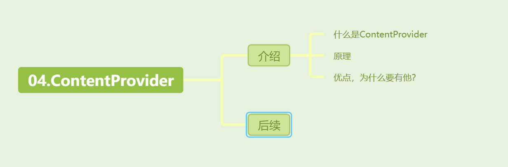
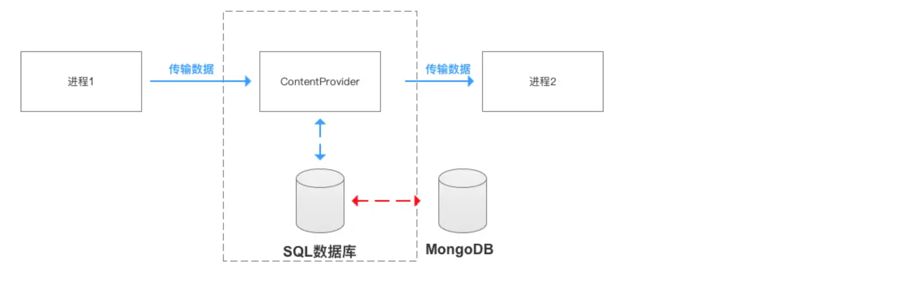
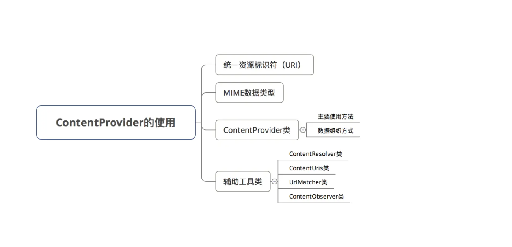

[toc]



## 01. ContentProvider介绍

### 1.1 什么是ContentProvider

**它是Android中不同应用程序间共享数据的组件**，具体来说，对于当前应用，借助ContentProvider提供的接口，其可以将内部的数据像数据库一样暴露给外部应用，或者从其它应用中像读取数据库一样读取共享的数据。

### 1.2 原理

ContentProvider 的底层工作原理是基于 Binder 机制的。

客户端进程通过 ContentResolver 的方法访问数据时，ContentResolver 会根据 URI 定位到目标的代理ContentProvider，我们调用ContentProvider对应方法时，调用的是proxy方法。会通过 Binder 机制将请求发送到服务端进程。服务端进程接收请求后，调用自身ContentProvider 的相应方法（如 `query()`、`insert()`、`update()` 或 `delete()`）执行数据操作，并将结果返回给客户端进程。

### 1.3 优点

他有什么优点呢？为什么要用ContentProvider呢？有这么多数据共享的方式，比如文件，数据库啊。这是因为他们存在一个问题，不同数据存储方式之间执行的代码不同，即耦合度较高，比如：

- 采用 文件方式 对外共享数据，需要进行文件操作读写数据；
- 采用 `Sharedpreferences` 共享数据，需要使用sharedpreferences API读写数据

这使得访问数据变得复杂 & 难度大。

而采用ContentProvider方式，其解耦了底层数据的存储方式，使得无论底层数据存储采用何种方式，外界对数据的访问方式都是统一的（即：可以通过 ContentResolver 以相同的方式访问数据），这使得访问简单 & 高效。

> 如一开始数据存储方式 采用 `SQLite` 数据库，后来把数据库换成 `MongoDB`，也不会对上层数据`ContentResolver `使用代码产生影响



## 02. 相关概念



### 2.1 URI

1. URI 的定义

**URI (Uniform Resource Identifier)** 是统一资源标识符，用来唯一标识某个资源。在 ContentProvider 中，URI 主要用于标识要访问的数据的位置，比如标识某个数据库表、记录等。

2. URI 的结构

URI 的结构可以分为以下几个部分：

```java
content://com.carson.provider/User/1
```

​	解释：

- **content**: 表示这是一个 ContentProvider。Android 系统规定，所有 ContentProvider 的 URI 都以 `content://` 开头。
- **com.carson.provider**: 表示 ContentProvider 的唯一标识符。通常是包名或包名后缀。
- **User**: 这是 **表名**，表示 ContentProvider 中数据库中的某个表，在这个例子中是 `User` 表。
- **1**: 这是具体记录的 **ID**，指向 `User` 表中 id 为 1 的某一行数据。如果没有具体的 ID，则表示操作整个表。


### 2.2 MIME

MIME 类型用于指定 **某个 URI 对应的资源的数据类型**。不同的 URI 会指向不同的数据记录或数据集合，而这些数据的类型需要通过 MIME 来描述，确保客户端应用可以正确理解并处理这些数据。

1. **ContentProvider.getType方法**

通过调用 `ContentProvider.getType(Uri uri)` 方法，客户端应用可以获取指定 URI 对应的数据类型（MIME）。ContentProvider 会根据 URI 的结构返回合适的 MIME 类型。

例如：

```java
String mimeType = getContentResolver().getType(uri);
```

2.  **MIME 类型的组成**

每个 MIME 类型由两部分组成，格式为：

```
类型/子类型
```

例如：

- `text/html`：类型是 `text`，子类型是 `html`，表示这是一个 HTML 文件。
- `application/pdf`：类型是 `application`，子类型是 `pdf`，表示这是一个 PDF 文件。

3. **item和dir**

当 ContentProvider 返回数据时，通过 MIME 类型中的 `vnd.android.cursor.item/自定义` 和 `vnd.android.cursor.dir/自定义` 来告知客户端应用 **返回的是单条记录还是多条记录**。

举例

```xml
<-- 单条记录 -->
  // 单个记录的MIME类型
  vnd.android.cursor.item/vnd.yourcompanyname.contenttype 

  // 若一个Uri如下
  content://com.example.transportationprovider/trains/122   
  
  // 则ContentProvider会通过ContentProvider.geType(url)返回以下MIME类型
  vnd.android.cursor.item/vnd.example.rail


<-- 多条记录 -->
  // 多个记录的MIME类型
  vnd.android.cursor.dir/vnd.yourcompanyname.contenttype 
  
  // 若一个Uri如下
  content://com.example.transportationprovider/trains 
  
  // 则ContentProvider会通过ContentProvider.geType(url)返回以下MIME类型
  vnd.android.cursor.dir/vnd.example.rail
```


### 2.3 ContentProvider

1. 组织数据方式

   **ContentProvider** 主要以**表格形式**组织和管理数据，类似于数据库表。每个表由 **行（记录）** 和 **列（字段）** 组成：

   - **行**：代表数据库中的一条记录，例如某个用户的信息。
   - **列**：代表记录中的一个字段，例如用户的名字或 ID。

   除了表格数据外，ContentProvider 也可以用于文件存储和管理。不过，表格形式更为常见，因为很多应用使用 SQLite 数据库来组织数据。


2. 主要方法

   **ContentProvider** 的核心操作与数据库基本一致，即 **增（insert）**、**删（delete）**、**改（update）** 和 **查（query）** 数据。

   以下是这四个核心方法的具体解释：

   1. **`insert(Uri uri, ContentValues values)`**：
      - 向uri中插入数据。其中`ContentValues` 是键值对的形式，用来存储要插入的数据内容。
   2. **`delete(Uri uri, String selection, String[] selectionArgs)`**：
      - 删除`uri`中指定条件的数据。通过 `selection` 和 `selectionArgs` 来指定删除的条件。
   3. **`update(Uri uri, ContentValues values, String selection, String[] selectionArgs)`**：
      - 更新`uri`中指定条件的数据。
   4. **`query(Uri uri, String[] projection, String selection, String[] selectionArgs, String sortOrder)`**：
      - 该方法用于查询数据。`projection` 用来指定需要查询的列，`selection` 和 `selectionArgs` 用来指定查询条件，`sortOrder` 用来指定结果的排序方式。返回值是一个 `Cursor` 对象，包含查询结果。

3. 其他方法：
   1. **`onCreate()`**：
      - ContentProvider 启动过程中会调用该方法。此方法通常用于初始化数据存储或者数据库的连接。**注意：** `onCreate()` 是在主线程中执行的，不能进行耗时操作（例如初始化大型数据库或文件）。
   2. **`getType(Uri uri)`**：
      - 该方法用于返回给定 URI 对应的数据的 **MIME 类型**。

4. 注意事项：
   1. **四个核心方法执行在 ContentProvider 注册进程，并在 Binder 线程池中执行，而不是主线程**。考虑到存在多线程并发访问，为了保证数据安全在实现 ContentProvider 是还需要保证线程同步。如果数据存储方式是 **SQLite**，通常不需要额外处理，因为 SQLite 内部已经实现了线程同步机制；但如果是使用其他方式（如内存或多个数据库实例），则需要手动实现线程同步，避免并发问题。
   2. onCreate() 方法执行在 ContentProvider 注册进程的主线程，因此不能执行耗时操作。
   3. **ContentProvider** 并不直接与外部进程进行通信，外部应用需要通过 ContentResolver 调用 ContentProvider 的方法来访问数据。


## 03. ContentProvider核心类

包括`ContentProvider`的封装`ContentResolver` 。以及三个辅助工具类来简化其使用：`ContentUris`，`UriMatcher`，`ContentObserver`。

### 3.1 ContentResolver

#### 1.作用

**ContentResolver** 的主要作用是**统一管理不同** ContentProvider 之间的操作，**简化了应用程序访问数据的流程**。

首先是简化了应用程序访问数据的流程。ContentProvider 的核心是通过 Binder 机制进行进程间通信，而 ContentResolver 隐藏了这种跨进程通信的复杂性。使得开发者不需要处理底层的跨进程通信细节。

统一管理：一个应用可能会使用多个不同的 ContentProvider，每个 ContentProvider 可能有不同的实现方式和存储机制。如果直接与 ContentProvider 交互，开发者需要分别了解每个 ContentProvider 的具体实现，这样操作的复杂性会增加。使用**ContentResolver**进行一层封装，可以让开发者无需了解每个 ContentProvider 的内部实现。

#### 2.理解：

**ContentProvider** 是对不同存储形式（如数据库或文件）的封装，使得数据访问不需要关心底层数据操作的具体实现细节。ContentResolver是当前应用提供给外部应用的数据访问接口，是对ContentProvider 的封装。

#### 3.具体使用

**ContentResolver** 提供了一系列与 **ContentProvider** 相同名称，参数和功能的 CRUD 方法，允许开发者进行数据插入、删除、更新和查询操作。

使用示例：

1. **获取 ContentResolver**：

   - ContentResolver 是通过 `Context` 类获取的。所有继承自 `Context` 的类都可以通过 `getContentResolver()` 方法来获取 ContentResolver。

   ```java
   ContentResolver resolver = getContentResolver();
   ```
   
2. **设置 URI**：

   - URI 用于指定操作的 ContentProvider 和数据表。例如，`content://cn.scu.myprovider/user` 表示访问 `cn.scu.myprovider` 这个 ContentProvider 中的 `user` 表。

   ```
   Uri uri = Uri.parse("content://cn.scu.myprovider/user");
   ```
   
3. **查询数据**：

   - 使用 `resolver.query()` 方法，基于 URI 查询数据。例如，查询 `user` 表中的所有记录，并按 `userid` 降序排列。

   ```
   Cursor cursor = resolver.query(uri, null, null, null, "userid desc");
   ```


### 3.2 **ContentUris 类**

**作用**：ContentUris 类提供了简便的方法来构建或解析带有 ID 的 URI。

**怎么理解？**

在 ContentProvider 中，通常需要通过表的 URI 来操作某内部一条特定的数据记录。因为每条记录通常由一个唯一的 ID 标识，因此我们需要给其附加ID。

说白了，就是附加或解析获取ID

**核心方法**：

1. **`withAppendedId(Uri uri, long id)`**：

   - **作用**：向指定的 URI 后附加一个 ID，生成指向某条记录的 URI。

   - 示例：

     ```java
      Uri uri = Uri.parse("content://cn.scu.myprovider/user");
     Uri resultUri = ContentUris.withAppendedId(uri, 7);  
     // 最终生成后的 URI 为：content://cn.scu.myprovider/user/7
     ```
     
   - 这种方法常用于创建指向特定记录的 URI，例如在查询或更新特定记录时。

2. **`parseId(Uri uri)`**：

   - **作用**：从一个 URI 中提取出 ID。

   - 示例：

     ```java
     Uri uri = Uri.parse("content://cn.scu.myprovider/user/7");
     long personId = ContentUris.parseId(uri); 
     // 获取的结果为: 7
     ```
     
   - 这种方法常用于从 URI 中提取记录 ID，以便对具体的记录进行操作。

**提问：那我为什么不能用StringBuilder，在后面附加7？**

因为：手动拼接可能会导致 URI 不合法或无法正确解析。


### 3.3 **UriMatcher 类**

**作用**：**UriMatcher** 用于在 **ContentProvider** 中将 URI 与特定的 **URI_CODE** 进行匹配，使得 ContentProvider 能够根据 URI 的路径做出相应的处理。

**使用步骤**：

1. **初始化 UriMatcher 对象**：

   使用 `UriMatcher.NO_MATCH` 表示当前不匹配任何路径。

   ```
   UriMatcher matcher = new UriMatcher(UriMatcher.NO_MATCH);
   ```

2. **注册 URI**：

   - 通过 `addURI()` 方法将 URI 与特定的 **URI_CODE** 绑定。在 `ContentProvider` 中，每个 URI 代表不同的数据表或资源。

   ```
   matcher.addURI("cn.scu.myprovider", "user1", URI_CODE_a);
   matcher.addURI("cn.scu.myprovider", "user2", URI_CODE_b);
   ```

   **第一个参数 `"cn.scu.myprovider"`**：这是 **ContentProvider** 的 **Authority**，表示 URI 所属的内容提供者的唯一标识。

   **第二个参数 `"user1"`**：这是 URI 的路径部分

   **第三个参数 `URI_CODE_a`**：这是一个整数代码，用于标识该 URI 对应的资源

3. **匹配 URI**：

   - 使用 `match()` 方法来匹配 URI，并根据返回的 **URI_CODE** 来决定处理的逻辑。

   ```
   @Override
   public String getType(Uri uri) {
       switch (matcher.match(uri)) {
           case URI_CODE_a:
               return "vnd.android.cursor.dir/vnd.cn.scu.myprovider.user1";
           case URI_CODE_b:
               return "vnd.android.cursor.dir/vnd.cn.scu.myprovider.user2";
           default:
               throw new IllegalArgumentException("Unknown URI: " + uri);
       }
   }
   ```

   当你通过 `matcher.match(uri)` 方法匹配 URI 时，如果传入的 URI 与 `"cn.scu.myprovider/user1"` 匹配，则 `UriMatcher` 会返回 `URI_CODE_a`，让你知道这段逻辑应该处理 `user1` 表的数据。

### 3.4 **ContentObserver 类**

**作用**：**ContentObserver** 是一个监听器，它用于监听某个 **URI** 相关的 **ContentProvider** 数据的变化。当 **ContentProvider** 中的数据发生增删改时，会通过 **ContentObserver** 通知外部应用程序。

它通常用于实现实时更新机制，当数据变化时自动刷新 UI 或其他相关的应用逻辑。

**使用步骤**：

1. **注册 ContentObserver**：

   - 使用 `getContentResolver().registerContentObserver()` 方法注册一个内容观察者，并指定需要监听的 URI。

   ```java
   getContentResolver().registerContentObserver(uri, true, new ContentObserver(new Handler()) {
       @Override
       public void onChange(boolean selfChange) {
           // 数据发生变化时的处理逻辑
       }
   });
   ```

   **`uri`**：指定需要监听的 URI，例如某个表或特定记录。

   **`true`**：表示是否要监听该 URI 子路径的变化。如果为 `true`，则监听 URI 和它的子路径；如果为 `false`，则仅监听指定的 URI。

    `onChange()`：当 URI 对应的数据发生变化时，系统会调用 `onChange()` 方法

2. **通知数据变化**：

   - 当 **ContentProvider** 中的数据发生变化时，调用 `getContext().getContentResolver().notifyChange(uri, null)` 方法来通知所有监听该 URI 的 **ContentObserver**，以便它们能够执行相应的操作。此时内容观察者内部执行onChange操作

   ```java
   public Uri insert(Uri uri, ContentValues values) {
       db.insert("user", "userid", values);
       getContext().getContentResolver().notifyChange(uri, null);
       return uri;
   }
   ```

   **`uri`**：这是发生变化的具体 URI，通常是被修改的数据的 URI。

   **`null`**：第二个参数是一个观察者对象，通常可以为 `null`，它用于避免循环通知。

3. **解除 ContentObserver**：

   - 当不再需要监听数据变化时，可以通过 `unregisterContentObserver()` 方法解除观察者。

   ```java
   getContentResolver().unregisterContentObserver(observer);
   ```

​		参数 `observer` 是之前通过 `registerContentObserver()` 注册的观察者实例。

### 3.5 总结：

- **ContentUris**：用于简化对URI的ID添加和解析操作
- **UriMatcher**：用于在 ContentProvider 中根据不同的 URI 匹配不同的资源或表，从而简化对不同 URI 的处理逻辑。
- **ContentObserver**：用于监听 ContentProvider 中的数据变化，当数据发生增删改时，通知外部应用并触发相应的操作。


## 04.实例说明

- 由于`ContentProvider`不仅常用于进程间通信，同时也适用于进程内通信
- 所以本实例会采用ContentProvider讲解：
  1. 进程内通信
  2. 进程间通信

### 4.1 进程内通信

- 步骤说明：
  1. 创建数据库类
  2. 自定义 `ContentProvider` 类
  3. 注册 创建的 `ContentProvider`类
  4. 进程内访问 `ContentProvider`的数据
- 具体使用

#### 1. **创建数据库类 `DBHelper.java`**

**`DBHelper`** 类继承自 **`SQLiteOpenHelper`**，用于创建和管理 SQLite 数据库。它负责创建两个表：

- `user` 表：存储用户信息（`_id` 和 `name`）。
- `job` 表：存储职业信息（`_id` 和 `job`）。

```
public class DBHelper extends SQLiteOpenHelper {
    private static final String DATABASE_NAME = "finch.db";
    public static final String USER_TABLE_NAME = "user";
    public static final String JOB_TABLE_NAME = "job";
    private static final int DATABASE_VERSION = 1;

    public DBHelper(Context context) {
        super(context, DATABASE_NAME, null, DATABASE_VERSION);
    }

    @Override
    public void onCreate(SQLiteDatabase db) {
        // 创建两个表格:用户表 和职业表
        db.execSQL("CREATE TABLE IF NOT EXISTS " + USER_TABLE_NAME + "(_id INTEGER PRIMARY KEY AUTOINCREMENT," + " name TEXT)");
        db.execSQL("CREATE TABLE IF NOT EXISTS " + JOB_TABLE_NAME + "(_id INTEGER PRIMARY KEY AUTOINCREMENT," + " job TEXT)");
    }
}
```

#### 2. **自定义 ContentProvider 类**

**`MyProvider`** 是自定义的 **ContentProvider**，它继承了 **`ContentProvider`** 类并实现了必须的 6 个方法：

- **`insert()`**：用于插入数据。
- **`query()`**：用于查询数据。
- **`delete()`、`update()`、`getType()`**：虽然不在这个例子中详细展开，但它们也是 **ContentProvider** 的必需方法。
- **`getTableName()`**：通过 `UriMatcher` 将 URI 与数据库中的表匹配。

```
public class MyProvider extends ContentProvider {
    private static final UriMatcher mMatcher;

    // 初始化 UriMatcher，用于匹配 URI
    static {
        mMatcher = new UriMatcher(UriMatcher.NO_MATCH);
        mMatcher.addURI("cn.scu.myprovider", "user", 1);
        mMatcher.addURI("cn.scu.myprovider", "job", 2);
    }

    // 初始化 ContentProvider，创建数据库实例
    @Override
    public boolean onCreate() {
        mDbHelper = new DBHelper(getContext());
        db = mDbHelper.getWritableDatabase();
        return true;
    }

    // 插入数据的方法
    @Override
    public Uri insert(Uri uri, ContentValues values) {
        String table = getTableName(uri); // 匹配 URI 对应的表
        db.insert(table, null, values);
        getContext().getContentResolver().notifyChange(uri, null); // 通知数据变更
        return uri;
    }

    // 查询数据的方法
    @Override
    public Cursor query(Uri uri, String[] projection, String selection, String[] selectionArgs, String sortOrder) {
        String table = getTableName(uri); // 匹配 URI 对应的表
        return db.query(table, projection, selection, selectionArgs, null, null, sortOrder, null);
    }

    // 根据 URI 匹配相应的表
    private String getTableName(Uri uri) {
        switch (mMatcher.match(uri)) {
            case 1: return DBHelper.USER_TABLE_NAME;
            case 2: return DBHelper.JOB_TABLE_NAME;
            default: throw new IllegalArgumentException("Unknown URI: " + uri);
        }
    }
}
```

#### 3. **注册 ContentProvider 类**

在 **`AndroidManifest.xml`** 文件中注册 **`MyProvider`**，并通过 **`authorities`** 属性唯一标识这个 `ContentProvider`。

```
<provider
    android:name="MyProvider"
    android:authorities="cn.scu.myprovider"/>
```

#### 4. **通过 `ContentResolver` 访问 ContentProvider 数据**

**`MainActivity.java`** 演示了如何通过 **`ContentResolver`** 访问和操作 **ContentProvider** 中的数据。`ContentResolver` 是 Android 提供的接口，用于跨进程或进程内访问 **ContentProvider**。

```
public class MainActivity extends AppCompatActivity {
    @Override
    protected void onCreate(Bundle savedInstanceState) {
        super.onCreate(savedInstanceState);
        setContentView(R.layout.activity_main);

        // 操作 user 表
        Uri uri_user = Uri.parse("content://cn.scu.myprovider/user");

        // 插入数据
        ContentValues values = new ContentValues();
        values.put("_id", 3);
        values.put("name", "Iverson");
        getContentResolver().insert(uri_user, values);

        // 查询数据
        Cursor cursor = getContentResolver().query(uri_user, new String[]{"_id", "name"}, null, null, null);
        while (cursor.moveToNext()) {
            System.out.println("query user:" + cursor.getInt(0) + " " + cursor.getString(1));
        }
        cursor.close();

        // 操作 job 表
        Uri uri_job = Uri.parse("content://cn.scu.myprovider/job");

        // 插入数据
        ContentValues values2 = new ContentValues();
        values2.put("_id", 3);
        values2.put("job", "NBA Player");
        getContentResolver().insert(uri_job, values2);

        // 查询数据
        Cursor cursor2 = getContentResolver().query(uri_job, new String[]{"_id", "job"}, null, null, null);
        while (cursor2.moveToNext()) {
            System.out.println("query job:" + cursor2.getInt(0) + " " + cursor2.getString(1));
        }
        cursor2.close();
    }
}
```

#### 5. 动态过程

在 **应用进程启动** 时，Android 系统会自动初始化并调用 **ContentProvider**，即使 `ContentProvider` 没有被主动调用。这是因为 **`MyProvider`** 在 **`AndroidManifest.xml`** 中注册了，该组件运行在主线程中。此时数据库表 `user` 和 `job` 被创建并插入初始数据。

**`ContentResolver.query()`** 方法会将查询请求发送到 `MyProvider`。

**`MyProvider.query()`** 方法根据传入的 URI（`content://cn.scu.myprovider/user`）确定查询的表是 `user` 表。

**数据库操作**：`query()` 方法会在数据库中执行查询，并将结果返回

**返回查询结果**：`ContentResolver` 将查询结果返回到界面，应用可以根据这些结果更新 UI。例如，显示所有用户的列表。


**提问**：

1. 进程内部，ContentResolver.insert() 方法怎么将插入请求传递给 MyProvider。 
2. MyProvider以什么形式运行？是直接运行在主线程中吗？
3. 数据变化通知的底层原理及过程。

**回答：**

1. 在同一进程内调用 `ContentResolver` 的方法（如 `insert()` 或 `query()`），是通过 **直接调用 `ContentProvider` 的相应方法** 来执行数据操作的，不需要通过消息队列或事件循环。

2. `MyProvider` 作为 **ContentProvider** 的具体实现，确实是在应用的 **主线程** 中运行的。`onCreate()`、`insert()`、`query()` 等方法默认会在主线程中执行。
3. `new ContentObserver(new Handler())`，创建观察者的时候会创建一个Handler，其使用的是主线程的looper。数据变化时，`notifyChange()` 方法会将数据变化的通知封装成一条消息，并通过 `Handler` 发送到主线程的消息队列（`MessageQueue`）中，然后 `Looper` 会从队列中取出消息传递给相应的 `Handler` 。`Handler` 接收到消息后，会调用 `ContentObserver` 的 `onChange()` 方法来处理具体的数据变化逻辑。


### 4.2 进程间数据共享的实现步骤

#### 1. **进程 1：ContentProvider 的创建与权限设置**

1. **创建数据库类** 和 **自定义 ContentProvider 类** 的过程与进程内通信类似，您已经在前面的例子中学习了如何实现这些部分。
2. **注册 ContentProvider 类并设置权限**

在 **`AndroidManifest.xml`** 文件中，除了注册 `ContentProvider`，我们还需要设置 **读写权限** 和 **进程间通信的可访问性**：

```
<provider 
    android:name="MyProvider"
    android:authorities="scut.carson_ho.myprovider"
    
    // 声明外部进程访问该 ContentProvider 的权限
    android:permission="scut.carson_ho.PROVIDER"
    
    // 细分为读 & 写权限（如果需要）
    android:readPermission="scut.carson_ho.Read"
    android:writePermission="scut.carson_ho.Write"

    // 声明该 ContentProvider 可以被其他进程访问
    android:exported="true" />
```

**关键点解释：**

- **`android:permission`**：声明整个 ContentProvider 的访问权限，外部进程需要与其匹配的权限才能访问。
- **`android:readPermission` 和 `android:writePermission`**：细化读写权限，确保对数据的访问是根据权限控制的。
- **`android:exported="true"`**：这允许 ContentProvider 被其他进程访问。如果不设置或设置为 `false`，其他进程将无法访问此 ContentProvider。

1. **声明权限**： 在 **`AndroidManifest.xml`** 中，还需要声明该应用允许的通信权限：

```
<permission android:name="scut.carson_ho.Read" android:protectionLevel="normal"/>
<permission android:name="scut.carson_ho.Write" android:protectionLevel="normal"/>
<permission android:name="scut.carson_ho.PROVIDER" android:protectionLevel="normal"/>
```

这些权限声明了外部进程需要具备相应的权限，才能进行对 `ContentProvider` 的读写操作。

#### 2. **进程 2：访问 ContentProvider 的设置**

进程 2 是另一个应用，需要通过权限验证后才能访问 **进程 1** 中的 `ContentProvider`。我们需要在进程 2 中设置相应的权限。

1. **声明权限**

在 **进程 2** 的 **`AndroidManifest.xml`** 文件中，声明需要访问的权限：

```
<uses-permission android:name="scut.carson_ho.PROVIDER"/>
<uses-permission android:name="scut.carson_ho.Read"/>
<uses-permission android:name="scut.carson_ho.Write"/>
```

**关键点解释**：

- 这些权限必须与 **进程 1** 中设置的权限保持一致。只有在获得这些权限后，进程 2 才能通过 **`ContentResolver`** 访问进程 1 中的 `ContentProvider`。

#### 3. **在进程 2 中通过 ContentResolver 访问数据**

在 **进程 2** 中，您可以通过 `ContentResolver` 访问 **进程 1** 中的 `ContentProvider`。操作类似于进程内通信，唯一的区别是这里发生在不同的进程之间。

```
Uri uri_user = Uri.parse("content://scut.carson_ho.myprovider/user");
ContentResolver resolver = getContentResolver();

// 插入数据
ContentValues values = new ContentValues();
values.put("_id", 4);
values.put("name", "Jordan");
resolver.insert(uri_user, values);

// 查询数据
Cursor cursor = resolver.query(uri_user, new String[]{"_id", "name"}, null, null, null);
while (cursor.moveToNext()) {
    System.out.println("query user:" + cursor.getInt(0) + " " + cursor.getString(1));
}
cursor.close();
```

**关键点解释**：

- `Uri` 使用了 `scut.carson_ho.myprovider`，这是在 **进程 1** 中为 `ContentProvider` 设置的 `authority`。
- 通过 `ContentResolver`，进程 2 可以插入和查询数据，像操作本地数据库一样访问 **进程 1** 中的数据。

#### 4. **运行两个进程**

- **先运行进程 1**：进程 1 负责初始化数据库和 `ContentProvider`。在该进程中，数据已经准备好了。
- **再运行进程 2**：进程 2 通过 `ContentResolver` 访问 **进程 1** 的 `ContentProvider`，并执行插入和查询操作。


## 其他介绍

### 01.关于我的博客

- csdn：http://my.csdn.net/qq_35829566

- 掘金：https://juejin.im/user/499639464759898

- github：https://github.com/jjjjjjava

- 简书：http://www.jianshu.com/u/92a2412be53e

- 邮箱：[934137388@qq.com](mailto:934137388@qq.com)

  
