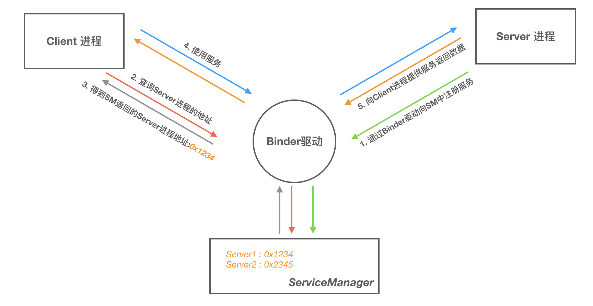

[toc]


## 01. Binder介绍

### 1.1 什么是Binder

Binder 是一种进程间通信机制，从字面上来解释 Binder 有胶水、粘合剂的意思，顾名思义就是粘和不同的进程，使之实现通信。

### 1.2 为什么要有Binder

Linux 已经提供了管道、消息队列、共享内存和 Socket 等 IPC 机制。那为什么 Android 还要提供 Binder 来实现 IPC 呢？主要是基于**性能**、**稳定性**和**安全性**几方面的原因。

#### 性能

首先说说性能上的优势。Socket 要经过多层协议栈的处理，其传输效率低，开销大，主要用在跨网络的进程间通信。消息队列和管道采用存储-转发方式，即数据先从发送方缓存区拷贝到内核开辟的缓存区中，然后再从内核缓存区拷贝到接收方缓存区，至少有两次拷贝过程。共享内存性能最高，无需拷贝。Binder 需要一次数据拷贝，性能上仅次于共享内存。

从性能上看，就用共享内存就好了啊？为什么用Binder呢？这是基于稳定性和安全性的权衡考虑。

注：各种IPC方式数据拷贝次数。

| IPC方式              | 数据拷贝次数 |
| -------------------- | ------------ |
| 共享内存             | 0            |
| Binder               | 1            |
| Socket/管道/消息队列 | 2            |

#### 稳定性

再说说稳定性，Binder 基于 C/S 架构，客户端（Client）有什么需求就丢给服务端（Server）去完成，架构清晰、职责明确又相互独立，自然稳定性更好。共享内存虽然无需拷贝，但是控制复杂，容易出现竞争条件和死锁等问题，稳定性较差。从稳定性的角度讲，Binder 机制是优于内存共享的。

#### *安全性

此外，Binder 支持实名 Binder 和匿名 Binder，实名 Binder 用于长期通信，匿名 Binder 用于短期通信，通信完即销毁，防止接入点暴露，从而提高了安全性。

基于性能，稳定性和安全性的综合考虑，Android有了自己的IPC通信机制：Binder。

**最后用一张表格来总结下 Binder 的优势：**

| 优势   | 描述                                                         |
| ------ | ------------------------------------------------------------ |
| 性能   | 只需要一次数据拷贝，性能上仅次于共享内存                     |
| 稳定性 | 基于 C/S 架构，职责明确、架构清晰，因此稳定性好              |
| 安全性 | Binder 通过内核为每个应用分配唯一的 UID/PID，确保通信双方的身份可靠，同时支持匿名 Binder，防止接入点暴露。 |


## 02. Linux下传统的进程间通信原理

我们得思考一个问题啊，Binder是为了解决进程间通信的问题，那么为什么Linux下进程间通信很困难呢？

### 2.1 基础概念

#### 1. 进程隔离 （进程间通信困难的原因）

Linux下进程间通信困难的原因是进程隔离。进程隔离是指在Linux中，两个进程之间彼此独立，他们无法访问到彼此所拥有的物理内存。

首先，Linux中内存分为物理内存和虚拟内存。物理内存是实际的内存，虚拟内存是为了更高效的使用物理内存出现的。页表是虚拟内存到物理内存的设置。不同进程的页表通常不会映射到相同的物理地址，这确保了他们无法直接访问其他进程的物理内存地址。

为什么要有进程隔离？这是出于安全性和隐私性的角度。假如不隔离，我可以随意修改或访问你的物理内存，那么你的数据就不安全，被修改。也不隐私，会被我访问。

#### 2. 进程空间划分：用户空间，内核空间（进程通信的底层倚赖）

那这样说来，我们岂不是没办法访问到其它进程的数据吗?有可行的方法吗？有的，孩子，Linux提供了两种进程空间。其中内核空间可以完全访问所有的物理内存地址。我们可以借助内核缓冲区当作中转站，进行数据的传输。

比如，对于**32 位系统**来说，虚拟地址空间是 2^32 = 4GB，也就是说每个进程理论上可以访问 4GB 的地址空间（虚拟存储空间）。但这 4GB 并不全是留给用户程序的，它被划分为用户空间和内核空间。

用户空间是应用程序运行的地方，内核空间是系统内核及其驱动程序运行的地方。内核空间拥有对整个系统的完全控制，可以访问所有的物理内存地址，而用户空间只能访问自己的虚拟地址空间。

内核空间其实是同一个，它映射到的物理内存是相同的，不同的是用户空间，无法映射到相同的物理内存。因此IPC数据传输实际是借助相同的内核空间进行传输。

**那么为什么要进行不同空间的划分？：**

- **安全性**：用户进程被隔离在用户空间内，无法随意访问内核空间的敏感数据或直接操作硬件。如果没有这种隔离，恶意程序可能会尝试修改系统内核或操作硬件，导致严重的安全问题。

- **稳定性**：应用程序如果在执行过程中崩溃，它只能影响用户空间中的内存，不会影响内核和其它进程的运行。内核的隔离防止用户程序导致整个操作系统崩溃。

#### 3. 系统调用（进程间通信的中转）

那么我们怎么利用内核空间，访问内核缓冲区呢？这要通过系统调用完成。

系统调用其实也是进程间通信机制，只不过不是用户进程间的，是内核和用户进程之间的。

1. **用户进程发起请求**：用户进程通过系统调用请求内核执行特定操作。
2. **进入内核态**：内核进程监听到该系统调用，进行**上下文切换**，使得处理器从**用户态**切换到**内核态**。
3. **内核执行请求的操作**：内核进程根据系统调用号执行相应的操作。
4. **返回结果**：内核进程将操作结果返回给用户进程，并切换回用户态，用户进程继续执行。

Linux下进程通信的系统调用通过下面的两个函数实现

```
copy_from_user() //将数据从用户空间拷贝到内核空间
copy_to_user() //将数据从内核空间拷贝到用户空间
```

### 2.2 Linux下传统IPC原理


## 03. Binder通信底层原理

Binder通信依赖于Binder驱动和mmap内存映射。

### 3.1 Binder驱动

**首先要解决一个问题：跨进程通信是需要内核做支持的**。传统的 IPC 机制如管道、Socket 都是内核的一部分，因此通过内核支持来实现进程间通信自然是没问题的。但是 Binder 并不是 Linux 系统内核的一部分，那怎么办呢？

这就得益于 Linux 的**动态内核可加载模块**（Loadable Kernel Module，LKM）的机制；它在运行时被链接到内核作为内核的一部分运行。这样用户进程之间通过这个内核模块作为桥梁来实现通信。在 Android 系统中，Binder驱动在系统启动时被加载到内核中。

### 3.2 **mmap() 的工作过程：**

那么如何降低内存拷贝的次数呢？这倚赖于mmap，其将内核空间中的内存区域映射到进程的虚拟地址空间中，这样进程访问自己的这段虚拟地址空间实际通过页表转化到对应内核空间的物理地址中。即：用户进程可以直接访问内核物理空间。

### 3.3 Binder IPC通信过程

一次完整的 Binder IPC 通信过程通常是这样：

1. 首先 Binder 驱动在内核空间中开辟一块数据缓冲区，用作数据的存储
2. 接着将这一块内核空间映射到 **接收进程的用户虚拟地址空间中**。
3. 发送方（进程 A）通过系统调用（ `copy_from_user()`）将自身用户空间的数据复制到内核空间的缓冲区中。
4. 此时进程 B 就可以通过访问自身的用户空间缓存区，经过内存映射，来访问到这块物理内存，进而获取到进程 A 传递的数据了。


这是底层的通信原理，但是到这一块，也只是类似共享内存，并没有超越其的地方，没有体现出自己的安全性，稳定性。

## 04. Binder通信模型

上面是Binder通信的操作系统层的原理，这只显示出来他性能上优越的地方，但是它的稳定性和安全性呢？这些在他的通信模型中体现出来。

### 4.1 Client/Server/ServiceManager/驱动

Binder 是基于 C/S 架构的。由一系列的组件组成，包括 Client、Server、ServiceManager（管理Binder节点的注册和查询）、Binder 驱动。其中 Client、Server、Service Manager 运行在用户空间，Binder 驱动运行在内核空间。其中 Service Manager 和 Binder 驱动由系统提供，而 Client、Server 由应用程序来实现。

Binder驱动注册成功后成为一个设备文件节点：/dev/binder，Client、Server 和 ServiceManager 可以通过 `open`、`mmap` 和 `ioctl` 系统调用来与 Binder 驱动交互。


Client、Server、ServiceManager、Binder 驱动这几个组件在通信过程中扮演的角色就如同互联网中服务器（Server）、客户端（Client）、DNS域名服务器（ServiceManager）以及路由器（Binder 驱动）之前的关系。

通常我们访问一个网页的步骤是这样的：首先在浏览器输入一个地址，如 www.google.com 然后按下回车键。但是并没有办法通过域名地址直接找到我们要访问的服务器，因此需要首先访问 DNS 域名服务器，域名服务器中保存了 www.google.com 对应的 ip 地址 10.249.23.13，然后通过这个 ip 地址经由路由器才能放到到 www.google.com 对应的服务器。

我们拿着Binder对象名字，向ServiceManager（DNS）查询，就可以获得Binder对象在内核中的句柄，再经过Binder驱动（路由器），从而访问到它。

### 4.2 Binder C/S结构中通信过程

至此，我们大致能总结出 Binder 通信过程：

1. 首先，一个进程使用 BINDER_SET_CONTEXT_MGR（MGR就是Manager） 命令通过 Binder 驱动将自己注册成为 ServiceManager；
2. 驱动为这个Server的 Binder 创建位于内核中的实体节点，将名字以及新建的引用打包传给 ServiceManager。ServiceManger 收到数据后从中取出名字和引用填入查找表。
3. Client 通过名字，在 Binder 驱动的帮助下从 ServiceManager 中获取到对 Binder 实体的引用，通过这个引用就能将数据发送给Server，实现和Server的通信。

我们看到整个通信过程都需要 Binder 驱动的接入。下图能更加直观的展现整个通信过程(为了进一步抽象通信过程以及呈现上的方便，下图我们忽略了 Binder 实体及其引用的概念)：





## 05. AIDL-Binder的实际设计

AIDL-Binder的实际设计是什么样的呢？

### 5.1 **Stub 和 Proxy 的定义**

- **Stub**（桩）：是服务端的实际类，它是对接口方法的具体实现者，负责接收来自客户端的请求，并在服务端执行实际的操作。
- **Proxy**（代理）：是客户端的代理类，提供和实际类一模一样的接口方法，但是并不实际执行。它会将客户端的调用打包（序列化）成适合的数据，通过 Binder 机制发送到服务端的 Stub 进行处理。

### 5.2 执行流程

假如客户端A类要调用服务端B类中的某个方法。

- **客户端获取Proxy对象**：客户端通过ServiceConnection从ServiceManager中获取Server端Binder，并在内部通过 `asInterface`方法将IBinder对象转换为接口类型，如果是同一进程，返回Stub本身，否则返回Proxy。
- **Binder驱动**：它在内核中为每个进程维护一个缓冲区，服务端进程和客户端进程可以通过mmap分别访问自身的缓冲区。
- **客户端发送请求**：客户端调用 Proxy 的方法，这个方法会将请求和参数封装到 `Parcel data` 中。通过`copy_from_user()`将数据拷贝到**服务端进程的内核缓冲区中** 。
- **服务端处理请求**：服务端的 `onTransact()` 方法被触发，通过mmap直接访问内核缓冲区，解析请求和参数。根据 `code` 参数调用相应的 方法进行处理。处理完成后，将结果写入 `Parcel reply`，Binder 驱动通过 `copy_from_user` 将 `reply` 数据拷贝到客户端进程的内核缓冲区中
- **客户端接收结果**：客户端通过mmap直接访问客户端进程的内核缓冲区，获取结果。

## 06. 演示案例

借助一个service组件提供服务的演示案例，我们来讲解清楚Binder驱动的底层和通信层原理。

这是Binder的AIDL接口

```java
public interface IGradeService extends android.os.IInterface {

    public static abstract class Stub extends android.os.Binder
        implements IGradeService {

        public static IGradeService asInterface(android.os.IBinder obj) {
            if (obj == null) {
                return null;
            }
            android.os.IInterface iin = obj.queryLocalInterface(DESCRIPTOR);
            if (iin != null && iin instanceof IGradeService) {
                return (IGradeService) iin;
            }
            return new Proxy(obj);
        }

        @Override
        public boolean onTransact(int code, Parcel data, Parcel reply, int flags) throws RemoteException {
            // 处理客户端的请求
        }

        private static class Proxy implements IGradeService {
            private android.os.IBinder mRemote;

            Proxy(android.os.IBinder remote) {
                mRemote = remote;
            }

            @Override
            public int getStudentGrade(String name) throws RemoteException {
                Parcel data = Parcel.obtain();
                Parcel reply = Parcel.obtain();
                int result;
                try {
                    data.writeInterfaceToken(DESCRIPTOR);
                    data.writeString(name);
                    mRemote.transact(Stub.TRANSACTION_getStudentGrade, data, reply, 0);
                    reply.readException();
                    result = reply.readInt();
                } finally {
                    reply.recycle();
                    data.recycle();
                }
                return result;
            }
        }
    }
}

```

案例分析：

1. **服务端返回 `Stub` 对象**：当服务端启动时，`onBind()` 方法会返回 `Stub` 实例。AMS 将这个 `Stub` 传递给客户端。
2. **客户端转换stub对象为proxy对象**：客户端调用`Proxy.getStudentGrade()` 方法

```java
public static IGradeService asInterface(IBinder obj) {
    if (obj == null) {
        return null;
    }
    IInterface iin = obj.queryLocalInterface(DESCRIPTOR);
    if (iin != null && iin instanceof IGradeService) {
        // 同一进程，直接返回 Stub
        return (IGradeService) iin;
    }
    // 跨进程，返回 Proxy
    return new Proxy(obj);
}
```

​	该方法实现了 **Binder 对象之间的相互转换**。根据当前是同一进程还是跨进程调用，`asInterface()` 会返回 `Stub` 或 `Proxy`：

- 如果 `IBinder` 对象在同一个进程中，直接返回 `Stub` 对象，因为没有必要通过 `Proxy` 来发送 `transact()` 调用。
- 如果 `IBinder` 是在不同的进程中，则返回 `Proxy` 对象，它负责处理跨进程的通信。

3. **客户端调用代理对象方法**：客户端获取到proxy对象后，调用proxy的getStudentGrade方法，该方法最终调用transact方法借助AMS传递给服务端

```java
mRemote.transact(Stub.TRANSACTION_getStudentGrade, data, reply, 0);
```

4. **服务端解析并调用本地方法**：服务端接受到Binder调用后，在onTransact方法中先解析data，然后根据code是Stub.TRANSACTION_getStudentGrade，调用getStudentGradeNative方法处理data，并最终将结果写入到reply中并返回客户端。

```java
public boolean onTransact(int code, Parcel data, Parcel reply, int flags) throws RemoteException {
            // 处理客户端的请求
        }
```

补充：

服务端service代码

```java
public class AidlGradeService extends Service {
    // 实现 Stub 的 getStudentGrade 方法
    private final IBinder mBinder = new IGradeService.Stub() {
        @Override
        public void basicTypes(int anInt, long aLong, boolean aBoolean, float aFloat, double aDouble, String aString) throws RemoteException {

        }

        @Override
        public int getStudentGrade(String name) throws RemoteException {
            return StudentMap.getStudentGrade(name);
        }
    };

    @Nullable
    @Override
    public IBinder onBind(Intent intent) {
        return mBinder;
    }
}
```

客户端代码

```java
public class AidlActivity extends BaseViewBindingActivity<ActivityBinderBinding> {

    private IGradeService mBinderProxy;

    private final ServiceConnection mServiceConnection = new ServiceConnection() {
        @Override
        public void onServiceConnected(ComponentName componentName, IBinder iBinder) {
            // 连接服务后，根据是否跨进程获取Binder或者Binder的代理对象
            mBinderProxy = IGradeService.Stub.asInterface(iBinder);
        }

        @Override
        public void onServiceDisconnected(ComponentName componentName) {
            mBinderProxy = null;
        }
    };

    @Override
    protected void onCreate(Bundle savedInstanceState) {
        super.onCreate(savedInstanceState);
        binding.btnBindService.setOnClickListener(view -> bindGradeService());
      	// 查询学生成绩
        binding.btnFindGrade.setOnClickListener(view -> getStudentGrade("Anna"));
    }
  
    // 绑定服务
    private void bindGradeService() {
        String action = "android.intent.action.server.aidl.gradeservice";
        Intent intent = new Intent(action);
        intent.setPackage(getPackageName());
        bindService(intent, mServiceConnection, BIND_AUTO_CREATE);
    }
  
    // 查询成绩
    private void getStudentGrade(String name) {
        int grade = 0;
        try {
            grade = mBinderProxy.getStudentGrade(name);
        } catch (RemoteException e) {
            e.printStackTrace();
        }
        ToastUtils.showShort("Anna grade is " + grade);
    }
}

```

## 其他介绍

### 01.关于我的博客

- csdn：http://my.csdn.net/qq_35829566

- 掘金：https://juejin.im/user/499639464759898

- github：https://github.com/jjjjjjava

- 简书：http://www.jianshu.com/u/92a2412be53e

- 邮箱：[934137388@qq.com]


