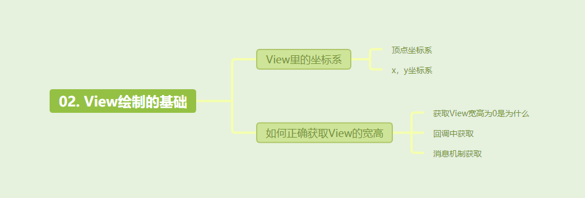
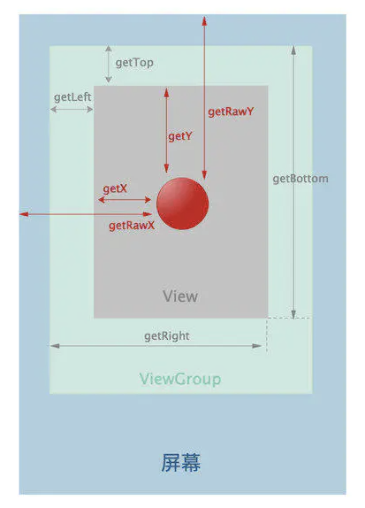

[toc]



- 我们为什么要介绍View的绘制基础？因为后续的OnMeasure等都要用到View的坐标系，我们需要清楚View的坐标系是什么样的。

## 01. View里的坐标系

### 1.1 view的四个顶点坐标

- view的位置主要由四个顶点坐标来决定的。

- 四个顶点坐标分别为：

  ```
  getTop();       //获取子View左上角距父View顶部的距离
  getLeft();      //获取子View左上角距父View左侧的距离
  getBottom();    //获取子View右下角距父View顶部的距离
  getRight();     //获取子View右下角距父View左侧的距离
  ```

- view的宽高计算：

  ```
  //宽=right-left
  int width = getRight() - getLeft();
  //框架自带
  int width2 = getWidth();
  
  //高=bottom-top
  int height = getBottom() - getTop();
  int height2 = getHeight();
  ```

- 具体view的坐标如图所示


### 1.2 view的x、y坐标

android3.0之后为view增加了x、y左边，其主要是标记点击事件的相对位置，具体如下：

- getX()：获取点击事件相对控件左边的x轴坐标，即点击事件距离控件左边的距离
- getY()：获取点击事件相对控件顶边的y轴坐标，即点击事件距离控件顶边的距离
- getRawX()：获取点击事件相对整个屏幕左边的x轴坐标，即点击事件距离整个屏幕左边的距离
- getRawY()：获取点击事件相对整个屏幕顶边的y轴坐标，即点击事件距离整个屏幕顶边的距离
- 

## 02.如何正确获取View宽高

View的宽高测量值很可能会获取出错，为了正确获取，我们可以在回调中执行，或者确定view已经生成后 自动/手动 获取。

### 2.0 获取View宽高测量值出错为0.

- 如果我们想在activity已启动时去获取某个View的宽、高，实际上在onCreate，onStart，onResume中均无法正确得到某个View的宽高信息。
- 因为View的measure过程和activity的生命周期方法不是同步执行的，因此无法保证Activity执行了onCreate，onStart，onResume时，某个View已经测量完毕，一旦View没有测量完毕，那么我们此时获得的宽/高就是0。

### 2.1 回调中获取

- onWindowFocusChanged

- 如下所示

  ```java
  @Override
  public void onWindowFocusChanged(boolean hasFocus) {
      super.onWindowFocusChanged(hasFocus);
      if (hasFocus) {
          int width = view.getMeasuredWidth();
          int height = view.getMeasuredHeight();
      }
  }
  ```

- 该方法的含义是：View已经初始化完毕了，宽/高已经准备好了，所以此时去获取宽/高是没有问题的。

  - 注意：onWindowFocusChanged会被调用多次，当activity的窗口得到焦点和失去焦点时均会被调用一次
  - 具体来说，当activity继续执行（onResume）和暂停执行（onPause）时，onWindowFocusChanged均会被调用。

### 2.2  确定view已经生成后获取。

- 如下所示

  ```java
  view.post(new Runnable() {
      @Override
      public void run() {
          int width = view.getMeasuredWidth();
          int height = view.getMeasuredHeight();
     }
  });
  ```

- 通过post可以将一个runnable投递到消息队列的尾部，然后等待Looper调用此runnable时，View也已经初始化好了。

- View的post(Runnable r)方法里，r会带来一个新的线程吗？不会，最终还是handler发送消息，执行在UI线程。

  ```java
  public boolean post(Runnable action) {
      final AttachInfo attachInfo = mAttachInfo;
      if (attachInfo != null) {
          return attachInfo.mHandler.post(action);
      }
  
      // Postpone the runnable until we know on which thread it needs to run.
      // Assume that the runnable will be successfully placed after attach.
      getRunQueue().post(action);
      return true;
  }
  ```

## 其他介绍

### 01.关于我的博客

- csdn：http://my.csdn.net/qq_35829566

- 掘金：https://juejin.im/user/499639464759898

- github：https://github.com/jjjjjjava

- 简书：http://www.jianshu.com/u/92a2412be53e

- 邮箱：[934137388@qq.com](mailto:934137388@qq.com)

  
