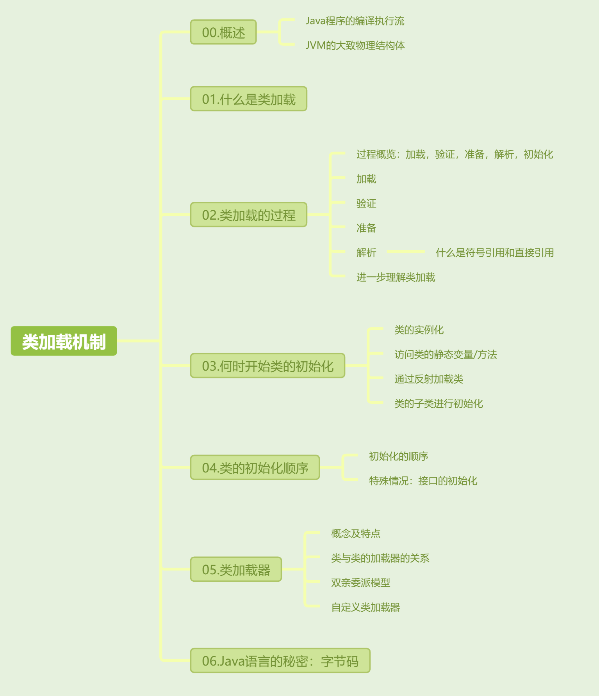

[toc]




## 01. 什么是类加载机制

-  先看一下java程序的执行流程图

  - 

  - 有三个关键的器：Java编译器，类装载器，解释器。
    - .java源文件通过编译器编译后形成符合JVM标准的字节码文件。
    - 加载器将将字节码文件从外部加载进JVM中，并转化为JVM中类的运行时数据结构。
    - 然后是解释器：当执行程序时，我们找到方法区中的字节码文件，通过解释器转化为对应硬件平台的机器语言进行执行。

- 好了，类加载就是Java程序执行的一个阶段。

## 02. 类加载过程


- Java的类加载过程按照**加载 -> 验证 -> 准备 -> 解析 -> 初始化**的顺序进行。

  - **加载**：装载阶段类加载器将通过类的全限定名找到字节码文件（`class` 文件可以来自本地文件系统、JAR 包、网络等。），并加载到 JVM 方法区中，并生成类对象（这个类对象包含类的相关信息）。
  
  
    - **验证**：确保类文件的结构和内容合法，符合JVM虚拟机的安全标准。
  
    - **准备**：为类的静态变量在方法区中分配内存，并初始化为默认值（0, null, false等）。
  
    - **解析**：将符号引用转换为直接引用。
  
    - **初始化**：在这个阶段，JVM会执行一系列的静态初始化操作。具体包括：
      - **静态变量赋值**：初始化类中的静态变量。
      - **静态代码块执行**：执行类中的静态代码块。
  

## 03. 类的初始化

### 3.1 何时初始化？

- 上面说到最后的类的初始化，那么请问类的初始化何时被触发？它遵循**懒加载**（Lazy Initialization）原则，即在类真正被使用时才进行初始化，通常主动使用有**类和子类的实例化**，**访问静态变量，静态方法**，**反射**，具体如下：

  - **类的实例化**：当程序首次创建类的实例时（通过 `new` 关键字），类会被初始化。

     ```java
     Example example = new Example();  // 触发类的初始化
     ```
  
  
    - **类的子类的实例化**：如果子类初始化时，父类尚未初始化，则会先触发父类的初始化。
  
       ```java
       class Child extends Example {}
       Child child = new Child();  // 会先初始化父类 Example
       ```
  
  
    - **访问静态变量，静态方法时**：当类的静态变量首次被访问时，JVM 会触发类的初始化。
  
       ```java
       int value = Example.a;  // 静态变量触发类的初始化
       Example.someStaticMethod();  // 静态方法触发类的初始化
       ```
  
  
    - **通过反射加载类时**：使用反射 API（如 `Class.forName("Example")`）加载类时，主动使用了类的相关结构，因此触发了懒加载。
  
       ```java
       Class<?> clazz = Class.forName("Example");  // 触发类的初始化
       ```
  


### 3.2 初始化顺序

- 我们上面提到了类初始化阶段会执行一系列静态的初始化操作，那么实例部分呢？其会紧紧跟在静态部分后面。
- 现在我们以一个子类为例，其初始化顺序分为静态部分和实例部分，先静态，后实例。
  - **静态部分**（类加载阶段）：
    - 父类静态成员变量和静态代码块（按代码顺序执行）。
    - 子类静态成员变量和静态代码块（按代码顺序执行）。
  - **实例部分**（对象创建阶段）：
    - 父类实例成员变量和实例代码块（按代码顺序执行）。
    - 父类构造方法（通过 `super()` 显式或隐式调用）。
    - 子类实例成员变量和实例代码块（按代码顺序执行）。
    - 子类构造方法。

## 04. 类加载器

- 类装载器就是寻找类的静态字节码文件，将其加载进JVM方法区中的组件。它有两个核心点：唯一性和双亲委派模型。


### 4.1 类的唯一性

- 唯一性是指：类的唯一性，也就是说**类名**与**加载类的类加载器**共同决定一个唯一的类。**因此，即使两个类的字节码完全相同，如果它们由不同的类加载器加载，它们也被视为不同的类**。


### 4.2 双亲委派模型

- **双亲委派模型**是指：每个类加载器在加载类时，都会首先把类加载请求委托给它的父类加载器，只有当父类加载器无法找到目标类时，子类加载器才会尝试自己去加载。

- 那么都有哪些类加载器呢？

  - **启动类加载器（Bootstrap ClassLoader）**：负责加载核心类库（例如 `java.lang.String`、`java.lang.System` 等类），用C++实现，不在Java层面直接可见。

  - **扩展类加载器（Extension ClassLoader）**：负责加载扩展库（如`lib/ext`目录下的类）。

  - **应用程序类加载器（Application ClassLoader）**：负责加载应用的类路径（`classpath`）中的类，也是程序默认使用的类加载器。可以通过 `ClassLoader.getSystemClassLoader()` 方法直接获取。


-  双亲委派模型的工作流程是什么样的呢？假设应用程序类加载器要加载类`java.util.ArrayList`，它的工作流程如下：

  - 应用程序类加载器接到加载请求，首先将请求委派给它的父类加载器（扩展类加载器）。

  - 扩展类加载器将请求委派给它的父类加载器（启动类加载器）。

  - 启动类加载器负责加载核心类库，找到`java.util.ArrayList`后成功加载，并返回结果。

  - 如果启动类加载器无法找到类（例如应用程序特定的类），委派链会逐级返回，直到应用程序类加载器最终尝试自己加载。


- 这个模型确保了基础类（如`Object`类）只会被顶层加载器加载一次，避免类冲突问题。


### 4.3 自定义类加载器

- 在某些场景下，开发者可能需要自定义类加载器，那么它要继承`java.lang.ClassLoader`并重写`findClass()`方法来实现类的加载逻辑。

  - 自定义类加载器有三个步骤：

    - 从指定的路径中读取`.class`文件

    - 将其转换为字节数组

    - 然后通过`defineClass()`方法将其定义为Java类，加载到JVM中。

  - 自定义类加载器的示例

    - ```
      public class MyClassLoader extends ClassLoader {
          private String classPath;
      
          public MyClassLoader(String classPath) {
              this.classPath = classPath;
          }
      
          @Override
          protected Class<?> findClass(String name) throws ClassNotFoundException {
              byte[] classData = loadClassData(name);
              if (classData == null) {
                  throw new ClassNotFoundException();
              }
              return defineClass(name, classData, 0, classData.length);
          }
      
          private byte[] loadClassData(String className) {
              String fileName = classPath + className.replace(".", "/") + ".class";
              try {
                  FileInputStream fis = new FileInputStream(fileName);
                  ByteArrayOutputStream baos = new ByteArrayOutputStream();
                  int b = 0;
                  while ((b = fis.read()) != -1) {
                      baos.write(b);
                  }
                  return baos.toByteArray();
              } catch (IOException e) {
                  e.printStackTrace();
                  return null;
              }
          }
      }
      ```

## 其他介绍

### 01.关于我的博客

- csdn：http://my.csdn.net/qq_35829566

- 掘金：https://juejin.im/user/499639464759898

- github：https://github.com/jjjjjjava

- 简书：http://www.jianshu.com/u/92a2412be53e

- 邮箱：[934137388@qq.com]
