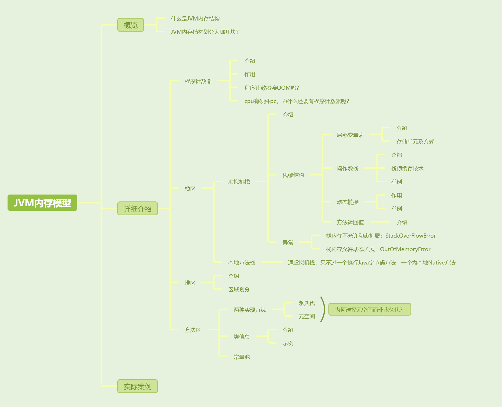
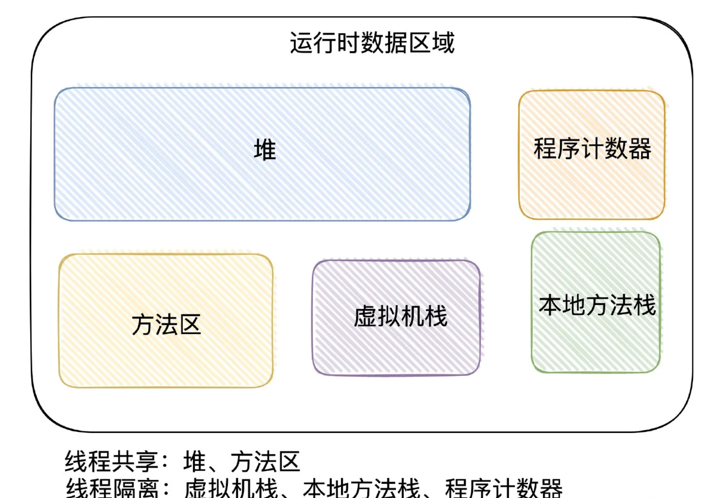
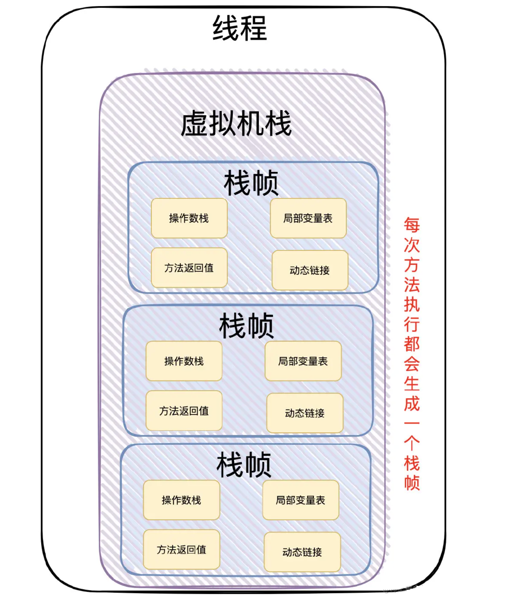
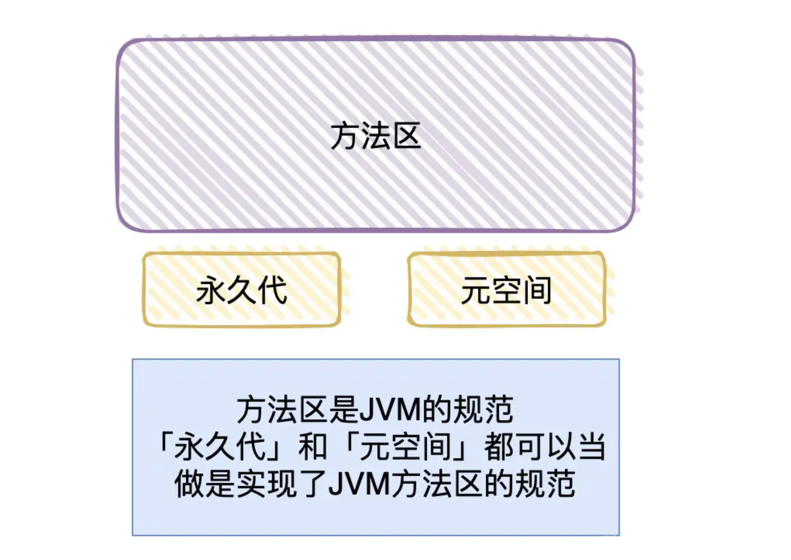

[toc]



## 01. JVM内存模型的概览

JVM内存结构（又称为运行时数据区域），它描述着Java代码执行时所倚赖的各个部分，它分为了5大块：程序计数器、堆、栈（虚拟机栈、本地方法栈）、方法区。

要值得注意的是：这是JVM「规范」的分区概念，到具体的实现落地，不同的厂商实现可能是有所区别的。



## 02.JVM内存模型详细介绍

### 2.1 程序计数器

程序计数器就是用于记录当前 Java 线程执行到的字节码位置。每个线程创建时都会有属于自己的程序计数器。

程序计数器主要有两个作用：

- 程序执行流的控制：我们可以通过改变程序计数器来实现字节码跳转，从而去控制代码流，常见的循环等就依赖于这个。
- 字节码位置的保存：程序计数器记录了当前线程执行的字节码的位置，从而当线程被切换回来的时候能够知道该线程上次运行到哪儿。

程序计数器会OOM吗？

- **注意：程序计数器是唯一一个不会出现OutOfMemoryError的内存区域，因为它要存储的数据量很小，就是一个地址而已。**

cpu不是有硬件pc吗？为什么JVM内存模型中还要有这个程序计数器？

- 两个是不同的，CPU 的 PC 是硬件寄存器，JVM 的程序计数器是一个线程私有的内存中的数据结构。cpu 的pc记录当前执行的机器指令的位置。JVM的程序计数器记录的是当前 Java 线程执行到的字节码位置。

### 2.2 虚拟机栈

#### 1. 介绍：

每个线程在创建的时候都会创建一个「虚拟机栈」，虚拟机栈用来描述Java中方法的运行过程，每次方法调用都会在栈中创建一个「栈帧」。每个「栈帧」会包含几块内容：局部变量表、操作数栈、动态连接和返回地址



#### 2. 栈帧结构

1. 局部变量表

- 定义为一个数组，用于存储方法参数、定义在方法体内部的局部变量。

2.操作数栈

- 用于存放程序执行过程中用于计算、操作、或传递的具体数据值。比如 a + b，里面a和b的值就是实际的操作数。
- 栈顶缓存技术：由于操作数是存储在内存中，频繁的进行内存读写操作影响执行速度，将栈顶元素全部缓存到物理 CPU 的寄存器中，以此降低对内存的读写次数，提升执行引擎的执行效率。

3.动态链接

- 当你在 Java 代码中调用方法或访问字段时，编译器会将其编译为符号引用。（符号引用是对方法或字段的一种抽象描述，不会直接指向实际的内存地址。）


- 在方法执行过程中，JVM 会动态的将符号引用解析为实际引用（也就是具体的方法或字段的内存地址）保存在这里（多态就是这样实现的）。

  - 假设 `Parent` 类有方法 `void foo()`，`Child` 类重写此方法。
  - 当通过 `parent.foo()` 调用时，JVM 根据 `parent` 的实际对象类型（`Child`），动态解析符号引用 `Parent.foo()` 为 `Child.foo()` 的内存地址，实现多态。


4.方法返回地址

- 保存方法执行完毕后需要返回的指令地址（即调用该方法的下一条指令地址）


### 2.3本地方法栈

跟虚拟机栈很像， **虚拟机栈为虚拟机执行 Java 方法 （也就是字节码）服务，而本地方法栈则为虚拟机使用到的 Native 方法服务。**

### 2.4堆

「堆」是用于存放对象实例的区域，对象实例几乎都在这分配内存。它在虚拟机启动时创建，被所有线程共享。

「堆」被划分为「新生代」，「老年代」和「永久代」，「新生代」又被进一步划分为 Eden 和 Survivor 区， Survivor区 由 From Survivor 和 To Survivor 组成


在 JDK 1.8中移除整个永久代，取而代之的是一个叫元空间（Metaspace）的区域（永久代使用的是JVM的堆内存空间，而元空间使用的是物理内存，直接受到本机的物理内存限制）。

将「堆内存」分开了几块区域，主要跟垃圾回收有关，我们这里采用分代收集算法。

### 2.5方法区

- 「方法区」是 JVM 中规范的一部分。方法区有两种实现方法，一个是堆中的永久代，另一个是物理内存中的元空间。




> **提问：为什么把方法区的实现从永久代变成元空间**
>
> 永久代使用Java堆中的内存，会经常因为内存不够用导致跑出OOM（虚拟机内存不足错误）异常。而「元空间」存储不在虚拟机中，而是使用本地内存，不会出现OOM（虚拟机内存不足错误）。
>

- 方法区主要是用来存放「类相关信息」：包括类信息和运行时常量池。
  - 类信息有：版本、字段、方法、父类、接口
  - **运行时常量池**：类加载时从静态常量池解析生成，包含字面量（从静态常量池复制而来，**字面量**是编译时可确定的常量），和从符号引用转化来的直接引用。

  > - 静态常量池：编译时直接写入 `.class` 文件。包含**字面量**，如字符串（`"Hello"`）、数值（`100`、`3.14`）、布尔值（`true/false`）等编译时可确定的常量。**符号引用（Symbolic References）**：对类、接口、字段、方法的抽象描述（如 `java/lang/Object.toString()Ljava/lang/String;`）。
  > - 运行时常量池的目的是通过直接引用取代符号引用，支持 JVM 高效执行。


- **类信息**又包括了类的版本、字段、方法、接口和父类等信息。比如：

  - 假设我们有一个简单的类：

    - ```java
      public class MyClass extends SuperClass implements MyInterface {
          private int myField;
      
          public void myMethod() {
              System.out.println("Hello");
          }
      }
      ```

  - 在 `.class` 文件中，`MyClass` 的类信息包括：

    - **类的版本**：Java 版本号。
    - **字段信息**：`myField` 的名称和类型（`int`）。
    - **方法信息**：`myMethod` 的名称、返回类型（`void`）和参数列表（空参数）。
    - **接口信息**：`MyInterface`。
    - **父类信息**：`SuperClass`。


- 逻辑上常量池属于方法区，但是物理存储上，「常量池」在「堆」内存中进行存储。而类信息存放在元空间中
- 


## 03.实际案例

我们将以一个案例来理解Java内存结构，并讲解

```
//JVM 启动时将 Person.class 放入方法区
public class Person {

{


}

static {

}
    //静态变量，直接放到常量池中
    public static final String number = "13667225184";
    
	//new Person 创建实例后，name 引用放入堆区，name 对象放入常量池
    private String name;

	//new Person 创建实例后，age = 0 放入堆区
    private int age;

	//Person 方法放入方法区，方法内代码作为 Code 属性放入方法区
    public Person(String name, int age) {
        this.name = name;
        this.age = age;
    }

	//toString 方法放入方法区，方法内代码作为 Code 属性放入方法区
    @Override
    public String toString() {
        return "Person{" + "name='" + name + '\'' + ", age=" + age + '}';
    }
}

//JVM 启动时将 Test.class 放入方法区
public class Test {

	//main 方法放入方法区，方法内代码作为 Code 属性放入方法区
    public static void main(String[] args) {
        //局部变量，定义的一些基本类型的变量和对象的引用变量都是在函数的栈(本地方法栈)内存中分配
        String name1 = "张三";
        int age1 = 18;

        //person1 是引用放入虚拟机栈区，new 关键字开辟堆内存 Person 自定义对象放入堆区
        //堆内存用于存放所有由new创建的对象（内容包括该对象其中的所有成员变量）和数组。
        Person person1 = new Person(name1, age1);
        Person person2 = new Person("李四", 20);

        //通过 person 引用创建 toString() 方法栈帧
        person1.toString();
        person2.toString();
    }

    private void clear(){
        //对象设置为null，回收
        person1 = null;
        person2 = null;
    }
}
```

## 其他介绍

### 01.关于我的博客

- csdn：http://my.csdn.net/qq_35829566

- 掘金：https://juejin.im/user/499639464759898

- github：https://github.com/jjjjjjava

- 简书：http://www.jianshu.com/u/92a2412be53e

- 邮箱：[934137388@qq.com]
