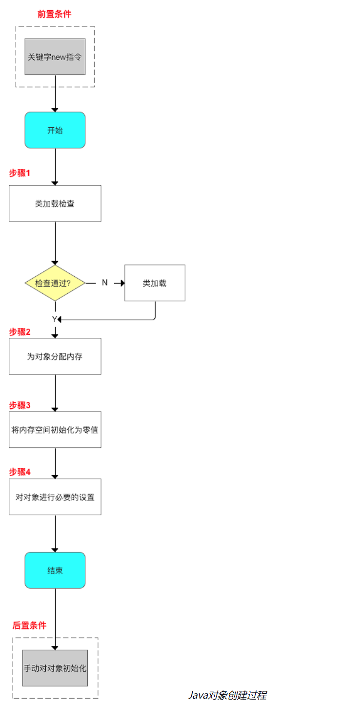
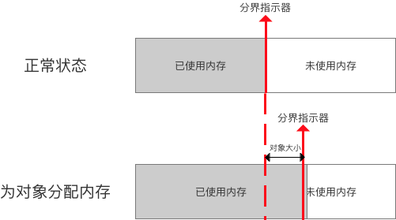
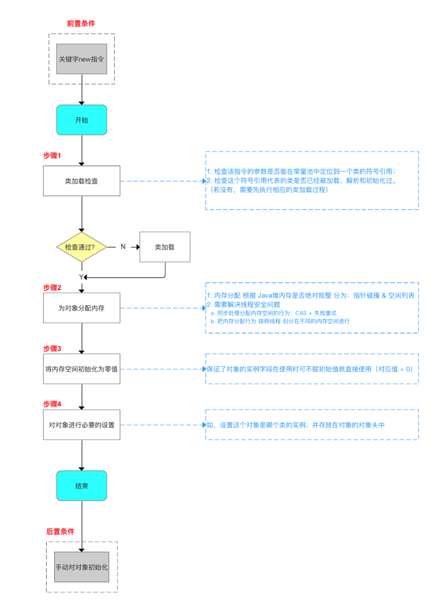
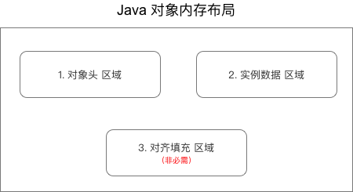
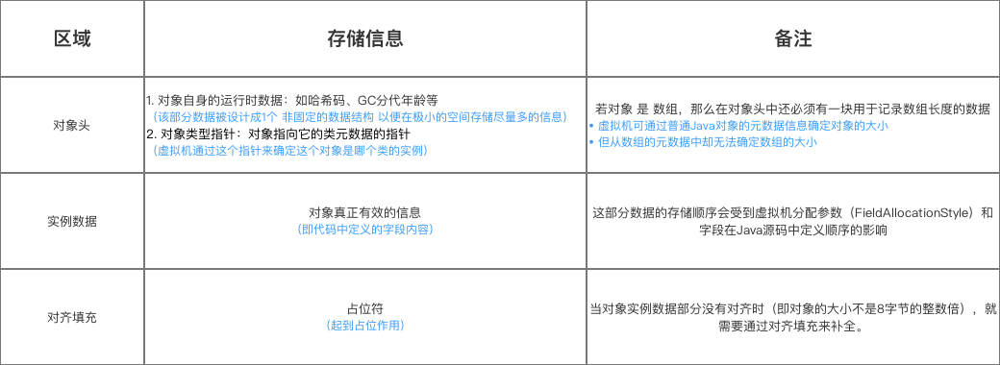
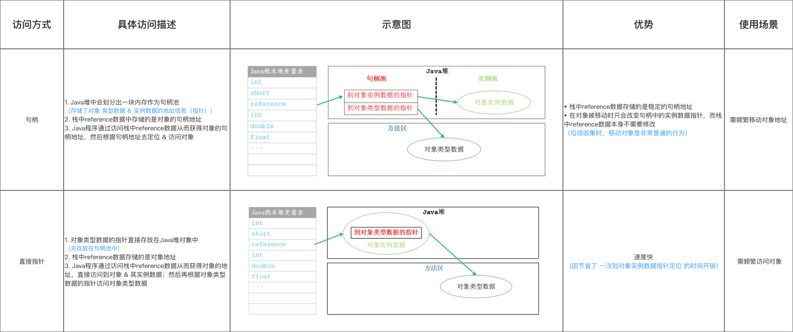

[toc]

> 注：读者在阅读博客的过程中总结各个文章的知识，写了很多笔记。但是本文原作者的写作和总结已经很翔实了，因此本文绝大多数照搬原作者的写作，中间稍加自己的理解和修改。原文来源如下：
>
> 作者：Carson带你学Android
> 链接：https://juejin.cn/post/6844903681553334285

## 01. 对象创建

- 在开发使用时，创建 `Java` 对象仅仅只是是通过关键字`new`：`A a = new A()；`，可是它真的这么简单吗？我想不是的，他是一个很复杂的过程。

### 1.1 创建过程概览

- 对象创建的流程概览如下：
  - new指令启动流程。
  - 类加载检查
  - 为对象分配内存
  - 将内存空间初始化为零值
  - 对对象进行必要的设置

- 下面我将对每个步骤进行讲解。

### 1.2 类加载检查

- 我们，调用new的时候，知道new指令右侧是有一个参数的， 它是一个符号引用，我们要检查是否能在 常量池中 定位到该符号引用，未定位到，则说明类尚未加载，我们要进行类的加载机制。这个我们可以后续介绍。

> 如果没有，需要先执行相应的类加载过程

### 1.3 为对象分配内存

- 现在我们类加载检查通过了，确定类已经被加载进来了。

- 虚拟机将会在堆中为对象分配内存，即把一块确定大小的内存从 `Java` 堆中划分出来，对象所需内存的大小在类加载完成后便可完全确定。

- 内存分配 根据 **Java堆内存是否绝对规整** 分为两种方式：指针碰撞 & 空闲列表

  > > 怎么理解这里的规整和不规整？
  > >
  > > 1.  `Java`堆内存 规整：已使用的内存在一边，未使用内存在另一边
  > > 2.  `Java`堆内存 不规整：已使用的内存和未使用内存相互交错
  > >
  > > 
  >

  - 指针碰撞：已使用内存在一边，未使用内存在另一边，中间有一个指针作为分界指示器，那么，分配对象内存 = 把指针向 未使用内存 移动一段 与对象大小相等的距离

    - - 

        

  - 空闲列表：虚拟机维护着一个 记录可用内存块 的列表，在分配时从列表中找到一块足够大的空间划分给对象实例，并更新列表上的记录

  > 那么Java堆为什么有时候规整，有时候不规整？
  >
  > Java堆是否规整 由所采用的垃圾收集器是否带有压缩整理功能决定。因此：            
  >
  > 1. 使用带`复制和标记-整理算法`的垃圾收集器时（如`Serial、ParNew`垃圾收集器），采用指针碰撞；
  > 2. 使用 `标记-清除`算法的垃圾收集器时（如 `CMS`垃圾收集器），采用空闲列表。

- 可是对象在堆中分配是非常频繁的操作，而堆又是进程共享的，会存在并发情况下线程安全的问题。如，正在给对象A分配内存，指针还没有来得及修改，对象B又同时使用了原来的指针来分配内存。我们怎么解决这个问题呢？

  - 加锁？ok，这可以，这是最基础的解决方式。但是，效率较低，有没有其它更好的方式呢？有的，孩子，我们可以采用更细的颗粒度的。
  - 我们可以为每个线程在 `Java`堆中预先分配一小块内存（本地线程分配缓冲（`Thread Local Allocation Buffer` ，`TLAB`）），哪个线程要分配内存，就在哪个线程的`TLAB上`分配，只有TLAB用完并分配新的TLAB时才需要同步锁。

### 1.4  将内存空间初始化为零值

- 内存分配完成后，虚拟机需要将分配到的内存空间初始化为零（不包括对象头），这保证了对象的实例字段在使用时可不赋初始值就直接使用（对应值 = 0）

### 1.5 设置对象的必要信息

- 如，设置 这个对象是哪个类的实例、如何才能找到类的元数据信息、对象的哈希码、对象的GC分代年龄等信息。**这些信息存放在对象的对象头中**。

- 至此，从 `Java` 虚拟机的角度来看，一个新的 `Java`对象创建完毕。但从 `Java` 程序开发来说，对象创建才刚开始，需要进行一些初始化操作。

### 1.6 总结

- 下面用一张图总结 `Java`对象创建的过程
  - 

## 02. 对象的内存布局

- 那么在 `Java` 对象创建后，到底是如何被存储在Java内存里的呢？

- 对象在 Java内存中的 存储布局 可分为三块：            

  - 对象头 存储区域
  - 实例数据 存储区域
  - 对齐填充 存储区域
- 

- 下面我会详细说明每一块区域。

### 2.1 对象头区域

此处存储的信息包括两部分：

- 对象自身的运行时数据（`Mark Word`）

> 1. 如哈希码（`HashCode`）、GC分代年龄、锁状态标志、线程持有的锁、偏向线程ID、偏向时间戳等
> 2. 该部分数据被设计成1个 非固定的数据结构 以便在极小的空间存储尽量多的信息（会根据对象状态复用存储空间）

- 对象的类型指针

> 1. 即对象指向它的类元数据的指针
> 2. 虚拟机通过这个指针来确定这个对象是哪个类的实例

- 如果对象是数组，那么在对象头中还必须有一块用于记录数组长度的数据

> 因为虚拟机可以通过普通Java对象的元数据信息确定对象的大小，但是从数组的元数据中却无法确定数组的大小。

------

### 2.2 实例数据区域

- 存储对象的实例变量，这是对象真正有效的数据

### 2.3 对齐填充区域

- 存储的信息：占位符，起到占位作用，当对象的大小不是8字节的整数倍，就需要通过对齐填充来补全。

> 为什么要补全呢？这不是白白浪费空间吗？
>
> 这涉及到底层的原理：
>
> 在程序员看来，内存是由一个个的字节组成。而CPU并不是这么看待的，CPU把内存当成是一块一块的，这里cpu的块是8字节大小。
>
> 假如有一个8字节大小的数据，它分为两种情况：
>
> 1、数据从0字节开始
> 2、数据从1字节开始
>
> - 当该数据是从0字节开始时，很CPU只需读取内存一次即可把这8字节的数据完全读取到寄存器中。
> - 当该数据是从1字节开始时，问题变的有些复杂，此时该数据不是位于内存读取边界上，这就是一类内存未对齐的数据。此时CPU先访问一次内存，读取0—7的数据进寄存器，并再次读取8—15的数据进寄存器，接着把0和9后续的的数据剔除，最后合并1- 9这8字节的数据进寄存器。对一个内存未对齐的数据进行了这么多额外的操作，大大降低了CPU性能。因此我们采用补全，损失一些空间，换取更高的执行效率？

### 2.4 总结

**

## 03. 对象的访问定位

- 问：建立对象后，该如何访问对象呢？

> 实际上需访问的是 对象类型数据 & 对象实例数据

- 答：`Java`程序 通过 栈上的引用类型数据（`reference`） 来访问`Java`堆上的对象

由于引用类型数据（`reference`）在 `Java`虚拟机中只规定了一个指向对象的引用，但没定义该引用应该通过何种方式去定位、访问堆中的对象的具体位置

所以对象访问方式取决于虚拟机实现。目前主流的对象访问方式有两种：

- 句柄 访问
- 直接指针 访问

具体请看如下介绍：很有意思。

## 其他介绍

### 01.关于我的博客

- csdn：http://my.csdn.net/qq_35829566

- 掘金：https://juejin.im/user/499639464759898

- github：https://github.com/jjjjjjava

- 简书：http://www.jianshu.com/u/92a2412be53e

- 邮箱：[934137388@qq.com]
