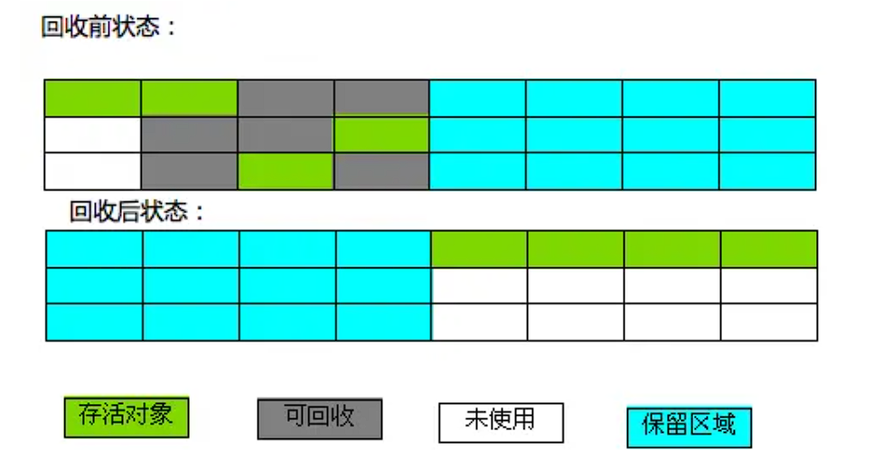

[toc]


## 01.垃圾回收介绍

- 首先，为什么要有垃圾回收？考虑JVM内存模型，程序计数器区，虚拟机栈，本地方法栈，堆区和方法区。

  - 程序计数器、虚拟机栈、本地方法栈随线程而生，也随线程而灭；内部的栈帧随着方法的开始而入栈，随着方法的结束而出栈。这几个区域的内存分配和回收都具有确定性，在这几个区域内不需要过多考虑回收的问题，因为方法结束或者线程结束时，内存自然就跟随着回收。

  - 而对于 Java 堆和方法区，它的内存回收并非自动的，因此我们需要垃圾回收机制来手动处理这部分内存。
- 那么，什么是垃圾回收？
  - 垃圾：对于一个对象，其占据内存空间，对象引用持有其内存空间地址，通过引用可以正确访问到该内存空间，如果该对象无对象引用，那么虽然它有内存空间，但是我们没有它的地址，无法正常访问到它，这就是垃圾。。这是简要的不可达，实际上更为复杂，要从GC Roots出发，进行可达性分析。

- 垃圾回收的过程：分为两个过程：垃圾的检测，和垃圾的清除。
- 假如我们想手动设置对象为垃圾，我们该如何处理呢？
  - 设置对象null，当一个对象的引用被置为 `null` 时，它与任何可达对象的引用链就被断开了，意味着该对象变为**不可达对象**，成为了 GC 的候选对象。
  - 包一个软引用或者弱引用，软引用允许垃圾回收器在内存不足的情况下回收引用的对象。弱引用允许垃圾回收器在启动垃圾回收周期时回收引用的对象。


## 02.垃圾的检测算法

我们如何正确检测垃圾，主要有以下两种算法：引用计数法，可达性分析算法。

### 2.1 引用计数法

- **什么是引用计数法**：给一个对象添加引用计数器，每当有个地方引用它，计数器就加1；引用失效就减1。

- **引用计数的优缺点**

  - 优点：**简化了垃圾的检测过程了**，我们不需要进行可达性分析算法了，只需要判断引用计数器的值即可。
    
  - 缺点：每次引用计数的增加和减少会带来额外的开销；无法检测出循环引用。
  - 什么是循环引用，介绍一个简单的循环引用：
  
    - A对象内部有B对象的引用，B对象内部有A对象的引用，但是A对象的地址丢失，B对象的地址丢失，此时虽然他们彼此持有，但是外部无法访问到他们两，他们形成了一个孤立的环。
  
    - ```
      class Node {
          Node next;
          public Node(Node next) { this.next = next; }
      }
      
      public class Main {
          public static void main(String[] args) {
              Node a = new Node(null);
              Node b = new Node(a);
              a.next = b;  // 形成循环引用
              a = null;    // 切断GC Roots
              b = null;
          }
      }
      ```


### 2.2 可达性分析算法

- 什么是可达性分析算法：可达性分析算法就是以根集对象为起始点进行图搜，如果有对象不在这个我们搜索产生的图内，也就是不可达，那么它就是垃圾对象。

- 什么是根集：所谓根集(Root Set)就是正在执行的Java程序可以访问的引用变量的集合，包含：虚拟机栈中的局部引用，本地方法栈中JNI持有的引用变量，方法区中的静态引用变量，当前对象持有的实例引用变量。

  - ```
    public class Example {
        private static Example staticVar;  // 方法区中的静态变量
        private Example instanceVar;       // 对象的实例变量
    
        public static void main(String[] args) {
            Example localVar = new Example();  // Java 栈中的局部变量
            staticVar = localVar;
        }
    }
    ```

- 可达性分析算法思路这种算法的基本思路如下：

  - 通过“GC Roots”的对象根集作为起始点，寻找对应的引用节点。

  - 找到这些引用节点后，从这些引用节点开始向下继续寻找它们所持有的引用节点。

  - 重复上述流程直到所有路径遍历完成，形成一个搜索图。

  - 当一个对象不在图中，也就是跟任何GC Roots都无法相连时，就证明此对象是不可用的。

  - 操作如下图

    

- 可达性分析算法标记阶段的几个关键点：

  - 在标记阶段，JVM 需要暂停应用线程以保证对象引用关系不会发生变化，从而可以准确地遍历对象图。这种暂停称为**Stop The World**（STW）暂停，暂停时触发的点称为**安全点**（Safe Point）。暂停时间的长短并不取决于堆内对象的多少也不是堆的大小，而是存活对象的数量。
  
  
    - 通过两次标记过程来确认对象死亡
  
      - **第一次标记**：如果根搜索（GC Roots 跟踪）发现对象没有与GC Roots相连接的引用链，它会被标记为不可达对象。如果其不需要执行 `finalize()` 方法，那么直接被回收。如果可以执行`finalize()` 方法，那么其执行该方法，尝试拯救自己。
      - **第二次标记**：对象可以在`finalize（）`方法中成功拯救自己，只要在`finalize（）`方法中让该对象重新与引用链上的任何一个对象建立关联就可以拯救自己。而如果对象这时还没有关联到任何链上的引用，那它就会被第二次标记并被清除。
  
    - 判断对象是否可达使用的是强引用，而弱引用、软引用等不会让对象在标记阶段被视为可达。
  


## 03.垃圾清除算法

### 3.1 处理垃圾的算法有哪些

- 标记-清除
- 复制
- 标记-整理

### 3.2 标记-清除算法

- 什么是标记-清除算法：分为标记和清除两个阶段，标记阶段使用可达性分析，在标记完成后统一回收所有被标记的对象。
- 算法示意图：
  - 
  - 
- 优点和缺点：
  - 优点：操作简单高效，不需要进行对象的移动。
  - 缺点：会产生大量不连续的内存碎片，导致出现一种可能的情况：虽然空闲区域的大小是足够的，但却可能没有一个单一区域能够满足这次分配所需的大小，因此本次分配还是会失败（在Java中就是一次OutOfMemoryError）不得不触发另一次垃圾收集动作。

### 3.3 复制算法

- 复制算法：此算法把内存空间划为两个相等的区域，每次只使用其中的一块（对象面），当这一块的内存用完了，就将还存活着的对象复制到另外一块内存上面（空闲面），然后再把已使用过的内存空间一次性清理掉。复制算法比较适合于新生代，在老年代中，对象存活率比较高，如果执行较多的复制操作，效率将会变低。
- 算法示意图：
  - 
  - 
- 它的优缺点
  - 优点：新对象的分配只需要通过指针碰撞便能完成（Pointer Bumping），相当简单。内存回收后无内存碎片的出现。
  - 缺点：可用内存分为两个部分。因此，可一次性分配的最大内存缩小了一半。

### 3.4 标记-整理（Mark-Compact）

- 什么是标记-整理算法
  - 它综合了上述两个算法的优点，分为标记和整理两个阶段，标记阶段使用可达性分析，在标记完成后，遍历整个堆，把存活对象“压缩”到堆的其中一侧，按顺序排放，并清除掉其它区域的内存。此算法避免了“标记-清除”的碎片问题，同时也避免了“复制”算法的空间问题。
  
- 算法示意图：
  - 
  - 
- 它的优缺点
  - 优点：新对象的分配只需要通过指针碰撞便能完成（Pointer Bumping），相当简单。内存回收后无内存碎片的出现。
  - 缺点：GC暂停的时间会增长，因为你需要将所有的对象都拷贝到一个新的地方，还得更新它们的引用地址。

## 04.分代收集策略

### 4.1 分代收集策略介绍

- 为什么要有分代收集策略？这是因为Java中不同对象的存活时间不同。比如，有的存活时间很长，他就不适合采用复制算法，因为每次它都要被复制。有的存活时间很短，他就适合复制算法。因此我们要因地制宜。我们根据对象的存活时间不同将它们分为不同的代，然后不同的代采用不同的垃圾清除算法。

### 4.2 对象划分为哪些代？

- 将对象按其生命周期划分
  - 年轻代(Young Generation)
  - 老年代(Old Generation)
  - 永久代主要存放的是类信息，所以与java对象的回收关系不大，与回收息息相关的是年轻代和老年代。

### 4.3 年轻代介绍

- 年轻代分为Eden区和Survivor区。Survivor区分为From和To。
  - 新对象首先分配在 `Eden` 区。当 `Eden` 区满时，触发 Minor GC。其采用复制算法进行垃圾回收。GC 会将 `Eden` 区中存活的对象和 `Survivor From` 区的存活对象复制到 `Survivor To` 区。
  - 完成复制后，`Survivor From` 和 `Survivor To` 区会交换角色。下一次 GC 时，当前的 `To` 区将成为 `From` 区，存活的对象会复制到新的 `To` 区。
  - 当对象经过多次复制（通常是经过一定的 Minor GC 次数）后依然存活，它们将被晋升到老年代。

### 4.4 老年代介绍

- 在年轻代中经历了N次回收后仍然没有被清除的对象，就会被放到老年代中，可以说他们都是久经沙场而不亡的一代，都是生命周期较长的对象。

- 垃圾回收策略：因此对于老年代，他们的对象生命周期较长，如果采用复制算法，那么要复制的数量太多，效率较低。因此采用标记-清除 或 标记-整理算法。
- **Major GC 和 Full GC**：在老年代执行的垃圾回收称为 Major GC，通常在老年代内存达到一定阈值时触发。而当老年代空间被占满时触发Full GC 清理整个堆内存。由于 Full GC 涉及整个堆，耗时较长，会暂停所有应用线程。

### 4.5 分代收集器类型

- Java采用分代收集器进行分代垃圾回收算法的管理和执行，我们在此不做过多赘述。

| 收集器                | 代     | 算法         | 线程   | 特性                                                         |
| --------------------- | ------ | ------------ | ------ | ------------------------------------------------------------ |
| **Serial**            | 年轻代 | 复制算法     | 单线程 | 串行收集，暂停所有线程，适合单核环境                         |
| **ParNew**            | 年轻代 | 复制算法     | 多线程 | 多线程收集，暂停其他线程，适合与 CMS 配合使用                |
| **Parallel Scavenge** | 年轻代 | 复制算法     | 多线程 | 吞吐量优先，适合后台应用                                     |
| **Serial Old**        | 老年代 | 标记整理算法 | 单线程 | 主要用于客户端模式或 CMS 备选方案                            |
| **Parallel Old**      | 老年代 | 标记整理算法 | 多线程 | 吞吐量优先的老年代收集器，适合大内存应用                     |
| **CMS**               | 老年代 | 标记清除算法 | 多线程 | 缩短回收停顿时间（即缩短垃圾回收的时间），用户线程和 GC 线程并发工作，适用于对响应时间要求高的场景，如需要快速响应的互联网应用。 |


## 05.补充

- 安全点：
- 垃圾回收源码
