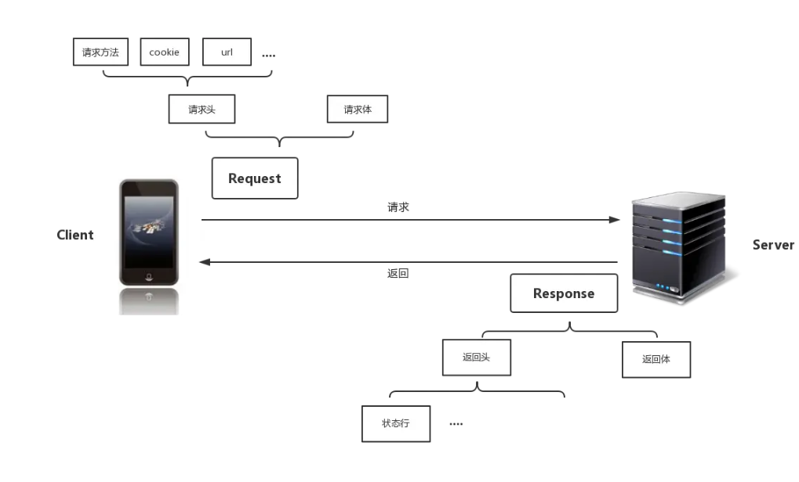
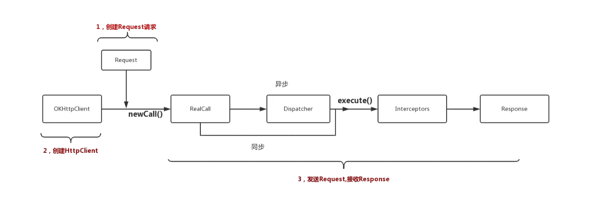
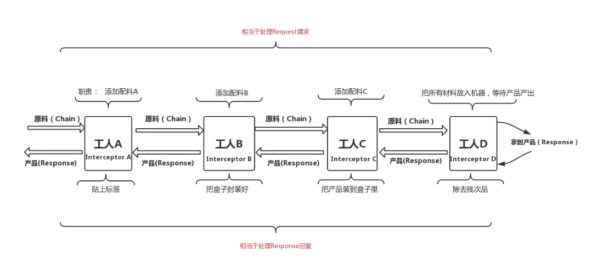

[toc]

## 01.OkHttp介绍

- 先来看看Http，一个Http请求本身其实很简单，从客户端的角度来看
  - 装配Request（涉及到请求方法，url，cookie等等）
  - Client端发送request请求
  - 接收服务端返回的Response数据
  - 

- 那么OkHttp呢？他就是发送Http请求并接收Http响应的组件。它分为请求构建和请求发送，和请求接收并响应这几个部分

  - ```
    //构造Request
    Request req=new Request.Builder()
                            .url(url)
                            .build();
    //构造一个HttpClient
    OkHttpClient client=new OkHttpClient();
    //发送请求
    client.newCall(req)
            .enqueue(new Callback() {
                //获得服务器返回的Response数据
                @Override
                public void onResponse(Call arg0, Response arg1) throws IOException {
    
                }
    
                @Override
                public void onFailure(Call arg0, IOException arg1) {
                    // TODO Auto-generated method stub
    
                }
            });
    
    ```

    

  - 

## 02.请求构建

- 这个阶段我们需要构建Request请求，需要构建HttpClient，也就是客户端。

- 首先是构建Request请求

  - ```
    //构造Request
    Request req=new Request.Builder()
                            .url(url)
                            .build();
    ```

  - 使用builder的方式，来插入请求的数据。怎么理解这个建造者模式呢？你看下面的源码就理解了。

    - 分离构造过程：

      - **`Request` 类**：仅定义对象的属性和行为，构造函数私有。
      - **`Builder` 类**：负责分步设置参数，并最终构建 `Request` 对象。

    - 链式调用：

      - 每个设置方法返回 `Builder` 实例本身：

        ```
        public Builder url(HttpUrl url) {
            this.url = url;
            return this; // 返回当前Builder实例
        }
        ```

      - 允许连续调用方法：

        ```
        builder.url(...).method(...).addHeader(...)
        ```

    - ```
      public final class Request {
          // 私有成员变量，只能通过Builder设置
          private final HttpUrl url;
          private final String method;
          private final Headers headers;
          private final RequestBody body;
          private final Object tag;
      
          // 私有构造函数，只能通过Builder创建实例
          private Request(Builder builder) {
              this.url = builder.url;
              this.method = builder.method;
              this.headers = builder.headers.build();
              this.body = builder.body;
              this.tag = builder.tag;
          }
      
          // 静态内部类 Builder
          public static class Builder {
              private HttpUrl url;        // 必选参数
              private String method = "GET"; // 可选参数（默认值）
              private Headers.Builder headers = new Headers.Builder();
              private RequestBody body;    // 可选参数
              private Object tag;          // 可选参数
      
              // 设置必选参数（url），返回Builder实例
              public Builder url(HttpUrl url) {
                  this.url = url;
                  return this;
              }
      
              // 设置可选参数（method），返回Builder实例
              public Builder method(String method, RequestBody body) {
                  this.method = method;
                  this.body = body;
                  return this;
              }
      
              // 添加请求头
              public Builder addHeader(String name, String value) {
                  headers.add(name, value);
                  return this;
              }
      
              // 设置标签
              public Builder tag(Object tag) {
                  this.tag = tag;
                  return this;
              }
      
              // 构建最终的Request对象
              public Request build() {
                  if (url == null) {
                      throw new IllegalStateException("URL is required.");
                  }
                  return new Request(this);
              }
          }
      }
      ```

  - 第一阶段我们插入了关键性数据，但是这些数据是不足以构建一个合法的Request的，其他待补全的信息其实是OkHttp在后面某个环节帮你加上去的。

- 构建HttpClient

  - 统一是使用Builder来构建OkHttpClient

  - ```
    public class OkHttpClient implements Cloneable, Call.Factory, WebSocketCall.Factory {
      ......
      ......
      public static final class Builder {
        Dispatcher dispatcher;
        Proxy proxy;
        CookieJar cookieJar;
       	......
    	......	
        }
    ....
    ....
      @Override 
      public Call newCall(Request request) {
        return new RealCall(this, request, false /* for web socket */);
      }
      ....
      ....
    
    }
    
    ```

  - 值得注意的是OKHttpClient实现了 Call.Factory接口，创建一个RealCall类的实例(Call的实现类)。

## 03.发送请求

- 我们注意到，在发送请求之前，需要调用newCall()方法，创建一个指向RealCall实现类的Call对象，**实际上RealCall包装了Request和OKHttpClient这两个类的实例。使得后面的方法中可以很方便的使用这两者**。

  - ```
    client.newCall(req)
            .enqueue(new Callback(){
            
            })
    ```

- 我们可以看看RealCall的上层接口Call：

  - ```
    public interface Call extends Cloneable {
      Request request();
    
      Response execute() throws IOException;
    
      void enqueue(Callback responseCallback);
    
      void cancel();
    
      boolean isExecuted();
    
      boolean isCanceled();
    
      Call clone();
    
      interface Factory {
        Call newCall(Request request);
      }
    }
    ```

  - 基本上我们会用到的大部分操作都定义在这个接口里面了，可以说这个接口是OkHttp框架的操作核心。在构造完HttpClient和Request之后，我们只要持有Call对象的引用就可以操控请求了。

- 我们继续按照上面的流程图来查看代码，发送请求时，将请求丢入请求队列，即调用realCall.enqueue();

  - ```
     @Override 
     public void enqueue(Callback responseCallback) {
        synchronized (this) {
          if (executed) throw new IllegalStateException("Already Executed");
          executed = true;
        }
        captureCallStackTrace();
        //对代码做了一点结构上的转化，帮助阅读
        Dispatcher dispatcher=client.dispatcher()
        //从这里我们也能感觉到，我们应该全局维护一个OkHttpClient实例，
        //因为每个实例都会带有一个请求队列，而我们只需要一个请求队列即可
        dispatcher.enqueue(new AsyncCall(responseCallback));
    
        /*
        *这个AsyncCall类继承自Runnable
        *AsyncCall(responseCallback)相当于构建了一个可运行的线程
        *responseCallback就是我们期望的response的回调
        */
      }
    
    ```

- 我们可以进入Dispatcher这个分发器内部看看enqueue()方法的细节，再回头看看AsyncCall执行的内容。

  - 如果当前请求数没有满，那么我们会从当前线程池中获取一个线程，执行请求。满了就加入到等待队列中。

  - ```
    ...
    ...
      /**等待异步执行的队列 */
      private final Deque<AsyncCall> readyAsyncCalls = new ArrayDeque<>();
    
      /** Running asynchronous calls. Includes canceled calls that haven't finished yet. */
      private final Deque<AsyncCall> runningAsyncCalls = new ArrayDeque<>();
    
      /** Running synchronous calls. Includes canceled calls that haven't finished yet. */
      private final Deque<RealCall> runningSyncCalls = new ArrayDeque<>();
      ...
      ...
    
    
      synchronized void enqueue(AsyncCall call) {
        //如果正在执行的请求小于设定值，
        //并且请求同一个主机的request小于设定值
        if (runningAsyncCalls.size() < maxRequests &&
                runningCallsForHost(call) < maxRequestsPerHost) {
            //添加到执行队列，开始执行请求
          runningAsyncCalls.add(call);
          //获得当前线程池，没有则创建一个
          ExecutorService mExecutorService=executorService();
          //执行线程
          mExecutorService.execute(call);
        } else {
            //添加到等待队列中
          readyAsyncCalls.add(call);
        }
      }
    
    ```

- 嗯，现在我们可以回头查看AsyncCall这个Runnable的实现类

  - ```
    //它是RealCall的一个内部类
    //NamedRunnable实现了Runnable接口，把run()方法封装成了execute()
    final class AsyncCall extends NamedRunnable {
        ......
    
        @Override 
        protected void execute() {
          boolean signalledCallback = false;
          try {
            //一言不和就返回Response，那没说的，这个方法里面肯定执行了request请求
            Response response = getResponseWithInterceptorChain();
            if (retryAndFollowUpInterceptor.isCanceled()) {
              signalledCallback = true;
              responseCallback.onFailure(RealCall.this, new IOException("Canceled"));
            } else {
              signalledCallback = true;
              responseCallback.onResponse(RealCall.this, response);
            }
          } catch (IOException e) {
            ......
        }
      }
      ...
      ...
      //显然请求在这里发生
        Response getResponseWithInterceptorChain() throws IOException {
        // Build a full stack of interceptors.
        List<Interceptor> interceptors = new ArrayList<>();
        interceptors.addAll(client.interceptors()); // 自定义应用拦截器
        interceptors.add(retryAndFollowUpInterceptor); // 重试与重定向
        interceptors.add(new BridgeInterceptor(client.cookieJar())); // 请求头处理
        interceptors.add(new CacheInterceptor(client.internalCache())); // 缓存管理
        interceptors.add(new ConnectInterceptor(client)); // 建立连接
        interceptors.addAll(client.networkInterceptors()); // 自定义网络拦截器
        interceptors.add(new CallServerInterceptor(forWebSocket)); // 发送请求与接收响应
        //包裹这request的chain
        Interceptor.Chain chain = new RealInterceptorChain(
            interceptors, null, null, null, 0, originalRequest);
        return chain.proceed(originalRequest);
      }
    
    ```

  - **应用拦截器（Application Interceptors）**：

    - 最早执行，最晚获得最终响应
    - 适合全局日志、请求重写等场景

  - **网络拦截器（Network Interceptors）**：

    - 在建立连接后执行，可获取网络层原始数据
    - 适合添加加密签名、监控网络流量

  - 在这个getResponseWithInterceptorChain()方法中，我们看到了大量的Interceptor，根据上面的流程图，就意味着网络请求流程可能到了末尾了，也终于到了我介绍的重点了，因为这个Interceptor设计确实是精彩。

  - 了解Interceptor之前，我们先来理一理，到目前为止，我们只有一个信息不全的Request，框架也没有做什么实质性的工作，与其说网络请求快到结尾了，不如说我们才刚刚开始，因为很多事情：**为Request添加必要信息，request失败重连,缓存，获取Response等等这些什么都没做，也就是说，这所有的工作都交给了Interceptor，你能想象这有多复杂。**。

## 04.Interceptor详解

- 我们执行AsyncCall的execute方法，内部会调用getResponseWithInterceptorChain。在里面为interceptors添加诸多东西，然后调用chain.proceed处理

- Interceptor是拦截者的意思，就是把Request请求或者Response回复做一些处理，而OkHttp通过一个“链条”Chain把所有的Interceptor串联在一起，保证所有的Interceptor一个接着一个执行。

- 我们先来看看Interceptor接口：

  - ```
    public interface Interceptor {
      //只有一个接口方法
      Response intercept(Chain chain) throws IOException;
        //Chain大概是链条的意思
      interface Chain {
        // Chain其实包装了一个Request请求
        Request request();
        //获得Response
        Response proceed(Request request) throws IOException;
        //获得当前网络连接
        Connection connection();
      }
    }
    ```

- 其实“链条”这个概念不是很容易理解Interceptor(拦截者),因此，我用一个更加生动的**环形流水线生产**的例子来帮助你在概念上完全理解Interceptor。

  - 
  - 包装了Request的Chain递归的从每个Interceptor手中走过去，最后请求网络得到的Response又会逆序的从每个Interceptor走回来，把Response返回到开发者手中”

- 我相信，通过这个例子，关于OkHttp的Interceptor以及它和Chain之间的关系在概念上应该能够理清楚了。但是我仍然想讲讲每个Intercept的作用，以及在代码层面他们是如何依次被调用的。那我们继续看看代码

  - ```
    Response getResponseWithInterceptorChain() throws IOException {
    
        List<Interceptor> interceptors = new ArrayList<>();
        //添加开发者应用层自定义的Interceptor
        interceptors.addAll(client.interceptors());
        //这个Interceptor是处理请求失败的重试，重定向
        interceptors.add(retryAndFollowUpInterceptor);
        //这个Interceptor工作是添加一些请求的头部或其他信息
        //并对返回的Response做一些友好的处理（有一些信息你可能并不需要）
        interceptors.add(new BridgeInterceptor(client.cookieJar()));
        //这个Interceptor的职责是判断缓存是否存在，读取缓存，更新缓存等等
        interceptors.add(new CacheInterceptor(client.internalCache()));
        //这个Interceptor的职责是建立客户端和服务器的连接
        interceptors.add(new ConnectInterceptor(client));
        if (!forWebSocket) {
            //添加开发者自定义的网络层拦截器
          interceptors.addAll(client.networkInterceptors());
        }
        //这个Interceptor的职责是向服务器发送数据，
        //并且接收服务器返回的Response
        interceptors.add(new CallServerInterceptor(forWebSocket));
    
        //一个包裹这request的chain
        Interceptor.Chain chain = new RealInterceptorChain(
            interceptors, null, null, null, 0, originalRequest);
        //把chain传递到第一个Interceptor手中
        return chain.proceed(originalRequest);
      }
    ```

  - 到这里，我们通过源码已经可以总结一些在开发中需要注意的问题了：

  - Interceptor的执行的是顺序的，也就意味着当我们自己自定义Interceptor时是否应该注意添加的顺序呢？
  - 在开发者自定义拦截器时，是有两种不同的拦截器可以自定义的。

- 接着，从上面最后两行代码讲起，首先创建了一个指向RealInterceptorChain这个实现类的chain引用，然后调用了 proceed（request）方法。

  - ```
    public final class RealInterceptorChain implements Interceptor.Chain {
      private final List<Interceptor> interceptors;
      private final StreamAllocation streamAllocation;
      private final HttpCodec httpCodec;
      private final Connection connection;
      private final int index;
      private final Request request;
      private int calls;
    
      public RealInterceptorChain(List<Interceptor> interceptors, StreamAllocation streamAllocation,
          HttpCodec httpCodec, Connection connection, int index, Request request) {
        this.interceptors = interceptors;
        this.connection = connection;
        this.streamAllocation = streamAllocation;
        this.httpCodec = httpCodec;
        this.index = index;
        this.request = request;
      }
    ....
    ....
    ....
     @Override 
     public Response proceed(Request request) throws IOException {
                //直接调用了下面的proceed（.....）方法。
        return proceed(request, streamAllocation, httpCodec, connection);
      }
    
        //这个方法用来获取list中下一个Interceptor，并调用它的intercept（）方法
      public Response proceed(Request request, StreamAllocation streamAllocation, HttpCodec httpCodec,
          Connection connection) throws IOException {
        if (index >= interceptors.size()) throw new AssertionError();
    
        calls++;
        ....
        ....
        ....
    
        // Call the next interceptor in the chain.
        RealInterceptorChain next = new RealInterceptorChain(
            interceptors, streamAllocation, httpCodec, connection, index + 1, request);
        //从list中获取到第一个Interceptor
        Interceptor interceptor = interceptors.get(index);
        //然后调用这个Interceptor的intercept（）方法，并等待返回Response
        Response response = interceptor.intercept(next);
        ....
        ....
        return response;
      }
    ```

- 从上文可知，如果没有开发者自定义的Interceptor时，首先调用的RetryAndFollowUpInterceptor，负责失败重连操作

  - ```
    ...
        //直接调用自身的intercept()方法
     @Override 
     public Response intercept(Chain chain) throws IOException {
        Request request = chain.request();
        ....
        ....
          Response response = null;
          boolean releaseConnection = true;
          try {
            //在这里通过继续调用RealInterceptorChain.proceed()这个方法
            //在RealInterceptorChain的list中拿到下一个Interceptor
            //然后继续调用Interceptor.intercept()，并等待返回Response
            response = ((RealInterceptorChain) chain).proceed(request, streamAllocation, null, null);
            releaseConnection = false;
          } catch (RouteException e) {
            ....
            ....
          } catch (IOException e) {
           ....
           ....
          } finally {
            ....
            ....
          }
    
        }
      }
    ...
    ...
    ```

- 嗯，到这里，Interceptor才算讲的差不多了，OKHttp也才算讲得差不多了，如果你想研究每个Interceptor的细节，欢迎自行阅读源码，现在在框架上，你不会再遇到什么难题了。这里篇幅太长，不能再继续讲了。

- 如果你还是好奇OKHttp到底是怎么发出请求？我可以做一点简短的介绍：这个请求动作发生在CallServerInterceptor（也就是最后一个Interceptor）中，而且其中还涉及到Okio这个io框架，通过Okio封装了流的读写操作，可以更加方便，快速的访问、存储和处理数据。最终请求调用到了socket这个层次,然后获得Response。

- 整体流程：

  - ```
    Request → App Interceptor → Retry → Bridge → Cache → Connect → Network Interceptor → CallServer  
    Response ← App Interceptor ← Retry ← Bridge ← Cache ← Connect ← Network Interceptor ← CallServer
    ```

  - **请求处理**：从第一个拦截器开始，依次传递至 `CallServerInterceptor`

  - **响应处理**：从最后一个拦截器开始，逆序返回至用户回调

  - | **拦截器**                    | **核心职责**                              | **典型应用**                 |
    | :---------------------------- | :---------------------------------------- | :--------------------------- |
    | `RetryAndFollowUpInterceptor` | 处理重试与重定向（如 302 跳转）           | 自动处理临时重定向           |
    | `BridgeInterceptor`           | 补充请求头（如 `Content-Type`、`Cookie`） | 添加 User-Agent 等通用头信息 |
    | `CacheInterceptor`            | 缓存策略管理（根据 `Cache-Control` 头）   | 实现离线缓存功能             |
    | `ConnectInterceptor`          | 建立 TCP/TLS 连接或复用连接池中的连接     | 复用连接提升性能             |
    | `CallServerInterceptor`       | 发送请求数据包，接收响应数据              | 实际网络 I/O 操作            |

  

- 我们构建后，进行发送，发送本质是调用每个拦截器的intercept方法。