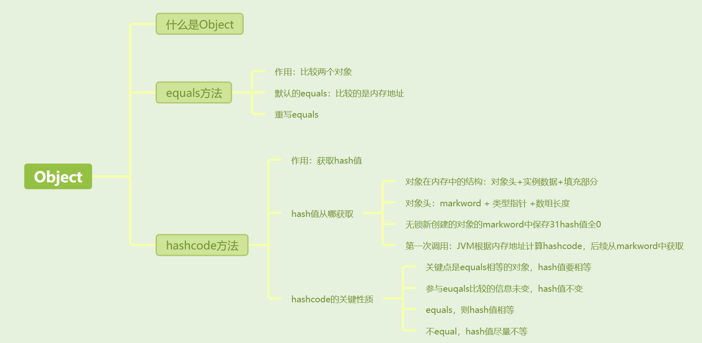
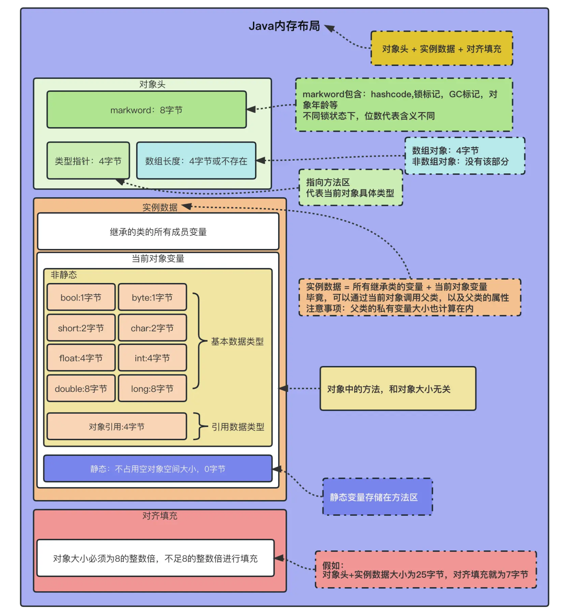
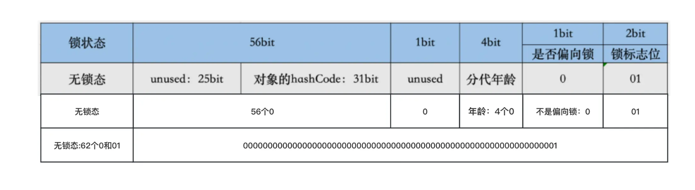

[toc]



## 1.Object

`Object`类是所有类的根类，也就是说所有的Java类都继承自`Object`类。这.意味着无论你创建什么类，它都自动继承了`Object`类的一系列基本方法，其中包括`equals()`和`hashCode()`方法。


## 2. equals方法

对两个对象的地址值进行的比较（即比较引用是否相同）

```
public boolean equals(Object obj) {
    return (this == obj);
}
```

这个实现只是简单地检查两个对象是否为同一对象的引用，即它们是否指向同一个内存地址。

### 2.1 重载equals

复杂的相同，重载equals

```
public class Point {
    private int x;
    private int y;

    public Point(int x, int y) {
        this.x = x;
        this.y = y;
    }

    @Override
    public boolean equals(Object obj) {
        // Check if the object is compared with itself
        if (this == obj) {
            return true;
        }

        // Check if obj is an instance of Point
        if (!(obj instanceof Point)) {
            return false;
        }

        // Typecast obj to Point so that we can compare data members
        Point other = (Point) obj;

        // Compare the data members and return accordingly
        return this.x == other.x && this.y == other.y;
    }
}

```

不光检测内存地址是否相等，当内存地址不同时，还检测两者是否为同一个类的实例（通过检查类的元信息），如果是实例，那么去判断数据是否相同，如果相同，仍然视作相等。


## 3.hashCode方法

hashCode() 方法给对象返回一个 hash code 值。为什么要有hashCode，关键在于哈希表

### 3.1 hashcode值怎么来的？

所谓的返回一个hashcode 的值，那么这个hashcode的值是怎么来的？总不能每次都是计算得来的吧。这样效率多地啊。

想理解是怎么来的，我们首先得了解对象正在Java中的内存布局


**Java内存布局** = **对象头** + **实例数据** +**对齐填充**

**对象头**由，**markword**+**类型指针**+**数组长度**组成。




##### 无锁对象的markword

可能没接触过的同学看不懂该图，我再举个例子。我们都知道可以通过**synchronized**锁对象，来做同步操作。

一个对象创建出来没有被锁过，它的**markword**应该是下图这样的。


 这里需要注意：hashcode方法返回的hash值是这样来的。 

**初次调用** `hashCode()` 方法时，如果该对象还没有存储过哈希值，JVM 会使用对象的内部地址等信息计算得到对应的值，存入 `markword` 中，并返回这个值。

**再次调用** `hashCode()` 方法时，它会直接返回保存在 `markword` 中的值，而不会重新生成新的哈希值。


### 3.2 `hashCode()`方法的关键性质

关键点是equals的对象的hash值相等

以下是实现Java中任何自定义类时都必须遵守的：

1. **一致性**：只要对象的equals比较用的信息没有改变，那么在一个应用的执行期间，无论该`hashCode()`方法被调用多少次，它都必须始终返回相同的值。

2. **相等对象的相同哈希码**：如果两个对象根据`equals(Object)`方法比较是相等的，那么这两个对象调用`hashCode()`方法必须返回相同的整数结果。

3. **不相等对象的哈希码最好不同**：虽然这不是强制要求，但对于不相等的对象产生不同的哈希码可以提高哈希表（如`HashMap`、`HashSet`等）的性能。这是因为不同的哈希码可以减少哈希冲突，从而减少哈希桶中链表的长度，提高存取效率。

   

### 3.3 什么叫只要对象的equals比较用的信息没有改变？我不是很理解

假设有一个 `Person` 类，有两个属性：`name` 和 `age`，并且我们重写了 `equals()` 方法，只比较了 `name` 属性。在这种情况下，如果 `name` 属性不会发生变化，那么对象的 `equals()` 方法就符合 "只要对象的equals比较用的信息没有改变" 的要求。


## 其他介绍

### 01.关于我的博客

- github：https://github.com/jjjjjjava
- 简书：http://www.jianshu.com/u/92a2412be53e
- csdn：http://my.csdn.net/qq_35829566
- 邮箱：[934137388@qq.com](mailto:934137388@qq.com)
- 掘金：https://juejin.im/user/499639464759898
- 泡在网上的日子：http://www.jcodecraeer.com/member/content_list.php?channelid=1

