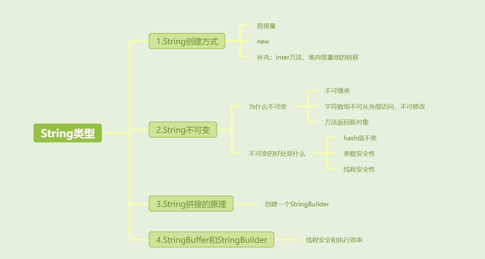

[toc]



## 01.String的创建机理

**直接量方式**：当通过字面量（如 `"123"`）来创建字符串时，JVM会首先检查字符串常量池。如果池中存在相同值的字符串对象，返回池中对象的引用；如果没有，JVM会在池中创建一个新的字符串对象并返回其引用。

```
String str1 = "123";  // 直接量方式，放入字符串常量池
```

由于`str1`通过直接量创建，因此会放入字符串常量池中。

**`new`关键字创建字符串**：使用`new`关键字创建字符串时，JVM不会去检查字符串常量池，而是直接在堆内存中创建一个新的对象。

```
String str2 = new String("123");  // 使用 new 关键字，堆内存中创建新的对象
```

### `intern()`方法

`intern()`方法可以**将堆中的字符串添加到字符串常量池中并返回常量池中的引用**。当调用`intern()`时：

- JVM会检查字符串常量池中是否存在一个等于此`String`对象的字符串（使用`equals()`方法比较）。
- 如果存在，则返回池中的字符串对象引用。
- 如果不存在，则将当前字符串对象的引用添加到池中，并返回它。

```
String str1 = "123";  // 直接量方式，放入字符串常量池
String str2 = new String("123");
String str3 = str2.intern();  // str3 现在指向常量池中的"123"
System.out.println(str1 == str3);  // true
```

在上面的例子中，`str3`调用了`intern()`，因此`str3`会指向常量池中的`"123"`，与`str1`指向同一对象，因此`str1 == str3`会返回`true`。

## 02.String不可变的原因

有三个原因

**String类不可继承**： `String` 类被定义为 `final`，意味着它不能被继承。这保证了任何尝试修改字符串的行为都不能通过继承 `String` 类来实现。

**字符数组的不可修改性**： `String` 类内部使用一个 `char[]` 来存储字符串的字符，由于这个数组是 `private` 和 `final` 的，外部无法直接访问或修改它。

```
private final char value[];
```

**方法返回新对象**： 在 `String` 类中的许多方法（例如 `substring()`, `toUpperCase()` 等）看起来像是对原字符串进行了修改，但实际上它们返回的是新的 `String` 对象，原始字符串没有发生任何改变。

## 03. `String` 不可变性的好处

- 6.1 可以缓存 hash 值
  - 由于 `String` 对象的不可变性，其 `hashCode` 只需计算一次。当计算出一个 `String` 的 `hashCode` 后，系统可以将其缓存起来，而不必每次使用时重新计算。
  
- 6.3 安全性
  - String 经常作为参数，String 不可变性可以保证参数不可变。例如在作为网络连接参数的情况下如果 String 是可变的，那么可能会出现连接到错误的目标主机的情况。
  
  - 举例：String作为参数
  
    ```java
    String hostname = "example.com";
    int port = 8080;
    Socket socket = new Socket(hostname, port);
    ```
  
- 6.4 线程安全
  
  - 什么是线程安全？线程不安全本质是由写造成的，写造成的后续读不安全，写造成的后续写不安全。如果没有写，只有读，那他天生就是安全的，String 不可变性天生具备线程安全，可以在多个线程中安全地使用。

## 04.String拼接的原理

- 来一道思考题：很明确，代码输出的结果是："111111222222"，但是它工作原理是怎样的呢？

  ```
  String str1 = "111111";
  String str2 = "222222";
  String str = str1 + str2;
  System.out.println(str);
  ```

- 由于字符串拼接太常用了，java才支持可以直接用+号对两个字符串进行拼接。

  - **其真正实现的原理是中间通过建立临时的StringBuilder对象，然后调用append方法实现**。

- 对于java来说，这段代码原理上应该是：

  ```
  String str1 = "111111";
  String str2 = "222222";
  StringBuilder sb = new StringBuilder();
  sb.append(str1);
  sb.append(str2);
  String str = sb.toString();
  System.out.println(str);
  ```


## 05.StringBuffer/StringBuilder

`StringBuffer` 和 `StringBuilder` 是 Java 中用于处理可变字符串的类。

### 底层机制

- **内存存储**：`StringBuffer` 和 `StringBuilder` 使用 `可扩容的char[]` 数组来存储字符串。当字符串内容发生变化时，不会创建新的对象，改变的是数组中的值，因此对象引用保持不变。
- **数组扩容**：在创建 `StringBuffer` 或 `StringBuilder` 对象时，默认分配一个初始容量的字符数组。当加入的字符数量超过数组的容量时，会创建一个新的、更大的数组，并将原有的字符数组内容复制到新数组中，随后丢弃旧数组。这种扩容机制虽然使得对象在内存中的大小可动态增长，但频繁扩容可能导致性能下降，因为每次扩容都涉及内存分配和数组复制操作。

### `StringBuffer` 和 `StringBuilder` 的区别

`StringBuffer` 是线程安全的，它的所有方法都使用了 `synchronized` 关键字来确保同步，性能相对较低。

`StringBuilder` 不是线程安全的，它没有使用同步机制，性能相对较好。

## 其他介绍

### 01.关于我的博客

- github：https://github.com/jjjjjjava
- 简书：http://www.jianshu.com/u/92a2412be53e
- csdn：http://my.csdn.net/qq_35829566
- 邮箱：[934137388@qq.com](mailto:934137388@qq.com)
- 掘金：https://juejin.im/user/499639464759898

