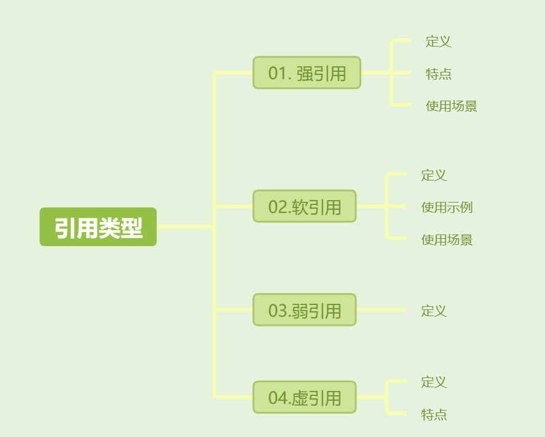

[toc]



## 01. Java中引用关系

java.lang.ref包中提供了几个类：

- SoftReference类、WeakReference类和PhantomReference类，它们分别代表软引用、弱引用和虚引用。
- ReferenceQueue类表示引用队列，它可以和这三种引用类联合使用，以便跟踪Java虚拟机回收所引用的对象的活动

### 1.1 强引用（Strong Reference）

**定义**：强引用就是对象的地址，当我们使用`new`关键字创建一个对象时，默认情况下，我们得到的就是一个强引用。

**特点**：只要一个对象存在强引用，垃圾回收器（GC）就不会回收这个对象。JVM宁愿抛出OutOfMemory错误也不会回收这种对象。

```java
Object obj = new Object(); // obj是一个强引用
```

**使用场景**：几乎所有的对象引用在默认情况下都是强引用。

### 1.2 软引用（Soft Reference）

**定义**：当虚拟机内存不足时，将会回收它指向的对象；需要获取对象时，可以调用get方法。

软引用的简单使用示例：

```java
Dog dog = new Dog();
SoftReference soft_dog = new SoftReference(dog);
Dog another_dog = (Dog)soft_dog.get();
```

**使用场景**：

- 通常用于缓存场景，这样可以确保在内存紧张时，缓存对象可以被回收。例如：例如从网络上获取图片，然后将获取的图片显示的同时，通过软引用缓存起来。当下次再去网络上获取图片时，首先会检查要获取的图片缓存中是否存在，若存在，直接取出来，不需要再去网络上获取。

**示例**：

```java
public void testSoftReference() {
    User user = new User(1, "Jett");
    SoftReference<User> userSoft = new SoftReference<>(user); // 创建一个软引用
    user = null; // 断开强引用

    System.out.println(userSoft.get()); // 输出: User对象
    System.gc(); // 显式触发GC
    System.out.println("After gc");
    System.out.println(userSoft.get()); // 如果内存足够，对象不会被回收

    // 模拟内存紧张
    try {
        List<byte[]> list = new LinkedList<>();
        for (int i = 0; i < 100; i++) {
            list.add(new byte[1024 * 1024 * 1]); // 分配大量内存
        }
    } catch (Throwable e) {
        System.out.println("Exception: " + userSoft.get()); // 由于内存不足，软引用对象可能被回收
    }
}
```

### 1.3 弱引用（Weak Reference）

**定义**：弱引用是比软引用更弱的一种引用类型。如果一个对象只被弱引用引用，那么无论当前内存是否足够，一旦垃圾回收器运行，这个对象都会被回收。

**示例**：

```java
public void testWeakReference() {
    User user = new User(1, "Jett");
    WeakReference<User> userWeakReference = new WeakReference<>(user); // 创建一个弱引用
    user = null; // 断开强引用

    System.out.println(userWeakReference.get()); // 输出: User对象
    System.gc(); // 显式触发GC
    System.out.println("After gc");
    System.out.println(userWeakReference.get()); // GC后对象被回收，输出: null
}
```

### 1.4 虚引用（Phantom Reference）

**定义**：虚引用是所有引用类型中最弱的一个。因为一个持有虚引用的对象，和没有引用几乎是一样的。

**特点**：

1. 随时都可能被垃圾回收器回收。

2. 当试图通过虚引用的get()方法取得强引用时，总是会失败。
3. 虚引用必须和引用队列一起使用，它的作用在于跟踪对象的垃圾回收过程。 当一个对象被垃圾回收时，如果发现它还有虚引用，那么就会将这个虚引用加入引用队列。此时引用队列里会存放被销毁对象的虚引用，我们可以通过判断队列中是否有对应的虚引用来判断对象是否被回收。


## 02. 总结

- 强引用：默认的引用方式，不会被垃圾回收，JVM宁愿抛出OutOfMemory错误也不会回收这种对象。
- 软引用（SoftReference）：如果一个对象只被软引用指向，只有内存空间不足够时，垃圾回收器才会回收它；
- 弱引用（WeakReference）：如果一个对象只被弱引用指向，当JVM进行垃圾回收时，无论内存是否充足，都会回收该对象。
- 虚引用（PhantomReference）：虚引用和前面的软引用、弱引用不同，它并不影响对象的生命周期。如果一个对象与虚引用关联，则跟没有引用与之关联一样，在任何时候都可能被垃圾回收器回收。虚引用通常和ReferenceQueue配合使用。当垃圾回收器准备回收一个对象时，如果发现它还有虚引用，就会在垃圾回收后，销毁这个对象，将这个虚引用加入引用队列。它主要用于跟踪对象的垃圾回收活动。


## 其他介绍

### 01.关于我的博客

- github：https://github.com/jjjjjjava
- 简书：http://www.jianshu.com/u/92a2412be53e
- csdn：http://my.csdn.net/qq_35829566
- 邮箱：[934137388@qq.com](mailto:934137388@qq.com)
- 掘金：https://juejin.im/user/499639464759898

