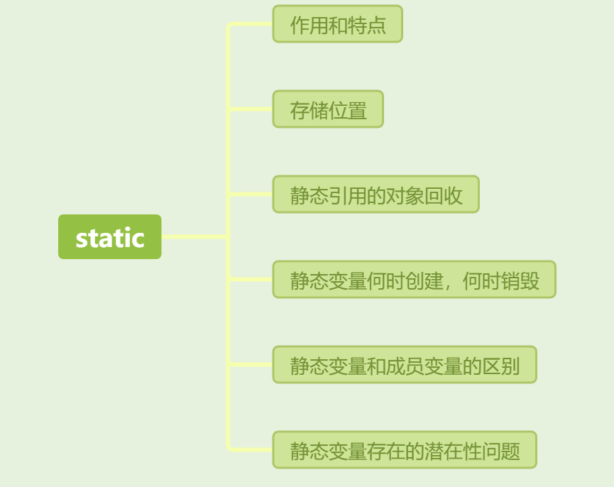

[toc]

### 01.static的作用和特点

- static的本质是表面属于类，而非实例。其可以用来修饰：成员变量，成员方法，代码块，内部类等。具体如下所示
  - 修饰成员变量
    - 被static 声明的成员变量属于静态成员变量，其存放在Java内存区域的方法区。
    -  static 修饰的成员变量的含义：表明该成员变量属于类，不属于这个类的某个对象，被类中所有对象共享，可以并且建议通过类名调用。
  - 静态代码块
    - 该类不管创建多少对象，静态代码块只执行一次，执行顺序为：(静态代码块—>非静态代码块—>构造方法)
  - **静态内部类（static修饰类的话只能修饰内部类）**
    - 非静态内部类在编译完成之后会隐含地保存着一个引用，该引用是指向创建它的外围内，但是静态内部类却没有。没有这个引用就意味着：1.它的创建是不需要依赖外围类的创建。2.它不能使用任何外围类的非static成员变量和方法。你可以把静态内部类理解为一个静态成员变量。
  - 修饰成员方法
    - 存放在方法区的静态区位置，静态方法无法辨别具体对象，因此只能访问静态的成员变量和静态的成员方法【静态只能访问静态,非静态可以访问静态的也可以访问非静态的】
- static关键字的特点
  - 随着类的加载而加载
  - 优先于对象存在
  - 被类的所有对象共享
  - 可以通过类名调用【静态修饰的内容一般我们称其为：与类相关的，类成员】

### 02.static变量存储位置

- static变量存储位置
  - 注意是：存储在JVM的方法区中

### 03.静态引用的对象回收

- 静态引用的对象回收
  - 只要静态变量没有被销毁也没有置null，其对象一直被保持引用，也即引用计数不可能是0，因此不会被垃圾回收。因此，单例对象会在程序的整个生命周期内一直存在，不会被垃圾回收。

### 04.静态变量何时被创建

- 静态变量何时销毁创建
  - 静态变量何时被创建？在进程创建的时候。
  - 当我们启动一个app的时候，Android系统会创建一个进程并为其分配一个虚拟机实例（如Dalvik VM），然后代码就运行在DVM之上，类的加载和卸载，垃圾回收等事情都由DVM负责。也就是说在进程启动的时候，类被加载，静态变量被分配内存。

### 05.静态变量何时销毁

- 静态变量何时销毁
  - 类在什么时候被卸载？在进程结束的时候。
  - 说明：一般情况下，所有的类都是默认的ClassLoader加载的，只要ClassLoader存在，类就不会被卸载，而默认的ClassLoader生命周期是与进程一致的，而进程结束时，ClassLoader不存在，因此类销毁。

### 06.静态变量和成员变量的区别

- A:所属不同
  - 静态变量属于类，所以也称为类变量
  - 成员变量属于对象，所以也称为实例变量(对象变量)
- B:内存中位置不同
  - 静态变量存储于方法区的静态区
  - 成员变量存储于堆内存
- C:内存出现时间不同
  - 静态变量随着类的加载而加载，随着类的消失而消失
  - 成员变量随着对象的创建而存在，随着对象的消失而消失
- D:调用不同
  - 静态变量可以通过类名调用，也可以通过对象调用
  - 成员变量只能通过对象名调用

### 07.用static静态变量潜在性问题

- 用static静态变量潜在性问题
  - 1.占用内存，并且内存一般不会释放；内存GC是针对堆区进行的垃圾回收，静态变量存放在方法区中，不会被自动回收。
  - 2.出现访问全局静态错误。虽然不会被GC，但是当Android系统检测到某个应用占用了过多内存，或整个系统内存不足时，它可能会激进的直接杀死后台进程来释放内存。如果一个静态变量引用了一个对象（如`Activity`），在内存不足时系统杀死了应用进程，重新启动后静态变量未被正确初始化，再次访问时会出现`NullPointerException`，因为该静态对象已经不再存在或数据被丢失。
  - 3.在Android中不能将activity作为static静态对象，这样使activity的所有组件对象都存入全局内存中，并且不会被回收；
