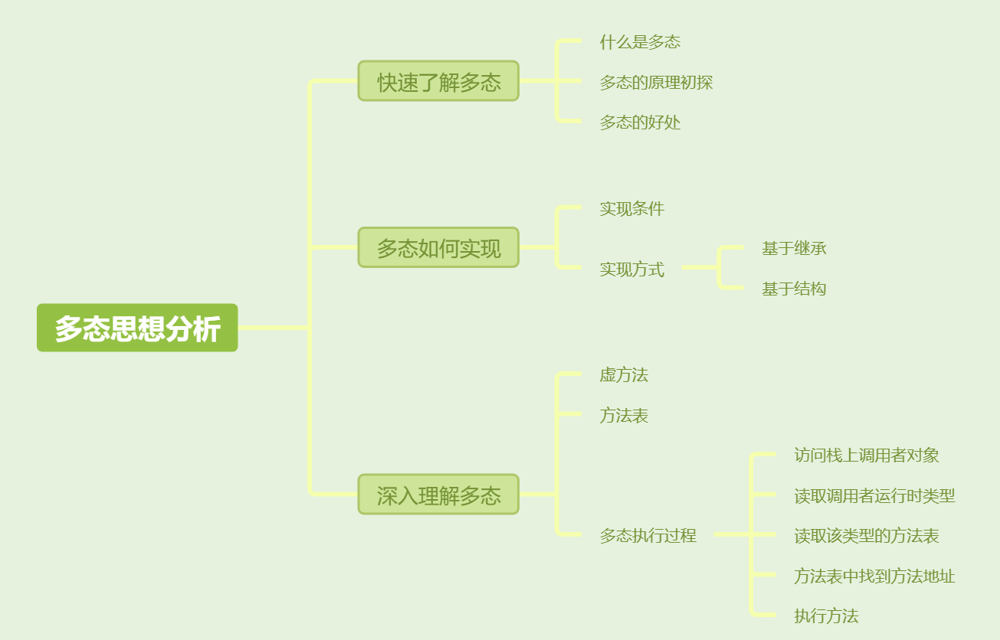

[toc]



## 01.快速了解多态

###  1.1 什么是多态

**一句话概括**：**多态就是允许子类替换父类，并在运行时调用子类中的具体实现方法**。

### 1.2 多态的原理

**为什么可以实现多态**？就在于**动态绑定，即根据运行时类型决定调用哪个方法。**

对象有两个类型，一个是引用类型（编译时确定的类型），一个是运行时类型，就是实际执行的子类类型。编译器在编译时知道其引用类型，但是不知道其运行时类型，因此不会确定具体调用哪个方法。而在运行时，JVM根据引用变量在运行时实际执行的具体对象找到其运行时类型，并通过其方法表，调用运行时类型中的具体方法。

### 1.3 多态的好处

这样的好处呢？在**运行时**根据对象的运行时类型决定调用哪个方法，这使得同一个引用变量（如 `Animal myAnimal`）去执行不同子类的行为（如 `Dog` 或 `Cat` 的方法），使得同一个程序能够表现出多种形态。

## 02.多态如何实现

### 2.1 实现条件

- Java实现多态有三个必要条件：继承、重写、向上转型。
  - 继承：在多态中必须存在有继承关系的子类和父类。
  - 重写：子类对父类中某些方法进行重新定义，这是为了修改方法表中的指针，使得在调用这些方法时就会调用子类的方法。
  - 向上转型：在多态中需要将子类的引用赋给父类对象，只有这样该引用才能够具备技能调用父类的方法和子类的方法。

### 2.2 实现方式

#### 1. **基于继承的多态**

#### **示例**：

```java
class Animal {
    public void sound() {
        System.out.println("Animal makes a sound");
    }
}

class Dog extends Animal {
    @Override
    public void sound() {
        System.out.println("Dog barks");
    }
}

class Cat extends Animal {
    @Override
    public void sound() {
        System.out.println("Cat meows");
    }
}

public class Main {
    public static void main(String[] args) {
        Animal myAnimal = new Dog();  // 父类引用指向子类对象
        myAnimal.sound();  // 输出：Dog barks

        myAnimal = new Cat();  // 父类引用指向另一个子类对象
        myAnimal.sound();  // 输出：Cat meows
    }
}
```


#### 2. **基于接口的多态**

**关键是引用类型要使用接口类型**

- 接口定义了一组方法，但没有方法的具体实现。
- 不同的类可以实现同一个接口，并提供接口方法的具体实现。
- 接口的引用可以指向任何实现该接口的对象，运行时调用的是具体实现类的方法。

#### **示例**：

```java
interface Animal {
    void sound();
}

class Dog implements Animal {
    @Override
    public void sound() {
        System.out.println("Dog barks");
    }
}

class Cat implements Animal {
    @Override
    public void sound() {
        System.out.println("Cat meows");
    }
}

public class Main {
    public static void main(String[] args) {
        Animal myAnimal = new Dog();  // 接口引用指向 Dog 实现类
        myAnimal.sound();  // 输出：Dog barks

        myAnimal = new Cat();  // 接口引用指向 Cat 实现类
        myAnimal.sound();  // 输出：Cat meows
    }
}
```


## 03. 深入理解多态

虚方法：在 Java 中，所有的非私有、非静态和非 final 方法都是被隐式地指定为虚拟方法。因为他们是可以被重写的，可以跟父类的方法不同的。

方法表（vtable，虚函数表）是一个数据结构，用于存储类中每个方法的实际地址。每个类都会有一张方法表。子类继承父类时，会拥有父类的方法表，当进行重写时可以在自己的方法表中覆盖父类的方法。

在 Java 中，当调用某个对象的方法时，JVM 会根据对象的实际类型进行动态绑定。这个过程可以概括为以下步骤：

1. **访问栈上的调用者对象**：当程序执行方法调用时，JVM 会从栈中找到方法调用者对象的引用
2. **读取调用者的动态类型**：JVM 通过引用访问对应堆中内存地址，获取对象头中类型指针，知晓其运行时类型。
3. **获取该类型的**`方法表`**（vtable）**
4. **从方法表中找到目标方法的地址**：
5. **执行方法**：JVM 通过找到的内存地址来执行实际的方法实现。


## 其他介绍

### 01.关于我的博客

- github：https://github.com/jjjjjjava
- 简书：http://www.jianshu.com/u/92a2412be53e
- csdn：http://my.csdn.net/qq_35829566
- 邮箱：[934137388@qq.com](mailto:934137388@qq.com)
- 掘金：https://juejin.im/user/499639464759898

