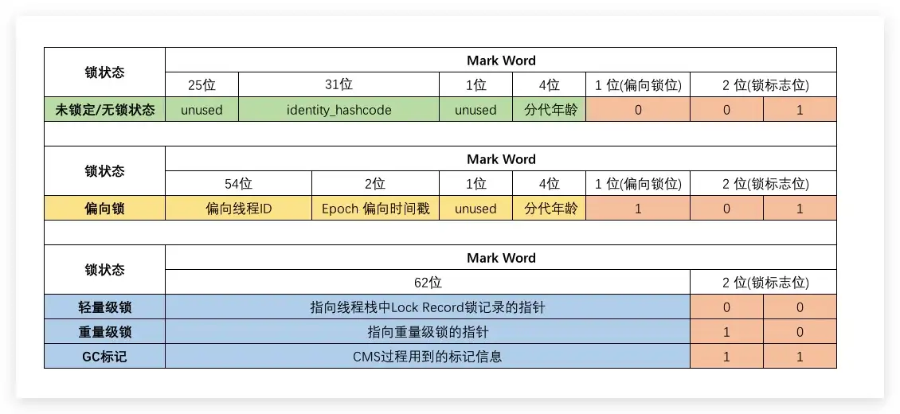
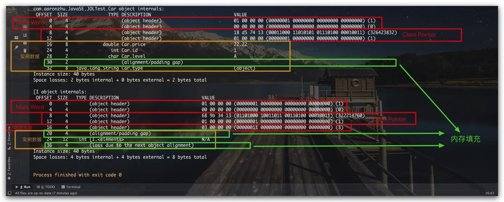

[toc]

## **Java 对象的内存布局**

Java的实例对象、数组对象在内存中的组成包括如下三部分：对象头Hearder、实例数据、内存填充。[示意图](https://zhida.zhihu.com/search?content_id=121877875&content_type=Article&match_order=1&q=示意图&zhida_source=entity)如下所示


- **对象头**：其主要包括两部分数据：Mark Word、Class对象指针。特别地对于数组对象而言，其还包括了数组长度数据。在64位的HotSpot虚拟机下，Mark Word占8个字节，其记录了Hash Code、GC信息、锁信息等相关信息；而Class对象指针则指向该实例的Class对象，在开启指针压缩的情况下占用4个字节，否则占8个字节；如果其是一个数组对象，则还需要4个字节用于记录数组长度信息。这里列出64位HotSpot虚拟机Mark Word的具体含义，以供参考。需要注意的是在下图的Mark Word中，左侧为高字节，右侧为低字节



- **实例数据**：用于存放该对象的实例数据
- **内存填充**：64位的HotSpot要求Java对象地址按8字节对齐，即每个对象所占内存的字节数必须是8字节的整数倍。因此Java对象需要通过内存填充来满足对齐要求


然后编写一个简单的Java类，以供我们进行后续分析

```java
@Data
@Builder
public class Car {
    private int id;
    private String type;
    private double price;
    private char level;
}
```

下面，我们分别构造处Car对象、数组对象，然后通过JOL工具进行内存布局的分析

```java
public class JOLDemo {
    public static void main(String[] args) {
        Car car = Car.builder()
                .id(1)
                .type("SUV")
                .level('A')
                .price(22.22)
                .build();


        System.out.println( ClassLayout.parseInstance(car).toPrintable() );
        
        int[] array = new int[3];
        array[0] = 11;
        array[1] = 22;
        array[2] = 33;
        System.out.println( ClassLayout.parseInstance(array).toPrintable() );

    }
}
```

这里我们设置了JVM选项-XX:-UseCompressedOops以关闭指针压缩。下面即是Java对象的内存布局信息输出及相关分析结果，这里笔者的CPU主机字节序为[小端](https://zhida.zhihu.com/search?content_id=121877875&content_type=Article&match_order=1&q=小端&zhida_source=entity)




#### 2.1 对象头


- 包括两部分信息
  - 第一部分：对象自身的运行时数据，如哈希码，GC分代年龄，锁状态标志，线程持有的锁，偏向线程ID，偏向时间戳等，这部分数据的长度在32位和64位的虚拟机中分别为32 bit和64 bit，官方称它为“Mark Word”。
  - 第二部分：类型指针，即对象指向它的类元数据的指针，虚拟机通过这个指针来确定这个对象是哪个类的实例。如果对象是一个java数组，那在对象头中还必须有一块用于记录数组长度的数据。
- 在对象头中有两类信息：标志信息（Mark Word）和类型指针（Kclass Pointer）
  - 1.标识信息用来存放对象一些固有属性的状态，这些属性从对象创建就有，而不是 Java 的使用者定义的：
    - 哈希码：对象的唯一标识符
    - 对象的分代年龄：与垃圾回收有关
    - 线程持有的锁
    - 锁的状态
    - 偏向线程 ID、偏向时间戳
    - 数组长度：如果该对象是数组，会有数组长度信息
  - 2.类型指针是指向方法区中类元信息的指针。

#### 2.2 实例数据


- 实例的信息存放的是一些对Java使用者真正有效的信息
  - 也就是**类中定义的各个字段，其中还包括从父类继承的字段**。hotspot把相同宽度的类型分配在一起。

#### 2.3 对齐填充


- 对齐填充不是必然存在的。
  - HotSpot VM的自动内存管理系统要求对象起始地址必须是8字节的整数倍，也就是说对象的大小必须是8字节的整数倍。
  - 而对象头部分正好是8字节的整数倍。因此，当对象实例数据部分没有对齐时，就需要通过对其补充来补全了。