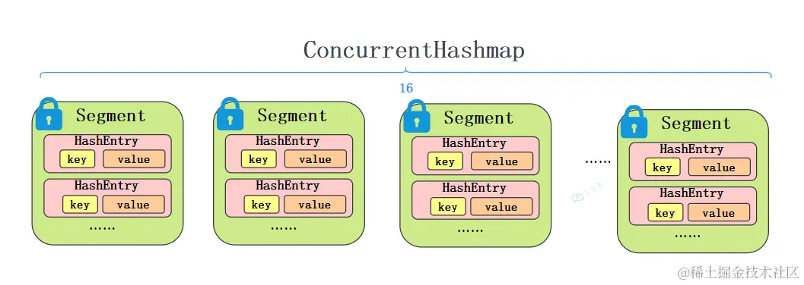

[toc]

## 01.介绍

Java 的集合框架提供了用于**存储和操作一组数据的标准方法**。集合框架主要包括**接口**、**实现类**和**算法**三部分。

从存储上划分，这里主要包括：Collection和Map。

Collection是存放单一元素。


Map则**存放键值对**。


### 1.1 **接口（Interfaces）**

存放单一元素的接口

- **Collection**: 是单一元素集合的根接口，定义了一套标准的方法。其他接口（如 List、Set、Queue）都继承自 Collection。
- **List**: 有序的集合，允许重复元素。List 可以通过索引访问元素。
- **Set**: 无序集合，不允许重复元素。
- **Queue**:先进先出的队列。

存放键值对的接口

- **Map**: 是键值对（key-value）集合的根接口，键不允许重复，而值可以重复。其它接口，如：HashMap，HashTable，SortedMap都是继承自它
- HashMap：线程不安全的哈希表
- HashTable：线程安全的哈希表
- SortedMap：使用红黑树数据结构来存储键值对。


### 1.2 **实现类（Implementations）**

依据不同的底层数据类型，划分为多种实现类。

分别是：

- Array：动态可调整大小的数组，典型的是ArrayList。
- Linked：双向链表，典型的是LinkedList
- Hash：基于哈希表实现，典型的是HashMap
- Tree：基于红黑树实现，典型的是：TreeSet
- LinkedHash：本质是基于哈希表实现，但是在 `Hash.node` 的基础上，通过为每个节点增加前驱和后继引用，从而构建了一个双向链表。


## 02. List相关问题

### 2.1 ArrayList和LinkedList有什么区别？


这个问题的本质是理解数组和链表的区别。

数组是一片连续的内存空间，因此支持随机访问，所以查找效率高，但是增删效率低。 链表是非连续的内存空间，因此查找效率低，但是增删效率高。

它们在空间占⽤上都有⼀些额外的消耗 ：对于LinkedList是单个元素内部需要额外存放指针，对于 ArrayList 则是整体的，其需要预先定义好数组的，所以其有一些内存空间可能没有使用到，所以存在着一定程度上的空间浪费


### 2.2 ArrayList的扩容机制了解吗？

初始长度是10，容量超过则会扩容，扩容是先创建一个原先容量 **1.5倍** 的新数组，然后再将原数组的值遍历拷贝过去。


### 2.3 ArrayList怎么序列化的知道吗？

在序列化时，`ArrayList` 将自身的元素序列化，而不是直接序列化这个数组。因为其整体存在很多空位没被使用。

具体原理如下：

`ArrayList` 实现了 `writeObject` 和 `readObject` 方法来控制序列化和反序列化过程。在 `writeObject` 中，它会写入 `ArrayList` 的大小（`size`），然后依次序列化其中的每个元素。在 `readObject` 中，先读出 `size`，然后逐个反序列化元素并将它们添加到 `ArrayList` 中。


### 2.4 CopyOnWriteArrayList了解多少？

CopyOnWriteArrayList就是线程安全版本的ArrayList。

CopyOnWriteArrayList 采用了一种**读写分离**的并发策略。在没有写操作的前提下，单纯的读操作不会产生线程并发问题，因此它允许随意读取原数组。

至于写操作，采取 **CopyOnWrite** ——写时复制策略。会拷贝一个新副本，在新副本上加锁写，结束之后再将**原数组的引用指向新副本**。

这样，整体是线程安全的，读是无锁的，高效的。写是有锁的，线程安全的。兼顾了读取效率和线程安全。


## 03.Map相关问题

### 3.1 能说一下HashMap的数据结构吗？

这个问题需要分成两个阶段来进行回答，分别是 JDK 1.8 以前和 JDK 1.8 之后。

JDK 1.8 以前，采用的数据结构是 **数组** **+** **链表 ，**。

JDK 1.8 以后，采用的数据结构是 **数组** **+** **链表** **+** **红黑树** 。

数据结构如下图所示：


其中，桶数组是用来存储哈希桶，桶中存放实际元素，链表是用来在桶中解决冲突，红黑树是为了提高查询的效率。

- 数据元素通过映射关系，也就是散列函数，映射到桶数组对应索引的位置
- 如果发生冲突，从冲突的位置拉一个链表，插入冲突的元素
- 如果链表长度>8&数组大小>=64，链表转为红黑树
- 如果红黑树节点个数<6 ，转为链表


### 3.2 你对红黑树了解多少

红黑树本质上是一种平衡的二叉查找树

**提问：什么是二叉查找树**

二叉查找树是一种特殊的二叉树，它满足以下性质：

- 他是二叉树。
- 左子树的所有节点值小于根节点值。
- 右子树的所有节点值大于根节点值。
- 左、右子树本身也是二叉查找树。

此时我们要查找3就很容易，只要与根节点比较，就知道它位于左子树还是右子树。


**为什么不采用普通二叉查找树呢？**

红黑树是一种平衡的二叉查找树，插入、删除、查找的最坏时间复杂度都是 O (log n)，，避免了二叉树最坏情况下退化成一条链表后的 O（n）时间复杂度。


**那我们再提一个点，为什么不用平衡二叉树：**

平衡二叉树是比红黑树更严格的平衡树，为了保持保持平衡，需要旋转的次数更多，也就是说平衡二叉树保持平衡的效率更低，所以平衡二叉树插入和删除的效率比红黑树要低。


### 3.3 HashMap的put流程


1. **根据原哈希值，通过扰动函数计算新哈希值**

`HashMap` 在存储键值对时，首先通过键的 `hashCode()` 方法计算出哈希值，然后通过一系列的扰动函数对哈希值进行处理，以减少哈希冲突。扰动函数的代码如下：

```
(key == null) ? 0 : (h = key.hashCode()) ^ (h >>> 16)
```

这里通过将哈希值右移16位并与原哈希值进行异或运算，可以让哈希值的高位和低位都参与到最后的哈希值计算中，从而更均匀地分布到数组中。

2. **判断数组是否需要初始化**

在插入元素之前，`HashMap` 会先检查内部的哈希表（`table`）是否为空或长度为0，如果是，则需要进行初始化。相关代码如下：

```
if ((tab = table) == null || (n = tab.length) == 0)
    n = (tab = resize()).length;
```

如果 `table` 为空，则通过调用 `resize()` 方法来初始化哈希表。

3. **计算下标并判断是否直接插入**

根据哈希值计算出数组的下标位置：

```
tab[i = (n - 1) & hash]
```

这个下标是通过 `哈希值 & (数组长度 - 1)` 计算得到的。如果在这个位置没有存放数据（即 `table[i]` 为 `null`），则直接插入元素。

如果 `table[i]` 不为空，则需要进一步判断该位置的数据结构。

4. **进一步找到插入位置并进行插入或更新（处理哈希冲突的过程）**

如果某个位置已经存在数据，则有两种情况：

- **链表**：如果当前位置存储的是一个链表，则需要遍历链表检查是否已经存在相同的键。如果找到相同的键，则更新其值；否则，将新的键值对添加到链表的末尾。如果链表的长度达到临界值（默认为8），则会将链表转换为红黑树。
- **红黑树**：如果当前位置已经是一个红黑树，则在树中进行插入或更新操作。

6. **判断是否需要扩容**

在完成元素插入后，`HashMap` 会检查当前的存储容量是否超过了阈值 `threshold`。如果超过了阈值，则会触发扩容操作，即重新分配一个更大的数组，并将现有元素重新分布到新的数组中。


### 3.4 HashMap的get流程


HashMap的查找就简单很多：

1. 使用扰动函数，获取新的哈希值
2. 计算数组下标，获取节点
3. 当前节点和key匹配，直接返回
4. 否则，当前节点是否为树节点，查找红黑树
5. 否则，遍历链表查找


### 3.5 HashMap的哈希/扰动函数是怎么设计的?

HashMap的哈希函数是先拿到 key 的 hashcode，是一个32位的int类型的数值，然后让hashcode的高16位和低16位进行异或操作。

```java
static final int hash(Object key) {
    int h;
    // key的hashCode和key的hashCode右移16位做异或运算
    return (key == null) ? 0 : (h = key.hashCode()) ^ (h >>> 16);
}
```

这种设计方式其目标就是为了降低哈希碰撞的概率。


### 3.6为什么哈希/扰动函数能降hash碰撞？

因为参与数组下标计算的多是低位的哈希值，而非高位的哈希值。由于扰动函数的引入，最终用于数组下标计算的哈希值低位包含了更多的信息，而不仅仅是原始哈希值的低位。这种混合增加了低位的随机性，降低了因为低位特征相同而导致的哈希冲突。


### 3.7为什么HashMap的容量是2的幂次方呢？

有三个主要原因：**提高哈希取余的效率** 和 **便于扩容机制的实现**，以及减少**哈希冲突**

**提高取余效率**

`HashMap` 在计算哈希桶数组的下标时，需要取模数组容量，保证在数组容纳范围内，如果是用2的幂次方，就可以将取模转化为位运算。

比如：hash % 16，可以转化为：hash & (16 - 1)。位运算操作效率更高。

**便于扩容机制：**

当 `HashMap` 扩容时，所有现有元素都必须重新分配到新的数组中。如果容量是 2 的幂次方，在扩容时，只需要检查**哈希值的扩展位**（新增加的位）是否为 `1`，就可以决定元素是否需要移动。

> **怎么理解？**
>
> 扩容后的容量是原容量的两倍，这意味着 `hash & (32 - 1)` 比 `hash & (16 - 1)` 多了一位，因此新分配的位置依赖于哈希值的 **高 1 位** 是否为 `1`。
>
> - **原容量是 16 时**：只使用哈希值的低 4 位来确定数组下标，例如 `hash & 15`。
> - **扩容到 32 时**：使用哈希值的低 5 位来确定数组下标，即 `hash & 31`。
>
> 扩容后，元素的下标将根据第 5 位（第 4 位是低位）的变化重新分配：
>
> - 如果扩容后哈希值的第 5 位是 `0`，则元素继续保持在原来的位置。
> - 如果第 5 位是 `1`，则该元素将被重新分配到新的位置。

**减少哈希冲突** 

这个该怎么理解？如果数组长度不是 2 的整数次幂，可能会导致某些哈希值的某些位没有参与到下标计算中，从而增加了哈希冲突的概率。例如，如果长度为 10（二进制为 `1010`），则只有低 4 位和高 1 位参与了计算，可能导致哈希值的部分信息被丢弃。


### 3.8.如果初始化HashMap，传一个17的值new HashMap<>，即：new HashMap<>(17)。它会怎么处理？

简单来说，就是初始化时，传的不是2的倍数时，HashMap会向上寻找**离得最近的2的倍数**，所以如果传入17的话，HashMap的实际容量就是32。

`HashMap` 会将传入的容量调整为大于或等于传入值的最小 2 的幂次方。这个调整是通过一个内部方法来完成的，通常是通过不断将容量向上翻倍，直到达到或超过传入的 `initialCapacity` 为止。

对于 `17` 这个值，`HashMap` 会将其调整为 32，因为 32 是大于 17 的最小的 2 的幂次方。


### 3.9 HashMap和HashTable

HashMap 是非 线程安全的的，性能更好，HashMap 可以接受为 null 的 key-value，而 Hashtable 是线程安全的，比 HashMap 要慢，不接受 null 的 key-value。如果要用线程安全的map，建议是ConcurrentHashMap


### 3.10能具体说一下ConcurrentHashmap的实现吗？

#### 1. **JDK 1.7：基于分段锁的实现**



##### **数据结构**

- **Segment**：JDK 1.7 的 `ConcurrentHashMap` 使用了分段锁（Segmented Locking）的机制。它的内部结构可以理解为一个包含多个 `Segment` 的数组，每个 `Segment` 类似于一个小型的 `HashMap`。每个 `Segment` 都可以独立加锁。

##### **工作原理**

- **并发度**：默认情况下，`ConcurrentHashMap` 的并发度是 16，这意味着最多允许 16 个线程同时操作 `ConcurrentHashMap`，而不会出现竞争。每个线程只会锁住一个 `Segment`，其他 `Segment` 可以被其他线程同时访问。
- put 操作：
  - 首先通过哈希值找到对应的 `Segment`，然后获取该 `Segment` 的自旋锁，重试达到一定次数则改为阻塞锁。
  - 根据key定位到HashEntry，然后遍历该 HashEntry，如果不为空则判断传入的 key 和当前遍历的 key 是否相等，相等则覆盖旧的 value。为空则需要新建一个 HashEntry 并加入到 Segment 中，同时会先判断是否需要扩容。最后会解除之前获取的Segment锁
- get 操作：
  - 由于 HashEntry 中的 value 属性是用 volatile 关键词修饰的，保证了内存可见性，所以每次获取时都是最新值。因此只需要将 Key 通过 Hash 之后定位到具体的 Segment ，再通过一次 Hash 定位到具体的元素上。
  
    

#### 2. JDK1.8 CAS + **Synchronized 双重自检锁**

它的数据结构和HashMap是一样的，数组+链表+红黑树。它实现线程安全的关键点在于put流程。

**put流程**

1. 首先计算hash，根据hash定位到要填入的node节点。
2. 判断node是否为空，如果node是空的话，就通过CAS尝试写入，失败则自旋保证成功。
3. 如果当前位置的 `hashcode == MOVED == -1`,则需要进行扩容。
4. 如果都不满足，则利用 synchronized 锁写入数据，写入数据同样判断链表、红黑树。链表写入和HashMap的方式一样，key hash一样就覆盖，反之就尾插法，
5. 链表长度超过8就转换成红黑树


我是这么理解的，1.8后其使用更细粒度的锁，由之前的段，改为必要时对每个桶上锁，不必要时通过CAS进行直接写入操作。

**get查询**

get很简单，和HashMap基本相同，通过key计算位置，table该位置key相同就返回，如果是红黑树按照红黑树获取，否则就遍历链表获取。


### 3.11**一般用什么作为HashMap的key?**

一般用Integer、String这种不可变类当 HashMap 当 key。String类比较常用。

1. hash值不变：对于可变类，如果其状态在存储后发生变化，它的哈希值可能会改变，从而导致在查找该键时无法找到正确的值。
2. hashcode被提前缓存：因为 String 是不可变的，所以在它创建的时候`hashcode``就被缓存了，不需要重新计算。这就是 HashMap 中的key经常使用字符串的原因。
3. 不需要重写hashcode方法：获取对象的时候要用到 equals() 和 hashCode() 方法，而Integer、String这些类都已经重写了 hashCode() 


### 3.12.讲讲 LinkedHashMap 底层原理，以及其是怎么实现有序的？

`LinkedHashMap` 是在 `HashMap` 的基础上，通过为每个节点增加前驱和后继引用，从而构建了一个双向链表。这一改进使得 `LinkedHashMap` 能够在保持哈希表高效性的同时，还能维护元素的顺序。

单个节点如下图：下面的Entry包裹了上面的Node


整体如下图：


**`put` 操作**：每次put操作都会**将entry(节点)插入到双向链表的尾部**。

**`get` 操作**：每当访问一个元素（通过 `get`、`put` 等操作）时，`LinkedHashMap` 会将该元素移到链表的末尾，表示它是最近访问的。具体操作是将该节点从链表的当前位置移除，并重新插入到链表的尾部。

### 3.13 TreeMap

`TreeMap` 就是红黑树存储键值对吗？在红黑树中的顺序由键本身的实际值决定

此时， 它的插入，删除，查询的时间复杂度全部下降为logn


## 04. set

### 4.1 HashSet的原理

HashSet 基于 HashMap 实现。放入HashSet中的元素实际上由HashMap的key来保存，而HashMap的value则统一存储为一个常量

**唯一性保证**：`HashSet` 的特点是保证集合中不包含重复的元素。它通过哈希表的机制来实现这一点，当你往 `HashSet` 中添加元素时，它会使用哈希函数来计算元素的哈希值，并将其映射到内部的 `HashMap` 中的某个位置。如果该位置已经有相同哈希值的元素（即重复元素），`HashSet` 会忽略这个元素。

## 5.Queue

### 5.1讲一下ArrayDeque？

`ArrayDeque` 是基于数组实现的。它的底层原理是通过一个动态调整大小的循环数组来实现双端队列（Deque）的功能。

`ArrayDeque` 使用两个指针来追踪队列的头部和尾部。

- **`head` 指针**：指向队列头部的元素。
- **`tail` 指针**：指向队列尾部的下一个可插入位置。

当元素从队列头部或尾部添加或移除时，这两个指针会根据需要向前或向后移动，并在到达数组末端时循环回到数组的开头。


如果只需要从两端进行操作，ArrayDeque效率更高一些。如果**经常需要在中间进行插入和删除**（LinkedList有相应的 api，如add(int index, E e)），则应该选 **LinkedList** 。
