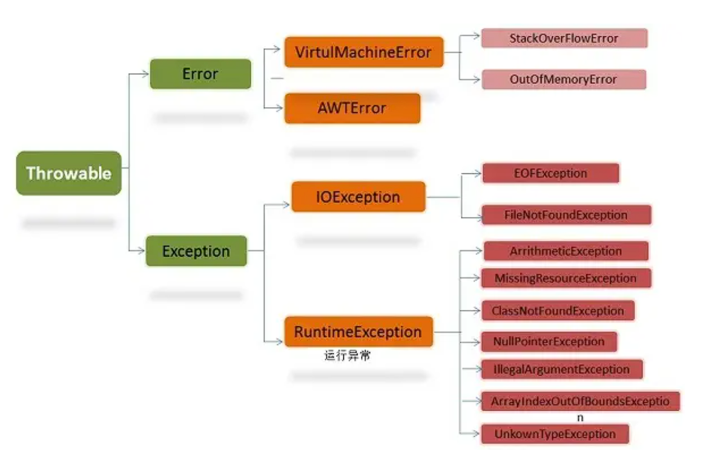

[toc]


## 01.快速了解异常

### 1.1 **什么是异常**

**异常（Exception）是指程序没有按照期望的正确结果执行，出现错误的情况。**

例如，常见的异常情况包括：

- **算术运算异常**：例如，除数为零时会触发 `ArithmeticException`。
- **数组下标越界**：如果访问数组时使用了非法的索引（超出数组的范围），会抛出 `ArrayIndexOutOfBoundsException`。
- **空指针异常**：试图调用 `null` 对象的方法或访问它的成员变量时，会抛出 `NullPointerException`。

### 1.2 为何要有异常

#### 1. 异常的由来与传统错误处理方式的局限性

在早期编程语言（如 C 语言）中，错误处理通常依赖于约定俗成的方法，例如：

- 函数返回特殊的错误码，例如 `-1` 或 `NULL`，以表明出现了错误。
- 使用全局变量（如 `errno`）来指示错误的具体类型。

这种方式的问题在于：

- **每一步都要检查错误**：程序员需要在代码的每一步操作后检查是否出现错误，导致逻辑繁琐且难以维护。
- **错误检查容易遗漏**：如果某个地方忘记检查返回值或错误码，可能会导致程序在出现错误时继续运行，最终导致难以预料的行为。
- **不利于大型系统**：当系统规模变大时，随着函数调用的嵌套和模块的增多，使用返回值如何手动往上传递？传递过程中是否会出现失真？

#### 2. 为什么需要异常处理机制？

异常处理机制的引入是为了解决传统错误处理方式的局限性，尤其是在构建大型、健壮的系统时，它具有以下优势：

1. **分离错误处理与正常逻辑**：异常处理机制将程序的正常执行路径与错误处理路径分离开来，减少了大量的错误检查代码，使程序更加简洁可读。你可以把“出现问题时怎么办”的处理逻辑集中放在一个地方，而不需要在每次调用函数后都写判断代码。

2. **自动传递与传播**：当某个代码块发生异常时，它可以自动被传递给调用它的上层代码，直到有一个地方对它进行处理。这种传播机制避免了需要手动返回错误码层层传递的繁琐过程。

**怎么理解：分离错误处理与正常逻辑**

"分离错误处理与正常逻辑" 是异常机制的一个核心概念，指的是在程序中将正常的业务逻辑（程序应该执行的主要功能）与处理错误的逻辑分开，从而使代码更加清晰、易读、易维护。以下是对这个概念的详细解释和示例。

**1.传统错误处理方法 vs 异常机制**

在没有异常机制的语言（如 C 语言）中，程序员通常需要在每一步操作后进行错误检查。例如，打开文件、处理输入、执行运算等，都可能出错。这种方式会导致业务逻辑与错误处理混在一起，使得代码显得冗杂和复杂。

**示例：**

```
FILE *file = fopen("example.txt", "r");
if (file == NULL) {
    printf("打开文件失败\n");
    return -1;
}

char buffer[256];
if (fgets(buffer, sizeof(buffer), file) == NULL) {
    printf("读取文件失败\n");
    fclose(file);
    return -1;
}

if (fclose(file) != 0) {
    printf("关闭文件失败\n");
    return -1;
}

// 业务逻辑：处理读取的内容
```

在这个例子中，你看到每一个操作（打开文件、读取文件、关闭文件）之后都有错误检查代码。这样做的结果是，业务逻辑和错误处理逻辑交织在一起，代码显得冗长、复杂、不易读，而且容易出错。

**2. 异常机制中的分离**

程序员不需要在每一步操作之后都进行错误检查，只需在一个集中的地方捕获和处理异常。

```
try {
    FileReader reader = new FileReader("example.txt");
    BufferedReader bufferedReader = new BufferedReader(reader);
    
    String line = bufferedReader.readLine();  // 正常的业务逻辑
    
    bufferedReader.close();
} catch (IOException e) {
    System.out.println("文件处理出错: " + e.getMessage());  // 错误处理逻辑集中在这里
}
```

#### 3. Java的异常机制标准模式

Java中常见的异常处理结构包括 `try-catch-finally` 语句，以及可以使用 `throw` 关键字手动抛出异常。

**示例**：

```
try {
    int result = 10 / 0;  // 可能会抛出 ArithmeticException
} catch (ArithmeticException e) {
    System.out.println("发生了算术异常: " + e.getMessage());
} finally {
    System.out.println("无论异常是否发生，都会执行finally块");
}
```

在这个例子中，`try` 块中出现了一个算术异常，`catch` 块捕获并处理了这个异常，而 `finally` 块则始终会执行，确保资源被正确释放或其他必要的操作得以执行。


### 1.3 异常思考

什么是一个有效的异常？

- 在有效使用异常的情况下，异常能清晰的回答what，where，why这3个问题：
  - 异常类型，会告诉“什么”被抛出
  - 异常堆栈跟踪，会告诉“在哪“抛出
  - 异常信息，会告诉“为什么“会抛出。

举例：看一个异常信息

- 异常类型，是NullPointerException，空指针异常
- 异常堆栈跟踪，ZygoteInit.main ----> RuntimeInit ----> ActivityThread.main ----> Handler.dispatchMessage ---> View.performClick ---> CrashTestActivity.onClick
- 异常信息，Attempt to invoke virtual method 'void android.app.Activity.finish()' on a null object reference

我们可以推算出：代码试图在一个 `null` 对象上调用 `finish()` 方法，而 `finish()` 是 `Activity` 类中的方法。可以推断出，`onClick` 方法中的某个 `Activity` 对象为 `null`


## 02.Java异常体系



### 2.1 继承体系介绍

父类Object，子类Throwable，往后是Error错误和Exception异常。错误有virtualMachineError和另一个。异常分为内部异常和外部异常，也就是IOException和RuntimeException。

### 2.2 什么是Error(错误)

- Error（错误）:很严重的，程序无法处理的错误，大多数错误都不是由程序本身产生的，而表示代码运行时 JVM（Java 虚拟机）出现的问题。
- 例如，Java虚拟机运行错误（Virtual MachineError），当 JVM不再有继续执行操作所需的内存资源时，将出现 OutOfMemoryError。这些异常发生时，Java虚拟机（JVM）一般会选择线程终止。

### 2.3 什么是Exception

- Exception（异常）:是程序本身可以处理的异常。
- Exception 这种异常分两大类运行时异常和非运行时异常(编译异常)。程序中应当尽可能去处理这些异常。

### 2.4 编译时异常和运行时异常

我理解他们为内部异常和外部异常，什么是内部，什么是外部？程序的本质是对数据进行处理。处理数据是内部，数据从外存，网络输入输出叫外部。

为了防止操作过程中和外部数据源断开链接引发的异常，因此我们要提前在编译时就必须编写异常处理代码，这些是必定会出现异常的，只是概率问题。如果不编写异常处理，程序将无法编译通过。

内部异常是 程序本身的错误，通常与程序的内部逻辑有关，比如空指针引用、数组下标越界等。这些问题是可以通过优秀的逻辑避免的。因此运行时异常并不强制要求程序员在编译时处理，它们可以在运行时被抛出。