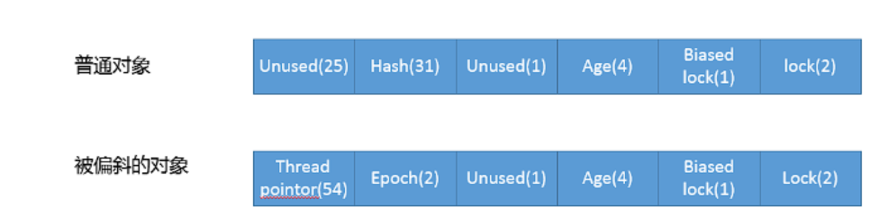
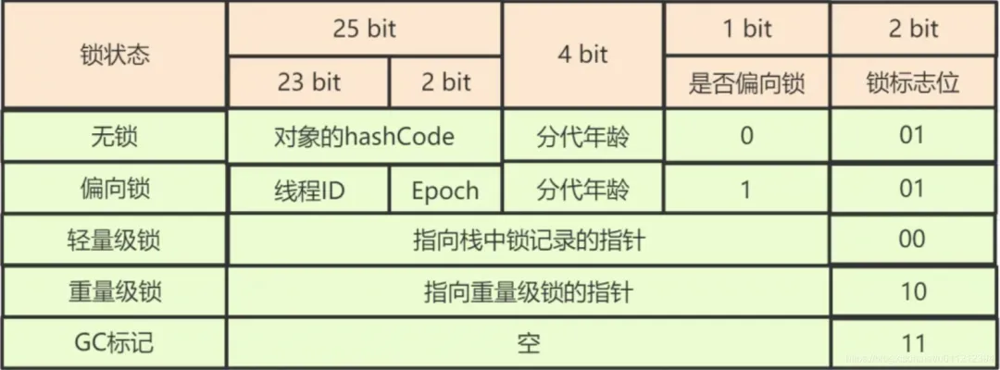

[toc]

## 01.Synchronize介绍

### 什么是Synchronize

Synchronize分时期，早期的底层就是内核互斥锁，当然，内核互斥锁其实就是带着等待队列的M类型Semaphore，即互斥信号量。信号量有很多种类，还有C类型计数信号量等等。当其尝试获取锁时，就是尝试对全局的某个互斥信号量循环判断是否是1，如果超时，那么其会被阻塞在等待队列中，当其它线程释放锁，让互斥信号量为1时会到等待队列中进行调度，唤醒被阻塞的线程。

Synchronize在现在是三种类型：偏向锁（无锁）-	轻量化锁（自旋锁）-	重量级锁（也就是上面的内核互斥锁）其中偏向锁和轻量化锁无需进行线程的阻塞睡眠和唤醒切换。非常节省时间。

### 它的作用是什么

实现多线程并发的三要素。


## 02.Synchronize用法

它看起来应用场景很多，但是实际上概括下来，它可以修饰两种，一个是类的实例对象。一个是类的class对象。

修饰代码块，普通方法，就是修饰类的实例对象，在该对象内执行会互斥。修饰静态方法和一个类，或者使用.class结尾，就是修饰类的class对象，在类的所有对象中执行都会互斥。。


## 03.理解Synchronize锁机制

### Monitor锁机制

`synchronized` 的实现机制依赖于 JVM 中的 **Monitor**（监视器）。在 JVM（如 HotSpot）中，Monitor 由 C++ 实现，具体由 **ObjectMonitor** 类来表示。每个 Java 对象都有一个与之关联的 Monitor。

Monitor 有一个**计数器**，表示当前锁的状态：

- 当线程第一次获得锁时，计数器从 0 变为 1。
- 如果同一个线程再次获得锁（可重入锁的特性），计数器继续增加。
- 当线程执行完同步代码块并释放锁时，计数器递减。当计数器降到 0 时，锁释放，其他线程可以尝试获取锁。

`ObjectMonitor` 提供了以下关键方法来实现同步的基本操作：

- **enter**：线程尝试获取 Monitor，成功则进入同步代码块，失败则进入同步队列等待。
- **exit**：线程释放 Monitor，计数器递减。如果计数器为 0，则锁释放。
- **wait**：线程在同步块中调用 `wait()` 方法时，会释放 Monitor，并进入等待队列，直到被 `notify()` 或 `notifyAll()` 唤醒。
- **notify**：唤醒等待队列中的一个线程。
- **notifyAll**：唤醒等待队列中的所有线程。

### Synchronized 的字节码实现

当使用 `synchronized` 关键字时，JVM 会在编译后的字节码中生成两条指令：

- **`monitorenter`**：进入同步块，尝试获取锁。
- **`monitorexit`**：退出同步块，释放锁。

每个对象都有一个与之关联的 **Monitor**（监视器），当线程执行 `monitorenter` 指令时，它会尝试获取该对象的 Monitor，如果获取成功则进入同步代码块，否则线程将被阻塞。

### 代码块同步和方法同步的区别

对于使用 `synchronized` 关键字的**同步代码块**，JVM 会插入 `monitorenter` 和 `monitorexit` 字节码指令.并通过其完成对对象的monitor的获取和释放。

当 `synchronized` 用于**同步方法**时，JVM 在方法的 `method_info` 结构中标记该方法为 **ACC_SYNCHRONIZED**。此时JVM 在调用方法时自动获取对象的 `Monitor`，在方法执行完毕后自动释放 `Monitor`，不需要显式的 `monitorenter` 和 `monitorexit` 指令。

举例：

- 我们有如下反编译代码：

  ```
  public synchronized void doSth();
      descriptor: ()V
      flags: ACC_PUBLIC, ACC_SYNCHRONIZED
      Code:
        stack=2, locals=1, args_size=1
           0: getstatic     #2                  // Field java/lang/System.out:Ljava/io/PrintStream;
           3: ldc           #3                  // String Hello World
           5: invokevirtual #4                  // Method java/io/PrintStream.println:(Ljava/lang/String;)V
           8: return
  
  public void doSth1();
      descriptor: ()V
      flags: ACC_PUBLIC
      Code:
        stack=2, locals=3, args_size=1
           0: ldc           #5                  // class com/hollis/SynchronizedTest
           2: dup
           3: astore_1
           4: monitorenter
           5: getstatic     #2                  // Field java/lang/System.out:Ljava/io/PrintStream;
           8: ldc           #3                  // String Hello World
          10: invokevirtual #4                  // Method java/io/PrintStream.println:(Ljava/lang/String;)V
          13: aload_1
          14: monitorexit
          15: goto          23
          18: astore_2
          19: aload_1
          20: monitorexit
          21: aload_2
          22: athrow
          23: return
  ```

  

- 通过反编译后代码可以看出：

  - 对于同步方法，JVM采用`ACC_SYNCHRONIZED`标记符来实现同步。
  - 对于同步代码块，JVM采用`monitorenter`、`monitorexit`两个指令来实现同步。

## 04. Synchronize与三要素

### 4.1 synchronized与原子性

**原子性**是指一个操作是不可分割的，要么全部执行成功，要么不执行。

synchronized能实现原子性有两个重要的因素，一个是其字节码指令 `monitorenter` 和 `monitorexit`是原子操作，也就是其获取锁时是原子操作，其获取锁要么完全成功，要么被阻塞失败，不会有其它结果。另一个是因为执行 `monitorenter`获取到锁后，它将进入临界区，执行代码块，此时执行过程是原子性的，不会被破坏。

### 4.2 synchronized与可见性

- 可见性是指当多个线程访问同一个变量时，一个线程修改了这个变量的值，其他线程能够立即看得到修改的值。
- 可见性存在两个问题，一个是cache和主存的问题，正常操作是在cache中操作的，只在合适的时候写会主存，此时其它线程看到的是主存中的旧值，因此cache对主存不可见。另一个是主存和工作内存的问题，线程对变量的读写操作都是在**工作内存**中进行的，而不是直接在主存中操作，因此工作内存对主存不可见。要解决这两个问题，只需要让其写回到主内存中，并且从主内存中读取即可。
- 当一个线程进入 `synchronized` 代码块时，JVM 会确保该线程从主存中读取变量的最新值。退出 `synchronized` 代码块时，JVM 会将线程对共享变量的修改**刷新到主存**。

补充：工作内存和主内存的区别

- Java内存模型规定了所有的变量都存储在主内存中，每条线程还有自己的工作内存，线程的工作内存中保存了该线程中是用到的变量的主内存副本拷贝，线程对变量的所有操作都必须在工作内存中进行，而不能直接读写主内存。不同的线程之间也无法直接访问对方工作内存中的变量，线程间变量的传递均需要自己的工作内存和主存之间进行数据同步进行。所以，就可能出现线程1改了某个变量的值，但是线程2不可见的情况。

  

###  4.3 synchronized与有序性

- 有序性即程序执行的顺序按照代码的先后顺序执行，单个线程内部不存在有序性问题。详见什么是多线程并发
  - 这里需要注意的是，`synchronized`是无法禁止指令重排和处理器优化的。也就是说，`synchronized`无法避免上述提到的问题。
- 那么，为什么还说synchronized也提供了有序性保证呢？
  - 这就要再把有序性的概念扩展一下了。Java程序中天然的有序性可以总结为一句话：如果在本线程内观察，所有操作都是天然有序的。如果在一个线程中观察另一个线程，所有操作都是无序的。
- 所以synchronized不是通过禁止指令重排实现有序性，而是保证只有一个线程执行临界区的代码，进而实现其对外部线程的有序性。


## 05.synchronized底层源码分析

我们前面讲到，Synchronized有两个不同阶段的实现，后续采用偏向锁（无锁）-	轻量化锁（自旋锁）-	重量级锁的实现就是对单互斥锁的优化，在非必要情况下，选择更简便的锁，降低了频繁的阻塞和唤醒的消耗，也提高了锁的获取效率。

### UseBiasedLocking

```cpp
Handle h_obj(THREAD, obj);
  if (UseBiasedLocking) {
    // Retry fast entry if bias is revoked to avoid unnecessary inflation
    ObjectSynchronizer::fast_enter(h_obj, lock, true, CHECK);
  } else {
    ObjectSynchronizer::slow_enter(h_obj, lock, CHECK);
  }
```

- UseBiasedLocking 是一个是否开启了偏向锁的检查，如果开启，那么进入fast_enter，否则进入slow_enter。fast_enter 是我们熟悉的完整锁获取路径，slow_enter 则是绕过偏斜锁，直接进入轻量级锁获取逻辑。

### fast_enter

```
void ObjectSynchronizer::fast_enter(Handle obj, BasicLock* lock,
                                	bool attempt_rebias, TRAPS) {
  if (UseBiasedLocking) {
    if (!SafepointSynchronize::is_at_safepoint()) {
      BiasedLocking::Condition cond = BiasedLocking::revoke_and_rebias(obj, attempt_rebias, THREAD);
      if (cond == BiasedLocking::BIAS_REVOKED_AND_REBIASED) {
        return;
      }
	} else {
      assert(!attempt_rebias, "can not rebias toward VM thread");
      BiasedLocking::revoke_at_safepoint(obj);
	}
    assert(!obj->mark()->has_bias_pattern(), "biases should be revoked by now");
  }
 
  slow_enter(obj, lock, THREAD);
}
```

- 来分析下这段逻辑实现：它会根据当前是否处于安全点进行响应的处理。安全点是 JVM 用来执行某些特定操作（如垃圾回收）的点。

  - [biasedLocking](http://hg.openjdk.java.net/jdk/jdk/file/6659a8f57d78/src/hotspot/share/runtime/biasedLocking.cpp)定义了偏斜锁相关操作，revoke_and_rebias 是不处于安全点时通过撤销和重偏向以获取偏斜锁的入口方法，revoke_at_safepoint 则定义了当检测到安全点时的处理逻辑。
  - 如果获取偏斜锁失败，则进入 slow_enter。
  - 这个方法里面同样检查是否开启了偏斜锁，但是从代码路径来看，其实如果关闭了偏斜锁，是不会进入这个方法的，所以算是个额外的保障性检查吧。

- 获取偏向锁的原理：通过 CAS 设置 Mark Word 中线程指针，对象头中 Mark Word 的结构，可以参考下图：

  

### slow_enter

```
void ObjectSynchronizer::slow_enter(Handle obj, BasicLock* lock, TRAPS) {
  markOop mark = obj->mark();
 if (mark->is_neutral()) {
       // 将目前的 Mark Word 复制到 Displaced Header 上
	lock->set_displaced_header(mark);
	// 利用 CAS 设置对象的 Mark Word
    if (mark == obj()->cas_set_mark((markOop) lock, mark)) {
      TEVENT(slow_enter: release stacklock);
      return;
    }
    // 检查存在竞争
  } else if (mark->has_locker() &&
             THREAD->is_lock_owned((address)mark->locker())) {
	// 清除
    lock->set_displaced_header(NULL);
    return;
  }
 
  // 重置 Displaced Header
  lock->set_displaced_header(markOopDesc::unused_mark());
  ObjectSynchronizer::inflate(THREAD,
                          	obj(),
                              inflate_cause_monitor_enter)->enter(THREAD);
}
```

先了解：轻量化锁，自旋锁是在JVM的线程栈上的，内部存储：

**Displaced Mark Word**：保存对象头的原始 **Mark Word**

**锁状态信息**：栈上锁记录还包含当前锁的状态信息，如锁是否已经膨胀、是否是递归加锁等。


 **获取对象的 Mark Word**

```
markOop mark = obj->mark();
```

- **`markOop mark = obj->mark()`**：从对象头获取当前对象的 **Mark Word**。

**3. 轻量级锁尝试**

```
if (mark->is_neutral()) {
  // 将目前的 Mark Word 复制到 Displaced Header 上
  lock->set_displaced_header(mark);
  // 利用 CAS 设置对象的 Mark Word
  if (mark == obj()->cas_set_mark((markOop) lock, mark)) {
    TEVENT(slow_enter: release stacklock);
    return;
  }
}
```

- **`mark->is_neutral()`**：检查对象的 Mark Word 是否处于中立状态（即对象当前没有被任何线程持有锁）。如果是中立状态，表示该对象还没有被加锁，线程可以尝试获取轻量级锁。



#### 轻量级锁获取过程：

1. **复制 Mark Word**：在尝试获取轻量级锁之前，当前线程会将对象头的原始 Mark Word 复制到 `BasicLock` 的 **Displaced Header** 中。这是因为在加锁后，原始的 Mark Word 会被替换为指向轻量级锁的指针，因此需要保存原始的 Mark Word 以便后续解锁时恢复。
   - `lock->set_displaced_header(mark)`：将当前对象的 Mark Word 复制到 `BasicLock` 的 **Displaced Header** 中。
2. **CAS 操作尝试获取轻量级锁**：线程通过 **CAS（Compare-And-Swap）** 尝试将对象的 Mark Word 修改为指向 `BasicLock`。如果 CAS 操作成功，则表示该线程成功获取了轻量级锁。
   - **`mark == obj()->cas_set_mark((markOop) lock, mark)`**：CAS 操作的含义是，检查对象的 Mark Word 是否仍然等于 `mark`（原始 Mark Word），如果是，则将其更新为指向 `lock` 的指针。CAS 是原子操作，确保在多线程环境下只有一个线程能够成功获取锁。
3. 获取成功则return

**4. 处理锁竞争**

```
else if (mark->has_locker() && THREAD->is_lock_owned((address)mark->locker())) {
  // 清除
  lock->set_displaced_header(NULL);
  return;
}
```

此时当前对象有锁，

- **`mark->has_locker()`**：检查当前对象是否**已经被某个线程持有锁**
- **`THREAD->is_lock_owned((address)mark->locker())`**：如果某个线程已经持有了该锁，通过 `mark->locker()` 获取当前持有锁的线程（或锁记录），然后调用 `THREAD->is_lock_owned()` 方法来检查**当前线程**是否就是持有锁的线程。
- **清除 `Displaced Header`**：如果发现当前线程已经持有锁，则清除轻量级锁的 `Displaced Header`，并直接返回。清除 `Displaced Header` 是为了避免重复保存原始 Mark Word。

**5. 锁膨胀（进入重量级锁）**

```
lock->set_displaced_header(markOopDesc::unused_mark());
ObjectSynchronizer::inflate(THREAD, obj(), inflate_cause_monitor_enter)->enter(THREAD);
```

锁竞争失败，需要进行锁膨胀

- **`lock->set_displaced_header(markOopDesc::unused_mark())`**：将 `Displaced Header` 设置为未使用状态。表明轻量化锁不再使用
- **锁膨胀**：当轻量级锁竞争失败时，JVM 会将轻量级锁升级为**重量级锁**，这意味着线程将进入等待队列，等待锁的释放。
  - **`ObjectSynchronizer::inflate()`**：这个方法用于将轻量级锁膨胀为重量级锁。膨胀后，锁的管理从**轻量级自旋锁**切换到**重量级的操作系统互斥量**，导致线程可能会被阻塞，直到锁被释放。
  - **原因标记 `inflate_cause_monitor_enter`**：锁膨胀的原因是线程试图进入同步块但无法获取轻量级锁。
  - **`->enter(THREAD)`**：当前线程进入重量级锁的等待队列，等待锁的释放。
  
  

## 其他介绍

### 01.关于我的博客

- github：https://github.com/jjjjjjava
- 简书：http://www.jianshu.com/u/92a2412be53e
- csdn：http://my.csdn.net/qq_35829566
- 邮箱：[934137388@qq.com](mailto:934137388@qq.com)
- 掘金：https://juejin.im/user/499639464759898


