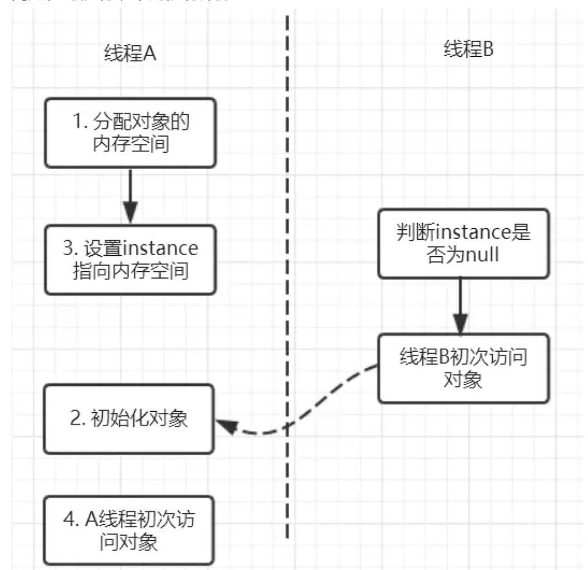

[toc]

## 提问

1. 什么是线程安全
2. 线程安全中代码的例子底层如何执行
3. 线程安全有哪三要素？分别怎么理解
4. 锁如何确保有序性的？
5. 线程安全三要素中的点由哪些关键字实现？

## 01.线程安全

什么是线程安全？

**在多线程环境下，代码的执行结果与单线程执行时的结果一致，并且变量的状态也是符合预期的**


下面是一个线程不安全的例子，我们期望的结果是count自增2次1000，最终为2000。

实际会低于2000.

```java
class Counter {
    private int count = 0;

    public void increment() {
        count++;
    }

    public int getCount() {
        return count;
    }
}

public class Main {
    public static void main(String[] args) throws InterruptedException {
        Counter counter = new Counter();

        // 创建两个线程，每个线程对 counter 进行 1000 次自增操作
        Thread t1 = new Thread(() -> {
            for (int i = 0; i < 1000; i++) {
                counter.increment();
            }
        });

        Thread t2 = new Thread(() -> {
            for (int i = 0; i < 1000; i++) {
                counter.increment();
            }
        });

        t1.start();
        t2.start();

        // 等待两个线程执行完毕
        t1.join();
        t2.join();

        // 打印最终结果
        System.out.println("Final count: " + counter.getCount());
    }
}

```

这里为什么无法实现期望结果呢？具体原理如下：

一个自增操作（`counter.value++`）实际上不是一个**原子操作**，它可以分为以下三个步骤：

1. **读取值**：从主内存中读取 `counter.value` 的值到线程的工作内存。
2. **修改值**：在工作内存中对这个值加 `1`。
3. **写回值**：将修改后的值写回主内存。

首先，不是原子操作，因此中间的过程可以被阻塞，t1线程修改值为2，被阻塞无法写回。t2线程未被阻塞，修改值为999并写回。此时t2被唤醒，继续执行，写回值为2，此时值为2。

其次，不具有可见性。t1修改的值在自身内部的工作空间中，在未被写回时，只有自身可见。t2读取到的值是主内存中的副本，t1的值对其不可见。

## 02.多线程三要素

那么请问：多线程安全的需要满足哪些要素？

要满足如下三要素，分别是：原子性，可见性，有序性

### 2.1 如何理解原子性

- 如何理解原子性
  - 即一个操作（有可能包含有多个子操作）要么全部执行（生效），要么全部都不执行（都不生效）。
- 举一个例子
  - 关于原子性，一个非常经典的例子就是银行转账问题：比如A和B同时向C转账10万元。如果转账操作不具有原子性，A在向C转账时，读取了C的余额为20万，然后加上转账的10万，计算出此时应该有30万，但还未来及将30万写回C的账户，此时B的转账请求过来了，B发现C的余额为20万，然后将其加10万并写回。然后A的转账操作继续——将30万写回C的余额。这种情况下C的最终余额为30万，而非预期的40万。

### 2.2 如何理解可见性

- 如何理解可见性
  - 当多个线程并发访问共享变量时，一个线程对共享变量的修改，其它线程能够立即看到。可见性分为两个部分，一个是缓存对内存的可见性，一个是工作内存对主内存的可见性。
- 举一个例子
  - CPU从主内存中读数据的效率相对来说不高，现在主流的计算机中，都有几级缓存。每个线程读取共享变量时，都会将该变量加载进其对应CPU的高速缓存里，**修改该变量后，CPU会立即更新该缓存，但并不一定会立即将其写回主内存**（实际上写回主内存的时间不可预期）。**此时其它线程（尤其是不在同一个CPU上执行的线程）访问该变量时，从主内存中读到的就是旧的数据，而非第一个线程更新后的数据。**这一点是操作系统或者说是硬件层面的机制，所以很多应用开发人员经常会忽略。
  - 另一个是，线程修改的数据实际上是其从主内存拷贝到自身工作空间中的副本。其必须写回主内存，才可以让修改可见。

### 2.3 如何理解有序性

- 如何理解有序性

  - 顺序性指的是，程序执行的顺序按照代码的先后顺序执行。

- 举一个例子

  - 考量一个语句 instance = new Singleton();
  - 这条语句实际上包含了三个操作：1.分配对象的内存空间；2.初始化对象；3.设置instance指向刚分配的内存地址。但由于存在重排序的问题，可能有以下的执行顺序：

  

  - 如果2和3进行了重排序的话，线程B进行判断if(instance==null)时就会为true，而实际上这个instance并没有初始化成功，显而易见对线程B来说之后的操作就会是错得，它会访问一片未被初始化的空间进而产生错误。而**用volatile修饰**的话就可以禁止2和3操作重排序，从而避免这种情况。这就是指令重排造成的后果，以及有序性的作用

- 由这个例子我们可以发现，如果不存在线程B，那么即使进行指令重排，也不影响A线程对对象的正确访问。所以单线程不存在有序性问题。**所以锁能解决有序性问题的本质不是他们可以禁止指令重排，而是其单线程执行临界区中代码块，此时不存在有序性问题。**

## 其他介绍

### 01.关于我的博客

- github：https://github.com/jjjjjjava
- 简书：http://www.jianshu.com/u/92a2412be53e
- csdn：http://my.csdn.net/qq_35829566
- 邮箱：[934137388@qq.com](mailto:934137388@qq.com)
- 掘金：https://juejin.im/user/499639464759898


