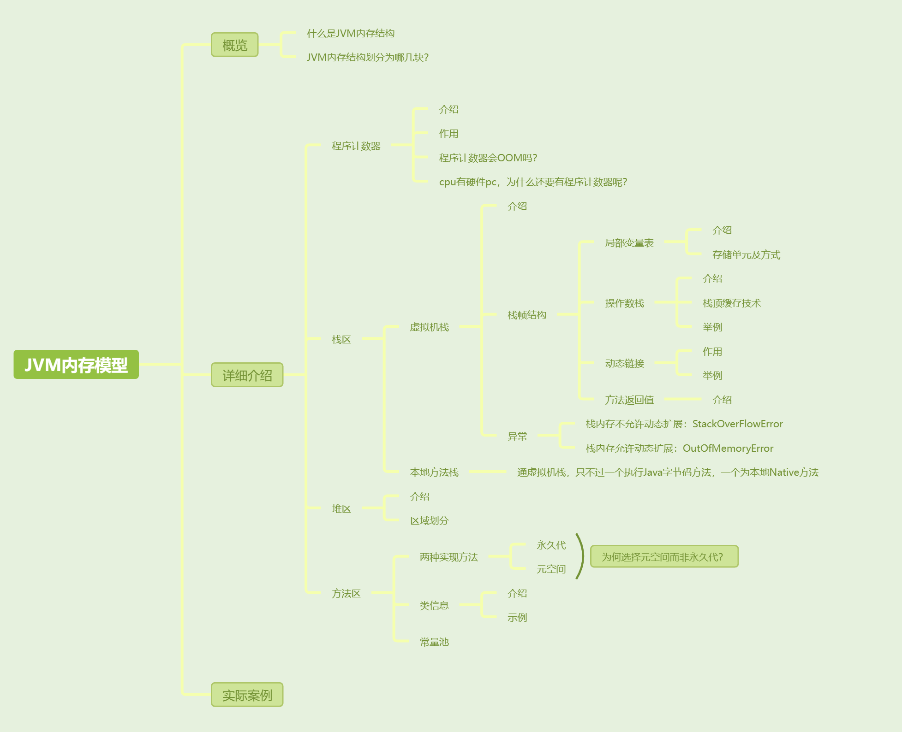
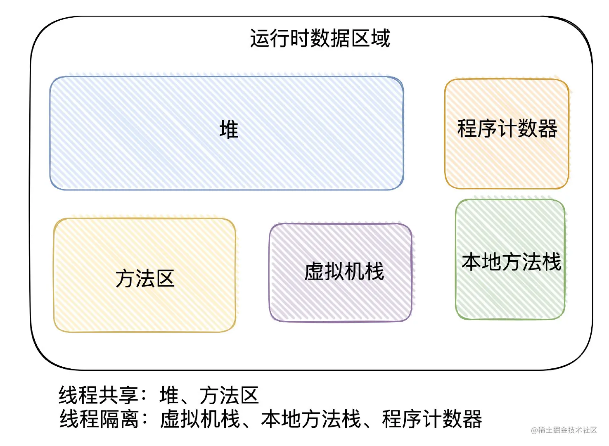
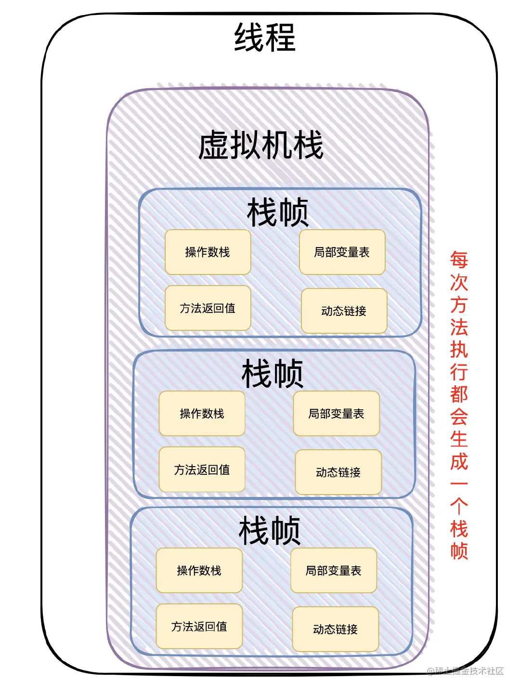
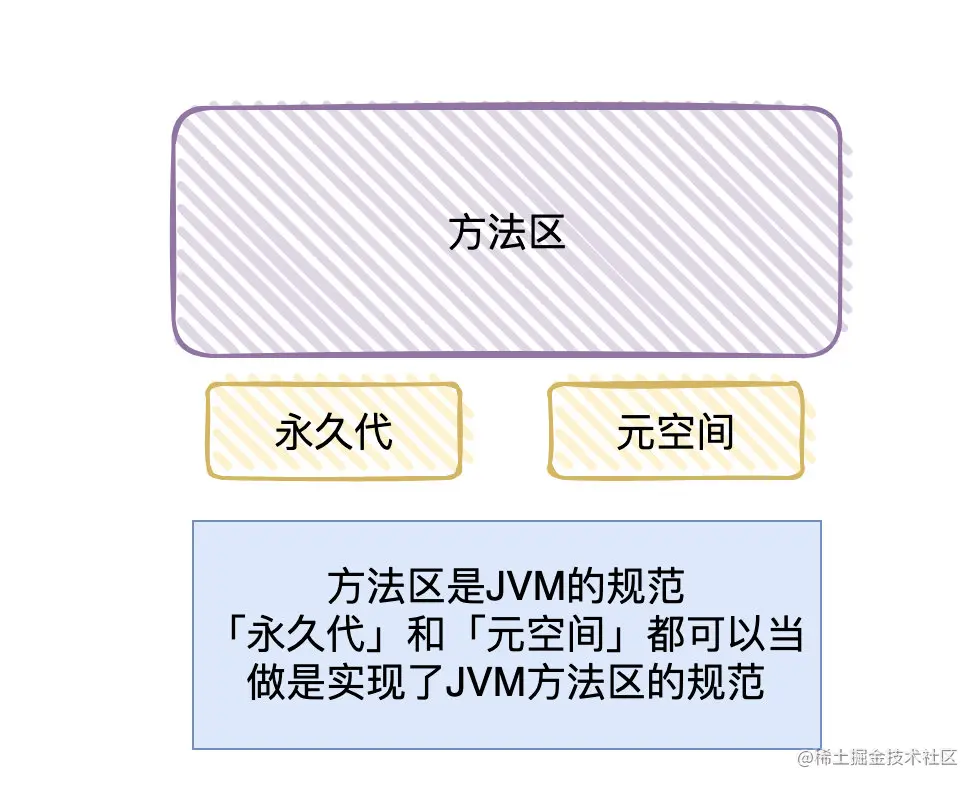
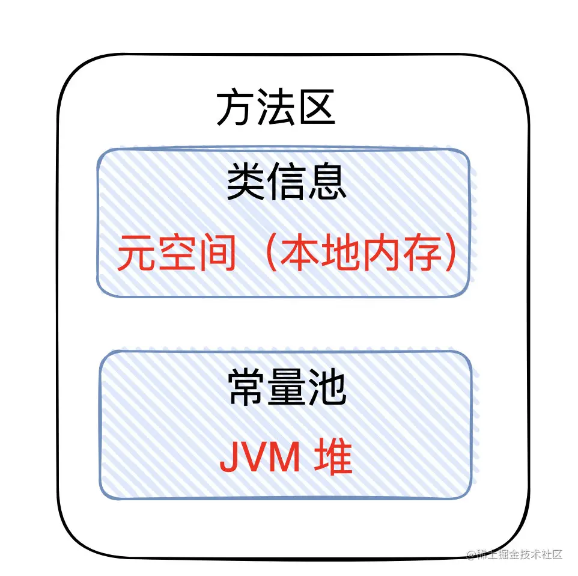

[toc]



## 01. 概览

JVM内存结构（又称为运行时数据区域），它描述着当我们的class文件加载至虚拟机后，各个分区的「逻辑结构」是如何的，每个分区承担着什么作用。。

简单来说就分为了5大块：程序计数器、堆、栈（虚拟机栈、本地方法栈）、方法区。

要值得注意的是：这是JVM「规范」的分区概念，到具体的实现落地，不同的厂商实现可能是有所区别的。



## 02. 详细介绍

### 2.1程序计数器

程序计数器就是用于保存当前正常执行的程序的内存地址的数据结构，每个线程创建时都会有属于自己的程序计数器

程序计数器主要有两个作用：

- 1.实现代码流控制：字节码解释器通过改变程序计数器来依次读取指令，从而实现代码的流程控制。如：顺序执行、选择、循环、异常处理。
- 2.知晓程序执行流位置：在多线程的情况下，程序计数器用于记录当前线程执行的位置，从而当线程被切换回来的时候能够知道该线程上次运行到哪儿。

程序计数器会OOM吗？

- **注意：程序计数器是唯一一个不会出现OutOfMemoryError的内存区域，因为它要存储的数据量很小，就是一个地址而已。**

cpu不是有硬件pc吗？为什么JVM内存模型中还要有这个程序计数器？

- 两个是不同的，CPU 的 PC 是硬件寄存器，JVM 的程序计数器是一个线程私有的内存中的数据结构。cpu 的pc记录当前执行的机器指令的位置，当进行线程切换时，会将保存pc状态。JVM的程序计数器记录的是当前 Java 线程执行到的字节码位置。当 JVM 解释执行 Java 字节码时，它会根据 JVM 程序计数器的值获取当前要执行的字节码，然后将其翻译为机器指令交给 CPU 执行。

### 2.2虚拟机栈

#### 1. 介绍：

Java 虚拟机栈是描述 Java 方法运行过程的内存模型。

每个线程在创建的时候都会创建一个「虚拟机栈」，每次方法调用都会创建一个「栈帧」。每个「栈帧」会包含几块内容：局部变量表、操作数栈、动态连接和返回地址



#### 2. 栈帧结构

1. 局部变量表

- 定义为一个数组，用于存储方法参数、定义在方法体内部的局部变量，数据类型包括各类基本数据类型，对象引用，以及 return address 类型。

- 局部变量表容量大小是在编译期确定下来的。最基本的存储单元是 slot，32 位占用一个 slot，64 位类型（long 和 double）占用两个 slot。、

- 举例：

  **Java程序：**

  ```java
  public class SlotExample {
      public static void main(String[] args) {
          int a = 10;       // 32 位，占用 1 个 slot
          long b = 20L;     // 64 位，占用 2 个 slot
          double c = 30.5;  // 64 位，占用 2 个 slot
          float d = 40.5f;  // 32 位，占用 1 个 slot
  
          System.out.println(a);
          System.out.println(b);
          System.out.println(c);
          System.out.println(d);
      }
  }
  ```

  **字节码分析：**

  使用 `javap -v SlotExample.class` 来查看局部变量表和字节码：

  ```c
  LocalVariableTable:
    Start  Length  Slot  Name   Signature
       0       27     0  args   [Ljava/lang/String;
       2       25     1     a   I
       4       23     2     b   J
       6       21     4     c   D
       8       19     6     d   F
  
    Code:
       0: iconst_0       // args[0] 存储在 slot 0
       1: bipush 10      // 将常量 10 推到栈顶
       3: istore_1       // 将 10 存储到局部变量表的 slot 1（变量 a）
       4: ldc2_w #2      // 将常量 20L 加载到操作数栈
       7: lstore_2       // 将 20L 存储到 slot 2 和 slot 3（变量 b，占用 2 个 slot）
       8: ldc2_w #4      // 将 30.5 加载到操作数栈
      11: dstore 4       // 将 30.5 存储到 slot 4 和 slot 5（变量 c，占用 2 个 slot）
      13: ldc #6         // 将 40.5f 加载到操作数栈
      15: fstore 6       // 将 40.5f 存储到 slot 6
      ...
  ```

  **解释**：**局部变量表的分配**：

  **slot 0**：`args`（方法的参数 `args[]` 被存储在 slot 0 中）

  **slot 1**：`a`（`int a = 10` 被存储在 slot 1 中，占用 1 个 slot）

  **slot 2 和 3**：`b`（`long b = 20L`，由于 `long` 是 64 位的类型，占用 2 个 slot）

  **slot 4 和 5**：`c`（`double c = 30.5`，由于 `double` 是 64 位的类型，占用 2 个 slot）

  **slot 6**：`d`（`float d = 40.5f`，占用 1 个 slot）

2.操作数栈

- 用于存放程序执行过程中用于计算、操作、或传递的具体数据值。比如 a + b，里面a和b的值就是实际的操作数。

- 栈顶缓存技术：由于操作数是存储在内存中，频繁的进行内存读写操作影响执行速度，将栈顶元素全部缓存到物理 CPU 的寄存器中，以此降低对内存的读写次数，提升执行引擎的执行效率。

- 举例：

  **Java程序**：

  ```java
  public class OperandStackExample {
      public static int add(int a, int b) {
          return a + b;
      }
  
      public static void main(String[] args) {
          int result = add(5, 3);
          System.out.println(result);
      }
  }
  ```

  **对应字节码：**

  ```c
  public static int add(int a, int b);
    Code:
       0: iload_0       // 将第一个参数 a 压入操作数栈
       1: iload_1       // 将第二个参数 b 压入操作数栈
       2: iadd          // 从操作数栈中弹出 a 和 b，执行相加操作，将结果压入操作数栈
       3: ireturn       // 从操作数栈中弹出结果，返回
  
  public static void main(java.lang.String[]);
    Code:
       0: iconst_5      // 将常量 5 压入操作数栈
       1: iconst_3      // 将常量 3 压入操作数栈
       2: invokestatic  #2   // 调用 add 方法，弹出两个参数并执行方法
       5: istore_1      // 将 add 方法返回的结果存储到本地变量 result
       6: getstatic     #3   // 获取 System.out
       9: iload_1       // 将 result 压入操作数栈
      10: invokevirtual #4   // 调用 println 方法，输出 result
      13: return        // 结束
  
  ```

  **操作数栈的工作流程：**

  1. **`main` 方法开始**：
     - `iconst_5`: 将常量 5 压入操作数栈。
       操作数栈：[5]
     - `iconst_3`: 将常量 3 压入操作数栈。
       操作数栈：[5, 3]
     - `invokestatic`: 调用 `add` 方法。这个指令会弹出操作数栈中的两个参数（5 和 3），并将它们作为 `add` 方法的参数传递。
  2. **`add` 方法执行**：
     - `iload_0`: 将第一个参数（5）加载到操作数栈。
       操作数栈：[5]
     - `iload_1`: 将第二个参数（3）加载到操作数栈。
       操作数栈：[5, 3]
     - `iadd`: 从操作数栈中弹出两个值（5 和 3），进行相加，将结果 8 压入操作数栈。
       操作数栈：[8]
     - `ireturn`: 弹出操作数栈中的结果 8，返回给调用者。
  3. **返回到 `main` 方法**：
     - main方法接收返回值 8，并将其存储在本地变量 `result` 中（即 `istore_1`）。
     - 接着，将 `result` 再次加载到操作数栈，调用 `System.out.println()` 输出结果`result`。

3.动态链接

当你在 Java 代码中调用方法或访问字段时，编译器会将其编译为符号引用。（符号引用是对方法或字段的一种抽象描述，不会直接指向实际的内存地址。）

在方法执行过程中，JVM 会根据具体的对象类型或者调用时的上下文，动态地将符号引用解析为实际引用（也就是具体的方法或字段的内存地址）。进而实现了Java中的多态性质。

举例：

```java
public class DynamicLinkExample {
    public static void main(String[] args) {
        Animal myAnimal = new Dog();
        myAnimal.speak();  // 这里的调用会使用动态链接
    }
}
```

字节码分析：

```
public static void main(java.lang.String[]);
    Code:
       0: new           #2                  // class Dog
       3: dup
       4: invokespecial #3                  // Method Dog."<init>":()V
       7: astore_1
       8: aload_1
       9: invokevirtual #4                  // Method Animal.speak:()V
      12: return
```

- **`invokevirtual #4`**：指向常量池中 `Animal.speak` 的符号引用。这个符号引用在编译时确定，但并不确定具体的内存地址。
- **动态链接的作用**：在 `invokevirtual` 执行时，JVM 会在当前栈帧中的动态链接部分查找实际的 `Dog.speak` 方法的地址，以便进行正确的方法调用。

4.方法返回值

保存方法执行的结果值，以及方法执行完毕后返回的位置

#### 3. 异常

Java 虚拟机栈会出现两种异常：StackOverFlowError 和 OutOfMemoryError。

- **StackOverFlowError：** 若Java虚拟机栈的内存大小不允许动态扩展，那么当线程请求栈的深度超过当前Java虚拟机栈的最大深度的时候，就抛出StackOverFlowError（栈溢出）异常。
- **OutOfMemoryError：** 若Java虚拟机栈的内存大小允许动态扩展，且当线程请求栈时内存用完了，无法再动态扩展了，此时抛出OutOfMemoryError异常（虚拟机内存不足错误）。

### 2.3本地方法栈

跟虚拟机栈很像， **虚拟机栈为虚拟机执行 Java 方法 （也就是字节码）服务，而本地方法栈则为虚拟机使用到的 Native 方法服务。**

### 2.4堆

「堆」是线程共享的区域，此内存区域的唯一目的就是存放对象实例，对象实例几乎都在这分配内存。在虚拟机启动时创建。

「堆」被划分为「新生代」，「老年代」和「永久代」，「新生代」又被进一步划分为 Eden 和 Survivor 区， Survivor区 由 From Survivor 和 To Survivor 组成


在 JDK 1.8中移除整个永久代，取而代之的是一个叫元空间（Metaspace）的区域（永久代使用的是JVM的堆内存空间，而元空间使用的是物理内存，直接受到本机的物理内存限制）。

将「堆内存」分开了几块区域，主要跟「内存回收」有关（垃圾回收机制）


### 2.5方法区

「方法区」是 JVM 中规范的一部分。

方法区有两种实现方法，一个是堆中的永久代，另一个是物理内存中的元空间。



**提问：为什么把方法区的实现从永久代变成元空间**

永久代使用Java堆中的内存，会经常因为内存不够用导致跑出OOM（虚拟机内存不足错误）异常。而「元空间」存储不在虚拟机中，而是使用本地内存，不会出现OOM（虚拟机内存不足错误）。


方法区主要是用来存放已被虚拟机加载的「类相关信息」：包括**类信息、常量池**


**类信息**又包括了类的版本、字段、方法、接口和父类等信息。

**示例：**

假设我们有一个简单的类：

```java
public class MyClass extends SuperClass implements MyInterface {
    private int myField;

    public void myMethod() {
        System.out.println("Hello");
    }
}
```

在 `.class` 文件中，`MyClass` 的类信息包括：

- **类的版本**：Java 版本号。
- **字段信息**：`myField` 的名称和类型（`int`）。
- **方法信息**：`myMethod` 的名称、返回类型（`void`）和参数列表（空参数）。
- **接口信息**：`MyInterface`。
- **父类信息**：`SuperClass`。


**常量池**又可以分「静态常量池」和「运行时常量池」

**静态常量池**是在编译时存储在Class文件中的，它是Java类文件的一部分。它主要存储符号引用和字面量，并且它不会在运行时直接被使用。

- **字面量**：编译时可确定的常量，例如字符串、整数、浮点数等。
- **符号引用**：指向类、接口、字段和方法的引用，这些引用在编译时是符号形式的，还未解析为实际内存地址。

**运行时常量池**是在类被加载时，从静态常量池中读取并解析而来。它包含运行时生成的直接引用（如指向具体类、方法或字段的内存地址）以及字面量。

在类加载的解析阶段，静态常量池中的符号引用会被解析为直接引用（如内存地址、偏移量等），并存储在运行时常量池中。


逻辑上常量池属于方法区，但是物理存储上，「运行时常量池」和「静态常量池」在「堆」内存中进行存储。而类信息存放在元空间中


## 03.实际案例

我们将以一个案例来理解Java内存结构，并讲解

```
//JVM 启动时将 Person.class 放入方法区
public class Person {

{


}

static {

}
    //静态变量，直接放到常量池中
    public static final String number = "13667225184";
    
	//new Person 创建实例后，name 引用放入堆区，name 对象放入常量池
    private String name;

	//new Person 创建实例后，age = 0 放入堆区
    private int age;

	//Person 方法放入方法区，方法内代码作为 Code 属性放入方法区
    public Person(String name, int age) {
        this.name = name;
        this.age = age;
    }

	//toString 方法放入方法区，方法内代码作为 Code 属性放入方法区
    @Override
    public String toString() {
        return "Person{" + "name='" + name + '\'' + ", age=" + age + '}';
    }
}

//JVM 启动时将 Test.class 放入方法区
public class Test {

	//main 方法放入方法区，方法内代码作为 Code 属性放入方法区
    public static void main(String[] args) {
        //局部变量，定义的一些基本类型的变量和对象的引用变量都是在函数的栈(本地方法栈)内存中分配
        String name1 = "张三";
        int age1 = 18;

        //person1 是引用放入虚拟机栈区，new 关键字开辟堆内存 Person 自定义对象放入堆区
        //堆内存用于存放所有由new创建的对象（内容包括该对象其中的所有成员变量）和数组。
        Person person1 = new Person(name1, age1);
        Person person2 = new Person("李四", 20);

        //通过 person 引用创建 toString() 方法栈帧
        person1.toString();
        person2.toString();
    }

    private void clear(){
        //对象设置为null，回收
        person1 = null;
        person2 = null;
    }
}
```

