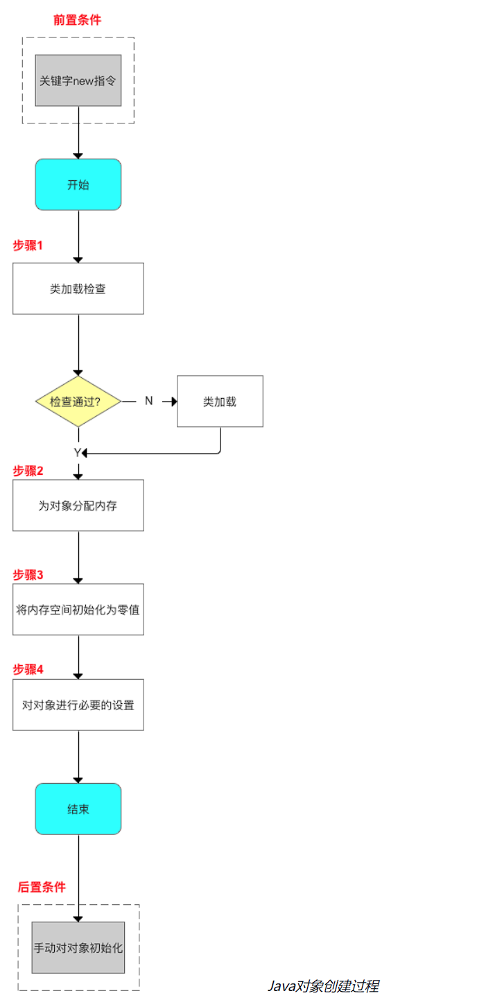
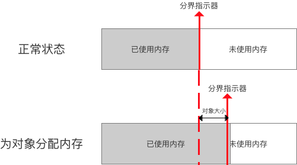
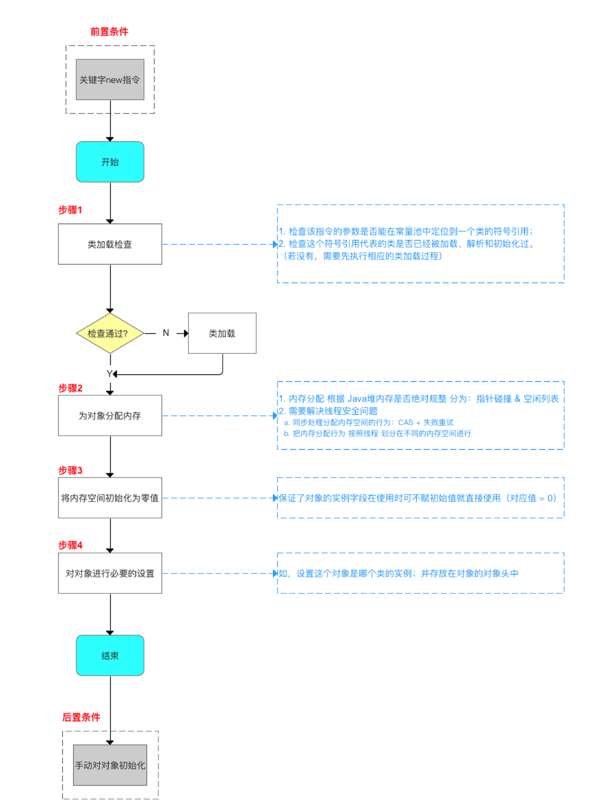
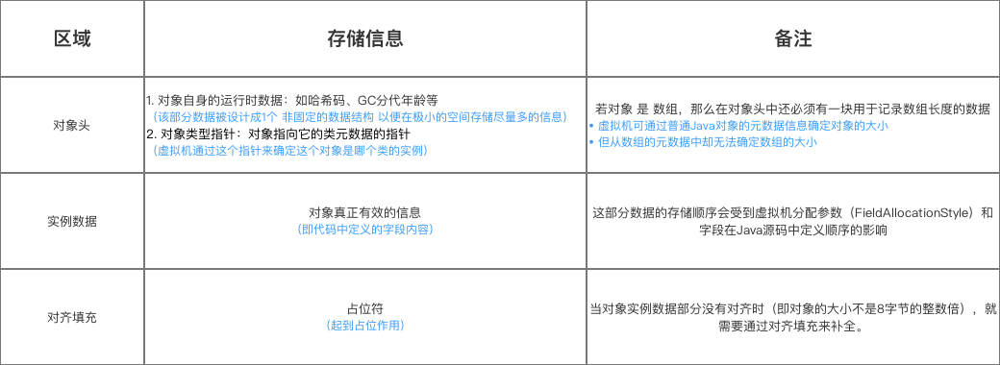
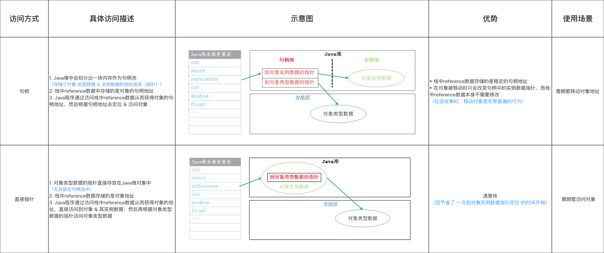

[toc]

> 注：读者在阅读博客的过程中总结各个文章的知识，写了很多笔记。但是本文原作者的写作和总结已经很翔实了，因此本文绝大多数照搬原作者的写作，中间稍加自己的理解和修改。原文来源如下：
>
> 作者：Carson带你学Android
> 链接：https://juejin.cn/post/6844903681553334285

## 1. 对象创建

- 在开发使用时，创建 `Java` 对象仅仅只是是通过关键字`new`：

```java
A a = new A()；
```

- 可是 `Java`对象在虚拟机中创建则是相对复杂。今天，我将详解`Java`对象在虚拟机中的创建过程

> 限于普通对象，不包括数组和Class对象等

### 1.1 创建过程

当遇到关键字`new`指令时，Java对象创建过程便开始，整个过程如下：



下面我将对每个步骤进行讲解。

### 1.2 步骤1：类加载检查

1. 检查 该`new`指令的参数 是否能在 常量池中 定位到一个类的符号引用，`new` 指令的参数并不是直接的类地址，而是一个**符号引用**。`new` 指令会尝试在 常量池中定位到对应的符号引用。

> 如果没有，需要先执行相应的类加载过程

### 1.3 步骤2：为对象分配内存

- 虚拟机将为对象分配内存，即把一块确定大小的内存从 `Java` 堆中划分出来

> 对象所需内存的大小在类加载完成后便可完全确定

- 关于分配内存，此处主要讲解内存分配方式
- 内存分配 根据 **Java堆内存是否绝对规整** 分为两种方式：指针碰撞 & 空闲列表

> 1.  `Java`堆内存 规整：已使用的内存在一边，未使用内存在另一边
> 2.  `Java`堆内存 不规整：已使用的内存和未使用内存相互交错

*示意图*

#### 方式1：指针碰撞

- 假设Java堆内存绝对规整，内存分配将采用指针碰撞
- 分配形式：已使用内存在一边，未使用内存在另一边，中间放一个作为分界点的指示器

*正常状态*

- 那么，分配对象内存 = 把指针向 未使用内存 移动一段 与对象大小相等的距离

*分配内存空间*

#### 方式2：空闲列表

- 假设Java堆内存不规整，内存分配将采用 空闲列表
- 分配形式：虚拟机维护着一个 记录可用内存块 的列表，在分配时从列表中找到一块足够大的空间划分给对象实例，并更新列表上的记录

#### 额外知识

- 分配方式的选择 取决于 `Java`堆内存是否规整；
- 而 Java堆是否规整 由所采用的垃圾收集器是否带有压缩整理功能决定。因此：            
  1. 使用带`复制和标记-整理算法`的垃圾收集器时，采用指针碰撞；

> 如`Serial、ParNew`垃圾收集器

​		  2.使用 `标记-清除`算法的垃圾收集器时，采用空闲列表。

> 如 `CMS`垃圾收集器

#### 特别注意

- 对象创建在虚拟机中是非常频繁的操作，即使仅仅修改一个指针所指向的位置，在并发情况下也会引起线程不安全

> 如，正在给对象A分配内存，指针还没有来得及修改，对象B又同时使用了原来的指针来分配内存

**所以，给对象分配内存会存在线程不安全的问题。**

解决 线程不安全 有两种方案：

1. 同步处理分配内存空间的行为

> 虚拟机采用 **`CAS` + 失败重试的方式** 保证更新操作的原子性

2. 把内存分配行为 按照线程 划分在不同的内存空间进行

> 1. 即每个线程在 `Java`堆中预先分配一小块内存（本地线程分配缓冲（`Thread Local Allocation Buffer` ，`TLAB`）），哪个线程要分配内存，就在哪个线程的`TLAB上`分配，只有TLAB用完并分配新的TLAB时才需要同步锁。
> 2. 虚拟机是否使用`TLAB`，可以通过`-XX:+/-UseTLAB`参数来设定。

------

### 1.4 步骤3： 将内存空间初始化为零值

内存分配完成后，虚拟机需要将分配到的内存空间初始化为零（不包括对象头）

> 1. 保证了对象的实例字段在使用时可不赋初始值就直接使用（对应值 = 0）
> 2. 如使用本地线程分配缓冲（TLAB），这一工作过程也可以提前至TLAB分配时进行。

------

### 1.5 步骤4： 对对象进行必要的设置

> 如，设置 这个对象是哪个类的实例、如何才能找到类的元数据信息、对象的哈希码、对象的GC分代年龄等信息。

**这些信息存放在对象的对象头中**。

------

- 至此，从 `Java` 虚拟机的角度来看，一个新的 `Java`对象创建完毕
- 但从 `Java` 程序开发来说，对象创建才刚开始，需要进行一些初始化操作。

### 1.6 总结

下面用一张图总结 `Java`对象创建的过程

 *示意图*



## 2. 对象的内存布局

- 问题：在 `Java` 对象创建后，到底是如何被存储在Java内存里的呢？

- 答：在Java

  虚拟机（HotSpot）中，对象在 Java

   内存中的 存储布局 可分为三块：            

  1. 对象头 存储区域
  2. 实例数据 存储区域
  3. 对齐填充 存储区域

*内存布局*

下面我会详细说明每一块区域。

### 2.1 对象头区域

此处存储的信息包括两部分：

- 对象自身的运行时数据（`Mark Word`）

> 1. 如哈希码（`HashCode`）、GC分代年龄、锁状态标志、线程持有的锁、偏向线程ID、偏向时间戳等
> 2. 该部分数据被设计成1个 非固定的数据结构 以便在极小的空间存储尽量多的信息（会根据对象状态复用存储空间）

- 对象类型指针

> 1. 即对象指向它的类元数据的指针
> 2. 虚拟机通过这个指针来确定这个对象是哪个类的实例

#### 特别注意

如果对象是数组，那么在对象头中还必须有一块用于记录数组长度的数据

> 因为虚拟机可以通过普通Java对象的元数据信息确定对象的大小，但是从数组的元数据中却无法确定数组的大小。

------

### 2.2 实例数据区域

- 存储的信息：对象真正有效的信息

> 即代码中定义的字段内容

- 注：这部分数据的存储顺序会受到虚拟机分配参数（FieldAllocationStyle）和字段在Java源码中定义顺序的影响。

```java
// HotSpot虚拟机默认的分配策略如下：
longs/doubles、ints、shorts/chars、bytes/booleans、oop(Ordinary Object Pointers)
// 从分配策略中可以看出，相同宽度的字段总是被分配到一起
// 在满足这个前提的条件下，父类中定义的变量会出现在子类之前

CompactFields = true；
// 如果 CompactFields 参数值为true，那么子类之中较窄的变量也可能会插入到父类变量的空隙之中。
```

### 2.3 对齐填充区域

- 存储的信息：占位符

> 占位作用

- 因为对象的大小必须是8字节的整数倍
- 而因HotSpot VM的要求对象起始地址必须是8字节的整数倍，且对象头部分正好是8字节的倍数。
- 因此，当对象实例数据部分没有对齐时（即对象的大小不是8字节的整数倍），就需要通过对齐填充来补全。

### 2.4 总结

*示意图*

## 3. 对象的访问定位

- 问：建立对象后，该如何访问对象呢？

> 实际上需访问的是 对象类型数据 & 对象实例数据

- 答：`Java`程序 通过 栈上的引用类型数据（`reference`） 来访问`Java`堆上的对象

由于引用类型数据（`reference`）在 `Java`虚拟机中只规定了一个指向对象的引用，但没定义该引用应该通过何种方式去定位、访问堆中的对象的具体位置

所以对象访问方式取决于虚拟机实现。目前主流的对象访问方式有两种：

- 句柄 访问
- 直接指针 访问

具体请看如下介绍：很有意思。

*示意图*

