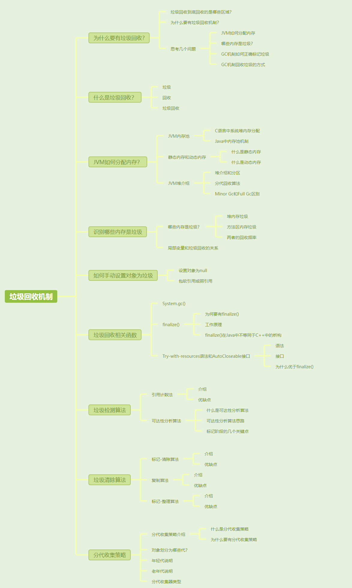
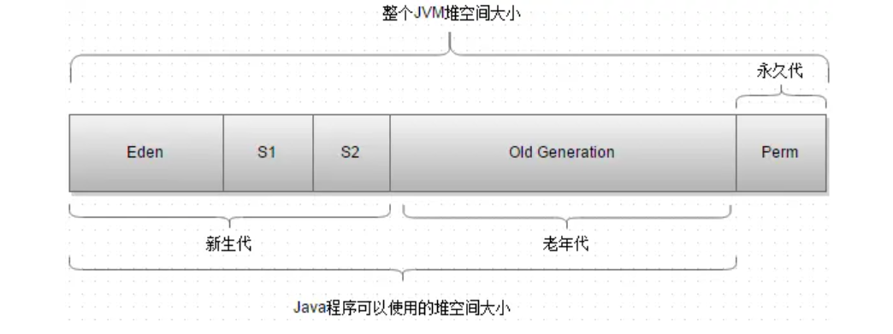
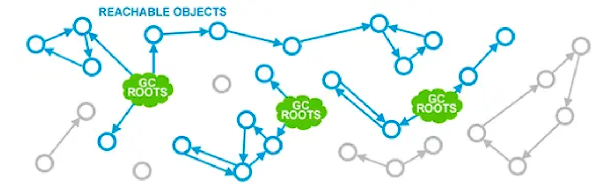
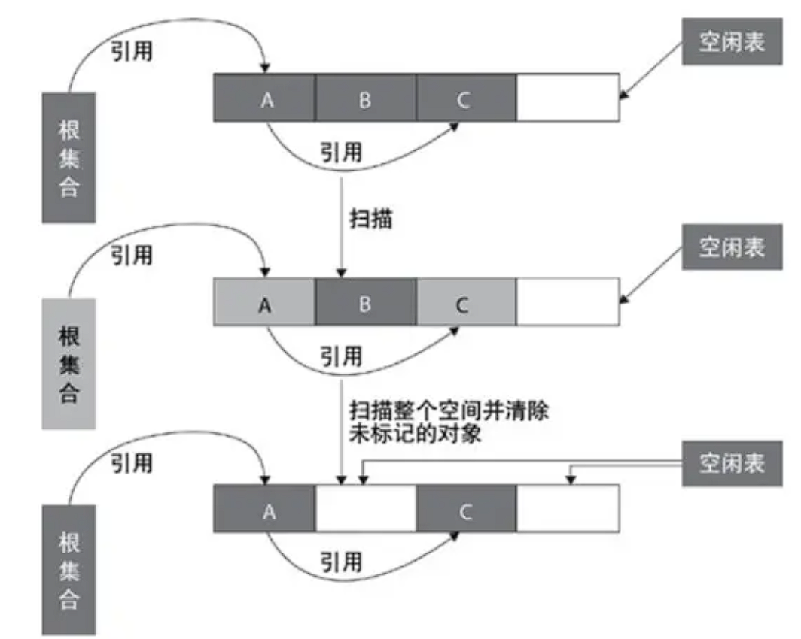
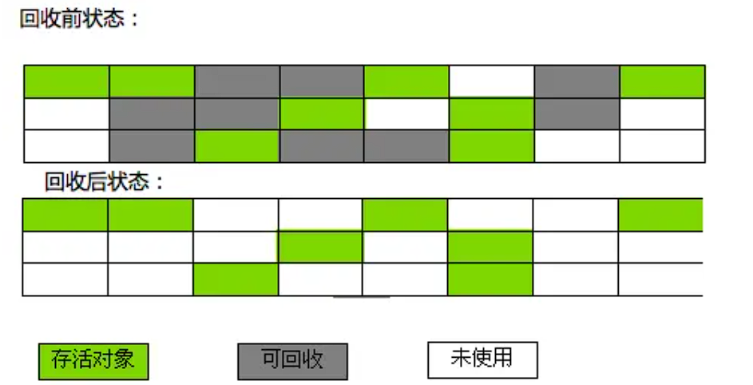
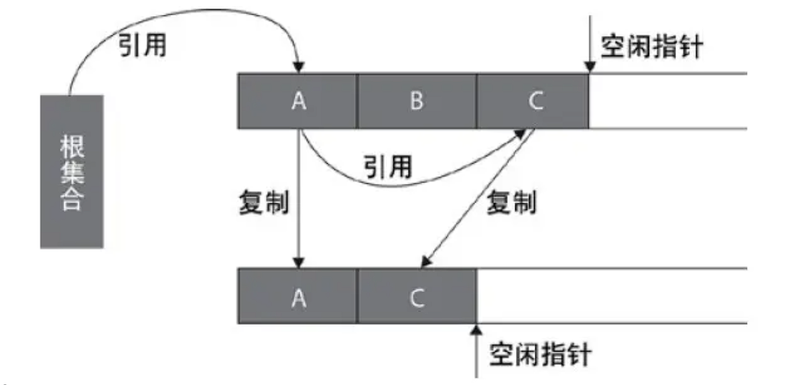
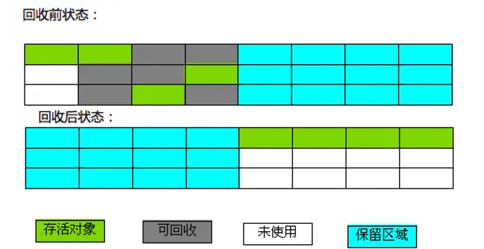
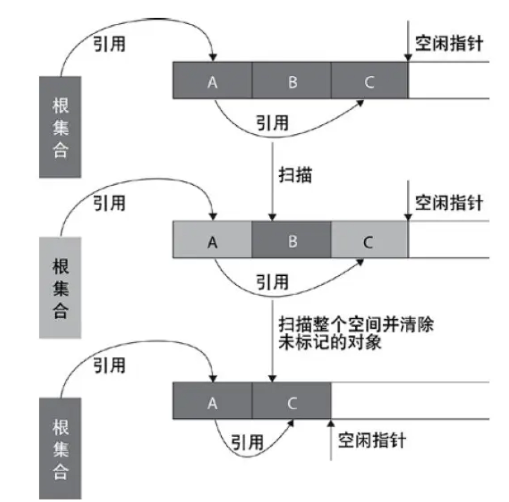
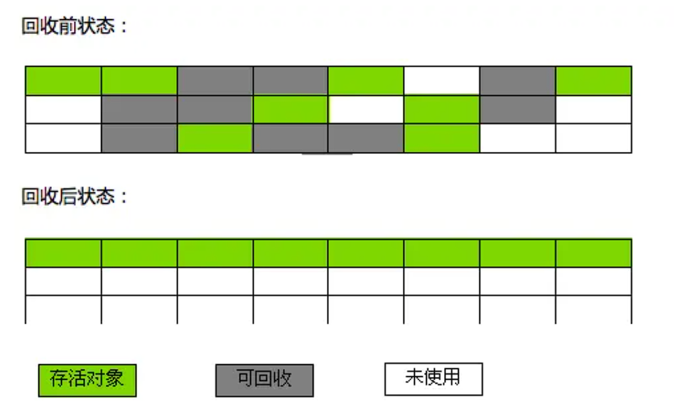

[toc]



## 01.为什么要有垃圾回收？

- 垃圾回收到底回收的是哪些区域？

  - 程序计数器、虚拟机栈、本地方法栈随线程而生，也随线程而灭；栈帧随着方法的开始而入栈，随着方法的结束而出栈。这几个区域的内存分配和回收都具有确定性，在这几个区域内不需要过多考虑回收的问题，因为方法结束或者线程结束时，内存自然就跟随着回收。
  - 对于 Java 堆和方法区，我们只有在程序运行期间才能知道会创建哪些对象，这部分内存的分配和回收都是动态的，垃圾收集器所关注的正是这部分内存。
- 为什么要有垃圾回收机制
  - 栈本身属于线程，随着线程的死亡而被清除。栈内的栈帧是顺序分配，每次方法结束后，栈指针自动返回上一个栈帧的位置，释放当前栈帧占用的内存。
  - 堆，分配内存是随机分配的，而且是不定长度。它内部的对象是跨越线程共享的，不会随着线程死亡或方法结束而释放，由于堆中的对象分布随机且大小不一，你也没法通过移动指针来释放。因此针对堆中垃圾，我们需要特殊的垃圾回收机制。
- 思考几个重要问题
  - JVM是怎么分配内存的？
  - 我们如何定义垃圾，即：哪些内存是垃圾？
  - GC机制如何正确的识别垃圾？
  - GC机制回收垃圾的方式。

## 02.什么是垃圾回收

- 什么是垃圾回收？
  - 垃圾：无任何**对象引用**的**对象**，对象占据内存空间，对象引用持有内存空间地址，可以正确访问到该内存空间，如果程对象无对象引用，那么虽然它有内存空间，但是我们没有它的地址，无法正常访问到它，这就是垃圾。（怎么通过算法找到这些对象呢？）。
  - 回收：清理“垃圾”占用的内存空间（怎么通过算法实现回收呢？）。
  - 垃圾回收(Garbage Collection)：是JVM提供的一种用于在空闲时间回收无任何对象引用的对象占据的内存空间的一种机制。
  

## 03.JVM是怎么分配内存的？

### 3.1 JVM内存池

**C语言中系统堆内存分配**：如果 JVM 在每次 `new` 操作时都直接请求操作系统分配内存，操作系统会进行一次内存分配的系统调用，切换CPU保护模式，进行系统堆中内存分配，这种开销比较大。

- 我们举一个简单的例子来讲解具体原理：内核维护一个系统堆的数据结构（空闲块链表），里面包含头指针和空闲块节点，每个空闲块是一个链表节点，包含以下主要信息：

  - **块大小**：表示该空闲块的大小，以便满足分配请求时可以判断是否适合。
  - **状态信息**：标识该块是否空闲（通常使用一个标志位）。
  - **前向和后向指针**：指向前后相邻的空闲块，使其在链表中形成一个链接结构。

  1.当进行内存分配时，系统会遍历空闲块链表，找到第一个满足分配请求大小的空闲块（首次适配算法），然后进行如下操作：

  - **分割**：如果空闲块大小远大于请求大小，会将空闲块分割成两部分，一部分分配给请求，另一部分作为新的空闲块留在链表中。
  - **更新链表**：更新链表结构，移除或调整该空闲块节点的信息。

  2.然后使用完该内存，进行free释放一个分配的内存块时，系统会将它重新插入空闲链表。通常会按地址顺序插入，使空闲块链表保持顺序排列。

  3.回收后，如果相邻内存块也空闲，则会合并它们形成一个更大的空闲块。并在合并后更新链表，删除合并后的多余节点，调整链表结构。

**Java中内存池机制**：JVM 启动时通过一次性请求一大块内存，当有新的对象请求分配内存时，JVM 会直接从这块内存中分配空间，而不需要每次都通过操作系统进行内存分配的系统调用，大大降低了**内存分配的时间开销**。

- 具体分配是：指针碰撞，Eden 区的空闲空间由一个指针标记，分配新对象时，指针向上移动一个对象大小的距离。这种方式非常高效，因为只需移动指针即可分配对象。

### 3.2 静态内存和动态内存

Java程序中一般内存申请有两种：

- 静态内存和动态内存。
- 静态内存是编译时就能够确定的内存，它的内存大小是固定的，比如int类型变量，int a = 10，编译时已经确定了其内存大小（4 字节）；
- 动态内存分配就是在程序执行时才知道要分配的存储空间大小，比如java的对象，如：`new int[size]`，其中 `size` 可以由用户输入决定或是`new String(input)` 时，Java 会在**堆内存**中分配一块空间，大小取决于 `input` 的长度（每个字符在 Java 中占用 2 字节）。

### 3.3 JVM堆介绍

- JDK1.8之前的堆内存示意图：
  - 
  - 从上图可以看出堆内存的分为新生代、老年代和永久代。新生代又被进一步分为：Eden 区＋Survior1 区＋Survior2 区。
  - 值得注意的是，在JDK1.8中移除整个永久代，取而代之的是一个叫元空间（Metaspace）的区域（永久代使用的是JVM的堆内存空间，而元空间使用的是物理内存，直接受到本机的物理内存限制）。
- 分代回收算法
  - 目前主流的垃圾收集器都会采用分代回收算法，因此需要将堆内存分为新生代和老年代，这样我们就可以根据各个年代的特点选择合适的垃圾收集算法。
  - 大多数情况下，对象在新生代中 eden 区分配。当 eden 区没有足够空间进行分配时，虚拟机将发起一次Minor GC。
- Minor Gc和Full GC 有什么不同呢？
  - **新生代GC（Minor GC）**:指发生新生代的的垃圾收集动作，Minor GC非常频繁，回收速度一般也比较快。
  - **老年代GC（Major GC/Full GC）**:指发生在老年代的GC，出现了Major GC经常会伴随至少一次的Minor GC（并非绝对），Major GC的速度一般会比Minor GC的慢10倍以上。

## 04.识别哪些内存是垃圾

### 4.1 哪些内存是垃圾？

1. **堆内存垃圾**：堆内存中的垃圾就是不可达的对象。什么是不可达，就是它本身还在那个分配的内存区域，但是，我没有引用持有它的地址，因此访问不到它，这就是不可达。还有一种特殊的不可达，A对象内部有B对象的引用，B对象内部有A对象的引用，但是A对象的地址丢失，B对象的地址丢失，此时虽然他们彼此持有，但是外部无法访问到他们两，他们形成了一个孤立的环。这也是不可达。

   举例：

   ```java
   class A {
       B b;
       void linkToB(B b) {
           this.b = b;
       }
   }
   
   class B {
       A a;
       void linkToA(A a) {
           this.a = a;
       }
   }
   
   public class Main {
       public static void main(String[] args) {
           A a = new A();
           B b = new B();
   
           a.linkToB(b);  // A对象持有B对象的引用
           b.linkToA(a);  // B对象持有A对象的引用
   
           a = null;  // 断开外部对A对象的引用
           b = null;  // 断开外部对B对象的引用
       }
   }
   ```

   

2. **方法区内存垃圾**：方法区的回收主要包括废弃常量（不再引用的常量）和无用的类（所有实例和类加载器被回收，并且类本身没有被引用）。

   举例：

   ```java
   public class ConstantExample {
       public static void main(String[] args) {
           String str1 = "Hello, World!"; // 字符串常量 "Hello, World!" 放入常量池
           String str2 = "Hello, JVM"; // 字符串常量 "Hello, JVM" 放入常量池
           
           str1 = null; // str1 置为 null，不再引用 "Hello, World!"
       }
   }
   ```

   

3. **回收频率**：堆内存中的垃圾回收更频繁，而方法区的垃圾回收相对较少，因为方法区中的内容生命周期较长。

### 4.2 局部变量和垃圾回收的关系？

局部变量表存储在每个方法的栈帧中，方法的执行过程中，**局部变量会作为 GC 的根节点**。被局部变量直接或间接引用的对象不会被回收，因为 GC 会认为它们仍在被使用。方法执行结束时，局部变量表对应的栈帧被销毁，这时局部变量失效，其引用的对象也就失去了根节点的保护，可以被回收。

## 05.如何手动设置对象为垃圾？

### 5.1 设置对象null

当一个对象的引用被置为 `null` 时，它与任何可达对象的引用链就被断开了，意味着该对象变为**不可达对象**，成为了 GC 的候选对象。

- 如果对象的引用被置为null，垃圾收集器是否会立即释放对象占用的内存？
  - 不会，垃圾回收是周期性地运行的，在下一个垃圾回收周期中，这个对象将是可被回收的。
  - 也就是说当一个对象的引用变为null时，并不会被垃圾收集器立刻回收，而是在下一次垃圾回收时才会释放其占用的内存。

### 5.2 包一个软引用或者弱引用

软引用允许垃圾回收器在内存不足的情况下回收引用的对象。

弱引用允许垃圾回收器在启动垃圾回收周期时回收引用的对象。

## 06.垃圾回收相关函数

### 6.1 `System.gc()` 方法

- **作用**：`System.gc()` 是一个方法，本质是一个请求，向JCM请求触发一次Full GC 。JVM 接收到该请求后，可能会加快垃圾回收的触发，但它并不会**立即**执行垃圾回收。JVM 会根据当前内存使用情况、垃圾回收算法的策略等因素决定是否进行回收以及回收的时机和范围。

### 6.2`finalize()` 方法

- 为何需要有finalize()
  - 垃圾回收器只知道释放那些经由new分配的内存，假定你的对象（并非使用new）获得了一块“特殊”的内存区域，此时它不知道该如何释放该对象的这块“特殊”内存。举例：通过C代码使用 `malloc()` 在系统堆中分配的内存。为了应对这种情况，Java允许在类中定义一个名为finalize()的方法，你可以在该方法中进行本地调用`free`来释放`malloc`分配的内存。
- 它的工作原理是这样的
  - 一旦垃圾回收器准备释放好对象占用的存储空间，将先调用其finalize()方法，特殊内存的释放在该方法中。然后在下一次垃圾回收动作发生时，才会真正回收对象占用的内存。这样给了你进行特殊内存释放的时间。
- `finalize()` 在 Java 中并不等同于 C++ 的析构函数。
  - `finalize()` 在 Java 中并不等同于 C++ 的析构函数。在C++中，对象一定会被销毁（如果程序没有缺陷）执行析构函数。但是Java中的对象却并非总是被垃圾回收，因此不一定会执行`finalize()`方法。
  - 在Java中，只要程序没有濒临存储空间用完的那一刻，对象占用的空间就总也得不到释放。如果程序执行结束，并且垃圾回收器一直都没有释放你创建的任何对象的存储空间，则随着程序的退出，那些资源也将全部交还给操作系统。这样就没有触发垃圾回收，也没有执行`finalize()`方法。。而在C++中，不管如何，对象一定会被销毁，也一定会执行析构函数。

### 3.`try-with-resources` 语法和`AutoCloseable` 接口：`finalize()` 方法的替代

- `try-with-resources` 语法：**它会在 `try` 块执行完成后自动关闭资源**。在 `try` 后面的括号中声明一个或多个资源，这些资源必须实现 `AutoCloseable` 接口。`try` 块执行结束后，无论是否发生异常，Java 会自动调用这些资源的 `close()` 方法来释放资源。

  ```java
  import java.io.BufferedReader;
  import java.io.FileReader;
  import java.io.IOException;
  
  public class TryWithResourcesExample {
      public static void main(String[] args) {
          try (BufferedReader reader = new BufferedReader(new FileReader("file.txt"))) {
              System.out.println(reader.readLine());
          } catch (IOException e) {
              e.printStackTrace();
          }
      }
  }
  ```

  在这个示例中，`BufferedReader` 是在 `try-with-resources` 语句中声明的。执行结束后，Java 会自动调用 `reader.close()` 方法，即使出现异常也会保证资源的正确释放。

- `AutoCloseable` 接口：`AutoCloseable` 定义了一个 `close()` 方法，当资源使用完成后会自动调用此方法进行资源清理。

  ```java
  public class MyResource implements AutoCloseable {
      public MyResource() {
          System.out.println("Resource acquired");
      }
  
      public void doSomething() {
          System.out.println("Using resource");
      }
  
      @Override
      public void close() {
          System.out.println("Resource released");
      }
  
      public static void main(String[] args) {
          try (MyResource resource = new MyResource()) {
              resource.doSomething();
          }
      }
  }
  ```

  `MyResource` 实现了 `AutoCloseable` 接口的 `close()` 方法。当 `try` 块结束后，`close()` 方法会自动被调用，打印出 "Resource released"，即资源释放。

- 为什么 `try-with-resources` 和 `AutoCloseable` 比 `finalize()` 更好？

  - `try-with-resources` 可以自动调用 `close()` 释放资源，确保资源及时清理。相比之下，`finalize()`虽然也会被JVM自动调用，但是调用时机不确定，某些资源可能在垃圾回收之前一直占用，延迟了资源释放，可能导致资源泄漏和系统资源不足。
  - `try-with-resources` 通过显式的 `close()` 调用清理资源，`close()` 的调用和执行不依赖垃圾回收器，因此不会加重垃圾回收器的负担。而执行 `finalize()` 方法时，需要垃圾回收器进行额外工作。

## 07.检测垃圾算法有哪些：GC机制如何正确的识别垃圾？

- 垃圾收集器一般必须完成两件事：
  - 检测出垃圾；回收垃圾。
- 怎么检测出垃圾？
  - 一般有以下几种方法：引用计数法，可达性分析算法。注意有时候通常将可达性分析算法称为根搜索算法。
- 怎么去回收垃圾？
  - 对垃圾进行标记，然后使用垃圾回收算法对不可用的对象进行回收。

### 7.1 引用计数法分析

#### 1. 什么是引用计数法

给一个对象添加引用计数器，每当有个地方引用它，计数器就加1；引用失效就减1。

#### 2. 引用计数的优缺点

- 引用计数的优点：
  - **简化标记的过程**：不需要在每次 GC 扫描时遍历整个对象图来标记对象是否可达，只需要判断引用计数器的值即可。
- 引用计数的缺点：
  - 1.每次引用计数的增加和减少会带来额外的开销；2.无法检测出循环引用，也就是孤立的引用环。
- 总结一下：
  - 难以检测出对象之间的循环引用。同时，引用计数器增加了程序执行的开销。所以Java语言并没有选择这种算法进行垃圾回收。

### 7.2 可达性分析算法

#### 1. 什么是可达性分析算法

- 可达性分析算法：以根集对象为起始点进行搜索，如果有对象不可达的话，即是垃圾对象。

- 什么是根集：所谓根集(Root Set)就是正在执行的Java程序可以访问的引用变量（注意：不是对象）的集合，包含：Java栈中的引用变量，本地方法栈中JNI持有的引用变量，方法区中的静态引用变量，当前对象持有的实例引用变量。

  举例：

  ```java
  public class Example {
      private static Example staticVar;  // 方法区中的静态变量
      private Example instanceVar;       // 对象的实例变量
  
      public static void main(String[] args) {
          Example localVar = new Example();  // Java 栈中的局部变量
          staticVar = localVar;
      }
  }
  ```

- 怎么理解上面根集定义中的：正在执行的Java程序？
  - 多个线程，在执行不同的代码流，这些代码流都算是当前正在执行的 Java 程序。
  - 当前程序已经执行完成的代码流或这将要执行的代码流，这些代码流不算是当前正在执行的 Java 程序。因为他们的栈帧已被弹出，或者还未被生成任何引用，所以不算。

#### 2. 可达性分析算法思路

- 这种算法的基本思路：
  - （1）通过一系列名为“GC Roots”的对象作为起始点，寻找对应的引用节点。
  - （2）找到这些引用节点后，从这些节点开始向下继续寻找它们的引用节点。
  - （3）重复（2）。
  - （4）搜索所走过的路径称为引用链，当一个对象到GC Roots没有任何引用链相连时，就证明此对象是不可用的。

- 怎么理解这里的从这些节点开始向下继续寻找它们的引用节点。

  ```java
  objA.instance = objB; // A -> B
  objB.instance = objC; // B -> C
  ```

  这样，我们从A这个GC Roots开始，A持有B的引用，所以A到B，B持有C的引用，所以B到C。

- 操作如下图

  

#### 3.标记阶段的几个关键点

- 在标记阶段，JVM 需要暂停应用线程以保证对象图（引用关系）不会发生变化，从而可以准确地遍历对象图。这种暂停称为**Stop The World**（STW）暂停，暂停时触发的点称为**安全点**（Safe Point）。

- 暂停时间的长短并不取决于堆内对象的多少也不是堆的大小，而是存活对象的数量。因此，调高堆的大小并不会影响到标记阶段的时间长短。

- 两次标记过程来确认对象死亡

  - **第一次标记**：如果根搜索（GC Roots 跟踪）发现对象没有与GC Roots相连接的引用链，它会被标记为不可达对象。然后，根据是否需要执行 `finalize()` 方法进行进一步判断：

    - **无必要执行 `finalize()` 方法**：如果对象未覆盖 `finalize()`，或者 `finalize()` 方法已被调用过，JVM 直接判定该对象可以被回收。

    - **有必要执行 `finalize()` 方法**：如果对象有 `finalize()` 方法且从未被调用过，JVM 会将其放入 **F-Queue** 队列，稍后由虚拟机自动建立的，低优先级的 **Finalizer 线程**调用 `finalize()`。

  - **第二次标记**：对象可以在`finalize（）`方法中成功拯救自己，只要在`finalize（）`方法中让该对象重新与引用链上的任何一个对象建立关联即可。而如果对象这时还没有关联到任何链上的引用，那它就会被回收掉。

- 判断对象是否可达使用强引用，弱引用、软引用等不会让对象在标记阶段被视为可达。

## 08.垃圾清除算法

### 8.1 处理垃圾的算法有哪些

- 标记-清除
- 复制
- 标记-整理

### 8.2 标记-清除算法

- 什么是标记-清除算法：分为标记和清除两个阶段，标记阶段使用可达性分析，在标记完成后统一回收所有被标记的对象。
- 算法示意图：
  - 
  - 
- 优点和缺点：
  - 优点：操作简单高效，不需要进行对象的移动，仅对不存活的对象进行处理，在存活对象比较多的情况下极为高效。
  - 缺点：会产生大量不连续的内存碎片，虽然空闲区域的大小是足够的，但却可能没有一个单一区域能够满足这次分配所需的大小，因此本次分配还是会失败（在Java中就是一次OutOfMemoryError）不得不触发另一次垃圾收集动作。

### 8.3 复制算法

- 什么是复制算法：此算法把内存空间划为两个相等的区域，每次只使用其中的一块（对象面），当这一块的内存用完了，就将还存活着的对象复制到另外一块内存上面（空闲面），然后再把已使用过的内存空间一次清理掉。复制算法比较适合于新生代（短生存期的对象），在老年代（长生存期的对象）中，对象存活率比较高，如果执行较多的复制操作，效率将会变低。
- 算法示意图：
  - 
  - 
- 它的优缺点
  - 优点：（1）标记阶段和复制阶段可以同时进行。（2）分配时，只需移动栈顶指针，按顺序分配内存即可，实现简单。（3）内存回收后无内存碎片的出现。
  - 缺点：需要一块能容纳下所有存活对象的额外的内存空间。因此，可一次性分配的最大内存缩小了一半。

### 8.4 标记-整理（Mark-Compact）

- 什么是标记-整理算法
  - 该算法标记的过程与标记—清除算法中的标记过程一样，但对标记后出的垃圾对象的处理情况有所不同，它不是直接对可回收对象进行清理，而是**让所有的对象都向一端移动，然后直接清理掉端边界以外的内存。**
  - 此算法结合了“标记-清除”和“复制”两个算法的优点。也是分两阶段，第一阶段从根节点开始标记所有被引用对象，第二阶段遍历整个堆，把清除未标记对象并且把存活对象“压缩”到堆的其中一块，按顺序排放。此算法避免了“标记-清除”的碎片问题，同时也避免了“复制”算法的空间问题。
- 算法示意图：
  - 
  - 
- 它的优缺点
  - 优点：（1）经过整理之后，新对象的分配只需要通过指针碰撞便能完成（Pointer Bumping），相当简单。（2）内存回收后无内存碎片的出现。。
  - 缺点：GC暂停的时间会增长，因为你需要将所有的对象都拷贝到一个新的地方，还得更新它们的引用地址。

## 09.分代收集策略

### 9.1 分代收集策略了解

- 什么是分代收集策略：将对象进行代的划分，把不同生命周期的对象放在不同的代上使用不同的垃圾回收方式。
- 为什么要运用分代收集策略？
  - 在java程序运行的过程中，会产生大量的对象，因每个对象所能承担的职责不同所具有的功能不同所以也有着不一样的生命周期，有的对象生命周期较长，比如Http请求中的Session对象，线程，Socket连接等；有的对象生命周期较短，比如String对象，由于其不变类的特性，有的在使用一次后即可回收。
  - 试想，在不进行对象存活时间区分的情况下，每次垃圾回收都是对整个堆空间进行回收，那么消耗的时间相对会很长，而且对于存活时间较长的对象进行的扫描工作等都是徒劳。因此就需要引入分治的思想，所谓分治的思想就是因地制宜，将对象进行代的划分，把不同生命周期的对象放在不同的代上使用不同的垃圾回收方式。

### 9.2 对象划分为哪些代？

- 将对象按其生命周期划分

- 年轻代(Young Generation)
- 老年代(Old Generation)
- 永久代(Permanent Generation)
- 其中永久代主要存放的是类信息，所以与java对象的回收关系不大，与回收息息相关的是年轻代和老年代。

### 9.3 年轻代说明

- **对象分配**：新对象首先分配在 `Eden` 区。
- **Minor GC 触发**：当 `Eden` 区满时，触发 Minor GC。GC 会将 `Eden` 区中存活的对象和 `Survivor From` 区的存活对象复制到 `Survivor To` 区。
- **交替角色**：完成复制后，`Survivor From` 和 `Survivor To` 区会交换角色。下一次 GC 时，当前的 `To` 区将成为 `From` 区，存活的对象会复制到新的 `To` 区。
- **晋升到老年代**：当对象经过多次复制（通常是经过一定的 Minor GC 次数）后依然存活，它们将被晋升到老年代。

`Survivor From` 和 `Survivor To` 区使用了**复制算法**来管理对象的存活状态。

### 9.4 老年代说明

- 对象晋升：在年轻代中经历了N次回收后仍然没有被清除的对象，就会被放到老年代中，可以说他们都是久经沙场而不亡的一代，都是生命周期较长的对象。
- 垃圾回收策略：对于老年代和永久代，他们的对象生命周期较长，如果采用复制算法，那么要复制的数量太多，效率较低。因此采用标记-清除、标记-整理算法。
- **Major GC 和 Full GC**：在老年代执行的垃圾回收称为 Major GC，通常在老年代内存达到一定阈值时触发。而当老年代空间被占满时触发Full GC 清理整个堆内存。由于 Full GC 涉及整个堆，耗时较长，会暂停所有应用线程。
- 永久代：用于存储与类相关的元数据，如类定义、方法、常量池等。Java 8 移除了永久代（PermGen），改为使用**元空间（Metaspace）**，将类元数据放在本地内存中，而非 JVM 堆内。永久代对垃圾回收没有显著的影响。

### 9.5 分代收集器类型

| 收集器                | 代     | 算法         | 线程   | 特性                                                         |
| --------------------- | ------ | ------------ | ------ | ------------------------------------------------------------ |
| **Serial**            | 年轻代 | 复制算法     | 单线程 | 串行收集，暂停所有线程，适合单核环境                         |
| **ParNew**            | 年轻代 | 复制算法     | 多线程 | 多线程收集，暂停其他线程，适合与 CMS 配合使用                |
| **Parallel Scavenge** | 年轻代 | 复制算法     | 多线程 | 吞吐量优先，适合后台应用                                     |
| **Serial Old**        | 老年代 | 标记整理算法 | 单线程 | 主要用于客户端模式或 CMS 备选方案                            |
| **Parallel Old**      | 老年代 | 标记整理算法 | 多线程 | 吞吐量优先的老年代收集器，适合大内存应用                     |
| **CMS**               | 老年代 | 标记清除算法 | 多线程 | 缩短回收停顿时间（即缩短垃圾回收的时间），用户线程和 GC 线程并发工作，适用于对响应时间要求高的场景，如需要快速响应的互联网应用。 |
