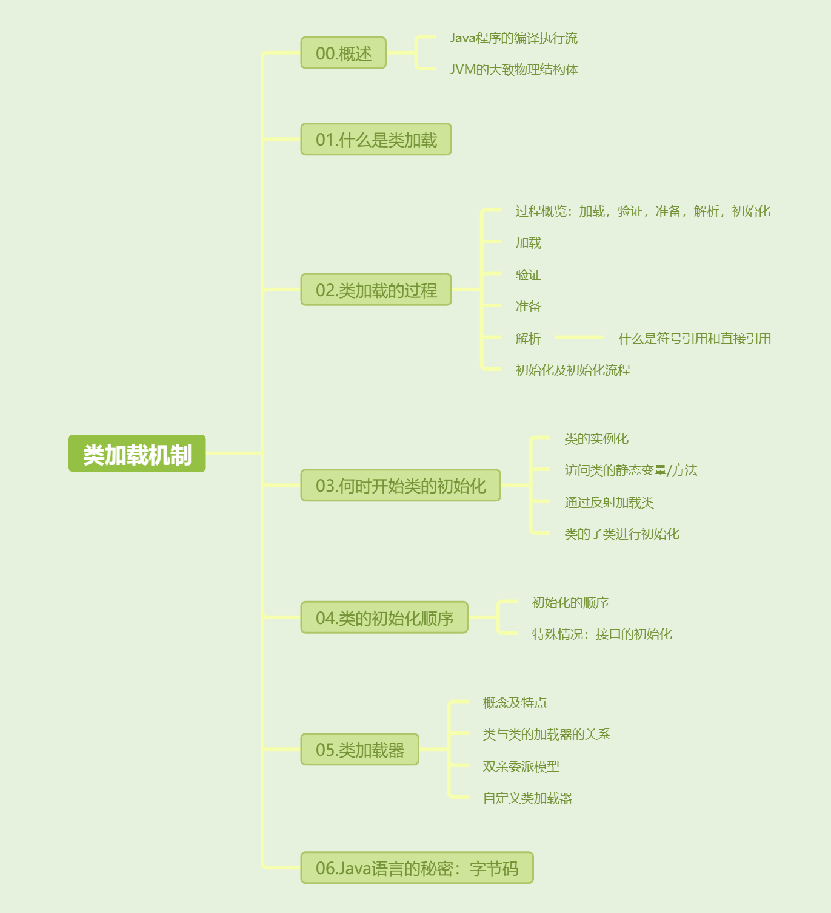
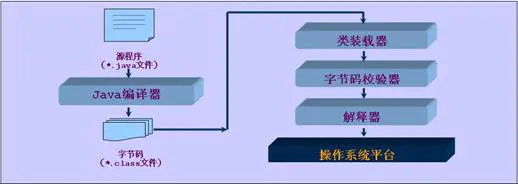
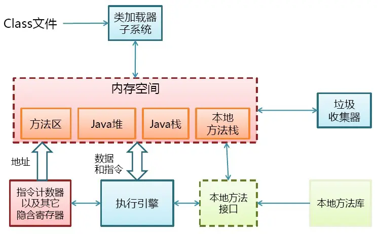
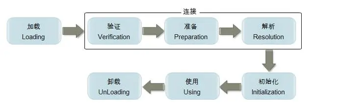

[toc]

提问： JAVA如何由代码变成运行中的程序。

什么是JAVA类的加载过程？

怎么理解JAVA的内存模型？



## 00. 概述

 先看一下java程序的执行流程图



再看一下jvm的大致物理结构图





本文将研究一下问题：

什么是类加载？类的加载过程（生命周期）？类什么时候初始化？类初始化顺序？类加载器、字节码等一系列问题。

## 01. 类加载概念

类加载本质上就是将静态的字节流形式的class文件从外部加载进JVM中，并转化为JVM中动态的Java运行时数据结构。加载完成后同时生成一份Class对象，用来提供访问方法区内的类相关数据结构的接口。


## 02. 类加载过程





类装载器就是寻找类的静态字节码文件，并构造出类在JVM内部表示的动态对象的组件。

在Java中，类的加载的生命周期如下：

Java的类加载过程按照**加载 -> 验证 -> 准备 -> 解析 -> 初始化 -> 使用 -> 卸载**的顺序进行。

- **加载**：通过类的全限定名找到字节码文件，并将类的字节码加载到内存中。
- **验证**：确保类文件的结构和内容合法，并符合Java虚拟机的安全标准。
- **准备**：为类的静态变量分配内存，并初始化为默认值（0, null, false等）。
- **解析**：将符号引用转换为直接引用（如物理内存地址指针或虚方法表指针等）。但是，在某些情况下，解析可以延迟到初始化之后进行，以支持动态绑定等运行时行为。
- **初始化**：执行类的静态初始化块和静态变量赋值操作，保证类处于可以使用的状态。

### **2.1 装载(加载)**

加载.class文件的方式有:

1). 从本地系统中直接加载 2). 通过网络下载.class文件 3). 从zip，jar等归档文件中加载.class文件 4). 从专有数据库中提取.class文件 5). 将Java源文件动态编译为.class文件

回头来再看jvm进行类加载阶段都做了什么。虚拟机需要完成以下三件事情：

1).通过一个类的全限定名称来获取此类的二进制字节码文件。

2).将这个字节流所代表的静态存储结构转化为方法区的运行时数据结构。

3).在java堆中生成一个代表这个类的java.lang.Class对象，作为方法区这些数据的访问入口。

**加载阶段完成后，虚拟机外部的 二进制字节流就按照虚拟机所需的格式存储在方法区之中，而且在Java堆中也创建一个java.lang.Class类的对象，这样便可以通过该对象访问方法区中的这些数据。**

### **2.2 验证**

验证的目的是为了确保Class文件中的字节流包含的信息符合当前虚拟机的要求，而且不会危害虚拟机自身的安全。

### **2.3 准备**

准备阶段是正式**为类变量分配内存并设置类变量初始值的阶段，这些内存都将在方法区中进行分配**。

 注意：

1）这时候进行内存分配的仅包括类变量（static），而不包括实例变量，实例变量会在对象实例化时随着对象一块分配在Java堆中。

2）这里所设置的初始值通常情况下是数据类型默认的零值（如0、0L、null、false等），而不是被在Java代码中被显式地赋予的值。

**怎么理解：方法区和元空间之间的关系？**

方法区是Java虚拟机（JVM）规范中定义的逻辑概念，是JVM内存模型的一部分。它的实现有两种方式：永久代和元空间。永久代使用JVM堆，有固定大小。元空间使用本地内存，不受JVM堆内存的限制。

### **2.4 解析**

解析阶段是虚拟机将常量池内的符号引用替换为直接引用的过程。

符号引用（Symbolic Reference）：符号引用以一组符号来描述所引用的目标。

直接引用（Direct Reference）：直接引用可以是直接指向目标的指针、相对偏移量或是一个能间接定位到目标的句柄。

解析阶段可以在初始化之前完成，也可以延迟到运行时，具体情况取决于引用的类型（静态、动态等）。

#### 1.什么是符号引用和直接引用 

**举例：** 假设我们有以下代码：

```java
public class SymbolReferenceExample {
    public void greet() {
        System.out.println("Hello from SymbolReferenceExample!");
    }

    public static void main(String[] args) {
        SymbolReferenceExample example = new SymbolReferenceExample();
        example.greet();
    }
}
```

可以通过 `javap` 工具查看 `.class` 文件中的符号引用信息，在输出中，你会看到类似以下内容的符号引用：

```
Method void greet()
  ...
  Code:
   0: getstatic     #2                  // Field java/lang/System.out:Ljava/io/PrintStream;
   3: ldc           #3                  // String Hello from SymbolReferenceExample!
   5: invokevirtual #4                  // Method java/io/PrintStream.println:(Ljava/lang/String;)V
   8: return
```

这里的 `getstatic #2` 和 `invokevirtual #4` 就是对符号引用的使用，分别对应 `System.out` 和 `println` 方法的符号引用。

在上述`System.out.println()`方法中，当JVM解析该符号引用时，会将其转换为指向方法代码的内存地址，类似于：

```java
0x7ffee4c5a6b0  // 假设这是 System.out.println() 方法在内存中的地址
```

一旦解析完成，后续对`System.out.println()`的调用将直接使用这个内存地址，而不再使用符号引用。

### **2.5 初始化**

这个阶段的任务是**执行类中的静态初始化代码**，包括静态变量的赋值和静态代码块（`static` 块）的执行。

该阶段是 Java 类加载过程中唯一一个真正执行 Java 代码的阶段。在这个阶段，JVM会根据类的字节码执行一系列的静态初始化操作。具体包括：

1. **静态变量赋值**：初始化类中的静态变量，将它们赋值为用户定义的值，而不是默认的零值或 `null`。
2. **静态代码块执行**：执行类中的静态代码块。静态代码块通常用于执行一次性的初始化任务，诸如静态资源的加载、数据表的预处理等操作。
3. **类构造器 `<clinit>()` 方法的执行**：静态变量的初始化和静态代码块的执行顺序是由编译器将它们合并到一个特殊的方法 `<clinit>()` 中，并按照它们在代码中出现的顺序依次执行。

## 03. 何时开始类的初始化

类的初始化通常在以下几种情况下被触发：

1. **类的实例化**：当程序首次创建类的实例时（通过 `new` 关键字），类会被初始化。

   ```java
   Example example = new Example();  // 触发类的初始化
   ```

2. **访问静态变量**：当类的静态变量首次被访问时，JVM 会触发类的初始化。

   ```java
   int value = Example.a;  // 触发类的初始化
   ```

3. **调用静态方法**：当类的静态方法被调用时，会触发类的初始化。

   ```java
   Example.someStaticMethod();  // 触发类的初始化
   ```

4. **通过反射加载类时**：使用反射 API（如 `Class.forName("Example")`）加载类时，会触发类的初始化。

   ```java
   Class<?> clazz = Class.forName("Example");  // 触发类的初始化
   ```

5. **类的子类进行初始化**：如果子类初始化时，父类尚未初始化，则会先触发父类的初始化。

   ```java
   class Child extends Example {}
   Child child = new Child();  // 会先初始化父类 Example
   ```

## 04. 类的初始化顺序

### 4.1 初始化的顺序

初始化的顺序可以分为以下几个步骤：

1. **父类静态成员变量和静态代码块**：在子类初始化之前，父类的静态成员和静态代码块会优先执行。
2. **子类静态成员变量和静态代码块**：在父类静态成员和静态代码块初始化之后，子类的静态成员和静态代码块会执行。
3. **父类实例成员变量和实例代码块**：父类的实例成员和实例代码块初始化会在父类构造方法之前执行。
4. **父类构造方法**：父类实例成员和实例代码块初始化完成后，父类的构造方法会被调用。
5. **子类实例成员变量和实例代码块**：在子类实例成员和实例代码块初始化之后，子类构造方法会执行。
6. **子类构造方法**：最后，子类的构造方法会被执行。

**提问：创建一个子类实例的时候，同时会创建一个父类实例吗？不然为什么会有父类的实例变量和代码块执行？**

很简单啊，子类实例继承了父类的所有成员（变量和方法），并且需要通过父类的构造器来初始化继承自父类的部分。因此，子类对象中包含了父类的部分，但这部分内容是通过调用父类构造器来初始化的，而不是创建一个独立的父类对象。

### 4.2  特殊情况：接口初始化

接口不会有实例化过程，因此接口没有实例成员变量，实例代码块，构造方法等。但是接口可以有静态变量，静态方法等。**接口的初始化只在首次使用静态成员（如静态变量或静态方法）时触发。而且，接口的静态初始化不会触发其父接口的静态初始化，除非父接口的静态成员也被使用。**

## 05. 类加载器

在Java中，**类加载器**（ClassLoader）是负责将类的字节码加载到JVM中的组件。类加载器的职责是根据类的全限定名来定位类文件，然后将其转换为JVM可以理解的类对象（`Class`对象）。

Java中的类加载器有以下几个核心点：

1. **唯一性**：一个类的唯一性是由类加载器和类名共同决定的，即使两个类的字节码完全相同，如果它们是由不同的类加载器加载的，它们在JVM中也是不同的类。
2. **双亲委派模型**：Java类加载器通常采用双亲委派模型，确保基础类的全局唯一性。双亲委派模型通过逐级向上委托类加载任务，确保基础类（如`java.lang.Object`）只会由顶层的类加载器加载一次。

### 5.1 类与类加载器的关系

每个类都由某个类加载器加载，并且类的唯一性是由**类名**与**类加载器**共同决定的。**因此，即使两个类的字节码完全相同，如果它们由不同的类加载器加载，它们也被视为不同的类**。

### 5.2 双亲委派模型

**双亲委派模型**是一种类加载机制，它保证了类加载的有序性和安全性。具体来说，每个类加载器在加载类时，都会首先把类加载请求委托给它的父类加载器，只有当父类加载器无法找到目标类时，子类加载器才会尝试自己去加载。

- **启动类加载器（Bootstrap ClassLoader）**：负责加载核心类库（例如 `java.lang.String`、`java.lang.System` 等类），用C++实现，不在Java层面直接可见。
- **扩展类加载器（Extension ClassLoader）**：负责加载扩展库（如`lib/ext`目录下的类）。
- **应用程序类加载器（Application ClassLoader）**：负责加载应用的类路径（`classpath`）中的类，也是程序默认使用的类加载器。可以通过 `ClassLoader.getSystemClassLoader()` 方法直接获取。

#### 1. 双亲委派模型的工作流程

假设应用程序类加载器要加载类`java.util.ArrayList`，它的工作流程如下：

1. 应用程序类加载器接到加载请求，首先将请求委派给它的父类加载器（扩展类加载器）。
2. 扩展类加载器将请求委派给它的父类加载器（启动类加载器）。
3. 启动类加载器负责加载核心类库，找到`java.util.ArrayList`后成功加载，并返回结果。
4. 如果启动类加载器无法找到类（例如应用程序特定的类），委派链会逐级返回，直到应用程序类加载器最终尝试自己加载。

这个模型确保了基础类（如`Object`类）只会被顶层加载器加载一次，避免类冲突问题。

#### 2. 代码实现的双亲委派逻辑

双亲委派模型通过`ClassLoader`类的`loadClass()`方法实现。

```java
protected synchronized Class<?> loadClass(String name, boolean resolve) throws ClassNotFoundException {
    // 检查类是否已经被加载
    Class<?> c = findLoadedClass(name);
    if (c == null) {
        try {
            if (parent != null) {
                // 委派给父类加载器加载
                c = parent.loadClass(name, false);
            } else {
                // 启动类加载器
                c = findBootstrapClass0(name);
            }
        } catch (ClassNotFoundException e) {
            // 如果父加载器无法加载，尝试自己加载
            c = findClass(name);
        }
    }
    if (resolve) {
        resolveClass(c);
    }
    return c;
}
```

在这个过程中，类加载器首先会委托给父类加载器，只有在父类加载器无法加载时才会尝试自己加载类。

### 5.3 自定义类加载器

在某些场景下，开发者可能需要自定义类加载器，例如用于加载加密的类文件、动态加载模块、实现热部署等。自定义类加载器需要继承`java.lang.ClassLoader`并重写`findClass()`方法来实现类的加载逻辑。

#### 1. 自定义类加载器的示例

```java
public class MyClassLoader extends ClassLoader {
    private String classPath;

    public MyClassLoader(String classPath) {
        this.classPath = classPath;
    }

    @Override
    protected Class<?> findClass(String name) throws ClassNotFoundException {
        byte[] classData = loadClassData(name);
        if (classData == null) {
            throw new ClassNotFoundException();
        }
        return defineClass(name, classData, 0, classData.length);
    }

    private byte[] loadClassData(String className) {
        String fileName = classPath + className.replace(".", "/") + ".class";
        try {
            FileInputStream fis = new FileInputStream(fileName);
            ByteArrayOutputStream baos = new ByteArrayOutputStream();
            int b = 0;
            while ((b = fis.read()) != -1) {
                baos.write(b);
            }
            return baos.toByteArray();
        } catch (IOException e) {
            e.printStackTrace();
            return null;
        }
    }
}
```

在上面的代码中，自定义类加载器从指定的路径中读取`.class`文件，将其转换为字节数组，然后通过`defineClass()`方法将其定义为Java类。

## 06. Java语言的秘密：字节码

ok，回到最开始的问题，Java号称是一门“一次编译到处运行”的语言，其到底是如何实现的呢？

1. 我们写的java文件到通过编译器编译成java字节码文件（也就是.class文件），这个过程是java编译过程；
2. 而我们的java虚拟机执行的就是字节码文件。不论该字节码文件来自何方，由哪种编译器编译，甚至是手写字节码文件，只要符合java虚拟机的规范，那么它就能够执行该字节码文件。
3. 执行字节码文件在不同平台上翻译成对应平台的机器语言。

上面三个步骤就实现了Java的一次编译，到处执行。关键点在于：编译形成的统一标准的字节码文件，以及解释器将字节码文件解释为对应平台的语言。