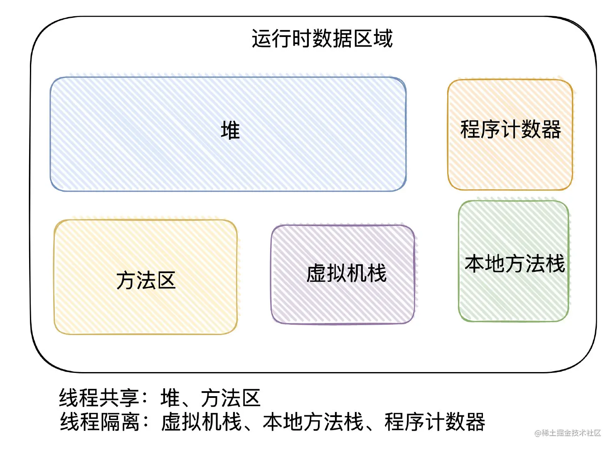
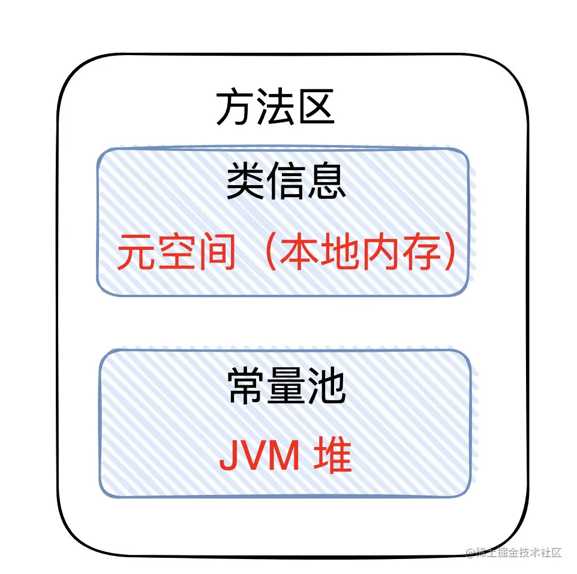

[toc]


## 01. 概览

JVM的内存结构，往往指的就是JVM定义的「运行时数据区域」

简单来说就分为了5大块：方法区、堆、程序计数器、虚拟机栈、本地方法栈

要值得注意的是：这是JVM「规范」的分区概念，到具体的实现落地，不同的厂商实现可能是有所区别的。



## 02. 详细介绍

### 2.1程序计数器

程序计数器就是用于保存当前正常执行的程序的内存地址的数据结构，每个线程创建时都会有属于自己的程序计数器

程序计数器主要有两个作用：

- 1.字节码解释器通过改变程序计数器来依次读取指令，从而实现代码的流程控制。如：顺序执行、选择、循环、异常处理。
- 2.在多线程的情况下，程序计数器用于记录当前线程执行的位置，从而当线程被切换回来的时候能够知道该线程上次运行到哪儿。

程序计数器会OOM吗

- **注意：程序计数器是唯一一个不会出现OutOfMemoryError的内存区域，因为它要存储的数据量很小，就是一个地址而已。**

### 2.2虚拟机栈

Java 虚拟机栈是描述 Java 方法运行过程的内存模型。

每个线程在创建的时候都会创建一个「虚拟机栈」，每次方法调用都会创建一个「栈帧」。每个「栈帧」会包含几块内容：局部变量表、操作数栈、动态连接和返回地址


#### 1. 局部变量表

- 定义为一个数组，用于存储方法参数、定义在方法体内部的局部变量，数据类型包括各类基本数据类型，对象引用（reference类型，它不同于对象本身，可能是一个指向对象起始地址的引用指针，也可能是指向一个代表对象的句柄或其他与此对象相关的位置），以及 return address 类型。

- 局部变量表容量大小是在编译期确定下来的。最基本的存储单元是 slot，32 位占用一个 slot，64 位类型（long 和 double）占用两个 slot。

#### 2.操作数栈

- 用于存放程序执行过程中用于计算、操作、或传递的具体数据值。比如 a + b，这里面a和b的值就是实际的操作数。
- 栈顶缓存技术：由于操作数是存储在内存中，频繁的进行内存读写操作影响执行速度，将栈顶元素全部缓存到物理 CPU 的寄存器中，以此降低对内存的读写次数，提升执行引擎的执行效率。

#### 3.动态链接

当你在 Java 代码中调用方法或访问字段时，编译器会将其编译为符号引用。（符号引用是对方法或字段的一种抽象描述，不会直接指向实际的内存地址。）

在方法执行过程中，JVM 会根据具体的对象类型或者调用时的上下文，动态地将符号引用解析为实际引用（也就是具体的方法或字段的内存地址）。

举例：

```java
class Parent {
    void sayHello() {
        System.out.println("Hello from Parent");
    }
}

class Child extends Parent {
    @Override
    void sayHello() {
        System.out.println("Hello from Child");
    }
}

Parent obj = new Child();
obj.sayHello();  // 动态链接解析，实际调用Child类的sayHello

```

在编译期，`obj.sayHello()` 是一个符号引用，指向 `Parent` 类中的 `sayHello()` 方法。到运行期，JVM 会根据实际对象的类型（`Child`），动态解析这个方法调用，实际执行 `Child` 类中的 `sayHello()` 方法。

#### 4.方法返回值

保存方法执行的结果值，以及方法执行完毕后返回的位置

#### 5.异常

Java 虚拟机栈会出现两种异常：StackOverFlowError 和 OutOfMemoryError。

- **StackOverFlowError：** 若Java虚拟机栈的内存大小不允许动态扩展，那么当线程请求栈的深度超过当前Java虚拟机栈的最大深度的时候，就抛出StackOverFlowError异常。
- **OutOfMemoryError：** 若Java虚拟机栈的内存大小允许动态扩展，且当线程请求栈时内存用完了，无法再动态扩展了，此时抛出OutOfMemoryError异常。


### 2.3本地方法栈

跟虚拟机栈很像， **虚拟机栈为虚拟机执行 Java 方法 （也就是字节码）服务，而本地方法栈则为虚拟机使用到的 Native 方法服务。**

### 2.4方法区

「方法区」是 JVM 中规范的一部分。

方法区有两种实现方法，一个是堆中的永久代，另一个是物理内存中的元空间。


**提问：为什么把方法区的实现从永久代变成元空间**

最主要的区别就是：「元空间」存储不在虚拟机中，而是使用本地内存，JVM 不会再出现方法区的内存溢出，以往「永久代」经常因为内存不够用导致跑出OOM异常。


方法区主要是用来存放已被虚拟机加载的「类相关信息」：包括类信息、常量池


**类信息**又包括了类的版本、字段、方法、接口和父类等信息。

**常量池**又可以分「静态常量池」和「运行时常量池」

**静态常量池**是在编译时存储在Class文件中的，它是Java类文件的一部分。它主要存储符号引用和字面量，并且它不会在运行时直接被使用。

- **字面量**：编译时可确定的常量，例如字符串、整数、浮点数等。
- **符号引用**：指向类、接口、字段和方法的引用，这些引用在编译时是符号形式的，还未解析为实际内存地址。

**运行时常量池**是在类被加载时，从静态常量池中读取并解析而来。它包含运行时生成的直接引用（如指向具体类、方法或字段的内存地址）以及字面量。

在类加载的解析阶段，静态常量池中的符号引用会被解析为直接引用（如内存地址、偏移量等），并存储在运行时常量池中。


逻辑上常量池属于方法区，但是物理存储上，「运行时常量池」和「静态常量池」在「堆」内存中进行存储。而类信息存放在元空间中

### 2.5堆

「堆」是线程共享的区域，此内存区域的唯一目的就是存放对象实例，对象实例几乎都在这分配内存。在虚拟机启动时创建。

「堆」被划分为「新生代」和「老年代」，「新生代」又被进一步划分为 Eden 和 Survivor 区，最后 Survivor 由 From Survivor 和 To Survivor 组成


在 JDK 1.8中移除整个永久代，取而代之的是一个叫元空间（Metaspace）的区域（永久代使用的是JVM的堆内存空间，而元空间使用的是物理内存，直接受到本机的物理内存限制）。

将「堆内存」分开了几块区域，主要跟「内存回收」有关（垃圾回收机制）


## 03：**JVM内存结构和Java内存模型有啥区别？**

他们俩没有啥直接关联，其实两次面试过后，应该你就有感觉了

Java内存模型是跟「并发」相关的，它是为了屏蔽底层细节而提出的规范，希望在上层(Java层面上)在操作内存时在不同的平台上也有相同的效果

JVM内存结构（又称为运行时数据区域），它描述着当我们的class文件加载至虚拟机后，各个分区的「逻辑结构」是如何的，每个分区承担着什么作用。。


## 04.实际案例

我们将以一个案例来理解Java内存结构，并讲解

```
//JVM 启动时将 Person.class 放入方法区
public class Person {

{


}

static {

}
    //静态变量，直接放到常量池中
    public static final String number = "13667225184";
    
	//new Person 创建实例后，name 引用放入堆区，name 对象放入常量池
    private String name;

	//new Person 创建实例后，age = 0 放入堆区
    private int age;

	//Person 方法放入方法区，方法内代码作为 Code 属性放入方法区
    public Person(String name, int age) {
        this.name = name;
        this.age = age;
    }

	//toString 方法放入方法区，方法内代码作为 Code 属性放入方法区
    @Override
    public String toString() {
        return "Person{" + "name='" + name + '\'' + ", age=" + age + '}';
    }
}

//JVM 启动时将 Test.class 放入方法区
public class Test {

	//main 方法放入方法区，方法内代码作为 Code 属性放入方法区
    public static void main(String[] args) {
        //局部变量，定义的一些基本类型的变量和对象的引用变量都是在函数的栈(本地方法栈)内存中分配
        String name1 = "张三";
        int age1 = 18;

        //person1 是引用放入虚拟机栈区，new 关键字开辟堆内存 Person 自定义对象放入堆区
        //堆内存用于存放所有由new创建的对象（内容包括该对象其中的所有成员变量）和数组。
        Person person1 = new Person(name1, age1);
        Person person2 = new Person("李四", 20);

        //通过 person 引用创建 toString() 方法栈帧
        person1.toString();
        person2.toString();
    }

    private void clear(){
        //对象设置为null，回收
        person1 = null;
        person2 = null;
    }
}
```

