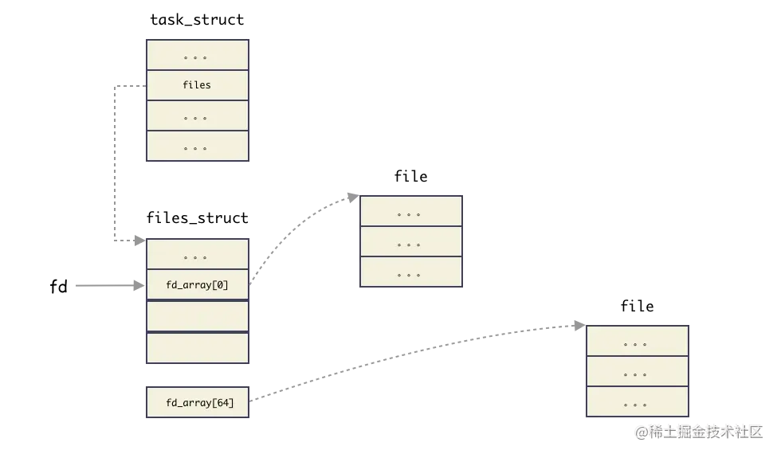
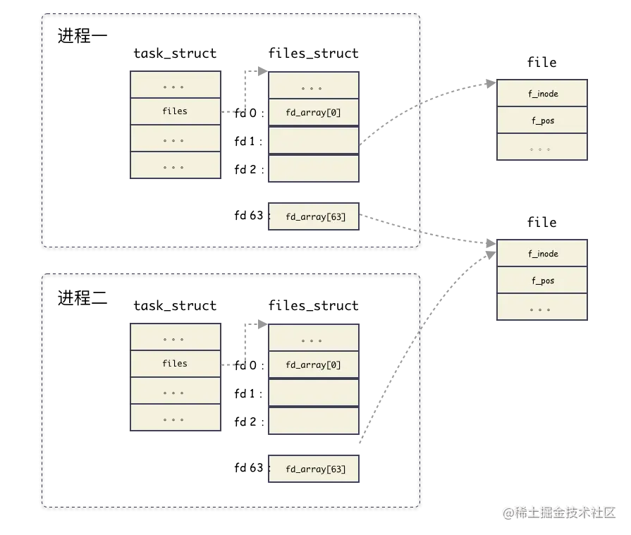
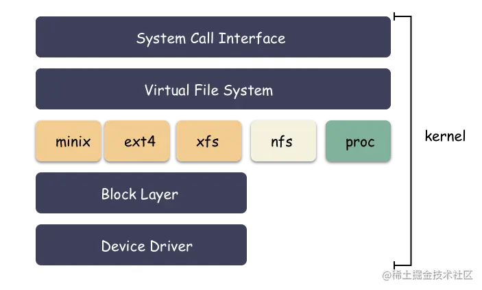
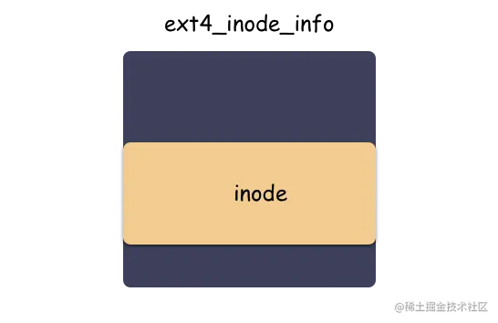
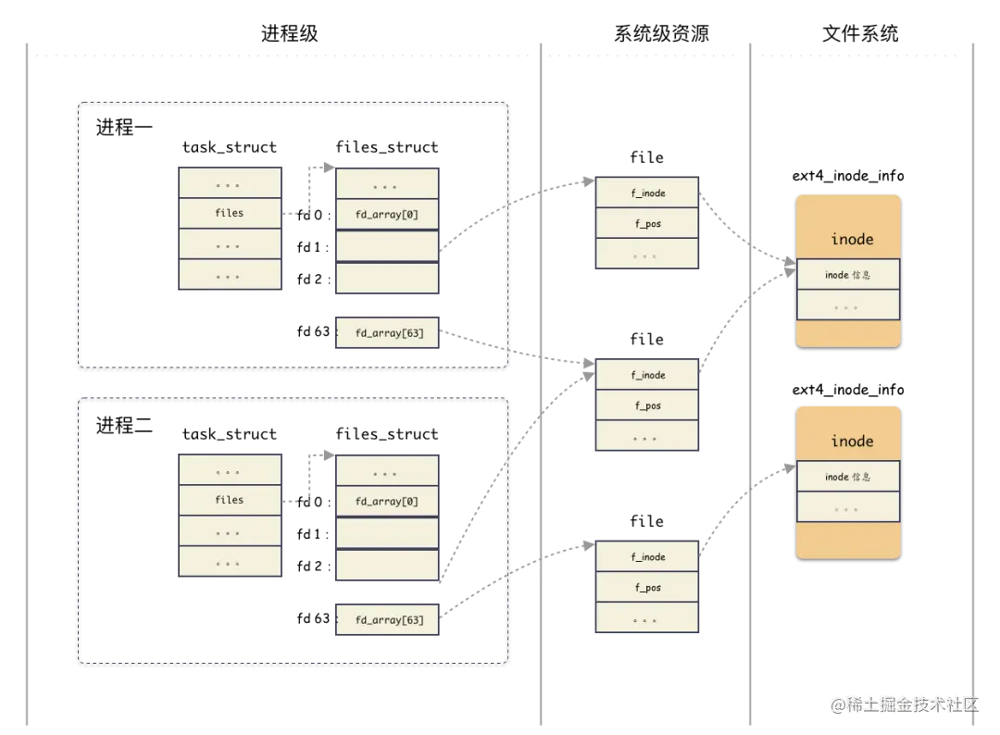

[toc]

## 01. `fd` 是什么？

`fd` 是 `File descriptor` 的缩写，中文名叫做：**文件描述符**。**文件描述符**是一个非负整数，**本质上是一个索引值**（这句话非常重要）。

**什么时候拿到的 `fd` ？**

当打开一个文件时，内核向进程返回一个文件描述符（ `open` 系统调用得到 ），后续 `read`、`write` 这个文件时，则只需要用这个**文件描述符**来标识该文件，将其作为参数传入 `read`、`write` 。


## 02. 窥探 Linux 内核

`fd` 究竟是什么？必须去 Linux 内核看一眼。

用户使用系统调用 `open` 或者 `creat` 来打开或创建一个文件，用户态得到的结果值就是 `fd` ，后续的 `IO` 操作全都是用 `fd` 来标识这个文件，可想而知内核做的操作并不简单，我们接下来就是要揭开这层面纱。

### 2.1 `task_struct`

首先，我们知道进程的抽象是基于 `struct task_struct` 结构体，这是 Linux 里面最复杂的结构体之一 ，成员字段非常多，我们今天不需要详解这个结构体，我稍微简化一下，只提取我们今天需要理解的字段如下：

```c
struct task_struct {
    // ...
    /* Open file information: */
    struct files_struct     *files;
    // ...
}
```

**`files;` 这个字段就是今天的主角之一**，`files` 是一个指针，指向一个为 `struct files_struct` 的结构体。这个结构体就是用来管理该进程**打开的所有文件**的管理结构。

**重点理解一个概念：**

**`struct task_struct` 是进程的抽象封装**，标识一个进程，在 Linux 里面的进程各种抽象视角，都是这个结构体给到你的。当创建一个进程，其实也就是 `new` 一个 `struct task_struct` 出来；

### 2.2 `files_struct`

好，上面通过进程结构体引出了 `struct files_struct` 这个结构体。**这个结构体管理某进程打开的所有文件的管理结构**，这个结构体本身是比较简单的：

```c
/*
 * Open file table structure
 */
struct files_struct {
    // 读相关字段
    atomic_t count;
    bool resize_in_progress;
    wait_queue_head_t resize_wait;

    // 打开的文件管理结构
    struct fdtable __rcu *fdt;
    struct fdtable fdtab;

    // 写相关字段
    unsigned int next_fd;
    unsigned long close_on_exec_init[1];
    unsigned long open_fds_init[1];
    unsigned long full_fds_bits_init[1];
    struct file * fd_array[NR_OPEN_DEFAULT];
};
```

`files_struct` 这个结构体我们说是用来管理所有打开的文件的。怎么管理？本质上就是数组管理的方式，所有打开的文件结构都在一个数组里。这可能会让你疑惑，数组在那里？有两个地方：

1. `struct file * fd_array[NR_OPEN_DEFAULT]` 是一个静态数组，随着 `files_struct` 结构体分配出来的，在 64 位系统上，静态数组大小为 64；
2. `struct fdtable` 也是个数组管理结构，只不过这个是一个动态数组，数组边界是用字段描述的；

**思考：为什么会有这种静态 + 动态的方式？**

性能和资源的权衡 ！大部分进程只会打开少量的文件，所以静态数组就够了，这样就不用另外分配内存。如果超过了静态数组的阈值，那么就动态扩展。

可以回忆下，这个是不是跟 `inode` 的直接索引，一级索引的优化思路类似。

#### 1.  `fdtable`

简单介绍下 `fdtable` 结构体，这个结构体就是封装用来管理 `fd` 的结构体，`fd` 的秘密就在这个里面。简化结构体如下：

```c
struct fdtable {
    unsigned int max_fds;
    struct file __rcu **fd;      /* current fd array */
};
```

注意到 `fdtable.fd` 这个字段是一个二级指针，什么意思？

就是指向 `fdtable.fd` 是一个指针字段，指向的内存地址还是存储指针的（元素指针类型为  `struct file *` ）。换句话说，`fdtable.fd` 指向一个数组，数组元素为指针（指针类型为 `struct file *`）。

其中 `max_fds` 指明数组边界。

#### 2.  `files_struct` 小结

`file_struct` 本质上是用来管理所有打开的文件的，内部的核心是由一个**静态数组**和**动态数组**管理结构实现。

**还记得上面我们说文件描述符 `fd` 本质上就是索引吗？这里就把概念接上了，`fd` 就是这个数组的索引，也就是数组的槽位编号而已。** 通过非负数 `fd` 就能拿到对应的 `struct file` 结构体的地址。

我们把概念串起来（注意，这里为了突出 `fd` 的本质,把 `fdtable` 管理简化掉）：



- `fd` 真的就是 `files` 这个字段指向的指针数组的索引而已（仅此而已）。通过 `fd` 能够找到对应文件的 `struct file` 结构体；

### 2.3 `file`

现在我们知道了 `fd` 本质是数组索引，数组元素是 `struct file` 结构体的指针。那么这里就引出了一个 `struct file` 的结构体。这个结构体又是用来干什么的呢？

这个结构体是用来表征进程打开的文件的。简化结构如下：

```c
struct file {
    // ...
    struct path                     f_path;
    struct inode                    *f_inode;
    const struct file_operations    *f_op;

    atomic_long_t                    f_count;
    unsigned int                     f_flags;
    fmode_t                          f_mode;
    struct mutex                     f_pos_lock;
    loff_t                           f_pos;
    struct fown_struct               f_owner;
    // ...
}
```

这个结构体非常重要，它标识一个进程打开的文件，下面解释 IO 相关的几个最重要的字段：

- `f_path` ：标识文件名
- `f_inode` ：非常重要的一个字段，`inode` 这个是 vfs 的 `inode` 类型，是基于具体文件系统之上的抽象封装；
- `f_pos` ： 这个字段非常重要，偏移，对，**就是当前文件偏移**。还记得上一篇 IO 基础里也提过偏移对吧，指的就是这个，`f_pos` 在 `open` 的时候会设置成默认值，`seek` 的时候可以更改，从而影响到 `write/read` 的位置；

#### 思考问题

**思考问题一：`files_struct` 结构体只会属于一个进程，那么`struct file` 这个结构体呢，是只会属于某一个进程？还是可能被多个进程共享？**

**划重点：`struct file` 是属于系统级别的结构，换句话说是可以共享与多个不同的进程。**

**思考问题二：什么时候会出现多个进程的  `fd`  指向同一个 `file`  结构体？**

比如 `fork`  的时候，父进程打开了文件，后面 `fork` 出一个子进程。这种情况就会出现共享 `file` 的场景。如图：



**思考问题三：在同一个进程中，多个 `fd` 可能指向同一个 file 结构吗？**

可以。`dup`  函数就是做这个的。

```c
#include <unistd.h>
int dup(int oldfd);
int dup2(int oldfd, int newfd);
```

### 2.4 inode

我们看到 `struct file` 结构体里面有一个 inode 的指针，也就自然引出了 inode 的概念。这个指向的 inode 并没有直接指向具体文件系统的 inode ，而是操作系统抽象出来的一层虚拟文件系统，叫做 **VFS （ Virtual File System ）**，然后在 VFS 之下才是真正的文件系统，比如 ext4 之类的。

`inode` 是 Linux 文件系统中的一个核心数据结构，负责存储与文件相关的元数据（如文件大小、权限、时间戳等），但不包括文件名和文件内容本身。文件名与 `inode` 之间的映射通过目录项（`dentry`）来管理。

完整架构图如下：



**思考：为什么会有这一层封装呢？**

其实很容里理解，就是解耦。如果让 `struct file` 直接和 `struct ext4_inode` 这样的文件系统对接，那么会导致 `struct file` 的处理逻辑非常复杂，因为每对接一个具体的文件系统，就要考虑一种实现。所以操作系统必须把底下文件系统屏蔽掉，对外提供统一的 `inode` 概念，对下定义好接口进行**回调注册**。这样让 `inode` 的概念得以统一，Unix 一切皆文件的基础就来源于此。

VFS 层的 `inode` 是所有文件系统的统一接口，定义了文件系统的共性。而具体文件系统（如 ext4、xfs 等）会扩展 VFS 层的 `inode`，并将自己特有的字段和实现附加到扩展的 `inode` 中。

再来看一样 VFS 的 `inode` 的结构：

```c
struct inode {
    // 文件相关的基本信息（权限，模式，uid，gid等）
    umode_t             i_mode;
    unsigned short      i_opflags;
    kuid_t              i_uid;
    kgid_t              i_gid;
    unsigned int        i_flags;
    // 回调函数
    const struct inode_operations   *i_op;
    struct super_block              *i_sb;
    struct address_space            *i_mapping;
    // 文件大小，atime，ctime，mtime等
    loff_t              i_size;
    struct timespec64   i_atime;
    struct timespec64   i_mtime;
    struct timespec64   i_ctime;
    // 回调函数
    const struct file_operations    *i_fop;
    struct address_space            i_data;
    // 指向后端具体文件系统的特殊数据
    void    *i_private;     /* fs or device private pointer */
};
```

其中包括了一些基本的文件信息，包括 uid，gid，大小，模式，类型，时间等等。

一个 vfs 和 后端具体文件系统的纽带：`i_private` 字段。**用来传递一些具体文件系统使用的数据结构。

至于 `i_op` 回调函数在构造 `inode` 的时候，就注册成了后端的文件系统函数，比如 ext4 等等。

**思考问题：通用的 VFS 层，定义了所有文件系统通用的 inode，叫做 vfs inode，而后端文件系统也有自身特殊的 inode 格式，该格式是在 vfs inode 之上进行扩展的，怎么通过 vfs inode 怎么得到具体文件系统的 inode 呢？**

下面以 ext4 文件系统举例（因为所有的文件系统套路一样），ext4 的 inode 类型是 `struct ext4_inode_info` 。

**划重点**：方法其实很简单，这个是属于 c 语言一种常见的（也是特有）编程手法：强转类型。**vfs inode 出生就和 `ext4_inode_info` 结构体分配在一起的，直接通过 vfs inode 结构体的地址强转类型就能得到 `ext4_inode_info` 结构体**。

```c
struct ext4_inode_info {
    // ext4 inode 特色字段
    // ...
    
    // 重要！！！
    struct inode    vfs_inode;  
};
```

举个例子，现已知 inode 地址和 vfs_inode 字段的内偏移如下：

- inode 的地址为 0xa89be0；
- `ext4_inode_info` 里有个内嵌字段 vfs_inode，类型为 `struct inode` ，该字段在结构体内偏移为 64 字节；

则可以得到：

`ext4_inode_info` 的地址为

```c
(struct ext4_inode_info *)(0xa89be0 - 64)
```

强转方法使用了一个叫做 `container_of` 的宏，如下：

```c
// 强转函数
static inline struct ext4_inode_info *EXT4_I(struct inode *inode)
{
   return container_of(inode, struct ext4_inode_info, vfs_inode);
}

// 强转实际封装
#define container_of(ptr, type, member) \
    (type *)((char *)(ptr) - (char *) &((type *)0)->member)
#endif
```

所以，你懂了吗？

分配 inode 的时候，其实分配的是 `ext4_inode_info` 结构体，包含了 vfs inode，然后对外给出去 vfs_inode 字段的地址即可。VFS 层拿 inode 的地址使用，底下文件系统强转类型后，取外层的 inode 地址使用。

举个 ext4 文件系统的例子：

```c
static struct inode *ext4_alloc_inode(struct super_block *sb)
{
    struct ext4_inode_info *ei;

    // 内存分配，分配 ext4_inode_info 的地址
    ei = kmem_cache_alloc(ext4_inode_cachep, GFP_NOFS);

    // ext4_inode_info 结构体初始化

    // 返回 vfs_inode 字段的地址
    return &ei->vfs_inode;
}
```

vfs 拿到的就是这个 inode 地址。



**划重点：inode 的内存由后端文件系统分配，vfs inode 结构体内嵌在不同的文件系统的 inode 之中。不同的层次用不同的地址，ext4 文件系统用 `ext4_inode_info` 的结构体的地址，vfs 层用 `ext4_inode_info.vfs_inode` 字段的地址。**

这种用法在 C 语言编程中很常见，算是 C 的特色了（仔细想想，这种用法和**面向对象的多态**的实现异曲同工）。

**思考问题：怎么理解 vfs `inode` 和 `ext2_inode_info`，`ext4_inode_info` 等结构体的区别？**

所有文件系统共性的东西抽象到 vfs `inode` ，不同文件系统差异的东西放在各自的 `inode` 结构体中。

### 2.5 小结梳理

当用户打开一个文件，用户只得到了一个 `fd` 句柄，但内核做了很多事情，梳理下来，我们得到几个关键的数据结构，这几个数据结构是有层次递进关系的，我们简单梳理下：

1. 进程结构 `task_struct` ：表征进程实体，每一个进程都和一个 `task_struct` 结构体对应，其中 `task_struct.files` 指向一个管理打开文件的结构体 `fiels_struct` ；
2. 文件表项管理结构 `files_struct` ：用于管理进程打开的 open 文件列表，内部以数组的方式实现（静态数组和动态数组结合）。返回给用户的 `fd` 就是这个数组的**编号索引**而已，索引元素为 `file` 结构；
   - `files_struct` 只从属于某进程；
3. 文件 `file` 结构：表征一个打开的文件，内部包含关键的字段有：**当前文件偏移，inode 结构地址**；
   - 该结构虽然由进程触发创建，但是 `file`  结构可以在进程间共享；
4. vfs `inode` 结构体：文件 `file` 结构指向 的是 vfs 的 `inode` ，这个是操作系统抽象出来的一层，用于屏蔽后端各种各样的文件系统的 `inode` 差异；
   - inode 这个具体进程无关，是文件系统级别的资源；
5. ext4 `inode` 结构体（指代具体文件系统 inode ）：后端文件系统的 `inode` 结构，不同文件系统自定义的结构体，ext2 有 `ext2_inode_info`，ext4 有`ext4_inode_info`，minix 有 `minix_inode_info`，这些结构里都是内嵌了一个 vfs `inode` 结构体，原理相同；

**完整的架构图：**



### 思考实验

现在我们已经彻底了解 fd 这个所谓的非负整数代表的深层含义了，我们可以准备一些 IO 的思考举一反三。

文件读写（ IO ）的时候会发生什么？

- 在完成 write 操作后，在文件 `file`  中的当前文件偏移量会增加所写入的字节数，如果这导致当前文件偏移量超处了当前文件长度，则会把 inode 的当前长度设置为当前文件偏移量（也就是文件变长）
- `O_APPEND`  标志打开一个文件，则相应的标识会被设置到文件 `file`  状态的标识中，每次对这种具有追加写标识的文件执行 `write` 操作的时候，`file` 的当前文件偏移量首先会被设置成 `inode` 结构体中的文件长度，这就使得每次写入的数据都追加到文件的当前尾端处（该操作对用户态提供原子语义）；
- 若一个文件 `seek` 定位到文件当前的尾端，则 `file` 中的当前文件偏移量设置成 `inode` 的当前文件长度；
- `seek` 函数值修改 `file` 中的当前文件偏移量，不进行任何 `I/O` 操作；
- 每个进程对有它自己的 `file`，其中包含了当前文件偏移，当多个进程写同一个文件的时候，由于一个文件最终是落到全局唯一的一个 `inode` 上，这种并发场景则可能产生用户不可预期的结果；

## 03. 总结

**回到初心，理解 fd 的概念有什么用？**

一切 IO 的行为到系统层面都是以 `fd` 的形式进行。无论是 C/C++，Go，Python，JAVA 都是一样，任何语言都是一样，这cai是最本源的东西，理解了 `fd` 关联的一系列结构，你才能对 IO 游刃有余。

下面做个简要的总结：

1. 从姿势上来讲，用户 `open` 文件得到一个非负数句柄 `fd`，之后针对该文件的 IO 操作都是基于这个 `fd` ；
2. 文件描述符 `fd` 本质上来讲就是数组索引，`fd` 等于 5 ，那对应数组的第 5 个元素而已，该数组是进程打开的所有文件的数组，数组元素类型为 `struct file`；
3. 结构体 `task_struct` 对应一个抽象的进程，`files_struct` 是这个进程管理**该进程打开的文件**数组管理器。`fd` 则对应了这个数组的编号，每一个打开的文件用 `file` 结构体表示，内含当前偏移等信息；
4. `file` 结构体可以为进程间共享，属于系统级资源，同一个文件可能对应多个 `file` 结构体，`file` 内部有个 `inode` 指针，指向文件系统的 `inode`；
5. `inode` 是文件系统级别的概念，只由文件系统管理维护，不因进程改变（ `file` 是进程出发创建的，进程 `open` 同一个文件会导致多个 `file` ，指向同一个 `inode` ）；


## 04.补充：最终的写入过程是什么样的

最终文件的实际写入过程是通过调用磁盘驱动来完成的。文件从用户空间写入磁盘的完整过程涉及多个层次的操作，从高层次的系统调用到底层的硬件操作，具体包括以下几个步骤：

1. **用户空间发起写操作**

用户进程调用类似 `write()` 的系统调用来向文件写入数据。在这一层，用户进程并不知道底层的磁盘结构、文件系统和硬件驱动的细节。它只需要传递要写入的数据、文件描述符和数据的大小。

```c
ssize_t write(int fd, const void *buf, size_t count);
```

- **`fd`**：文件描述符，用于标识要写入的文件。
- **`buf`**：指向用户空间的缓冲区，包含要写入的数据。
- **`count`**：要写入的字节数。

2. **VFS 层处理**

当用户进程调用 `write()`，内核首先通过 **VFS（虚拟文件系统）** 接口处理这一操作。

- **文件描述符转换**：内核根据传入的文件描述符 `fd` 找到与之对应的 `file` 结构体。`file` 结构体包含了当前文件的状态信息，如当前文件偏移量、打开模式等。
- **inode 处理**：VFS 层通过文件的 `inode` 来识别具体文件的元数据信息，例如文件大小、权限、所属文件系统等。
- **数据写入流程传递给具体文件系统**：VFS 并不直接处理具体的 I/O 操作，而是调用文件系统特定的函数。比如在 ext4 文件系统上，VFS 会调用 ext4 文件系统的写入函数。

3. **具体文件系统处理（如 ext4）**

VFS 层通过回调函数将写入请求交给具体的文件系统（如 ext4、xfs、btrfs 等）处理。文件系统负责将数据从用户空间写入到文件系统管理的存储设备上。

在文件系统层，主要涉及以下几个操作：

- **文件偏移量更新**：文件系统根据当前文件偏移量将数据写入正确的位置，并更新文件的大小信息（如果写入数据超出文件当前大小，文件系统会扩展文件大小）。
- **块分配**：如果文件需要扩展，文件系统可能会为文件分配新的磁盘块。文件系统会在适当的物理位置分配新的块，并将其映射到文件的逻辑地址空间。
- **缓存机制**：为了提高写入性能，文件系统通常会将写入的数据暂时存储在内存中的 **页缓存（page cache）** 中，而不是立即写入磁盘。内核会在合适的时机（如内存不足、文件系统同步或显式调用 `fsync()`）将这些缓存的数据写入磁盘。

4. **页缓存与延迟写入**

**页缓存（page cache）** 是内核中用于缓存文件读写数据的一部分。写入操作时，文件数据通常会先写入页缓存中，而不会立即写入磁盘。这种方式被称为 **延迟写入**，它通过减少频繁的磁盘访问来提高性能。

- **延迟写入的好处**：由于磁盘 I/O 是非常慢的操作，将数据先写入缓存可以减少磁盘写入的次数，提升系统性能。
- **页缓存刷新**：当页缓存中的数据达到一定量，或者系统空闲时，内核会将缓存中的数据写入磁盘。用户进程也可以通过调用 `fsync()` 或 `sync()` 来强制将数据从缓存刷到磁盘，确保数据持久化。

5. **块设备层与请求队列**

当文件系统决定将缓存中的数据写入磁盘时，它会通过 **块设备层（block device layer）** 来管理磁盘的 I/O 操作。块设备层是 Linux 内核中用于管理磁盘等块设备的一部分，它负责将文件系统的逻辑块请求转换为实际的磁盘块操作。

**请求队列**

- **I/O 请求队列**：块设备层将文件系统的写请求组织成 **I/O 请求队列**，这些队列中的请求将被传递给底层磁盘驱动。
- **请求合并与优化**：块设备层会尝试优化 I/O 操作，比如合并相邻的 I/O 请求，以减少磁盘寻道时间和提高吞吐量。

6. **调用磁盘驱动**

最终，块设备层将 I/O 请求传递给具体的 **磁盘驱动程序**。磁盘驱动负责与硬件进行实际交互，将数据写入磁盘设备中。

- **磁盘驱动层**：磁盘驱动与硬件交互，负责将块设备层的写入请求转换为实际的磁盘操作。例如，在 SATA 硬盘上，驱动程序会发送适当的命令到磁盘控制器以进行读写操作。
- **硬盘控制器**：硬盘控制器根据驱动程序的指令，调整磁头和盘片的位置，将数据写入到指定的物理扇区中。

7. **磁盘上的数据存储**

磁盘设备会将写入的数据写入磁盘的物理存储介质中。不同的存储介质（如 HDD、SSD 等）有不同的工作原理：

- **HDD（硬盘驱动器）**：HDD 通过机械磁头将数据写入旋转的磁盘片上，写入的过程涉及磁头定位和扇区写入。HDD 的寻道时间较长，因此会尝试优化写入请求以减少磁头移动。
- **SSD（固态硬盘）**：SSD 没有机械部件，数据直接写入闪存芯片。与 HDD 不同，SSD 的写入是基于闪存块操作，写入速度较快，但可能涉及垃圾回收和磨损均衡等操作。

8. **写入操作的完成与反馈**

当磁盘驱动完成实际的数据写入后，它会向块设备层返回一个成功或失败的结果。块设备层将这个结果传递给文件系统层，文件系统层则更新对应的 `inode` 信息（如文件大小、修改时间等）。最终，操作系统会将写入结果反馈给用户进程。

**总结的流程：**

1. **用户进程发起 `write()` 系统调用**。
2. **VFS 层通过 inode 查找具体文件系统并传递写入请求**。
3. **具体文件系统处理文件元数据和块分配，数据通常写入内存页缓存**。
4. **页缓存数据被延迟写入磁盘，块设备层管理 I/O 请求队列**。
5. **块设备层将写入请求传递给磁盘驱动**。
6. **磁盘驱动与硬件交互，将数据写入物理磁盘**。
7. **操作完成后，内核将结果返回给用户进程**。


