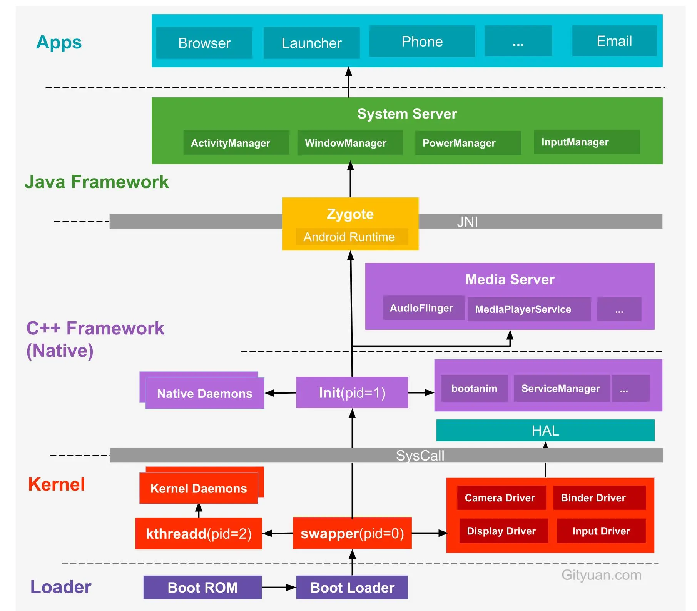
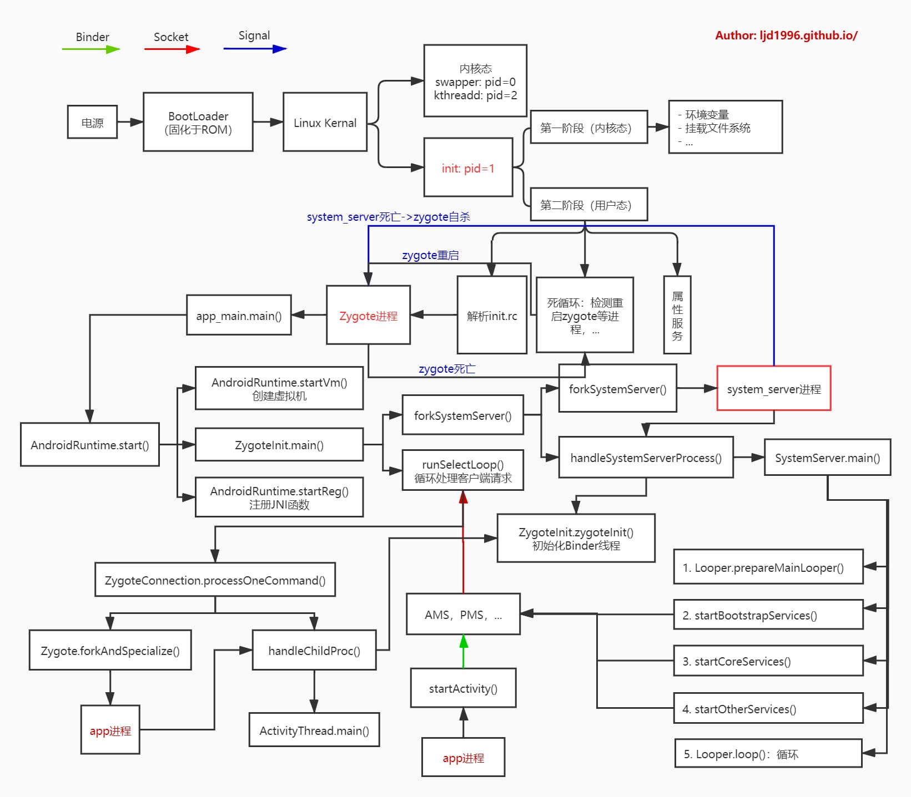

[toc]

## 01.启动流程初步介绍

启动流程如下图：



纵观整个 Android 体系结构，底层内核空间以 Linux Kernel 为核心，上层用户空间以 C++/Java 组成的 Framework 层组成，通过系统调用来连接用户空间和内核空间。而用户空间又分为 Native 世界和 Java 世界，通过 JNI 技术进行连接。

可以这么理解：安卓空间分为内核空间和用户空间，用户空间中分为C空间和Java空间。swapper是第一个内核进程，init是第一个用户进程，而Zygote是第一个Java进程。


提问：什么是JNI技术?

### 1.1 系统启动

当电源按下时会从加载固化在ROM中的引导程序BootLoader到内存RAM中，然后执行该引导程序。

### 1.2 引导程序BootLoader

类似Uboot等，会从存储设备中加载Linux内核到内存中，然后跳转到内核复位入口开始执行。

### 1.3 Linux内核启动

内核开始执行，进行内核的初始化和驱动加载。在这个过程中，会启动swapper进程(pid = 0)和kthreadd进程(pid = 2)：

- swapper进程：又称为idle进程，系统初始化过程Kernel由无到有开创的**第一个进程**, 其会加载Binder驱动。

### 1.4 C++Framework层

当内核启动完成时，swapper进程会会启动init进程。init进程是一个由内核启动的**第一个用户级进程**。

init进程是所有用户空间的鼻祖, 它会解析系统配置文件，启动servicemanager(提供binder地址查询功能),同时也会创建 Zygote进程(Java进程的鼻祖，负责启动应用进程的母进程). 

### 1.5 Java Framework层

`Zygote` ，它负责启动Java虚拟机，注册JNI，同时其会创建 `System Server`进程，`System Server` 负责管理和启动整个 Java Framework 层，其内部有重要的ActivityManager，WindowManager线程。

创建完 `System Server` 之后，`Zygote` 就会完全进入受精卵的角色，等待进行无性繁殖，创建应用进程。所有的应用进程都是由 `Zygote` 进程 fork 而来的，称之为 Java 世界的女娲也不足为过。

### 1.5 应用程序启动

此后，当用户点击某个应用程序图标时，实际是通过Binder提供的代理服务调用AMS，而Android 的 **ActivityManagerService** 会通过socket让 Zygote 进程启动一个新的应用进程来运行该应用。


## 02. init进程

在用户态部分解析init.rc配置文件，启动 Android 系统的核心服务，在这个过程中，init进程会解析init.zygote64_32.rc ，fork出 app_main 进程执行 app_process.cpp的main函数，也就是 Zygote 的执行流程中。这个进程最终在执行过程中会更名为 Zygote。

同时启动核心服务过程中还会启动serviceManager。

然后它进入主循环，重启挂掉的进程。这个在创建System Server失败的时候会执行。

### 2.1 init.cpp

init进程的入口函数是`system/core/init/init.cpp`的main函数，它的代码如下所示：

```C++
int main(int argc, char** argv) {
    add_environment("PATH", _PATH_DEFPATH);

    // 第一阶段：内核态
    // 第二阶段：用户态
    bool is_first_stage = (getenv("INIT_SECOND_STAGE") == nullptr);

    if (is_first_stage) {
        // Clear the umask，与Linux系统权限有关
        umask(0);

        // Get the basic filesystem setup we need put together in the initramdisk
        // on / and then we'll let the rc file figure out the rest.
        mount("tmpfs", "/dev", "tmpfs", MS_NOSUID, "mode=0755");
        mkdir("/dev/pts", 0755);
        // ...

        InitKernelLogging(argv);

        LOG(INFO) << "init first stage started!";

        if (!DoFirstStageMount()) {
            LOG(ERROR) << "Failed to mount required partitions early ...";
            panic();
        }

        // Set up SELinux(Security-Enhanced Linux), loading the SELinux policy.
        selinux_initialize(true);

        // We're in the kernel domain, so re-exec init to transition to the init domain now
        // that the SELinux policy has been loaded.
        // 按selinux policy要求，重新设置init文件属性
        if (restorecon("/init") == -1) {
            // 失败的话会reboot
            PLOG(ERROR) << "restorecon failed";
            security_failure();
        }

        setenv("INIT_SECOND_STAGE", "true", 1);
        setenv("INIT_STARTED_AT", StringPrintf("%" PRIu64, start_ms).c_str(), 1);

        // 再次调用init的main函数，启动用户态的init进程
        char* path = argv[0];
        char* args[] = { path, nullptr };
        execv(path, args);

        // execv() only returns if an error happened, in which case we
        // panic and never fall through this conditional.
        PLOG(ERROR) << "execv(\"" << path << "\") failed";
        security_failure();
    }

    // 第二阶段：用户态
    InitKernelLogging(argv);
    LOG(INFO) << "init second stage started!";

    property_init();  // 初始化属性服务

    // 执行内核命令
    process_kernel_dt();
    process_kernel_cmdline();
    export_kernel_boot_props();

    // 设置属性
    property_set("ro.boottime.init", getenv("INIT_STARTED_AT"));
    property_set("ro.boottime.init.selinux", getenv("INIT_SELINUX_TOOK"));

    // 重置之前使用过的一些环境变量
    unsetenv("INIT_SECOND_STAGE");
    unsetenv("INIT_STARTED_AT");
    unsetenv("INIT_SELINUX_TOOK");
    unsetenv("INIT_AVB_VERSION");

    // Now set up SELinux for second stage.
    selinux_initialize(false);
    selinux_restore_context();

    signal_handler_init();

    // 开启属性服务
    start_property_service();

    // 解析init.rc
    // ...

    while (true) {
        // 默认会休眠直到有事件唤醒
        int epoll_timeout_ms = -1;

        if (!(waiting_for_prop || ServiceManager::GetInstance().IsWaitingForExec())) {
            am.ExecuteOneCommand();
        }
        // 重启一些挂掉的进程，例如Zygote
        if (!(waiting_for_prop || ServiceManager::GetInstance().IsWaitingForExec())) {
            restart_processes();
            // If there's a process that needs restarting, wake up in time for that.
            if (process_needs_restart_at != 0) {
                epoll_timeout_ms = (process_needs_restart_at - time(nullptr)) * 1000;
                if (epoll_timeout_ms < 0) epoll_timeout_ms = 0;
            }

            // If there's more work to do, wake up again immediately.
            if (am.HasMoreCommands()) epoll_timeout_ms = 0;
        }

        epoll_event ev;
        int nr = TEMP_FAILURE_RETRY(epoll_wait(epoll_fd, &ev, 1, epoll_timeout_ms));
        if (nr == -1) {
            PLOG(ERROR) << "epoll_wait failed";
        } else if (nr == 1) {
            ((void (*)()) ev.data.ptr)();
        }
    }

    return 0;
}
```

**第一阶段（内核态）**：

**第二阶段（用户态）**：

- 解析init.rc配置文件，启动 Android 系统的核心服务，创建Zygote的工作就是在其中的某个阶段完成的。
- 进入主循环，重启挂掉的进程。这个在创建System Server失败的时候会执行。

下面给出 init.rc 部分内容(Mi Max3--MIUI 10--Android 9)：

```shell
on early-init
on init
on property:sys.boot_from_charger_mode=1
on load_persist_props_action
on firmware_mounts_complete
on late-init
on post-fs      // mount file system
    start logd
    mount rootfs rootfs / ro remount
    mount rootfs rootfs / shared rec
    mount none /mnt/runtime/default /storage slave bind rec
    // ...
// ...
on post-fs-data  // mount /data/
    // 启动 logd
    start logd
    // 启动 vold, 用于管理Android外部存储介质的后台进程，包括SD卡的插拔等
    start vold
    // ...
// ...
on boot
    // ...
    class_start core
```

Zygote 的启动是在 start 核心类的时候执行的。


### 2.2 启动Zygote

在start核心类时，init进程会解析init.zygote64_32.rc ，fork出 app_main 进程执行 app_process.cpp的main函数，也就是 Zygote 的执行流程中。这个进程最终在执行过程中会更名为 Zygote.

Zygote很特殊，在上面的体系结构图中，一半在C框架层，一半在Java框架层。因为它最开始执行的是cpp代码，后面创建完Java虚拟机环境后，才通过反射执行Java代码。


补充：下面是 init.zygote64_32.rc 文件：

```shell
service zygote /system/bin/app_process64 -Xzygote /system/bin --zygote --start-system-server --socket-name=zygote
    class main
    priority -20
    user root
    group root readproc reserved_disk
    socket zygote stream 660 root system
    onrestart write /sys/android_power/request_state wake
    onrestart write /sys/power/state on
    onrestart restart audioserver
    onrestart restart cameraserver
    onrestart restart media
    onrestart restart netd
    onrestart restart wificond
    writepid /dev/cpuset/foreground/tasks

service zygote_secondary /system/bin/app_process32 -Xzygote /system/bin --zygote --socket-name=zygote_secondary --enable-lazy-preload
    class main
    priority -20
    user root
    group root readproc reserved_disk
    socket zygote_secondary stream 660 root system
    onrestart restart zygote
    writepid /dev/cpuset/foreground/tasks
```


## 03. Zygote进程

`Zygote` ，它负责启动Java虚拟机，同时其会创建 `System Server`进程，`System Server` 负责管理和启动整个 Java Framework 层，其内部有重要的ActivityManager，WindowManager线程。

创建完 `System Server` 之后，`Zygote` 就会完全进入受精卵的角色，等待进行无性繁殖，创建应用进程。

### 3.1 概述

随着init解析完成init.zygote64_32.rc ，fork出 app_main 进程执行 app_process.cpp的main函数

我们执行到frameworks/base/cmds/app_process/app_process.cpp文件的main()方法。整个调用流程:

```shell
app_process.main
    AndroidRuntime.start
        AndroidRuntime.startVm
        AndroidRuntime.startReg
        通过反射机制，获取ZygoteInit.main 方法并执行(首次进入Java世界)
            registerServerSocketFromEnv
            preload
            forkSystemServer
            runSelectLoop
```

Zygote进程创建Java虚拟机，并注册JNI方法，真正成为Java进程的母体，用于孵化Java进程。在创建完system_server进程后，zygote功成身退，调用runSelectLoop()随时待命，当接收到创建新进程请求时立即唤醒并执行相应工作。

Zygote进程共做了如下几件事：

1. 创建AppRuntime并调用其start方法。实际对应AndroidRuntime.start
2. AndroidRuntime.start中通过startVm创建虚拟机，通过startReg注册Android原生函数
3. 通过反射获取ZygoteInit类的main方法，然后执行，此时正式进入到Java框架层。
4. 在ZygoteInit.main方法中通过registerServerSocketFromEnv函数创建服务端Socket
5. preload预加载资源，方便后续fork出app进程时无需进行过多的初始化工作。
6. 创建 `system_server` 进程。创建成功则返回一个 `Runnable`，并通过`r.run()`在子进程中执行 `SystemServer.main()`。
7. 通过runSelectLoop函数启动套接字循环，等待系统服务的请求来创建新的应用程序进程。

### 3.1 app_main.cpp

Zygote本身是一个Native的应用程序，和驱动、内核等均无关系。zygote最初的名字叫“app_process”，但app_process在运行过程中，通过Linux下的pctrl系统调用将自己的名字换成了“zygote”

zygote的原型app_process所对应的源文件是`framework/base/cmds/app_process/app_main.cpp`，代码如下所示：

```cpp
int main(int argc, const char* const argv[])
{
    AppRuntime runtime(argv[0], computeArgBlockSize(argc, argv));

    // --zygote : Start in zygote mode
    // --start-system-server : Start the system server.
    // --application : Start in application (stand alone, non zygote) mode.
    // --nice-name : The nice name for this process.
    bool zygote = false;
    bool startSystemServer = false;
    bool application = false;
    String8 niceName;
    String8 className;

    while (i < argc) {
        const char* arg = argv[i++];
        if (strcmp(arg, "--zygote") == 0) {
            zygote = true;
            niceName = ZYGOTE_NICE_NAME;  // zygote64 or zygote
        } else if (strcmp(arg, "--start-system-server") == 0) {
            startSystemServer = true;
        } else if (strcmp(arg, "--application") == 0) {
            application = true;
        } else if (strncmp(arg, "--nice-name=", 12) == 0) {
            niceName.setTo(arg + 12);
        } else if (strncmp(arg, "--", 2) != 0) {
            className.setTo(arg);
            break;
        } else {
            --i;
            break;
        }
    }

    Vector<String8> args;
    if (!className.isEmpty()) {
        // We're not in zygote mode
        // 需要传递给RuntimeInit的唯一参数是application参数，剩余的args传递给启动类main
        args.add(application ? String8("application") : String8("tool"));
        runtime.setClassNameAndArgs(className, argc - i, argv + i);
    } else {
        // We're in zygote mode.
        maybeCreateDalvikCache();

        if (startSystemServer) {
            args.add(String8("start-system-server"));
        }

        char prop[PROP_VALUE_MAX];
        if (property_get(ABI_LIST_PROPERTY, prop, NULL) == 0) {
            LOG_ALWAYS_FATAL("app_process: Unable to determine ABI list from property %s.",
                ABI_LIST_PROPERTY);
            return 11;
        }

        String8 abiFlag("--abi-list=");
        abiFlag.append(prop);
        args.add(abiFlag);

        // In zygote mode, pass all remaining arguments to the zygote
        // main() method.
        for (; i < argc; ++i) {
            args.add(String8(argv[i]));
        }
    }

    if (!niceName.isEmpty()) {
        runtime.setArgv0(niceName.string(), true /* setProcName */);
    }

    if (zygote) {
        runtime.start("com.android.internal.os.ZygoteInit", args, zygote);
    } else if (className) {
        runtime.start("com.android.internal.os.RuntimeInit", args, zygote);
    } else {
        fprintf(stderr, "Error: no class name or --zygote supplied.\n");
        app_usage();
        LOG_ALWAYS_FATAL("app_process: no class name or --zygote supplied.");
    }
}

```

**`AppRuntime runtime(argv[0], computeArgBlockSize(argc, argv));`**

- 这个创建了一个 `AppRuntime` 对象，它是 Android Runtime（ART）环境的包装类，负责启动应用程序的运行时环境。

AppRuntime类的声明和实现均在app_main.cpp中，它是从AndroidRuntime类派生出来的，所以上述 runtime.start 函数使用的是基类AndroidRuntime的start。

### 3.2 AndroidRuntime.start

```C++
// frameworks/base/core/jni/AndroidRuntime.cpp
void AndroidRuntime::start(const char* className, const Vector<String8>& options, bool zygote)
{
    const char* rootDir = getenv("ANDROID_ROOT");
    if (rootDir == NULL) {
        rootDir = "/system";
        if (!hasDir("/system")) {
            LOG_FATAL("No root directory specified, and /android does not exist.");
            return;
        }
        setenv("ANDROID_ROOT", rootDir, 1);
    }

    /* start the virtual machine */
    JniInvocation jni_invocation;
    jni_invocation.Init(NULL);
    JNIEnv* env;
    if (startVm(&mJavaVM, &env, zygote) != 0) {
        return;
    }
    onVmCreated(env);

    // 因为后续Java世界用到的一些函数是采用native方式来实现的，所以必须提前注册这些函数
    if (startReg(env) < 0) {
        ALOGE("Unable to register all android natives\n");
        return;
    }

    // 将参数封装到strArray里

    /*
     * Start VM.  This thread becomes the main thread of the VM, and will
     * not return until the VM exits.
     */
    char* slashClassName = toSlashClassName(className != NULL ? className : "");
    jclass startClass = env->FindClass(slashClassName);
    if (startClass == NULL) {
        ALOGE("JavaVM unable to locate class '%s'\n", slashClassName);
    } else {
        // 找到ZygoteInit类的static main函数的jMethodId
        jmethodID startMeth = env->GetStaticMethodID(startClass, "main",
            "([Ljava/lang/String;)V");
        if (startMeth == NULL) {
            ALOGE("JavaVM unable to find main() in '%s'\n", className);
        } else {
            // 调用ZygoteInit.main函数后，Zygote便进入了Java世界
            env->CallStaticVoidMethod(startClass, startMeth, strArray);
        }
    }
    free(slashClassName);
}
```

**重要代码逻辑如下：**

1. **启动 Java 虚拟机**：

```cpp
if (startVm(&mJavaVM, &env, zygote) != 0) {
    return;
}
onVmCreated(env);
```

- 调用 `startVm` 函数启动 Java 虚拟机，并将 `mJavaVM` 设置为当前进程的 JVM 实例，`env` 是 JNI 环境指针。

**2. 注册 Android 原生函数**：

```cpp
if (startReg(env) < 0) {
    ALOGE("Unable to register all android natives\n");
    return;
}
```

- 注册 JNI 原生函数（native functions），即将 C++ 的方法和 Java 方法进行绑定。这是因为 Android 的某些功能需要通过 JNI 来调用底层的 C/C++ 实现。

**怎么理解：将 C++ 的方法和 Java 方法进行绑定**

我们可以在 Java 中使用 `native` 关键字声明一个本地方法，并通过绑定，让这个执行方法实际执行的是c/cpp代码。

绑定的作用是将它们管理起来，当我们声明时，JVM 并不知道这个方法的实现，它只是定义了一个接口。通过 JNI，我们告诉 JVM 这个 `native` 方法的实现是在某个本地（native）库中。我们遵循以下绑定机制。

- Java 程序通过 `System.loadLibrary("libraryName")` 加载一个共享库（如 `.so`、`.dll` 等），这个库包含了 C/C++ 中对应 Java `native` 方法的实现。
- JVM 在运行时调用这个 `native` 方法时，会根据 Java 方法名和参数类型找到对应的 C/C++ 实现函数，并执行该函数。


3. 通过反射调用ZygoteInit类的Main方法

   **根据类名获取ZygoteInit类的jclass对象**：

```cpp
char* slashClassName = toSlashClassName(className != NULL ? className : "");
jclass startClass = env->FindClass(slashClassName);
if (startClass == NULL) {
    ALOGE("JavaVM unable to locate class '%s'\n", slashClassName);
}
```

- 通过 `env->FindClass` 方法查找要启动的 Java 类。在 Zygote 启动过程中，传入的类名slashClassName是 `com.android.internal.os.ZygoteInit`，即 `ZygoteInit` 类。

**提问：jclass是什么**：`jclass` 是 JNI 中的一个类型，表示 Java 类在 JVM 中的本地引用。

​	**查找获取ZygoteInit类的Main方法并执行**：

```cpp
jmethodID startMeth = env->GetStaticMethodID(startClass, "main",
    "([Ljava/lang/String;)V");
if (startMeth == NULL) {
    ALOGE("JavaVM unable to find main() in '%s'\n", className);
} else {
    env->CallStaticVoidMethod(startClass, startMeth, strArray);
}
```

- 使用 `env->GetStaticMethodID` 在startClass这个jclass类中查找 Java 类中的 `main` 方法，这个方法是 Zygote 启动的入口。
- 如果找到 `main` 方法（通过静态方法签名匹配 `"([Ljava/lang/String;)V"`，表示它是一个接收字符串数组参数的静态方法），那么调用 `CallStaticVoidMethod` 执行这个方法。
- 这意味着，从这里开始，Java 虚拟机会执行 `ZygoteInit` 类中的 `main` 函数，这就是 Android 进入 Java 世界的地方。

### 3.3 ZygoteInit.main

CallStaticVoidMethod最终将调用com.android.internal.os.ZygoteInit的main函数。

此时Zygote正式进入到了自身的Java侧，开始执行自身的使命：创建SystemServer，fork应用程序。

代码如下所示：

```C++
// frameworks/base/core/java/com/android/internal/os/ZygoteInit.java
public static void main(String argv[]) {
    ZygoteServer zygoteServer = new ZygoteServer();
    try {
        boolean startSystemServer = false;
        String socketName = "zygote";
        String abiList = null;
        boolean enableLazyPreload = false;
        for (int i = 1; i < argv.length; i++) {
            if ("start-system-server".equals(argv[i])) {
                startSystemServer = true;
            } else if ("--enable-lazy-preload".equals(argv[i])) {
                enableLazyPreload = true;
            } else if (argv[i].startsWith(ABI_LIST_ARG)) {
                abiList = argv[i].substring(ABI_LIST_ARG.length());
            } else if (argv[i].startsWith(SOCKET_NAME_ARG)) {
                socketName = argv[i].substring(SOCKET_NAME_ARG.length());
            } else {
                throw new RuntimeException("Unknown command line argument: " + argv[i]);
            }
        }
        // 创建一个Zygote的Socket接口，用来和AMS等通信
        zygoteServer.registerServerSocketFromEnv(socketName);
        if (!enableLazyPreload) {
            // 预加载一些类和资源，这是导致Android系统启动慢的原因之一
            // 应用程序都从Zygote孵化出来，应用程序都会继承Zygote的所有内容，如果在Zygote启动的时候加载这些类和资源，
            // 这些孵化的应用程序就继承Zygote的类和资源，这样启动引用程序的时候就不需要加载类和资源了，启动的速度就会快很多。
            preload(bootTimingsTraceLog);
        }

        // Do an initial gc to clean up after startup
        gcAndFinalize();

        if (startSystemServer) {
            Runnable r = forkSystemServer(abiList, socketName, zygoteServer);
            // 子进程（system_server）
            if (r != null) {
                // 调用com.android.server.SystemServer.main方法
                r.run();
                return;
            }
        }

        Log.i(TAG, "Accepting command socket connections");

        // The select loop returns early in the child process after a fork and
        // loops forever in the zygote.
        caller = zygoteServer.runSelectLoop(abiList);
    } catch (Throwable ex) {
        Log.e(TAG, "System zygote died with exception", ex);
        throw ex;
    } finally {
        zygoteServer.closeServerSocket();
    }

    // We're in the child process and have exited the select loop. Proceed to execute the command.
    if (caller != null) {
        caller.run();
    }
}
```

上面有三个重要的调用：

- registerServerSocketFromEnv用来注册一个 Zygote Server 套接字，用来和AMS等系统服务通信
- `preload()` 方法用于预加载系统类和资源。由于 Android 应用都通过 Zygote 进程孵化而来，预加载有助于加快应用程序启动速度。
- `forkSystemServer()` 方法用于创建 `system_server` 进程。创建成功则返回一个 `Runnable`，里面是通过反射封装的SystemServer.main()方法，fork完成后，SystemServer进程从fork之后继续执行，通过`r.run()`执行自身 `SystemServer.main()`方法。
- `runSelectLoop()` 是 Zygote 的主循环，监听 Zygote 套接字，等待来自 AMS 等服务的进程启动请求。

**补充**：

`preload()` 会加载：

- 核心类库（如 `java.util.*`, `android.*`）
- 一些常用的资源（如图片、XML 等）

虽然这一步会增加 Zygote 启动的时间，但它可以提升应用启动的效率，因为通过fork每个新启动的应用会继承 Zygote 的内存内容，包括已经加载好的类和资源。


## 04. system_server进程

### 4.1 概述

整个调用流程:

```shell

ZygoteInit.main
	forkSystemServer创建SystemServer进程
		Zygote.forkSystemServer()创建进程，创建失败会kill杀死Zygote进程，并在Init中重启
    	handleSystemServerProcess通过类反射机制获取并返回SystemServer.main方法的封装，这个过程会创建binder线程池
	子进程会执行r.run()，运行SystemServer.main方法。
    	SystemServer.run
            Looper.prepareMainLooper();
            createSystemContext
            startBootstrapServices();
            startCoreServices();
            startOtherServices();
            Looper.loop();
```

SyetemServer在启动时做了如下工作：

1. 启动Binder线程池，这样就可以与其他进程进行通信。
2. 创建SystemServiceManager用于对系统的服务进行创建、启动和生命周期管理。
3. 启动各种系统服务。AMS，PMS，以及WMS等都是运行在system_server这个进程中的线程。
4. 执行loop循环等待消息到来。

### 4.2 ZygoteInit.forkSystemServer

在上节中，ZygoteInit.main方法首次进入Java世界，然后调用了forkSystemServer方法创建system_server进程。

```Java
private static Runnable forkSystemServer(String abiList, String socketName,
        ZygoteServer zygoteServer) {
    /* Hardcoded command line to start the system server */
    String args[] = {
        "--setuid=1000",
        "--setgid=1000",
        "--setgroups=1001,1002,1003,1004,1005,1006,1007,1008,1009,1010,1018,1021,1023,1024,1032,1065,3001,3002,3003,3006,3007,3009,3010",
        "--capabilities=" + capabilities + "," + capabilities,
        "--nice-name=system_server",
        "--runtime-args",
        "--target-sdk-version=" + VMRuntime.SDK_VERSION_CUR_DEVELOPMENT,
        "com.android.server.SystemServer",
    };
    ZygoteConnection.Arguments parsedArgs = null;

    int pid;

    try {
        parsedArgs = new ZygoteConnection.Arguments(args);
        ZygoteConnection.applyDebuggerSystemProperty(parsedArgs);
        ZygoteConnection.applyInvokeWithSystemProperty(parsedArgs);

        boolean profileSystemServer = SystemProperties.getBoolean(
                "dalvik.vm.profilesystemserver", false);
        if (profileSystemServer) {
            parsedArgs.runtimeFlags |= Zygote.PROFILE_SYSTEM_SERVER;
        }

        /* Request to fork the system server process */
        pid = Zygote.forkSystemServer(
                parsedArgs.uid, parsedArgs.gid,
                parsedArgs.gids,
                parsedArgs.runtimeFlags,
                null,
                parsedArgs.permittedCapabilities,
                parsedArgs.effectiveCapabilities);
    } catch (IllegalArgumentException ex) {
        throw new RuntimeException(ex);
    }

    /* For child process */
    if (pid == 0) {
        if (hasSecondZygote(abiList)) {
            waitForSecondaryZygote(socketName);
        }

        zygoteServer.closeServerSocket();
        return handleSystemServerProcess(parsedArgs);
    }

    return null;
}
```

在这里设置了system_server进程的各种权限（如 UID、GID、组权限等）。

实际的线程创建是通过Zygote.forkSystemServer()函数执行。

这里有两个重要的调用：

- Zygote.forkSystemServer()函数用来fork一个新的进程，如果pid==0，表示已经进入SystemServer子进程，于是先关闭“Zygote”socket，因为系统服务进程system_server不用socket，所以close它；
- 调用了handleSystemServerProcess()方法，返回Runnable对象到ZygoteInit.main中，并在其中通过r.run()调用到com.android.server.SystemServer.main方法。

因此我们后续有三个重要函数要看，一个是Zygote.forkSystemServer，一个是handleSystemServerProcess,一个是SystemServer.main


### 4.3 Zygote.forkSystemServer

首先看看Zygote.forkSystemServer方法，它调用的是nativeForkSystemServer方法，该方法定义在 C++ 文件 `Zygote.cpp` 中，它接收 UID、GID 等系统参数，并负责 fork 出一个新的 `system_server` 进程。

```C++
// frameworks/base/core/jni/com_android_internal_os_Zygote.cpp
static jint com_android_internal_os_Zygote_nativeForkSystemServer(
        JNIEnv* env, jclass, uid_t uid, gid_t gid, jintArray gids,
        jint runtime_flags, jobjectArray rlimits, jlong permittedCapabilities,
        jlong effectiveCapabilities) {
    pid_t pid = ForkAndSpecializeCommon(env, uid, gid, gids,
                                        runtime_flags, rlimits,
                                        permittedCapabilities, effectiveCapabilities,
                                        MOUNT_EXTERNAL_DEFAULT, NULL, NULL, true, NULL,
                                        NULL, NULL, NULL);
    if (pid > 0) {
    }
    return pid;
}

static pid_t ForkAndSpecializeCommon(/* ... */) {
    SetSignalHandlers();
    pid_t pid = fork(); // fork子进程
    UnsetChldSignalHandler();
}

static void SetSignalHandlers() {
    struct sigaction sig_chld = {};
    sig_chld.sa_handler = SigChldHandler;

    if (sigaction(SIGCHLD, &sig_chld, NULL) < 0) {
        ALOGW("Error setting SIGCHLD handler: %s", strerror(errno));
    }

    struct sigaction sig_hup = {};
    sig_hup.sa_handler = SIG_IGN;
    if (sigaction(SIGHUP, &sig_hup, NULL) < 0) {
        ALOGW("Error setting SIGHUP handler: %s", strerror(errno));
    }
}

// Sets the SIGCHLD handler back to default behavior in zygote children.
static void UnsetChldSignalHandler() {
    struct sigaction sa;
    memset(&sa, 0, sizeof(sa));
    sa.sa_handler = SIG_DFL;

    if (sigaction(SIGCHLD, &sa, NULL) < 0) {
        ALOGW("Error unsetting SIGCHLD handler: %s", strerror(errno));
    }
}

static void SigChldHandler(int /*signal_number*/) {
    pid_t pid;
    int status;

    while ((pid = waitpid(-1, &status, WNOHANG)) > 0) {
        if (pid == gSystemServerPid) {
            ALOGE("Exit zygote because system server (%d) has terminated", pid);
            kill(getpid(), SIGKILL);
        }
    }
}
```

在这里进行了SystemServer进程的实际fork操作，

同时有一个值得注意的：**如果 `system_server` 进程在运行过程中崩溃或被意外终止，会发送SIGCHLD信号，而`SigChldHandler` 会捕获到这一事件，并通过 `kill(getpid(), SIGKILL)` 杀死 `Zygote` 进程**。这是一个自我保护机制，因为 `system_server` 是 Android 系统中的核心进程，如果它崩溃了，整个系统需要重新启动。

**同时一旦 `Zygote` 进程被杀死，系统的父进程 `Init` 会检测到并重启 `Zygote`，从而重新启动 Android 系统。**这份代码逻辑在Init进程的主循环，处理系统事件的部分。

### 4.4 handleSystemServerProcess

```Java
private static Runnable handleSystemServerProcess(ZygoteConnection.Arguments parsedArgs) {
    ClassLoader cl = createPathClassLoader(systemServerClasspath, parsedArgs.targetSdkVersion);
    Thread.currentThread().setContextClassLoader(cl);
    return ZygoteInit.zygoteInit(parsedArgs.targetSdkVersion, parsedArgs.remainingArgs, cl);
}

public static final Runnable zygoteInit(int targetSdkVersion, String[] argv, ClassLoader classLoader) {
    // 执行Binder驱动程序初始化的相关工作，它调用之后system_server进程就可以进行Binder进程通信
    ZygoteInit.nativeZygoteInit();
    return RuntimeInit.applicationInit(targetSdkVersion, argv, classLoader);
}

// frameworks/base/core/java/com/android/internal/os/RuntimeInit.java
protected static Runnable applicationInit(int targetSdkVersion, String[] argv,
        ClassLoader classLoader) {
    final Arguments args = new Arguments(argv);
    return findStaticMain(args.startClass, args.startArgs, classLoader);
}

// 通过反射获得com.android.server.SystemServer的main方法
protected static Runnable findStaticMain(String className, String[] argv,
        ClassLoader classLoader) {
    Class<?> cl = Class.forName(className, true, classLoader);
    Method m = cl.getMethod("main", new Class[] { String[].class });
    return new MethodAndArgsCaller(m, argv);
}

static class MethodAndArgsCaller implements Runnable {
    /** method to call */
    private final Method mMethod;

    /** argument array */
    private final String[] mArgs;

    public MethodAndArgsCaller(Method method, String[] args) {
        mMethod = method;
        mArgs = args;
    }

    public void run() {
        mMethod.invoke(null, new Object[] { mArgs });
    }
}
```

- `handleSystemServerProcess` 首先创建了 `system_server` 进程的类加载器，然后调用 `ZygoteInit.zygoteInit` 方法。
- 在 `zygoteInit` 方法中，会创建Binder线程池，使 `system_server` 能进行进程间通信。
- 之后，`RuntimeInit.applicationInit` 通过反射找到 `com.android.server.SystemServer` 的 `main()` 方法，并将其封装为 `MethodAndArgsCaller`返回给ZygoteInit.main方法中的Runnable对象r。
- 当 `r.run()` 被调用时，通过反射实际执行了 `SystemServer.main()`，完成 `system_server` 进程的启动。

到这里可以知道ZygoteInit.main方法中的`Runnable r = forkSystemServer(abiList, socketName, zygoteServer);`返回的r即是MethodAndArgsCaller，在子进程中调用r.run方法便是调用了com.android.server.SystemServer.main方法。


### 4.5 SystemServer#main

```Java
// SystemServer.java
public final class SystemServer {
    ...
    public static void main(String[] args) {
        //先初始化SystemServer对象，再调用对象的run()方法
        new SystemServer().run();
    }
}

private void run() {
    Looper.prepareMainLooper();// 准备主线程looper

    //加载android_servers.so库，该库包含的源码在frameworks/base/services/目录下
    System.loadLibrary("android_servers");

    createSystemContext(); //初始化系统上下文

    //创建系统服务管理
    mSystemServiceManager = new SystemServiceManager(mSystemContext);
    LocalServices.addService(SystemServiceManager.class, mSystemServiceManager);

    //启动各种系统服务
    try {
        startBootstrapServices(); // 启动引导服务
        startCoreServices();      // 启动核心服务
        startOtherServices();     // 启动其他服务
    } catch (Throwable ex) {
        throw ex;
    }

    //一直循环执行
    Looper.loop();
    throw new RuntimeException("Main thread loop unexpectedly exited");
}
```

`main()` 方法首先创建 `SystemServer` 对象，然后调用它的 `run()` 方法：

在`run()` 方法中它主要完成了以下几件事情：

1. **准备主线程 Looper**：

2. **加载 `android_servers` 原生库**：

3. **初始化系统上下文**：调用 `createSystemContext()` 方法，创建 `SystemContext`，它是系统服务运行时的上下文环境。

4. **创建 `SystemServiceManager`**：

   - 创建并初始化 `SystemServiceManager`，该类用于管理系统服务的生命周期。

   - 通过 `LocalServices.addService`，将 `SystemServiceManager` 注册到一个静态 `Map`（`LocalServices`）中，便于其他部分调用。


5. **启动系统服务**：
   - 调用一系列方法来启动不同层次的系统服务：
     - `startBootstrapServices()`：启动引导服务。
     - `startCoreServices()`：启动核心服务。
     - `startOtherServices()`：启动其他服务。


5. **进入 `Looper.loop()` 循环**：

   - `Looper.loop()` 方法开启一个无限循环，开始处理主线程的消息队列。

   - 这个循环是关键，因为 Android 的大部分服务都是通过消息机制来运作的，它会保持主线程的活跃和响应。


具体调用关系如下：

```Java
SystemServer.main
    SystemServer.run
        Looper.prepareMainLooper();
        createSystemContext
        startBootstrapServices();
        startCoreServices();
        startOtherServices();
        Looper.loop();
```


首先看看启动引导服务的方法startBootstrapServices：

```Java
private void startBootstrapServices() {
    // 阻塞等待与installd建立socket通道
    Installer installer = mSystemServiceManager.startService(Installer.class);

    // In some cases after launching an app we need to access device identifiers,
    // therefore register the device identifier policy before the activity manager.
    mSystemServiceManager.startService(DeviceIdentifiersPolicyService.class);

    mActivityManagerService = mSystemServiceManager.startService(
            ActivityManagerService.Lifecycle.class).getService();
    mActivityManagerService.setSystemServiceManager(mSystemServiceManager);
    mActivityManagerService.setInstaller(installer);

    mPowerManagerService = mSystemServiceManager.startService(PowerManagerService.class);
    mActivityManagerService.initPowerManagement();

    mSystemServiceManager.startService(RecoverySystemService.class);

    // Now that we have the bare essentials of the OS up and running, take
    // note that we just booted, which might send out a rescue party if
    // we're stuck in a runtime restart loop.
    RescueParty.noteBoot(mSystemContext);

    mSystemServiceManager.startService(LightsService.class);

    // Package manager isn't started yet; need to use SysProp not hardware feature
    if (SystemProperties.getBoolean("config.enable_sidekick_graphics", false)) {
        mSystemServiceManager.startService(WEAR_SIDEKICK_SERVICE_CLASS);
    }

    mDisplayManagerService = mSystemServiceManager.startService(DisplayManagerService.class);

    // We need the default display before we can initialize the package manager.
    mSystemServiceManager.startBootPhase(SystemService.PHASE_WAIT_FOR_DEFAULT_DISPLAY);

    // 当设备正在加密时，仅运行core apps
    String cryptState = SystemProperties.get("vold.decrypt");
    if (ENCRYPTING_STATE.equals(cryptState)) {
        Slog.w(TAG, "Detected encryption in progress - only parsing core apps");
        mOnlyCore = true;
    } else if (ENCRYPTED_STATE.equals(cryptState)) {
        Slog.w(TAG, "Device encrypted - only parsing core apps");
        mOnlyCore = true;
    }

    // Start the package manager.
    mPackageManagerService = PackageManagerService.main(mSystemContext, installer,
            mFactoryTestMode != FactoryTest.FACTORY_TEST_OFF, mOnlyCore);
    mFirstBoot = mPackageManagerService.isFirstBoot();
    mPackageManager = mSystemContext.getPackageManager();

    mSystemServiceManager.startService(UserManagerService.LifeCycle.class);

    AttributeCache.init(mSystemContext);

    // Set up the Application instance for the system process and get started.
    mActivityManagerService.setSystemProcess();

    mDisplayManagerService.setupSchedulerPolicies();
    mSystemServiceManager.startService(new OverlayManagerService(mSystemContext, installer));

    // 启动传感器服务
    startSensorService();
```

该方法所创建的服务：ActivityManagerService, PowerManagerService, LightsService, DisplayManagerService， PackageManagerService， UserManagerService， sensor服务等。

然后是启动核心服务startCoreServices：

```Java
private void startCoreServices() {
    // 启动服务BatteryService，用于统计电池电量，需要LightService.
    mSystemServiceManager.startService(BatteryService.class);

    // 启动服务UsageStatsService，用于统计应用使用情况
    mSystemServiceManager.startService(UsageStatsService.class);
    mActivityManagerService.setUsageStatsManager(
            LocalServices.getService(UsageStatsManagerInternal.class));

    if (mPackageManager.hasSystemFeature(PackageManager.FEATURE_WEBVIEW)) {
        // 启动服务WebViewUpdateService
        mWebViewUpdateService = mSystemServiceManager.startService(WebViewUpdateService.class);
    }

    BinderCallsStatsService.start();
}
```

启动服务BatteryService，UsageStatsService，WebViewUpdateService等。

启动其它服务的startOtherServices方法比较长，主要是启动一系列的服务：

```Java
private void startOtherServices() {
    // ...
    ServiceManager.addService("sec_key_att_app_id_provider", new KeyAttestationApplicationIdProviderService(context));
    mSystemServiceManager.startService(KeyChainSystemService.class);
    ServiceManager.addService("scheduling_policy", new SchedulingPolicyService());
    mSystemServiceManager.startService(TelecomLoaderService.class);
    telephonyRegistry = new TelephonyRegistry(context);
    ServiceManager.addService("telephony.registry", telephonyRegistry);
    mEntropyMixer = new EntropyMixer(context);

    mContentResolver = context.getContentResolver();

    mSystemServiceManager.startService(ACCOUNT_SERVICE_CLASS);
    mSystemServiceManager.startService(CONTENT_SERVICE_CLASS);

    // 准备好window, power, package, display服务
    wm.systemReady();
    mPowerManagerService.systemReady(...);
    mPackageManagerService.systemReady();
    mDisplayManagerService.systemReady(...);
    mActivityManagerService.systemReady(...);
    // ...
}
```

重要的有

**WindowManagerService (WMS)**：负责管理窗口，处理 UI 显示、窗口层级、应用之间的 UI 切换等操作。

**ContentService**：提供数据共享和内容提供者（Content Provider）管理功能，允许应用程序访问和共享数据。


到此, System_server主线程的启动工作总算完成, 进入Looper.loop()状态，等待其他线程通过handler发送消息到主线再处理。


## 05. App进程

### 5.1 app进程发送请求

ActivityManagerService也是由SystemServer创建的。

假设通过startActivity来启动一个新的Activity，而这个Activity附属于一个还未启动的进程，则会启动一个新的进程，调用startActivity的进程通过Binder调用到ActivityManagerService中的方法，然后经过层层调用，会调用到ActivityManagerService的Process.start()方法，代码如下所示：

```Java
public static final ProcessStartResult start(final String processClass,
                                  final String niceName,
                                  int uid, int gid, int[] gids,
                                  int runtimeFlags, int mountExternal,
                                  int targetSdkVersion,
                                  String seInfo,
                                  String abi,
                                  String instructionSet,
                                  String appDataDir,
                                  String invokeWith,
                                  String[] zygoteArgs) {
    return zygoteProcess.start(processClass, niceName, uid, gid, gids,
            runtimeFlags, mountExternal, targetSdkVersion, seInfo,
            abi, instructionSet, appDataDir, invokeWith, zygoteArgs);
}
```

这里的参数processClass为“android.app.ActivityThread”，它是传进去的第一个参数，也就是程序初始化进程时要加载的主文件Java类。当应用进程启动之后，会把这个类加载到进程，调用它的main()方法作为应用程序进程的入口。

### 5.2 AMS发送请求

Process类的start()直接调用了ZygoteProcess类的start()方法，该start()方法调用了ZygoteProcess类的startViaZygote()方法，下面看看该方法实现：

```C++
private Process.ProcessStartResult startViaZygote(final String processClass, final String niceName,
    final int uid, final int gid, final int[] gids, int runtimeFlags, int mountExternal, 
    int targetSdkVersion, String seInfo, String abi, String instructionSet,String appDataDir, 
    String invokeWith, String[] extraArgs) throws ZygoteStartFailedEx {
    ArrayList<String> argsForZygote = new ArrayList<String>();
    argsForZygote.add("--runtime-args");
    argsForZygote.add("--setuid=" + uid);
    argsForZygote.add("--setgid=" + gid);
    // ......
    synchronized(mLock) {
        return zygoteSendArgsAndGetResult(openZygoteSocketIfNeeded(abi), argsForZygote);
    }
}
```

首先给它设置值，包括uid、gid等。接着上锁，调用openZygoteSocketIfNeeded()方法来连接“zygote”Socket，链接Socket成功之后，就会调用zygoteSendArgsAndGetResult()方法来进一步处理。

**提问：为什么是socket，而不是binder跟Zygote通信？**

主要是多线程问题，具体来说， `fork()` 只会复制调用它的线程到子进程中，而父进程中的其他线程不会被复制到子进程中，如果父进程在 `fork()` 前是多线程的，且一个线程持有了某个锁，然后另外一个线程调用了fork创建子进程，在子进程中持有那个锁的线程却"蒸发"了，从子进程的角度来看，这个锁被“永久”的上锁了，因为它的持有者“蒸发”了。如果子进程中的任何一个线程对这个已经被持有的锁进行lock操作，就会发生死锁。


先来看看openZygoteSocketIfNeeded()方法：

```Java
private ZygoteState openZygoteSocketIfNeeded(String abi) throws ZygoteStartFailedEx {
    if (primaryZygoteState == null || primaryZygoteState.isClosed()) {
        try {
            primaryZygoteState = ZygoteState.connect(mSocket);
        }
}
```

方法中的mSocket的值是“zygote”，通过connect()方法去连接“zygote”Socket。接着看看zygoteSendArgsAndGetResult()方法：

```Java
private static Process.ProcessStartResult zygoteSendArgsAndGetResult(
        ZygoteState zygoteState, ArrayList<String> args)
        throws ZygoteStartFailedEx {
    try {
        final BufferedWriter writer = zygoteState.writer;
        final DataInputStream inputStream = zygoteState.inputStream;
        writer.write(Integer.toString(args.size()));
        writer.newLine();
        for (int i = 0; i < sz; i++) {
            String arg = args.get(i);
            writer.write(arg);
            writer.newLine();
        }
        writer.flush();
}
```

通过Socket写入流writer把前面传过来的那些参数写进去，Socket即ZygoteServer类的runSelectLoop()方法监听。写入这些数据之后，ZygoteServer类的runSelectLoop()方法就能被监听到。

### 5.3 Zygote响应请求

这是Zygote的runSelectLoop，监听事件循环

```Java
void setForkChild() {
    mIsForkChild = true;
}

Runnable runSelectLoop(String abiList) {
    ArrayList<FileDescriptor> fds = new ArrayList<FileDescriptor>();
    ArrayList<ZygoteConnection> peers = new ArrayList<ZygoteConnection>();

    fds.add(mServerSocket.getFileDescriptor());
    peers.add(null);

    while (true) {
        StructPollfd[] pollFds = new StructPollfd[fds.size()];
        for (int i = 0; i < pollFds.length; ++i) {
            pollFds[i] = new StructPollfd();
            pollFds[i].fd = fds.get(i);
            pollFds[i].events = (short) POLLIN;
        }
        try {
            Os.poll(pollFds, -1);
        } catch (ErrnoException ex) {
            throw new RuntimeException("poll failed", ex);
        }
        for (int i = pollFds.length - 1; i >= 0; --i) {
            if ((pollFds[i].revents & POLLIN) == 0) {
                continue;
            }

            if (i == 0) {
                ZygoteConnection newPeer = acceptCommandPeer(abiList);
                peers.add(newPeer);
                fds.add(newPeer.getFileDesciptor());
            } else {
                try {
                    ZygoteConnection connection = peers.get(i);
                    final Runnable command = connection.processOneCommand(this);
                    // 通过mIsForkChild变量控制父进程接着死循环/子进程返回command
                    if (mIsForkChild) {
                        // We're in the child. We should always have a command to run at this
                        // stage if processOneCommand hasn't called "exec".
                        if (command == null) {
                            throw new IllegalStateException("command == null");
                        }

                        return command;
                    } else {
                        // We're in the server - we should never have any commands to run.
                        if (command != null) {
                            throw new IllegalStateException("command != null");
                        }

                        if (connection.isClosedByPeer()) {
                            connection.closeSocket();
                            peers.remove(i);
                            fds.remove(i);
                        }
                    }
                } catch (Exception e) {
                    if (!mIsForkChild) {
                        ZygoteConnection conn = peers.remove(i);
                        conn.closeSocket();
                        fds.remove(i);
                    } else {

                        throw e;
                    }
                } finally {
                    mIsForkChild = false;
                }
            }
        }
    }
}
```

监听到请求后，会进入ZygoteConnection类的processOneCommand()方法：

```Java
Runnable processOneCommand(ZygoteServer zygoteServer) {
    pid = Zygote.forkAndSpecialize(parsedArgs.uid, parsedArgs.gid, parsedArgs.gids,
            parsedArgs.runtimeFlags, rlimits, parsedArgs.mountExternal, parsedArgs.seInfo,
            parsedArgs.niceName, fdsToClose, fdsToIgnore, parsedArgs.instructionSet,
            parsedArgs.appDataDir);
    try {
        if (pid == 0) {
            // in child
            zygoteServer.setForkChild();
            zygoteServer.closeServerSocket();
            IoUtils.closeQuietly(serverPipeFd);
            serverPipeFd = null;
            return handleChildProc(parsedArgs, descriptors, childPipeFd);
        }
    }
}
```

- 此处通过Zygote.forkAndSpecialize()来fork新的应用进程，而启动systemserver进程是通过Zygote.forkSystemServer()来fork SystemServer进程。
- 此处通过handleChildProc()方法处理，而之前是用handleSystemServerProcess()来处理。

通过fork新的应用程序进程之后，返回pid等于0就表示进入子进程，于是调用handleChildProc()方法进一步处理：

```Java
private Runnable handleChildProc(Arguments parsedArgs, FileDescriptor[] descriptors,FileDescriptor pipeFd) {
    // ZygoteInit.zygoteInit中会创建Binder线程池，
    // 也就是说每个进程无论是否包含任何activity等组件，一定至少会包含一个Binder线程
    return ZygoteInit.zygoteInit(parsedArgs.targetSdkVersion, parsedArgs.remainingArgs,null /* classLoader */);
}
```

到此处，后面便和上面一样的了，唯一不同的是，SystemServer进程启动之后进入的是主类SystemServer.java的main()函数，而这里应用程序启动起来后进入的是主类是ActivityThread.java的main()函数，进入ActivityThread.main()方法后，会创建Application实例，具体可见：[Android-Application](https://link.juejin.cn?target=https%3A%2F%2Fljd1996.github.io%2F2019%2F12%2F16%2FAndroid-Application%2F)。

接下来就只剩下forkAndSpecialize方法的解析了：

调用逻辑很复杂，我们简要概括为以下几个重要步骤：

1. **停止 Zygote 的其他线程：** 在 `VM_HOOKS.preFork()` 中会停止 Zygote 的其他四个守护线程（用于后台垃圾回收、JIT 编译等），确保在调用 `fork()` 时，Zygote 进程处于单线程状态，从而提高 `fork()` 的效率。同时避免因为多线程下调用 `fork()` 可能导致资源状态的不一致。
2. **调用 `fork()` 函数：** 通过 `nativeForkAndSpecialize()` 方法，Zygote 调用了 C++ 层的 `fork()`，这个操作会创建一个新的子进程。父进程（Zygote）继续运行，而子进程（新的应用进程）从 `fork()` 返回时，返回值为 0。此时从返回时运行，判断为0，代表在子线程中，会进行子线程的初始化。
3. **子进程的初始化：** 如果返回值是 0，意味着在子进程中执行，Zygote 会调用 `handleChildProc()` 对子进程进行初始化。具体步骤包括关闭不必要的文件描述符、挂载虚拟存储设备等。
4. **进入 Java 世界：** 最后，子进程通过 `ZygoteInit.zygoteInit()` 初始化Binder线程池。并最终在后续进入 Java 世界，类似于 `SystemServer` 进程启动流程，应用进程会进入 `ActivityThread.main()`，开始运行 Android 应用的主线程。

## 06.总结


具体流程如下图

