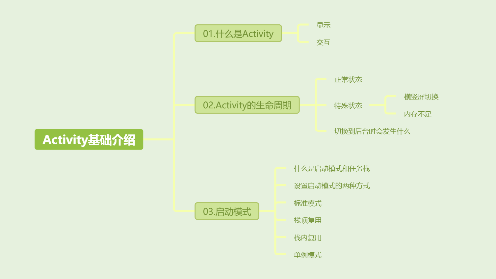
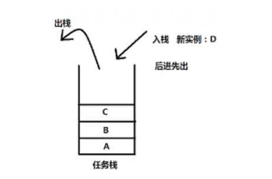
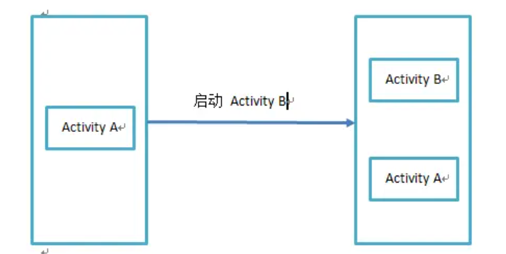
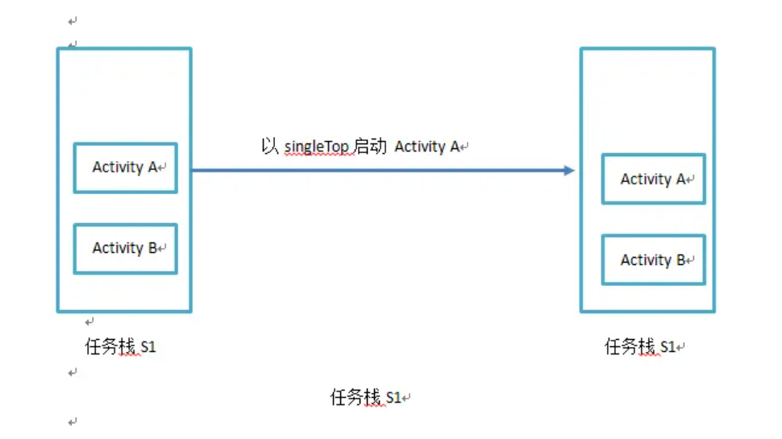
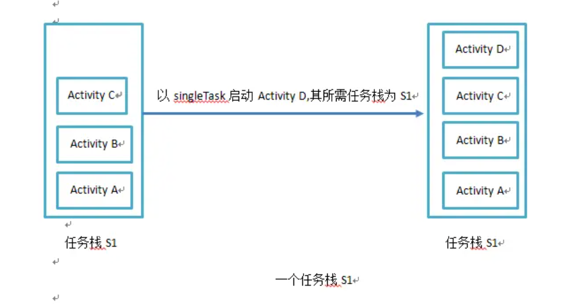
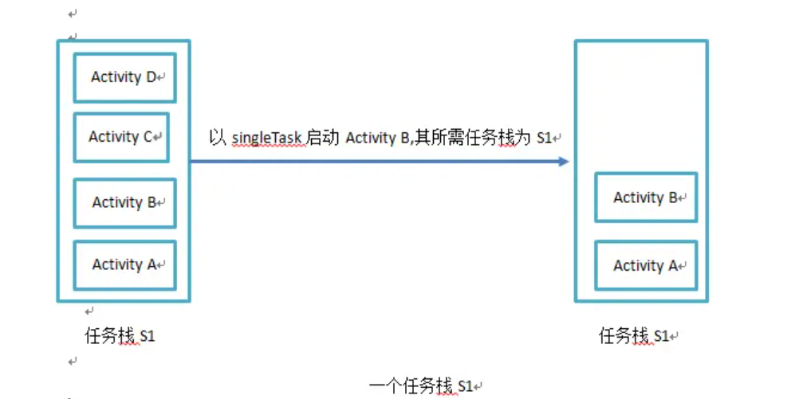
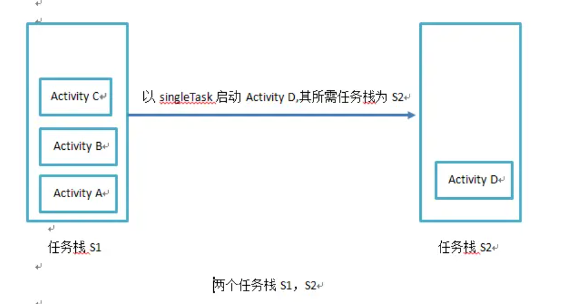
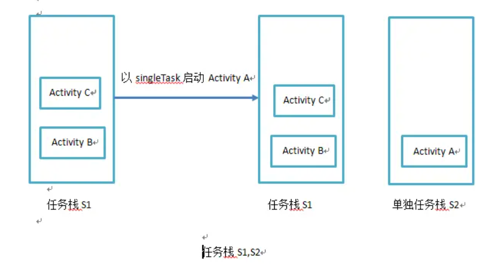

[toc]



## 01.什么是 Activity

`Activity` 是一个为用户提供应用界面的组件，用户借助其和应用完成交互。每个 `Activity` 一般对应一个屏幕。例如：

-  购物应用中的商城列表和购物车可能是不同的 Activity，也可能是同一 Activity 中的多个 Fragment。

怎么理解上面的提供界面和与用户进行交互？

- **显示界面**：`Activity` 是一个界面容器，负责容纳view对象（如按钮、文本框、图片等）来构成用户界面，具体的界面绘制由 `View` 层完成。
- **响应用户操作**：用户的交互事件（如点击、输入、滑动等）首先由具体的 `View` 对象捕获，`Activity` 作为控制器，通过监听或回调机制处理这些事件，从而实现与用户的交互。

## 02. Activity生命周期


### 2.1 正常状态下的生命周期

- onCreate()：主要进行资源加载和初始化。
  - 资源加载：比如`setContentView(R.layout.activity_main)`加载布局文件资源 ，此时`onCreate` 将 XML 布局文件提取到内存中加载为 `View` 树，最终生成UI界面显示给用户。
  - 资源初始化： `Button button = findViewById(R.id.button);`初始化按钮控件。
  -  `onCreate` 是资源加载和初始化的主要阶段，但并不是唯一的地方。例如，如果某些资源在 `onStart` 或 `onResume` 阶段才需要使用（如动画、某些状态刷新等），可以延迟到这些方法中再加载，以节省内存和提高效率。
- onRestart()：表示Activity正在重新变得可见。这种情形一般是用户行为导致的，比如用户按Home键切换到桌面或打开了另一个新的Activity，接着用户又回到了这个Actvity。
- onStart(): 此时 `Activity` 已经可见，但并未到前台，用户还不能与它进行交互。举个例子：如果你打开了一个半屏的对话框，没有完全覆盖底层界面。此时底层界面就是可见但是不能交互的状态。
- onResume():表示Activity正式进入前台，可交互。

> 提问：在onCreate阶段通过setContentView()设置的界面，为什么在onResume()之后才`DecorView` 才会显示出来，对用户可见呢？
>
> 在onResume()阶段会实例化ViewRootImpl对象，然后调用其setView()方法。其中setView()方法经过一些列折腾，最终调用了performTraversals()方法，view树经过层层绘制，最终显示出来。

- onPause():表示 Activity正在停止，仍可见，但是不可交互。**对于启动一个新的Activity而言，当前Activity的onPause必须执行完，新的Activity的onResume才会执行**，因此onPause中不能进行耗时操作，会影响到新Activity的显示。
- onStop():表示Activity即将不可见，位于后台。可以做稍微重量级的回收工作，同样不能太耗时。
- onDestroy():表示Activity即将销毁，这是Activity生命周期的最后一个回调，用于将activity的资源从内存中清除，此时可以做一些回收工作和最终的资源回收。

在平常的开发中，我们经常用到的就是 onCreate()和onDestroy()，做一些初始化和回收操作。

### 2.2 特殊情况下的生命周期

Activity在横竖屏切换以及系统不足等特殊状态时会被直接杀死。

#### 2.2.1 横竖屏切换时发生销毁与重建

当设备横竖屏切换时，系统会销毁当前的 Activity 并重建它，以便重新加载适应新的屏幕方向的布局和配置。很好理解，资源布局已经不适配当前情况了，只能重新销毁和重建

#### 2.2.2 内存不足时，低优先级的 Activity 被杀死

当系统内存不足时，Android 会根据 `Activity` 的优先级从低到高杀死进程。`Activity` 的优先级取决于其状态：

1. 前台 `Activity`：正在与用户交互，优先级最高。
2. 可见但不在前台的 `Activity`：
3. 后台 `Activity`：已执行 `onStop()` 的 `Activity`，优先级最低。

需要注意的是，这里是系统直接终止了进程，Activity 的生命周期方法（如 `onPause`、`onStop`、`onDestroy`）不会被调用。

#### 2.2.3`onSaveInstanceState()` 和 `onRestoreInstanceState()`

以上两种异常状态都会导致Activity的销毁，我们可以通过以下两个函数在这种异常销毁时进行状态的保存和回复，它们会被自动调用。

- **onSaveInstanceState()**：保存状态。

  ```
  @Override
  protected void onSaveInstanceState(Bundle outState) {
      super.onSaveInstanceState(outState);
      outState.putString("inputText", editText.getText().toString());
  }
  ```

- **onRestoreInstanceState()**：当 `Activity` 被重建时，系统会在 `onStart()` 之后自动调用 `onRestoreInstanceState()`回复状态，此时传递的Bundle savedInstanceState就是之前保存的。

  ```
  @Override
  protected void onRestoreInstanceState(Bundle savedInstanceState) {
      super.onRestoreInstanceState(savedInstanceState);
      String savedText = savedInstanceState.getString("inputText");
      editText.setText(savedText);
  }
  ```

### 2.3 App切换到后台时会发生什么

当应用从前台切换到后台（例如用户按下 Home 键或打开其他应用），当前 `Activity` 会依次调用 `onPause()` 和 `onStop()`，但 **不会** 调用 `onDestroy()`。`onDestroy()` 只有在 `Activity` 被销毁时才会调用，而切换到后台只是让 `Activity` 暂时不可见，并不意味着销毁。

此时需要在onStop()中执于处理一些需要在 `Activity` 不再可见时暂停或停止的任务，例如暂停动画、视频播放等操作。

- **停止视频播放**：在后台运行视频播放器是浪费资源的，用户看不到视频内容，因此应当在 `onStop()` 中停止视频播放。

  ```java
  @Override
  protected void onStop() {
      super.onStop();
      // 停止视频播放
      videoPlayer.pause();
  }
  ```

## 03.Activity启动模式

- activity的启动模式分为两个部分，一个是在配置文件中指定的启动模式，一个是我们在代码中启动activity时使用Intent的FLAG来指定其启动模式。

  - ```
    <activity android:name=".Activity1"
    	android:launchMode="singleTask"
    	android:label="@string/app_name">
    </activity>
    ```

  - ```
    Intent intent = new Intent(context, HiddenActivity.class);
    intent.setFlags(Intent.FLAG_ACTIVITY_EXCLUDE_FROM_RECENTS);
    context.startActivity(intent);
    ```

#### 3.0 任务栈介绍

启动模式代表activity在任务栈中如何存放。

什么是任务栈？首先什么是任务？ 任务就是一组连续的activity的集合。举例：打开购物应用主页，搜索要购买的商品，加入购物车，进入结算界面。这一连串的活动就是一个任务。

任务栈呢？活动之间是有顺序的，有先后关系的，我要进行回退可以退到上一个界面，我要加入就在当前界面的后面加入。因此我们通过一个栈来管理任务内部活动的进入顺序。

#### 3.1 启动模式的类别

- Android提供了四种Activity启动方式：
  - 标准模式（standard）
  - 栈顶复用模式（singleTop）
  - 栈内复用模式（singleTask）
  - 单例模式（singleInstance）

#### 3.2 启动模式的结构——栈

- Activity的管理是采用任务栈的形式，任务栈采用“后进先出”的栈结构。

  

#### 3.3 标准模式(standard)

- 每启动一次Activity，就会创建一个新的Activity实例并置于栈顶。谁启动了这个Activity，那么这个Activity就运行在启动它的那个Activity所在的栈中。

  - 例如：Activity A启动了Activity B，则就会在A所在的栈顶压入一个新的Activity。

    

#### 3.4 栈顶复用模式(singleTop)

- 如果需要新建的Activity位于任务栈栈顶，那么此Activity的实例就不会重建，而是重用栈顶的实例。并回调如下方法：

  ```java
  @Override
  protected void onNewIntent(Intent intent) {
      super.onNewIntent(intent);
  }
  ```

- 如果栈顶不是新建的Activity，就会创建该Activity新的实例，并放入栈顶。

  

#### 3.5 栈内复用模式(singleTask)

- 该模式，可以通过在AndroidManifest文件的Activity中指定该Activity需要加载到那个栈中，即singleTask的Activity可以指定想要加载的目标栈。
- singleTask和taskAffinity配合使用，指定开启的Activity加入到哪个栈中。

```
<activity android:name=".Activity1"
	android:launchMode="singleTask"
	android:taskAffinity="com.jjjjjjava.task"
	android:label="@string/app_name">
</activity>
```

- 关于taskAffinity的值：
  - 每个Activity都有taskAffinity属性，这个属性指出了它希望进入的Task。如果一个Activity没有显式的指明该Activity的taskAffinity，那么它的这个属性就等于Application指明的taskAffinity，如果Application也没有指明，那么该taskAffinity的值就等于包名。
  
  - 在这种模式下，如果Activity指定的栈不存在，则创建一个栈，并把创建的Activity压入栈内。
  
  - 如果Activity指定的栈存在，如果其中没有该Activity实例，则会创建Activity并压入栈顶，如果其中有该Activity实例，则把该Activity实例之上的Activity杀死清除出栈，重用并让该Activity实例处在栈顶，然后调用onNewIntent()方法。
  
  - 对应如下三种情况：
  
  - 
  
  - 
  
  - 
  
    
  
- 应用场景：
  - 大多数App的主页。对于大部分应用，当我们在主界面点击回退按钮的时候都是退出应用，那么当我们第一次进入主界面之后，主界面位于栈底。如果我们采用栈内复用的模式，那么以后不管我们打开了多少个Activity，只要我们再次回到主界面，都会将主界面Activity上所有的Activity移除，以此来让主界面Activity处于栈顶，此时我们够保证退出应用时所有的Activity都能被销毁。
  

#### 3.6 单例模式(singleInstance)

- 作为栈内复用模式（singleTask）的加强版
  - 打开该Activity时，直接创建一个新的任务栈，并创建该Activity实例放入新栈中。一旦该模式的Activity实例已经存在于某个栈中，任何应用再激活该Activity时都会重用该栈中的实例。
  - 

#### 3.7 Activity的Flags

- Activity的Flags很多，这里介绍集中常用的，用于设定Activity的启动模式。可以在启动Activity时，通过Intent的setFlags()方法设置。

- ```
  Intent intent = new Intent(context, TargetActivity.class);
  intent.setFlags(Intent.FLAG_ACTIVITY_NEW_TASK | Intent.FLAG_ACTIVITY_CLEAR_TOP);
  context.startActivity(intent);
  ```
  
  - **(1)FLAG_ACTIVITY_NEW_TASK**
  - 其效果与指定Activity为singleTask模式一致。
  - **(2)FLAG_ACTIVITY_SINGLE_TOP**
  - 其效果与指定Activity为singleTop模式一致。
  - **(3)FLAG_ACTIVITY_CLEAR_TOP**
  - 具有此标记位的Activity，当它启动时，在同一个任务栈中所有位于它上面的Activity都要出栈。如果和singleTask模式一起出现，若被启动的Activity已经存在栈中，则清除其之上的Activity，并调用该Activity的onNewIntent方法。如果被启动的Activity采用standard模式，那么该Activity连同之上的所有Activity出栈，然后创建新的Activity实例并压入栈中。
  - 

