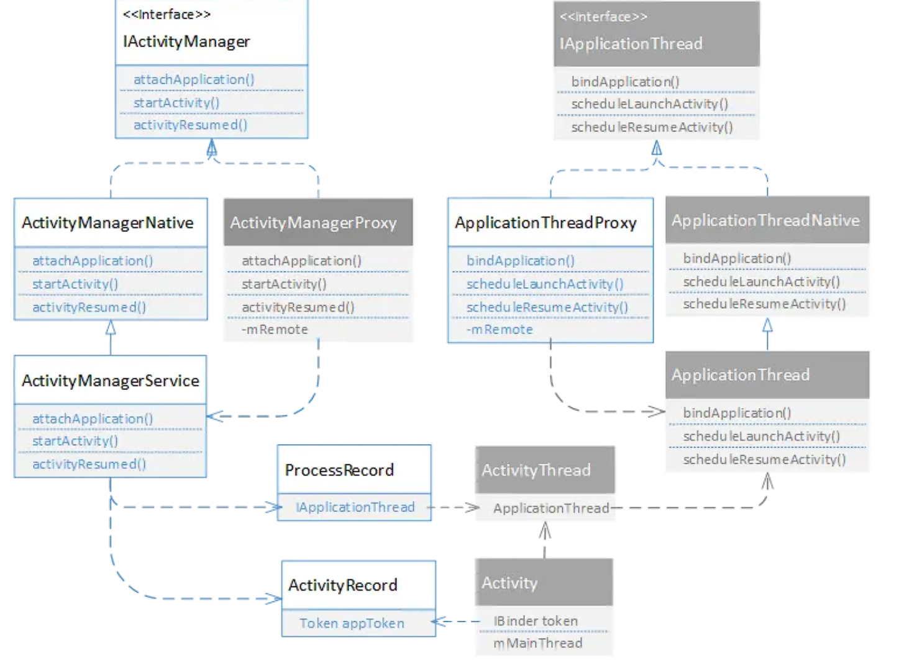

[toc]


## 01. 冷启动与热启动

Activity启动过程中，一般会牵涉到应用启动的流程。应用启动又分为冷启动和热启动。

1. 冷启动：点击桌面图标，手机系统不存在该应用进程，这时系统会重新fork一个子进程来加载Application并启动Activity，这个启动方式就是冷启动。
2. 热启动：应用的热启动比冷启动简单得多，开销也更低。在热启动中，因为**系统里已有该应用的进程**，所以系统的所有工作就是将您的 Activity 带到前台。 冷启动是应用完全从0开始启动，涉及到更多的内容，所以就应用冷启动的过程展开讨论。


应用程序分为创建和初始化两个部分，创建是指创建应用程序进程并执行main函数，初始化是指创建application和activity。

创建过程主要是由发起创建请求的进程-AMS线程-Zygote进程之间的沟通

初始化主要是由新创建的app进程-AMS线程之间的沟通。

## 02. 应用程序创建流程

一般来说，冷启动包括了以下内容：

1. 启动进程

   点击图标事件发生在Launcher应用的进程，startActivity()函数最终是由Instrumentation通过Android的Binder跨进程通信机制 发送消息给 system_server 进程；

    在 system_server 中，启动进程的操作由AMS处理。AMS发现ProcessRecord不存在时，就会执行`Process.start()`，最终通过 socket 通信告知 Zygote 进程 fork 子进程（app进程）

2. 开启主线程

   app进程创建后，首先是反射调用`android.app.ActivityThread`类的main方法，main()函数里会：准备looper循环，在ActivityThread.attach中创建 ApplicationThread对象，借助该对象和AMS建立Binder通信，然后开启主线程消息循环`Looper.loop()`。

```java
public static void main(String[] args) {
        //....

        //创建Looper和MessageQueue对象，用于处理主线程的消息
        Looper.prepareMainLooper();

        //创建ActivityThread对象
        ActivityThread thread = new ActivityThread(); 

        //建立Binder通道 (创建新线程)
        thread.attach(false);

        Looper.loop(); //消息循环运行
        throw new RuntimeException("Main thread loop unexpectedly exited");
    }
```


## 3.应用程序初始化流程

1. 创建并初始化 Application和Activity

   在主线程中，`ActivityThread#attach(false)` 方法用于通知系统进程（`system_server`）启动应用。它通过 `Binder` 通信调用 `ActivityManagerService#attachApplication(mAppThread)` 方法，向 `ActivityManagerService`（AMS）传递 `ApplicationThread`对象，用于应用进程与系统进程之间的通信。

   在 `system_server` 进程的 `ActivityManagerService` 中，`attachApplication(mAppThread)` 方法会执行以下操作：

   - **初始化 `Application`**：
     - thread#bindApplication()：这个方法通过 ApplicationThread通知主线程 Handler，执行应用的初始化。主要任务是：
       1. **创建 `Application` 对象**：为整个应用程序创建一个唯一的 `Application` 实例。
       2. **绑定 `Context`**：为 `Application` 绑定 `Context`，提供全局的应用上下文。
       3. **调用 `Application#onCreate()`**：执行 `Application` 的生命周期回调方法 `onCreate()`，以便应用程序可以进行初始化操作，如启动依赖的服务、初始化库等。
   - **初始化 `Activity`**：mStackSupervisor#attachApplicationLocked()：这个方法最终会调用 ActivityThread#ApplicationThread#scheduleLaunchActivity()方法，用于启动指定的 Activity。流程如下：
     1. `scheduleLaunchActivity()` 将启动 `Activity` 的任务发送到主线程的 `Handler` 中。
     2. `Handler` 在主线程中处理消息，创建 `Activity` 对象。
     3. 创建 `Activity` 对象后，通过 `Instrumentation#callActivityOnCreate()` 调用 `Activity#onCreate()` 生命周期方法，完成 `Activity` 的初始化。

   

2. 布局&绘制

   在 `Activity` 完成初始化后，系统会启动布局和绘制流程，以便将 `Activity` 的界面显示给用户。

   源码流程可以参考[Android View 的绘制流程分析及其源码调用追踪](https://link.juejin.cn?target=https%3A%2F%2Fwww.jianshu.com%2Fp%2Fd3be5def8398)

至此，应用启动流程完成。

其中1、2、3的源码流程可以参考[Android Application 启动流程分析及其源码调用探究](https://link.juejin.cn?target=https%3A%2F%2Fwww.jianshu.com%2Fp%2F03ec8203919e)，但代码细节不是本篇重点。

下面说说上述流程中的几个关键角色，以及其作用：

### 3.1应用启动中的Binder机制

Binder接口在客户端和服务端各有一个实现：

1. Binder接口的两种实现一般从命名上可以区分：xxxNative和xxxProxy
2. xxxNative继承**Stub**，并继承Binder，运行服务端进程内，代表服务端进程的本地对象；
3. xxxProxy运行在客户端进程，是服务端Binder对象在客户端进程的代理；
4. 它们之间的通信是由客户端端用IBinder的`transact()`对数据进行序列化并发送请求，服务端用Binder的`onTransact()`响应执行并返回结果给客户端，这个过程是同步的。

> 这些Binder都由ServiceManager统一管理：
>
> ServiceManager管理所有的Android系统服务，有人把ServiceManager比喻成Binder机制中的DNS服务器，client端应用如果要使用系统服务，调用getSystemService接口，ServiceManager就会通过字符串形式的Binder名称找到并返回对应的服务的Binder对象。

#### 1. **Stub 和 Proxy 的定义**

- **Stub**（桩）：是服务端的实际类，它是对接口方法的具体实现者，负责接收来自客户端的请求，并在服务端执行实际的操作。
- **Proxy**（代理）：是客户端的代理类，提供和实际类一模一样的接口方法，但是并不实际执行。它会将客户端的调用打包（序列化）成适合通过 Binder 机制发送的数据，然后将其发送到服务端的 Stub 进行处理。

#### 2.实际通信

App进程与SystemServer进程是通过Binder机制进行进程间通信，Android为此设计了两个Binder接口：

1. IActivityManager: 作为应用进程请求系统进程的接口
2. IApplicationThread: 作为系统进程请求应用进程的接口

数据传输分为两种情况，一个是系统进程作为服务端，另一个是应用进程作为服务端。

**情况一：系统进程作为服务端**

- **服务端：系统进程中的 `IActivityManager` 接口实现**
  - **`IActivityManager`**：定义了服务端提供给客户端的接口，比如 `startActivity()` 和 `bindService()`。
  - **`ActivityManagerNative`**：它是 `IActivityManager` 的一个抽象实现，作为 Binder 机制中的 Stub。`ActivityManagerNative` 继承自 `Binder`，并且实现了 `IActivityManager` 接口。它的职责是负责接收来自客户端的调用，并在服务端处理这些调用。它也是服务端暴露的 Binder 接口。
  - **`ActivityManagerService`（AMS）**：系统进程中的实际服务实现，继承自 `ActivityManagerNative`。`AMS` 是 Android 系统中管理应用生命周期的核心服务，负责执行诸如 `startActivity()`、`bindService()` 之类的具体操作。当客户端发起远程调用时，`AMS` 会通过 Binder 机制接收调用，并在服务端执行实际的操作。
- **客户端：应用进程中的代理 `ActivityManagerProxy`**
  - **`ActivityManagerProxy`**：这是客户端进程中用于代理系统服务的类。它实现了 `IActivityManager` 接口，但它并不直接执行方法，而是将客户端的调用（如 `startActivity()`）通过 Binder 机制发送给服务端。`ActivityManagerProxy` 使用 `transact()` 方法将方法调用打包为 `Parcel`，并通过 Binder 发送给 `ActivityManagerNative` 处理。
  
  - **客户端的调用流程**：应用进程中的代码通过 `ActivityManagerProxy` 发起调用，比如调用 `startActivity()`。这个调用并不会直接在客户端执行，而是被 `Proxy` 序列化并发送给服务端的 `ActivityManagerNative`，然后由 `AMS` 处理。

**情况二：应用进程作为服务端**

当应用进程作为服务端时，例如 `IApplicationThread` 接口：

- **服务端**：`ApplicationThread` 是 `IApplicationThread` 的实现，负责接收系统进程（`AMS`）发来的请求，并通过 `Handler` 将这些请求转发给应用进程的主线程来处理。
- **客户端**：`ApplicationThreadProxy` 是 `AMS` 中的代理对象，用于通过 `Binder` 向应用进程发送请求（如启动 `Activity`）。

系统进程充当服务端是为了应用进程使用系统服务，包括不限于：注册自身，startActivity。

应用进程充当服务是为了接收系统进程的命令，包括不限于：onCreate

app与系统服务进程的Binder接口如下图：



### 3.2 初始化流程

在ActivityThread的main方法中，调用 `ActivityThread#attach(false) `方法进行 Binder 通信，通知system_server进程执行 `ActivityManagerService#attachApplication(mAppThread) `方法，用于初始化Application和Activity。

会将自己的ApplicationThread绑定到AMS中：

```java
ActivityThread.main()
└── ActivityThread.attach()
    final IActivityManager mgr = ActivityManager.getService();
    然后IActivityManager.attachApplication(mAppThread)
        └── Binder.transact()
```

`ActivityManager.getService()` 方法用于从serviceManager中获取AMS的Binder对象，并将其封装成为`IActivityManager` 的接口代理，应用进程可以通过这个代理与 `AMS` 进行通信。

这里传递的mAppThread是指应用进程中 `ApplicationThread` 类的实例。它是一个 Binder 对象，可以提供`IApplicationThread` 的接口代理，AMS可以通过这个代理和应用进程通信。

同时在 `ActivityManagerService` 中，`attachApplication()` 方法会接收 `mAppThread` 这个 Binder 对象，并将其与 `ProcessRecord` 绑定，代表这个应用进程与 AMS 建立了通信连接。

#### `ActivityManagerService.attachApplication()` 实现：

```java
@Override
public final void attachApplication(IApplicationThread appThread) {
    // 将传递进来的 ApplicationThread 实例（即 mAppThread）与 ProcessRecord 绑定
    synchronized (this) {
        // 获取应用进程的 ProcessRecord
        ProcessRecord app = getProcessRecordLocked(appThread);
        // 通过 ApplicationThread 向应用进程发送请求，进行 Activity 启动等操作
        app.thread = appThread;  // 这里的 appThread 就是 mAppThread
    }
}
```

- `attachApplication()` 方法接收 `IApplicationThread`（即 `mAppThread`）对象，它是应用进程的 Binder 接口。
- `AMS` 会将该 `mAppThread` 和系统中的 `ProcessRecord` 进行绑定，这样 `AMS` 就可以通过 `mAppThread` 向应用进程发送指令，通知它启动 `Activity` 等操作。
