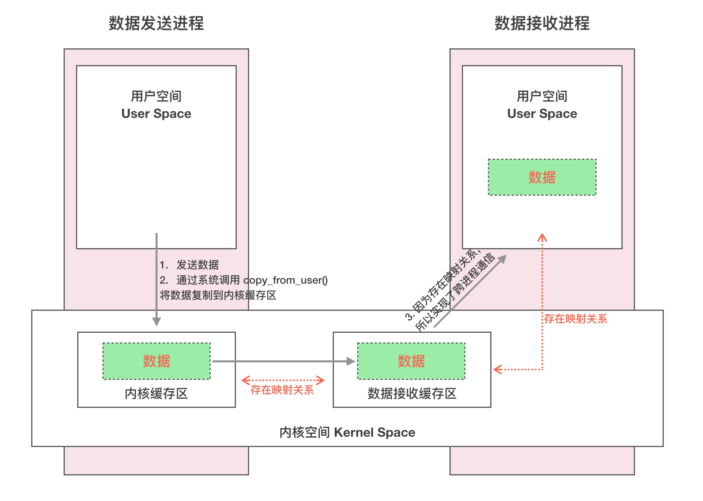

[toc]


## 01. Binder概述

### 1.1 什么是Binder

Binder 是一种进程间通信机制，从字面上来解释 Binder 有胶水、粘合剂的意思，顾名思义就是粘和不同的进程，使之实现通信。

### 1.2 为什么要有Binder

Linux 已经提供了管道、消息队列、共享内存和 Socket 等 IPC 机制。那为什么 Android 还要提供 Binder 来实现 IPC 呢？主要是基于**性能**、**稳定性**和**安全性**几方面的原因。

#### 性能

首先说说性能上的优势。Socket 作为一款通用接口，其传输效率低，开销大，主要用在跨网络的进程间通信和本机上进程间的低速通信。消息队列和管道采用存储-转发方式，即数据先从发送方缓存区拷贝到内核开辟的缓存区中，然后再从内核缓存区拷贝到接收方缓存区，至少有两次拷贝过程。共享内存性能最高，无需拷贝。Binder 需要一次数据拷贝，性能上仅次于共享内存。

从性能上看，就用共享内存就好了啊？为什么用Binder呢？这是基于稳定性和安全性的权衡考虑。

注：各种IPC方式数据拷贝次数。

| IPC方式              | 数据拷贝次数 |
| -------------------- | ------------ |
| 共享内存             | 0            |
| Binder               | 1            |
| Socket/管道/消息队列 | 2            |

#### 稳定性

再说说稳定性，Binder 基于 C/S 架构，客户端（Client）有什么需求就丢给服务端（Server）去完成，架构清晰、职责明确又相互独立，自然稳定性更好。共享内存虽然无需拷贝，但是控制复杂，难以使用，不像binder这样结构清晰。从稳定性的角度讲，Binder 机制是优于内存共享的。

#### 安全性

另一方面就是安全性。作为用户当然不希望我们下载的 APP 偷偷读取我的通信录，上传我的隐私数据，后台偷跑流量、消耗手机电量。

**首先传统的 IPC 接收方无法获得对方可靠的进程用户ID/进程ID（UID/PID）**，只能由用户在数据包中填入 UID/PID，但这样不可靠，容易被恶意程序利用。从而无法正确鉴别对方身份。而Android 为每个安装好的 APP 分配了自己的 UID，由内核进行UID的添加，借由内核就可以避免用户进程的恶意利用，从而正确失败进程的身份。

**其次传统的 IPC 访问接入点是开放的，只要知道这些接入点的程序都可以和对端建立连接**，不管怎样都无法阻止恶意程序通过猜测接收方地址获得连接。而Binder不仅支持向外注册和暴露的实名Binder，也提供了短时间通信，不暴露的匿名Binder，安全性高。

基于性能，稳定性和安全性的综合考虑，Android有了自己的IPC通信机制：Binder。

**最后用一张表格来总结下 Binder 的优势：**

| 优势   | 描述                                                         |
| ------ | ------------------------------------------------------------ |
| 性能   | 只需要一次数据拷贝，性能上仅次于共享内存                     |
| 稳定性 | 基于 C/S 架构，职责明确、架构清晰，因此稳定性好              |
| 安全性 | 由内核为每个 APP 分配 UID，可以正确识别进程身份，同时支持匿名Binder，防止接入点暴露 |


## 02. Linux下传统的进程间通信原理

我们了解了Binder存在的必要性，我们要想了解Binder通信的原理，首先得理解IPC通信的原理。

IPC的存在是建立在进程间通信困难的基础上，但是没有人想过，为什么进程间通信很困难吗？不都在内存上跑吗？知道地址不能访问吗？

### 2.1 基础概念

#### 1. 进程隔离 

简单的说就是操作系统中，进程与进程间内存是不共享的。两个进程就像两个平行的世界，A 进程没法直接访问 B 进程的数据。进程隔离本质是基于页表实现的。

为什么说是平行世界，因为每个进程有独立的但相似的虚拟地址空间。操作系统通过 MMU 来管理进程的虚拟地址到物理地址的映射，不同进程的页表是分开的，确保它们无法直接访问其他进程的物理内存地址。

#### 2. 进程空间划分：用户空间，内核空间

**你可以认为进程的虚拟空间划分为表世界和里世界，虽然都是平行世界，但是其本质的里世界（内核空间）是同一个。平行的只是表世界（用户空间），因此IPC数据传输实际是借助相同的里世界进行传输。**

对于**32 位系统**来说，虚拟地址空间是 2^32 = 4GB，也就是说每个进程理论上可以访问 4GB 的地址空间（虚拟存储空间）。但这 4GB 并不全是留给用户程序的，它被分为两大部分：

**用户空间（User Space）**：

- 是应用程序运行的地方。

**内核空间（Kernel Space）**：

- 是操作系统内核及其模块（如驱动程序）运行的地方。内核空间拥有对整个系统的完全控制，它们能够访问所有的物理内存地址，也就是说内核不受虚拟地址空间的限制。

**为什么要有内存的隔离？**

**安全性**：用户进程被隔离在用户空间内，无法随意访问内核空间的敏感数据或直接操作硬件。如果没有这种隔离，恶意程序可能会尝试修改系统内核或操作硬件，导致严重的安全问题。

**稳定性**：应用程序如果在执行过程中崩溃，它只能影响用户空间中的内存。内核的隔离防止用户程序导致整个操作系统崩溃。

#### 3. 系统调用

系统调用其实也是进程间通信机制，只不过不是用户进程间的，是内核和用户之间的。

1. **用户进程发起请求**：用户使用系统调用希望执行内核代码，访问内核资源，发起系统调用请求。
2. **进入内核态**：内核进程监听到该系统调用，进行**上下文切换**，使得处理器从**用户态**切换到**内核态**。
3. **内核执行请求的操作**：此时，用户进程的执行被暂停，内核接管控制权，并根据系统调用号确定需要执行的内核代码，然后执行对应代码。
4. **返回结果**：内核执行完系统调用所要求的操作后，将结果返回给用户进程，并将控制权切换回**用户态**，用户进程继续执行


Linux下进程通信的系统调用通过下面的两个函数实现

```
copy_from_user() //将数据从用户空间拷贝到内核空间
copy_to_user() //将数据从内核空间拷贝到用户空间
```


### 2.2 Linux下传统IPC原理


## 03. Binder跨进程通信底层原理

3.1 Binder驱动

**首先要解决一个问题：跨进程通信是需要内核空间做支持的**。传统的 IPC 机制如管道、Socket 都是内核的一部分，因此通过内核支持来实现进程间通信自然是没问题的。但是 Binder 并不是 Linux 系统内核的一部分，那怎么办呢？

这就得益于 Linux 的**动态内核可加载模块**（Loadable Kernel Module，LKM）的机制；它在运行时被链接到内核作为内核的一部分运行。这样用户进程之间通过这个内核模块作为桥梁来实现通信。

> 在 Android 系统中，这个运行在内核空间，负责各个用户进程通过 Binder 实现通信的内核模块就叫 **Binder 驱动**（Binder Dirver）。由swapper内核进程加载。


### 3.2 **mmap() 的工作过程：**

那么如何降低内存拷贝的次数呢？这倚赖于mmap，即：让表世界等于里世界。

也就是将内核空间中的内存区域映射到进程的虚拟地址空间中，这样进程访问自己的这段虚拟地址空间实际通过页表转化到对应内核空间的物理地址中。即：用户进程可以直接访问内核物理空间。


这不就是共享内存吗？你可以这么说，binder是更为复杂的共享内存。

### 3.3 Binder IPC通信过程

一次完整的 Binder IPC 通信过程通常是这样：

1. 首先 Binder 驱动在内核空间中开辟一块数据缓冲区，用作数据的存储
2. 接着将这一块内核空间映射到 **接收进程的用户虚拟地址空间**，称为 **接收进程的用户空间缓存区**。
3. 发送方（进程 A）通过系统调用（ `copy_from_user()`）将用户空间的数据复制到内核空间的缓冲区中。
4. 此时进程 B 就可以通过访问自身的用户空间缓存区，经过内存映射，来访问到这块物理内存，进而获取到进程 A 传递的数据了。




这是底层的通信原理，但是到这一块，也只是类似共享内存，并没有超越其的地方，没有体现出自己的安全性，稳定性。

## 04. Bider通信模型

介绍完 Binder IPC 的底层通信原理，接下来我们看看实现层面是如何设计的。这才是Binder的精髓。

一次完整的进程间通信必然至少包含两个进程，通常我们称通信的双方分别为客户端进程（Client）和服务端进程（Server），由于进程隔离机制的存在，通信双方必然需要借助 Binder 来实现。

### 4.1 Client/Server/ServiceManager/驱动

Binder 是基于 C/S 架构的。由一系列的组件组成，包括 Client、Server、ServiceManager、Binder 驱动。其中 Client、Server、Service Manager 运行在用户空间，Binder 驱动运行在内核空间。其中 Service Manager 和 Binder 驱动由系统提供，而 Client、Server 由应用程序来实现。Binder驱动注册成功后成为一个设备文件节点：/dev/binder，Client、Server 和 ServiceManager 可以通过系统调用 open、mmap 和 ioctl 来访问该设备文件r，从而实现与 Binder 驱动的交互来间接的实现跨进程通信。


Client、Server、ServiceManager、Binder 驱动这几个组件在通信过程中扮演的角色就如同互联网中服务器（Server）、客户端（Client）、DNS域名服务器（ServiceManager）以及路由器（Binder 驱动）之前的关系。

通常我们访问一个网页的步骤是这样的：首先在浏览器输入一个地址，如 www.google.com 然后按下回车键。但是并没有办法通过域名地址直接找到我们要访问的服务器，因此需要首先访问 DNS 域名服务器，域名服务器中保存了 www.google.com 对应的 ip 地址 10.249.23.13，然后通过这个 ip 地址才能放到到 www.google.com 对应的服务器。

我们拿着Binder对象名字，向ServiceManager查询，就可以获得Binder对象在内核中的句柄，从而访问到它。

**请问：这个地址是什么**：是Binder驱动在内核中创建的Binder对象的引用。


**那么ServiceManager如何能够建立这个名称和引用的映射关系呢？**

驱动为这个Server的 Binder 创建位于内核中的实体节点，将名字以及新建的引用打包传给 ServiceManager。ServiceManger 收到数据后从中取出名字和引用填入查找表。

### 4.2 Binder通信过程

至此，我们大致能总结出 Binder 通信过程：

1. 首先，一个进程使用 BINDER_SET_CONTEXT_MGR（MGR就是Manager） 命令通过 Binder 驱动将自己注册成为 ServiceManager；
2. Server 通过驱动向 ServiceManager 中注册 Binder（Server 中的 Binder 实体），表明可以对外提供服务。驱动为这个 Binder 创建位于内核中的实体节点以及 ServiceManager 对实体的引用，将名字以及新建的引用打包传给 ServiceManager，ServiceManger 将其填入查找表。
3. Client 通过名字，在 Binder 驱动的帮助下从 ServiceManager 中获取到对 Binder 实体的引用，通过这个引用就能实现和 Server 进程的通信。

我们看到整个通信过程都需要 Binder 驱动的接入。下图能更加直观的展现整个通信过程(为了进一步抽象通信过程以及呈现上的方便，下图我们忽略了 Binder 实体及其引用的概念)：


### 4.3 Binder通信中的代理模式

我们已经解释清楚 Client、Server 借助 Binder 驱动完成跨进程通信的实现机制了，但是还有个问题会让我们困惑。**A 进程想要 B 进程中某个对象（object）是如何实现的呢？毕竟它们分属不同的进程，A 进程 没法直接使用 B 进程中的 object。**

当 A 进程想要获取 B 进程中的 object 时，驱动并不会真的把 object 返回给 A，而是返回了一个跟 object 看起来一模一样的代理对象 objectProxy，这个 objectProxy 具有和 object 一摸一样的方法，但是这些方法并没有 B 进程中 object 对象那些方法的能力。

A进程调用方法，传递参数，此时这个调用并不会直接在客户端执行，而是被 `Proxy` 使用 `transact()` 方法将方法调用打包为 `Parcel`，并通过 Binder 驱动发送给 进程B的`Stub` 实际对象进行处理。

类似下图：


## 05. stub-proxy模型

那么这个代理模式的原理我们知道了，但是它的实际设计是什么样的呢？现在让我们来学习一下代理模式的实现：stub-proxy模型。

### 5.1 **Stub 和 Proxy 的定义**

- **Stub**（桩）：是服务端的实际类，它是对接口方法的具体实现者，负责接收来自客户端的请求，并在服务端执行实际的操作。
- **Proxy**（代理）：是客户端的代理类，提供和实际类一模一样的接口方法，但是并不实际执行。它会将客户端的调用打包（序列化）成适合通过 Binder 机制发送的数据，然后将其发送到服务端的 Stub 进行处理。

### 5.2 Binder中的Stub和Proxy

Binder接口在客户端和服务端各有一个实现：

1. Binder接口的两种实现一般从命名上可以区分：xxxNative和xxxProxy
2. xxxNative继承**Stub**，并继承Binder，运行服务端进程内，代表服务端进程的本地对象；
3. xxxProxy运行在客户端进程，是服务端Binder对象在客户端进程的代理；
4. 它们之间的通信是由客户端端用IBinder的`transact()`对数据进行序列化并发送请求，服务端用Binder的`onTransact()`响应执行并返回结果给客户端，这个过程是同步的。

### 5.3 执行流程

服务端将自己的stub类型binder对象返回给AMS，AMS发送给客户端。

客户端将binder对象转化为proxy类型Binder对象。然后调用proxy内部的方法xxxProxy。这个方法最终会将请求和参数封装到 `Parcel data` 中，并通过 `transact()` 将数据发送到服务端。 `transact()` 会通过 `ioctl` 进行 `Binder` 驱动的系统调用将数据拷贝到内核数据缓冲区，然后映射到服务端用户空间。

服务端的 `onTransact()` 方法被触发，`onTransact()` 从 `Parcel data` 中解析请求和参数。然后调用xxxNative在本地处理，处理完后，服务端将结果写入 `Parcel reply`。然后通过 `ioctl` 再次进行 `Binder` 驱动的系统调用将数据拷贝到内核数据缓存区，此时客户端通过mmap映射即可直接访问。


值得注意的是：

Binder机制从客户端发送到服务端还是从服务端返回数据，都是进行一次内存的拷贝。只不过通过将内核空间映射到服务端用户空间以及后续将内核空间映射到客户端用户空间，来避免后续的内存拷贝。


## 06. 演示案例

借助一个service组件提供服务的演示案例，我们来讲解清楚Binder驱动的底层和通信层原理。

这是Binder的AIDL接口

```java
public interface IGradeService extends android.os.IInterface {

    public static abstract class Stub extends android.os.Binder
        implements IGradeService {

        public static IGradeService asInterface(android.os.IBinder obj) {
            if (obj == null) {
                return null;
            }
            android.os.IInterface iin = obj.queryLocalInterface(DESCRIPTOR);
            if (iin != null && iin instanceof IGradeService) {
                return (IGradeService) iin;
            }
            return new Proxy(obj);
        }

        @Override
        public boolean onTransact(int code, Parcel data, Parcel reply, int flags) throws RemoteException {
            // 处理客户端的请求
        }

        private static class Proxy implements IGradeService {
            private android.os.IBinder mRemote;

            Proxy(android.os.IBinder remote) {
                mRemote = remote;
            }

            @Override
            public int getStudentGrade(String name) throws RemoteException {
                Parcel data = Parcel.obtain();
                Parcel reply = Parcel.obtain();
                int result;
                try {
                    data.writeInterfaceToken(DESCRIPTOR);
                    data.writeString(name);
                    mRemote.transact(Stub.TRANSACTION_getStudentGrade, data, reply, 0);
                    reply.readException();
                    result = reply.readInt();
                } finally {
                    reply.recycle();
                    data.recycle();
                }
                return result;
            }
        }
    }
}

```

案例分析：

1. **服务端返回 `Stub` 对象**：当服务端启动时，`onBind()` 方法会返回 `Stub` 实例。AMS 将这个 `Stub` 传递给客户端。
2. **客户端转换stub对象为proxy对象**：客户端调用`Proxy.getStudentGrade()` 方法

```java
public static IGradeService asInterface(IBinder obj) {
    if (obj == null) {
        return null;
    }
    IInterface iin = obj.queryLocalInterface(DESCRIPTOR);
    if (iin != null && iin instanceof IGradeService) {
        // 同一进程，直接返回 Stub
        return (IGradeService) iin;
    }
    // 跨进程，返回 Proxy
    return new Proxy(obj);
}
```

​	该方法实现了 **Binder 对象之间的相互转换**。根据当前是同一进程还是跨进程调用，`asInterface()` 会返回 `Stub` 或 `Proxy`：

- 如果 `IBinder` 对象在同一个进程中，直接返回 `Stub` 对象，因为没有必要通过 `Proxy` 来发送 `transact()` 调用。
- 如果 `IBinder` 是在不同的进程中，则返回 `Proxy` 对象，它负责处理跨进程的通信。


3. **客户端调用代理对象方法**：客户端获取到proxy对象后，调用proxy的getStudentGradeProxy方法，该方法最终调用transact方法借助AMS传递给服务端

```java
mRemote.transact(Stub.TRANSACTION_getStudentGrade, data, reply, 0);
```

4. **服务端解析并调用本地方法**：服务端接受到Binder调用后，在onTransact方法中先解析data，然后根据code是Stub.TRANSACTION_getStudentGrade，调用getStudentGradeNative方法处理data，并最终将结果写入到reply中并返回客户端。

```java
public boolean onTransact(int code, Parcel data, Parcel reply, int flags) throws RemoteException {
            // 处理客户端的请求
        }
```

补充：

服务端service代码

```java
public class AidlGradeService extends Service {
    // 实现 Stub 的 getStudentGrade 方法
    private final IBinder mBinder = new IGradeService.Stub() {
        @Override
        public void basicTypes(int anInt, long aLong, boolean aBoolean, float aFloat, double aDouble, String aString) throws RemoteException {

        }

        @Override
        public int getStudentGrade(String name) throws RemoteException {
            return StudentMap.getStudentGrade(name);
        }
    };

    @Nullable
    @Override
    public IBinder onBind(Intent intent) {
        return mBinder;
    }
}
```

客户端代码

```java
public class AidlActivity extends BaseViewBindingActivity<ActivityBinderBinding> {

    private IGradeService mBinderProxy;

    private final ServiceConnection mServiceConnection = new ServiceConnection() {
        @Override
        public void onServiceConnected(ComponentName componentName, IBinder iBinder) {
            // 连接服务后，根据是否跨进程获取Binder或者Binder的代理对象
            mBinderProxy = IGradeService.Stub.asInterface(iBinder);
        }

        @Override
        public void onServiceDisconnected(ComponentName componentName) {
            mBinderProxy = null;
        }
    };

    @Override
    protected void onCreate(Bundle savedInstanceState) {
        super.onCreate(savedInstanceState);
        binding.btnBindService.setOnClickListener(view -> bindGradeService());
      	// 查询学生成绩
        binding.btnFindGrade.setOnClickListener(view -> getStudentGrade("Anna"));
    }
  
    // 绑定服务
    private void bindGradeService() {
        String action = "android.intent.action.server.aidl.gradeservice";
        Intent intent = new Intent(action);
        intent.setPackage(getPackageName());
        bindService(intent, mServiceConnection, BIND_AUTO_CREATE);
    }
  
    // 查询成绩
    private void getStudentGrade(String name) {
        int grade = 0;
        try {
            grade = mBinderProxy.getStudentGrade(name);
        } catch (RemoteException e) {
            e.printStackTrace();
        }
        ToastUtils.showShort("Anna grade is " + grade);
    }
}

```

