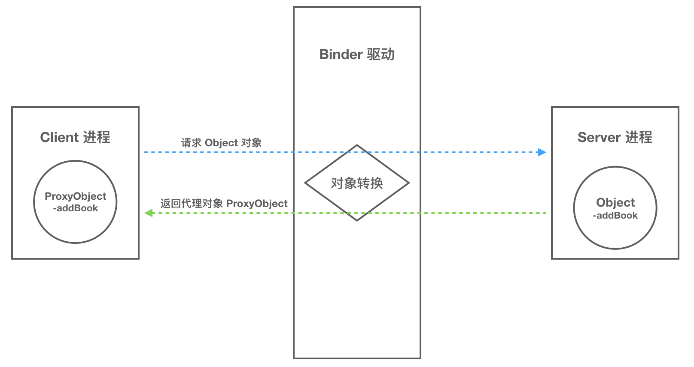

## Binder概述

### 什么是Binder

Binder 是一种进程间通信机制，从字面上来解释 Binder 有胶水、粘合剂的意思，顾名思义就是粘和不同的进程，使之实现通信。

### 为什么要有Binder

Linux 已经提供了管道、消息队列、共享内存和 Socket 等 IPC 机制。那为什么 Android 还要提供 Binder 来实现 IPC 呢？主要是基于**性能**、**稳定性**和**安全性**几方面的原因。


消息队列原理？


#### 性能

首先说说性能上的优势。Socket 作为一款通用接口，其传输效率低，开销大，主要用在跨网络的进程间通信和本机上进程间的低速通信。消息队列和管道采用存储-转发方式，即数据先从发送方缓存区拷贝到内核开辟的缓存区中，然后再从内核缓存区拷贝到接收方缓存区，至少有两次拷贝过程。共享内存虽然无需拷贝，但控制复杂，难以使用。Binder 只需要一次数据拷贝，性能上仅次于共享内存。

注：各种IPC方式数据拷贝次数

| IPC方式              | 数据拷贝次数 |
| -------------------- | ------------ |
| 共享内存             | 0            |
| Binder               | 1            |
| Socket/管道/消息队列 | 2            |

#### 稳定性

再说说稳定性，Binder 基于 C/S 架构，客户端（Client）有什么需求就丢给服务端（Server）去完成，架构清晰、职责明确又相互独立，自然稳定性更好。共享内存虽然无需拷贝，但是控制负责，难以使用。从稳定性的角度讲，Binder 机制是优于内存共享的。

#### 安全性

另一方面就是安全性。作为用户当然不希望我们下载的 APP 偷偷读取我的通信录，上传我的隐私数据，后台偷跑流量、消耗手机电量。

传统的 IPC 没有任何安全措施，完全依赖上层协议来确保。首先传统的 IPC 接收方无法获得对方可靠的进程用户ID/进程ID（UID/PID），从而无法鉴别对方身份。Android 为每个安装好的 APP 分配了自己的 UID，故而进程的 UID 是鉴别进程身份的重要标志。传统的 IPC 只能由用户在数据包中填入 UID/PID，但这样不可靠，容易被恶意程序利用。可靠的身份标识只有由 IPC 机制在内核中添加。

其次传统的 IPC 访问接入点是开放的，只要知道这些接入点的程序都可以和对端建立连接，不管怎样都无法阻止恶意程序通过猜测接收方地址获得连接。同时 Binder 既支持实名 Binder，又支持匿名 Binder，安全性高。

基于上述原因，Android 需要建立一套新的 IPC 机制来满足系统对稳定性、传输性能和安全性方面的要求，这就是 Binder。

**最后用一张表格来总结下 Binder 的优势：**

| 优势   | 描述                                                     |
| ------ | -------------------------------------------------------- |
| 性能   | 只需要一次数据拷贝，性能上仅次于共享内存                 |
| 稳定性 | 基于 C/S 架构，职责明确、架构清晰，因此稳定性好          |
| 安全性 | 为每个 APP 分配 UID，进程的 UID 是鉴别进程身份的重要标志 |


## Linux下传统的进程间通信原理

### 基础概念

#### 进程隔离 

简单的说就是操作系统中，进程与进程间内存是不共享的。两个进程就像两个平行的世界，A 进程没法直接访问 B 进程的数据，这就是进程隔离的通俗解释。A 进程和 B 进程之间要进行数据交互就得采用特殊的通信机制：进程间通信（IPC）。

每个进程有独立的虚拟地址空间。操作系统通过 MMU 来管理进程的虚拟地址到物理地址的映射，不同进程的页表是分开的，确保它们无法直接访问其他进程的物理内存地址。

#### 进程空间划分：用户空间，内核空间

操作系统使用**虚拟存储器**（virtual memory）来让进程认为它有连续的内存空间，而实际上这个内存空间可能是分散的，甚至部分可能存放在硬盘上。当程序访问某个内存地址时，处理器通过**内存管理单元（MMU）**将虚拟地址翻译为物理内存地址。

对于**32 位系统**来说，虚拟地址空间是 2^32 = 4GB，也就是说每个进程理论上可以访问 4GB 的地址空间（虚拟存储空间）。但这 4GB 并不全是留给用户程序的，它被分为两大部分：

**用户空间（User Space）**：

- 是应用程序运行的地方。用户空间的程序运行时，无法直接访问内核空间的内容，除非通过系统调用（如访问文件、使用网络等）。这种隔离保障了用户程序不能直接修改系统内核或硬件，确保系统的稳定性和安全性。

**内核空间（Kernel Space）**：

- 是操作系统内核及其模块（如驱动程序）运行的地方。内核空间拥有对整个系统的完全控制，可以直接访问硬件设备、管理内存等。内核程序运行时，它们能够访问所有的物理内存地址，也就是说内核不受虚拟地址空间的限制。

**为什么要有内存的隔离？**

**安全性**：用户进程被隔离在用户空间内，无法随意访问内核空间的敏感数据或直接操作硬件。如果没有这种隔离，恶意程序可能会尝试修改系统内核或操作硬件，导致严重的安全问题。

**稳定性**：应用程序如果在执行过程中崩溃，它只能影响用户空间中的内存。内核的隔离防止用户程序导致整个操作系统崩溃。

#### 系统调用

系统调用其实也是进程间通信机制，只不过不是用户进程间的，是内核和用户之间的。

用户使用系统调用希望执行内核代码，访问内核资源，内核进程监听到该系统调用，进行**上下文切换**，使得处理器从**用户态**切换到**内核态**。此时，用户进程的执行被暂停，内核接管控制权，并根据系统调用号确定需要执行的内核代码。然后执行对应代码，并将操作结果返回给用户，。

1. **用户进程发起请求**：当用户进程需要访问系统资源（如文件、网络、内存等）时，它发起一个系统调用，比如 `read()`、`write()`、`fork()` 等。这个系统调用实际上是一个“**请求**”，通过预定义的接口告诉内核需要执行的操作。
2. **进入内核态**：系统调用会触发**上下文切换**，使得处理器从**用户态**切换到**内核态**。此时，用户进程的执行被暂停，内核接管控制权，并根据系统调用号确定需要执行的内核代码。
3. **内核执行请求的操作**：内核代码开始执行与系统调用相关的操作。例如：
   - 如果是文件读写请求，内核会通过文件系统接口操作硬盘或内存。
   - 如果是创建进程请求（如 `fork()`），内核会为用户进程分配资源，启动新的子进程。
   - 如果是网络请求，内核会通过网络协议栈处理数据的发送与接收。
4. **返回结果**：内核执行完系统调用所要求的操作后，将结果返回给用户进程（如读取到的文件数据、创建的子进程 ID 等），并将控制权切换回**用户态**，用户进程继续执行


系统调用通过下面的两个函数实现

```
copy_from_user() //将数据从用户空间拷贝到内核空间
copy_to_user() //将数据从内核空间拷贝到用户空间
```


### Linux下传统IPC原理


## Binder跨进程通信底层原理

首先要解决一个问题：跨进程通信是需要内核空间做支持的。传统的 IPC 机制如管道、Socket 都是内核的一部分，因此通过内核支持来实现进程间通信自然是没问题的。但是 Binder 并不是 Linux 系统内核的一部分，那怎么办呢？

这就得益于 Linux 的**动态内核可加载模块**（Loadable Kernel Module，LKM）的机制；模块是具有独立功能的程序，它可以被单独编译，但是不能独立运行。它在运行时被链接到内核作为内核的一部分运行。这样，Android 系统就可以通过动态添加一个内核模块运行在内核空间，用户进程之间通过这个内核模块作为桥梁来实现通信。

> 在 Android 系统中，这个运行在内核空间，负责各个用户进程通过 Binder 实现通信的内核模块就叫 **Binder 驱动**（Binder Dirver）。

那么如何借助内核这个Binder驱动进行通信呢？


### **mmap() 的工作过程：**

mmap本质是将内核空间中的内存区域映射到进程的虚拟地址空间中，这样进程访问自己的这段虚拟地址空间实际通过页表转化到对应内核空间的物理地址中。

- **建立映射**：通过 `mmap()`，操作系统会在**内核空间**中开辟一块区域，同时将这块区域映射到**用户空间**中的某个地址。
- **访问内存**：一旦映射建立起来，用户进程和内核可以共享这块内存。无论是内核对这段内存的修改，还是用户进程对这段内存的操作，都会直接反映在彼此的映射关系中。
- **数据同步**：用户空间的进程可以通过访问自己的虚拟地址来操作实际的物理内存，内核也是如此。这种机制保证了数据的实时同步，而不需要传统的系统调用来进行数据复制或交互。


这不就是共享内存吗？你可以这么说，binder是更为复杂的共享内存。


一次完整的 Binder IPC 通信过程通常是这样：

1. 首先 Binder 驱动在内核空间创建一个数据接收缓存区；
2. 接着在内核空间开辟一块内核缓存区，建立**内核缓存区**和**内核中数据接收缓存区**之间的映射关系，以及**内核中数据接收缓存区**和**接收进程用户空间地址**的映射关系；
3. 发送方进程通过系统调用 copy_from_user() 将数据 copy 到内核中的**内核缓存区**，由于内核缓存区和接收进程的用户空间存在内存映射，因此也就相当于把数据发送到了接收进程的用户空间，这样便完成了一次进程间的通信。


**实际对应的物理地址空间** 只有 **一块物理内存**，这块物理内存映射到 **内核虚拟地址空间**，称为 **内核缓存区**。同一块物理内存也会映射到 **接收进程的用户虚拟地址空间**，称为 **接收进程的用户空间缓存区**。

所以，Binder的本质是：进程A发送数据，其将数据copy复制到内存的物理空间中，内核将这块 **物理内存区域** 映射到 **接收进程B的用户空间**，通过 `mmap()` 等机制，使得进程B可以直接访问这块物理内存。


这是底层的通信原理，但是到这一块，也只是类似共享内存，并没有超越其的地方。

## Bider通信模型

介绍完 Binder IPC 的底层通信原理，接下来我们看看实现层面是如何设计的。

一次完整的进程间通信必然至少包含两个进程，通常我们称通信的双方分别为客户端进程（Client）和服务端进程（Server），由于进程隔离机制的存在，通信双方必然需要借助 Binder 来实现。

### Client/Server/ServiceManager/驱动

Binder 是基于 C/S 架构的。由一系列的组件组成，包括 Client、Server、ServiceManager、Binder 驱动。其中 Client、Server、Service Manager 运行在用户空间，Binder 驱动运行在内核空间。其中 Service Manager 和 Binder 驱动由系统提供，而 Client、Server 由应用程序来实现。Client、Server 和 ServiceManager 均是通过系统调用 open、mmap 和 ioctl 来访问设备文件 /dev/binder，从而实现与 Binder 驱动的交互来间接的实现跨进程通信。


Client、Server、ServiceManager、Binder 驱动这几个组件在通信过程中扮演的角色就如同互联网中服务器（Server）、客户端（Client）、DNS域名服务器（ServiceManager）以及路由器（Binder 驱动）之前的关系。

通常我们访问一个网页的步骤是这样的：首先在浏览器输入一个地址，如 www.google.com 然后按下回车键。但是并没有办法通过域名地址直接找到我们要访问的服务器，因此需要首先访问 DNS 域名服务器，域名服务器中保存了 www.google.com 对应的 ip 地址 10.249.23.13，然后通过这个 ip 地址才能放到到 www.google.com 对应的服务器。

**请问：这个地址是什么**：是Binder驱动在内核中创建的Binder对象的地址。

驱动为这个穿越进程边界的 Binder 创建位于内核中的实体节点，将名字以及新建的引用打包传给 ServiceManager。ServiceManger 收到数据后从中取出名字和引用填入查找表。

### Binder通信过程

至此，我们大致能总结出 Binder 通信过程：

1. 首先，一个进程使用 BINDER_SET_CONTEXT_MGR 命令通过 Binder 驱动将自己注册成为 ServiceManager；
2. Server 通过驱动向 ServiceManager 中注册 Binder（Server 中的 Binder 实体），表明可以对外提供服务。驱动为这个 Binder 创建位于内核中的实体节点以及 ServiceManager 对实体的引用，将名字以及新建的引用打包传给 ServiceManager，ServiceManger 将其填入查找表。
3. Client 通过名字，在 Binder 驱动的帮助下从 ServiceManager 中获取到对 Binder 实体的引用，通过这个引用就能实现和 Server 进程的通信。

我们看到整个通信过程都需要 Binder 驱动的接入。下图能更加直观的展现整个通信过程(为了进一步抽象通信过程以及呈现上的方便，下图我们忽略了 Binder 实体及其引用的概念)：


### Binder通信中的代理模式

我们已经解释清楚 Client、Server 借助 Binder 驱动完成跨进程通信的实现机制了，但是还有个问题会让我们困惑。A 进程想要 B 进程中某个对象（object）是如何实现的呢？毕竟它们分属不同的进程，A 进程 没法直接使用 B 进程中的 object。

当 A 进程想要获取 B 进程中的 object 时，驱动并不会真的把 object 返回给 A，而是返回了一个跟 object 看起来一模一样的代理对象 objectProxy，这个 objectProxy 具有和 object 一摸一样的方法，但是这些方法并没有 B 进程中 object 对象那些方法的能力，这些方法只需要把把请求参数交给驱动即可。对于 A 进程来说和直接调用 object 中的方法是一样的。

当 Binder 驱动接收到 A 进程的消息后，发现这是个 objectProxy 就去查询自己维护的表单，一查发现这是 B 进程 object 的代理对象。于是就会去通知 B 进程调用 object 的方法，并要求 B 进程把返回结果发给自己。当驱动拿到 B 进程的返回结果后就会转发给 A 进程，一次通信就完成了。



### 总结

**Binder 引用** 本质上是一个 **内核对象的句柄**，它指向了 **内核中** 维护的 **Binder 实体**。当Service启动时，驱动为这个 Service 创建位于内核中的Binder实体节点以及 ServiceManager 对实体的引用，将名字以及新建的引用打包传给 ServiceManager，ServiceManger 将其填入查找表。

**ServiceManager** 维护了一张表，记录了服务名称和对应的 **Binder 实体引用**。当 **Client** 通过名称查询服务时，**ServiceManager** 会通过 **Binder 驱动** 返回该 **Service** 的 **Binder 引用**。

当 **Client** 尝试与Service通信时，首先通过 **ServiceManager** 获取到这个 **引用** ，即： **内核对象的句柄**，它指向了 **内核中** 维护的 **Binder 实体**。因为 **Binder 引用** 使得 **Binder 驱动** 能够找到对应的 **Server 实体** 。然后Binder驱动会把请求发送给Server实体。同时，Client发起请求后，Binder驱动会开辟内核缓冲区和数据接收区，接下来，**Client** 的数据会通过 **copy_from_user()** 这样的系统调用复制到这个内核缓冲区中。**Server 实体** 收到请求后，会按照请求的数据执行相应的操作。这包括解析请求中的参数、调用实际的服务方法、并生成返回结果。

处理完成后，**Server** 会将结果写入到 **内核缓冲区** 中，而内核通过内存映射技术直接将这个结果传递给 **Client**。**Client** 通过 **Binder 驱动** 获取到 **Server** 返回的结果。由于内核已经将结果写入 **Client** 的映射内存区域，**Client** 可以直接读取这个结果，通信就此完成。


Client传给Server的请求包含：请求的操作和要处理的数据。请求的操作由Binder直接转发给Server，要处理的数据借助内核缓冲区传递，请问准确吗？

### 完整过程的细化：

1. **Client** 通过 **Binder proxy** 发起请求，数据和操作都被打包发送到 **Binder 驱动**。
2. **Binder 驱动** 处理请求，首先解析出要调用的 **Server** 方法和服务，接着在 **内核缓冲区** 中开辟存储空间，将 **Client** 的数据拷贝到内核中。
3. **Binder 驱动** 通过内核中的 **Binder 引用** 找到 **Server 实体**，并将请求的操作指令传递给 **Server**。
4. **Server** 通过内存映射，直接从 **内核缓冲区** 中读取 **Client** 的数据，并执行请求的操作。
5. **Server** 处理完请求后，将结果写回到 **内核缓冲区** 中。
6. **Binder 驱动** 将结果通过内核返回给 **Client**，从而完成一次完整的 IPC 通信。

因此，**操作指令和数据** 都依赖 **Binder 驱动** 传递，但数据的高效传递依赖于内核缓冲区和 **mmap** 技术，以减少数据复制的开销。