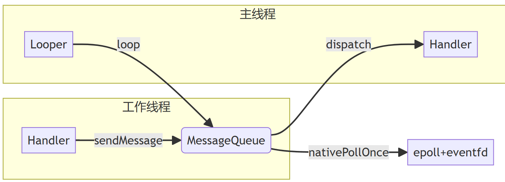
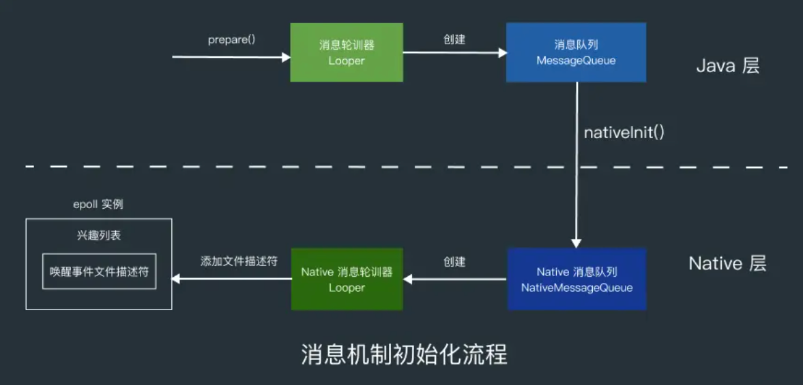
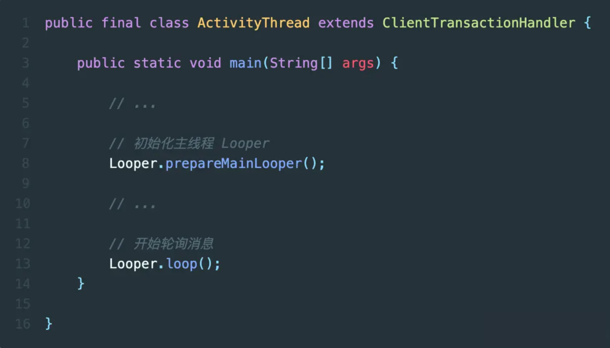
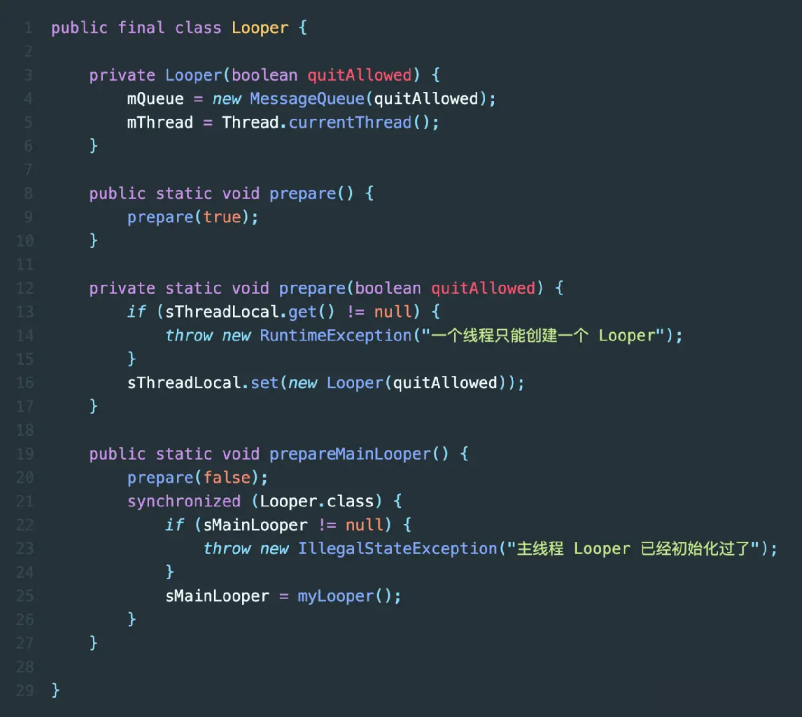
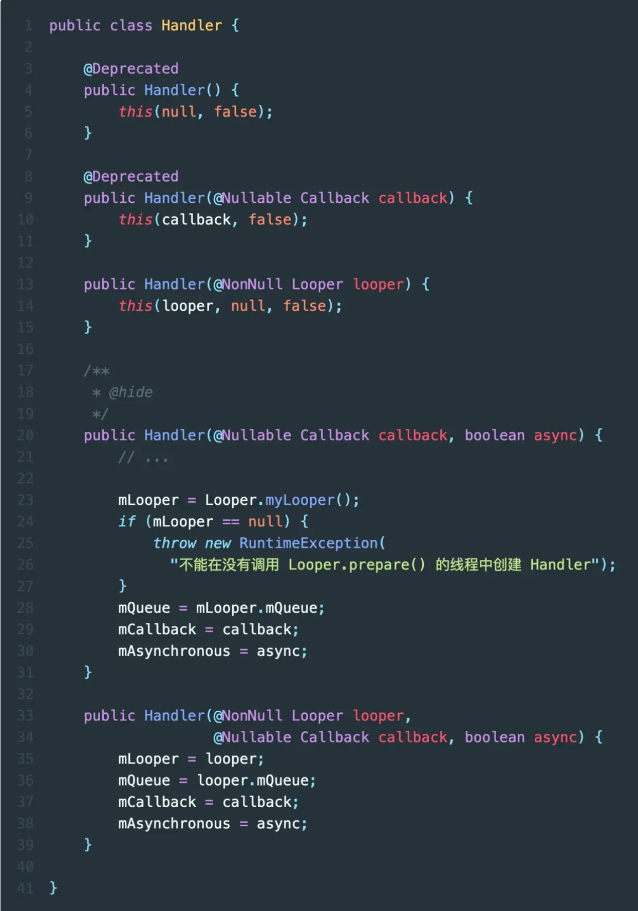
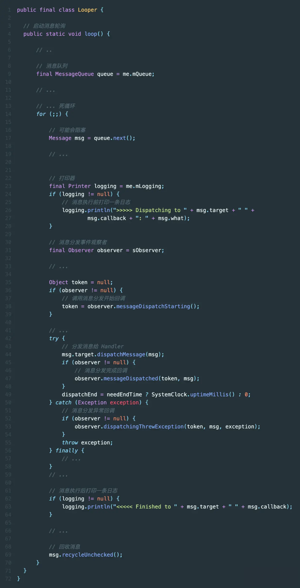

[toc]

## 01. 消息机制介绍 

### 1.1 进程与线程通信差异

- 要理解消息机制，我们首先要理解进程和线程间的通信的差异。
- 对于进程，他们之间通信相对困难，因为进程彼此之间隔离。所以他们的关键点是解决隔离问题，通常借助系统调用将用户空间数据复制到内核空间，再通过内核来传递数据，以此来消除隔离。
- 对于线程，他们之间通信相对简单，因为他们都属于同一个进程，拥有相同的地址空间，理论上它们可以直接访问彼此的数据。那么线程间通信困难点是什么？线程间通信相对困难的是：在多线程的环境下，期望数据的获取与代码执行的结果和单线程时保持一致，这依赖于同步（控制线程间执行顺序）和互斥（避免多个线程同时修改数据）。


### 1.2 为什么要有消息机制

- 那么我们为什么要有消息机制？它存在的主要原因是在于Android UI线程的特殊性，其有如下两点要求。

  - **单线程规则**：所有 UI 操作（按钮点击、页面滚动、动画等）**必须**在主线程执行

  - **16ms 生死线**：屏幕每 16ms 刷新一次，主线程必须在这期间完成界面渲染，这意味着UI线程不能被延迟太久。


- 因此，这产生了一个结果，就是主线程既要频繁获取其它线程对UI的修改的数据，又不能被阻塞导致绘制过程延时。如果主线程和其它线程之前通过Linux中传统的锁来进行彼此的同步和互斥，那么会造成一种可能的情况：我们主线程尝试获取数据，但是被锁住，导致主线程渲染界面操作被阻塞，进而产生界面卡顿或无响应，产生ANR。


- 那么我们该怎么解决这个问题呢？Android 的答案：**用异步消息队列取代锁，进行主线程和其它线程间通信**。有以下几点：

  - 我们有一个消息队列，工作线程只能通过锁往消息队列中放入消息，而主线程可以单线程的从消息队列中取出消息并执行，天然避免竞争。

  - 主线程平时休眠，只有有消息到达消息队列时才被唤醒，并从中取出消息进行UI更新。




## 02. 消息机制底层原理

- 消息机制的核心不是消息队列本身，而是依赖 Linux 的 `epoll` 和 `eventfd` 实现的高效阻塞唤醒。
- 我们设想一种情况，假如我主线程要进行UI的更新。
  - 如果我是一直循环等待，这种情况就是for无限循环，监听消息队列中消息的到来，每次到来进行视图的更新。它存在一个问题，就是这个主线程必定一直占据一个cpu核心。但是，它这个过程中大部分时间都在等待，没有执行实际的操作。
  - 另一种情况，我每隔一段时间被唤醒，然后检测消息队列中消息的到来。这种情况虽然提高了cpu利用率，但是存在一个问题，就是消息队列中消息没法及时处理，如果有紧急消息，这种情况显然不能满足？
  - 那么我们怎么解决呢？我们希望主线程既可以休眠提高cpu利用率，又可以在消息到来时及时响应，这依赖于Linux 的 `epoll` 和 `eventfd` 实现的高效阻塞唤醒。

- 那么这个高效阻塞唤醒的过程是什么呢？
  - 主线程通过调用 epoll_wait() ，进入 wq 等待队列中，放弃自身时间片，进入睡眠状态。
  - 当工作线程写入消息时，eventfd被更新，触发系统调用，进入内核态
  - 内核线程检测到eventfd更新产生的这次系统调用后，将主线程从epoll的等待队列中唤醒，分配时间片，让其开始工作。
  - 这样我们通过加入等待队列实现了阻塞，提高了cpu利用率，然后当消息到来时，通过写入eventfd，将主线程唤醒，可以及时响应消息。我们付出的代价仅仅是线程的切换。

## 03. 消息机制实际流程

- Android 的消息机制主要有三个组成部分，分别是：**消息队列**（`MessageQueue`）、**事件循环**（`Looper`）、以及 `Handler` 。消息队列用于存放消息，事件循环用于等待消息的到来，并进行消息的分发。Handler是消息的实际的执行者。
- 它的整体流程概括为：消息轮询，消息入队，消息分发处理。

### 3.1 消息队列的轮询

- 主线程启动时创建 `Looper` 和 `MessageQueue`，调用 `Looper.loop()` 进入消息循环。

- 消息循环过程主要是由 Looper 的 `loop()` 方法、MessageQueue 的 `next()` 方法、Native 层 `pollOnce()` 这三个方法组成。

  - 首先是从 Looper 的 loop() 方法开始的，loop() 方法中有一个死循环，死循环中会调用 MessageQueue 的 next() 方法尝试获取消息。如果获取到，`msg != null`，loop() 方法就会调用`msg.target.dispatchMessage(msg);` 方法分发消息。

  - 让我们来看看next方法，这是里面的核心。在 MessageQueue 的 next() 方法中，首先会调用 native层的PollOnce() JNI 方法，内部调用epoll_wait监听eventfd。没有消息到来，线程就会被阻塞。有的话线程会被唤醒，接着执行后续处理。

  - 线程被唤醒后：首先其不会立刻执行新消息，而是优先尝试找出需要优先执行的异步消息，如果没有，那么会判断这个新到来的消息是否到了要执行的时间可以执行，如果可以执行，那么返回给 Looper 处理。looper调用dispatchMessage分发消息给实际Handler处理。

- ```
  public static void loop() {
      final Looper me = myLooper();
      final MessageQueue queue = me.mQueue;
      for (;;) {
          Message msg = queue.next(); // 可能阻塞
          if (msg == null) return;
          msg.target.dispatchMessage(msg); // 分发消息
      }
  }
  queue.next()中调用pollOnce方法。
  // 主线程循环核心代码
  void Looper::pollOnce(int timeoutMillis) {
      int eventCount = epoll_wait(mEpollFd, mEvents, EPOLL_MAX_EVENTS, timeoutMillis);
      
      for (int i = 0; i < eventCount; i++) {
          if (mEvents[i].data.fd == mEventFd) {
              // 唤醒事件到来
              eventfd_t value;
              eventfd_read(mEventFd, &value); // 清空eventfd计数器
              processMessageQueue();
          }
      }
  }
  
  ```

### 3.2 工作线程发送消息

- **工作线程的消息发送**：工作线程收到来自系统服务的请求后，会将该请求封装为消息，并将其插入到消息队列中。内部会调用nativeWake，触发eventfd_write（），经过内核的eventfd和epoll机制后，会唤醒阻塞线程。

  - ```
    boolean enqueueMessage(Message msg, long when) {
        synchronized (this) {
            // 插入消息到队列
            if (needWake) {
                nativeWake(mPtr); // 触发 eventfd_write()
            }
        }
    }
    ```

### 3.3 消息分发和处理

- 主线程被唤醒后，找到要处理的消息，并通过 `dispatchMessage(msg);` 将消息分发给目标 Handler进行实际的处理。实际的Handler会调用run消费掉这个消息。

- ```
  public void dispatchMessage(Message msg) {
      if (msg.callback != null) {
          // 处理 Runnable
          msg.callback.run();
      } else if (mCallback != null) {
          // 处理 Callback
          mCallback.handleMessage(msg);
      }
  }
  ```

## 04. 消息机制源码

消息机制的初始化本质是创建eventfd + epoll实例，实现IO多路复用和事件通知机制，进而创建好事件循环的底层机制。

具体流程如下：



### 3.1 Looper初始化流程

之所以我们能在 Activity 中直接用 Handler 给主线程发消息 ，是因为 ActivityThread 的主函数 `main()` 中初始化了一个主线程专用的 Looper ，也正是这个 Looper 一直在轮询主线程要处理的消息。



`prepare()` 方法用于为当前线程创建一个新的 `Looper` 实例。 `Looper` 实例内其实就是调用 `MessageQueue` 构造函数创建 `MessageQueue` ，并将其与当前线程绑定。

`quitAllowed` 参数决定了是否允许该 `Looper` 被退出。



### 3.2 MessageQueue初始化

下面来看 `MessageQueue` 初始化流程

#### 1.MessageQueue 构造函数

在 `MessageQueue` 的 Java 构造函数中，有两个重要的成员变量被初始化：

```java
public final class MessageQueue {
    MessageQueue(boolean quitAllowed) {
        mQuitAllowed = quitAllowed; // 是否允许队列退出
        mPtr = nativeInit();        // 调用 JNI 方法初始化 NativeMessageQueue
    }
}
```

**`mQuitAllowed`**：用于控制 MessageQueue 是否允许退出。

**`mPtr`**：通过 `nativeInit()` 返回的 Native 层对象指针，用于关联 Java 层的 MessageQueue 和 Native 层的消息处理机制。

#### 2. `nativeInit()` 方法

`nativeInit()` 是一个 **JNI** 调用，用来初始化 **NativeMessageQueue** 对象，并返回其指针给 `mPtr`。在 Native 层的代码中，`NativeMessageQueue` 的构造函数被调用，创建了一个新的 **Looper**。

```cpp
jlong android_os_MessageQueue_nativeInit(JNIEnv* env, jclass clazz) {
    NativeMessageQueue* nativeMessageQueue = new NativeMessageQueue();
    return reinterpret_cast<jlong>(nativeMessageQueue);
}
```

- **`NativeMessageQueue`**：这是 Native 层的消息队列实现，它和 Java 层的 `MessageQueue` 对应，但工作在 Native 环境下，主要处理 Native 层的消息轮询。
- **`mPtr`**：这是一个指向 Native 层对象的指针，用于在 Java 和 Native 层之间传递数据。

#### 3. Native层MessageQueue 构造函数

```cpp
NativeMessageQueue::NativeMessageQueue() :
    mPollEnv(NULL), mPollObj(NULL), mExceptionObj(NULL) {

    mLooper = Looper::getForThread(); // 尝试为当前线程获取 Looper
    if (mLooper == NULL) {
        mLooper = new Looper(false);  // 如果没有 Looper，则为当前线程创建一个新的
        Looper::setForThread(mLooper); // 将 Looper 设置到当前线程
    }
}
```

- **`mLooper`**：Native 层的 `Looper`，类似于 Java 层的 `Looper`，负责处理消息的分发与轮询。每个线程都有一个独立的 `Looper` 实例。
- **`Looper::setForThread()`**：将当前 `Looper` 实例绑定到当前线程，这类似于 Java 层的 **ThreadLocal** 机制。

#### 4. Native层Looper 构造函数

```
cpp复制代码Looper::Looper(bool allowNonCallbacks) :
    mAllowNonCallbacks(allowNonCallbacks),
    mSendingMessage(false),
    mPolling(false),
    mEpollRebuildRequired(false),
    mNextRequestSeq(0),
    mResponseIndex(0),
    mNextMessageUptime(LLONG_MAX) {

    mWakeEventFd.reset(eventfd(0, EFD_NONBLOCK | EFD_CLOEXEC)); // 创建唤醒事件描述符
    rebuildEpollLocked(); // 重建 epoll 实例
}
```

- **`mWakeEventFd`**：这是一个文件描述符，用于线程间的唤醒机制，类似于一个信号量。当有新消息到达时，通过该描述符唤醒等待中的线程。
- **`rebuildEpollLocked()`**：调用该方法创建 `epoll` 实例，并将文件描述符加入到 `epoll` 事件监听中。

#### 5. rebuildEpollLocked 方法

```
cpp复制代码void Looper::rebuildEpollLocked() {
    mEpollFd.reset(epoll_create1(EPOLL_CLOEXEC)); // 创建 epoll 实例

    struct epoll_event eventItem;
    eventItem.events = EPOLLIN; // 监听可读事件
    int result = epoll_ctl(mEpollFd.get(), EPOLL_CTL_ADD, mWakeEventFd.get(), &eventItem); // 注册事件

    // 遍历请求列表，将每个请求的文件描述符注册到 epoll 中
    for (size_t i = 0; i < mRequests.size(); i++) {
        const Request& request = mRequests.valueAt(i);
        struct epoll_event eventItem;
        int epollResult = epoll_ctl(mEpollFd.get(), EPOLL_CTL_ADD, request.fd, &eventItem);
    }
}
```

- **`epoll_create1()`**：创建 `epoll` 实例，用于监听多个文件描述符上的事件。
- **`epoll_ctl()`**：将 `mWakeEventFd` 和请求中的文件描述符注册到 `epoll` 实例中，用于监听这些文件描述符上的可读事件。
- **`EPOLLIN`**：表示监听可读事件。当有数据可读时，`epoll` 会返回事件，触发相应的处理。

到现在我们发现了，创建一个looper，最终就是创建了eventfd和epoll实例，并把evetnfd加入到epoll监听中

#### 6.**这里有一个很困惑的地方，消息存放在哪？**

我们看如下代码：尤其关注enqueueMessage插入逻辑

`MessageQueue` 内部采用了一个简单的链表结构来管理消息

```
class MessageQueue {
    private Message mMessages;  // 链表头，代表消息队列中的第一条消息

    // 插入消息
    boolean enqueueMessage(Message msg, long when) {
        synchronized (this) {
            msg.when = when; // 设置消息的触发时间
            Message p = mMessages; // 当前的消息链表头
            if (p == null || when < p.when) {
                // 如果队列为空，或者新消息的执行时间早于当前队列中的第一条消息
                msg.next = p;
                mMessages = msg; // 新消息成为新的链表头
            } else {
                // 否则，找到合适的位置插入消息
                Message prev;
                while (true) {
                    prev = p;
                    p = p.next;
                    if (p == null || when < p.when) {
                        break;
                    }
                }
                msg.next = p;
                prev.next = msg;
            }
        }
        return true;
    }

    // 取出消息
    Message next() {
        // ... 取出链表中的消息并返回
    }
}

```

所以，消息队列是一个空的链表，并不是一开始就有内容的，而是通过程序运行过程中不断地 **插入消息** 逐渐充实的。

#### 7.消息的数据结构

`Handler` 发送的核心数据是 **`Message`** 对象。`Message` 是 Android 中用来封装数据和操作的基本单元，它包括了目标 `Handler`、要传递的数据和要执行的操作等信息。

```
java复制代码public class Message {
    public int what;            // 消息的类型
    public int arg1;            // 消息的整型参数
    public int arg2;            // 消息的整型参数
    public Object obj;          // 消息携带的任意对象
    Handler target;             // 消息的目标处理 Handler
    Runnable callback;          // 可选的 Runnable 回调
    long when;                  // 消息的执行时间
}
```

- **`what`**：消息类型，通常用于区分不同的消息。
- **`arg1` / `arg2`**：整型参数，可以携带一些附加的数值。
- **`obj`**：可选的对象参数，携带复杂的数据。
- **`target`**：该消息的目标 `Handler`，当 `Looper` 从 `MessageQueue` 中取出消息时，会调用 `target` 的 `handleMessage()` 方法来处理。
- **`callback`**：如果 `Message` 传递了一个 `Runnable` 回调，则消息处理时会优先执行该 `Runnable`。没有则调用 `target` 的 `handleMessage()` 方法来处理。
- **`when`**：消息的执行时间。


### 3.3 Handler初始化流程

#### 1. 那么Handler呢？首先我们怎么理解Handler

```
public class Handler {
    final Looper mLooper;         // Handler 所绑定的 Looper
    final MessageQueue mQueue;    // Looper 中的消息队列
    final Callback mCallback;     // 用户自定义的回调，用于处理消息
}
```

`Handler` 并不是独立存在的，它和 `Looper` 以及 `MessageQueue` 紧密关联。每个 `Handler` 都需要绑定一个 `Looper`，从而与其管理的 `MessageQueue` 关联。

Handler是可以动态注册，有很多个。Handler其实就是对一个处理函数的封装。每注册一个，代表当前looper可以处理的任务又多了一个种类。

#### 2.Handler的初始化

Handler 的初始化过程比较简单，这个过程中比较特别的两个点分别是`不能在没有调用 Looper.prepare() 的线程创建 Handler`以及`异步 Handler`。

Handler 的构造函数有一个比较特别的一个 async 参数，async 为 true 时表示该 Handler 是一个`异步消息处理器`，使用这个 Handler 发送的消息会是异步消息。




#### 3.**怎么理解：异步消息，跳过同步屏障**

**同步消息**：这是 Android 消息机制中默认的消息类型。同步消息会按照插入队列的顺序，逐个取出并处理，遵循严格的顺序执行规则。

**异步消息**：异步消息是通过异步 `Handler`（即创建 `Handler` 时 `async` 标志为 `true`）发送的消息。与同步消息不同，异步消息具有更高的优先级，能够在某些特殊情况下绕过队列中的同步消息，被优先处理。

同步屏障是 Android 的消息机制中引入的一种特殊机制，用于暂时阻止队列中普通同步消息的处理。屏障存在时，`MessageQueue` 只会处理**异步消息**。屏障机制通常用于 **界面渲染** 或 **动画** 等场景，以确保某些任务能够优先被执行，避免延迟。


## 04.消息轮询过程

##### 1. 消息轮询过程概述

消息循环过程主要是由 Looper 的 `loop()` 方法、MessageQueue 的 `next()` 方法、Native 层 Looper 的 `pollOnce()` 这三个方法组成。

消息轮询过程是从 Looper 的 loop() 方法开始的，loop() 方法中有一个死循环，死循环中会调用 MessageQueue 的 next() 方法，获取到消息后，loop() 方法就会调用 Message 的 target 的 dispatchMessage() 方法分发消息

在 MessageQueue 的 next() 方法中，首先会调用 nativePollOnce() JNI 方法检查队列中是否有新的消息要处理，没有时线程就会被阻塞。有的话就会尝试找出需要优先执行的异步线程，没有异步消息的话，就会判断消息是否到了要执行的时间，是的话就返回给 Looper 处理，否则重新计算消息的执行时间。

##### 2.Looper.loop()

前面讲到了在 ActivityThread 的 `main()` 函数中会调用 Looper 的 loop() 方法让 Looper 开始轮询消息，loop() 方法中有一个死循环，死循环中会调用 MessageQueue 的 `next()` 方法获取下一条消息，获取到消息后，loop() 方法就会调用 Message 的 target 的 `dispatchMessage()` 方法，target 其实就是发送 Message 的 `Handler` 。最后就会调用 Message 的 `recycleUnchecked()` 方法回收处理完的消息。




## 其他介绍

### 01.关于我的博客

- csdn：http://my.csdn.net/qq_35829566

- 掘金：https://juejin.im/user/499639464759898

- github：https://github.com/jjjjjjava

- 简书：http://www.jianshu.com/u/92a2412be53e

- 邮箱：[934137388@qq.com]

