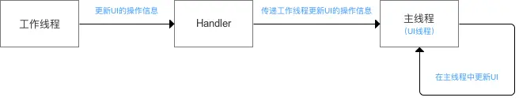

[toc]

## 消息机制介绍


### 为什么要有消息机制

在多线程的应用场景中，**将工作线程中需更新`UI`的操作信息 传递到 `UI`主线程**，从而实现 工作线程对`UI`的更新处理，这里使用消息机制进行异步消息的传递和处理



那么为什么使用消息机制进程传递呢？其它不行吗？

**多个线程并发更新UI的同时 保证线程安全**，当工作线程需要更新UI时，通过Handler通知主线程，从而在主线程中完成UI的更新操作。


### 消息机制的核心

Android的消息机制，本质是这样的：主线程通过epoll阻塞等待。Binder线程接收到请求后，将请求封装为消息，拷贝到消息池中。然后向eventfd写入1,。此时触发eventfd的唤醒队列，主线程被唤醒，然后查找自身的就绪链表，找到eventfd，然后读取，发现是1，知道有1个任务到来，然后去消息池中取出一个消息，调用Handler进行解析和处理。


### 消息机制概览

Android 消息机制是由 `Handler`、`Looper` 和 `MessageQueue` 三者合作完成的，消息机制可以分为`消息机制初始化`、`消息轮询`、`消息发送`和`消息处理` 4 个过程来理解，消息机制是基于 Linux 的事件轮询机制 `epoll` 和用来通知事件的文件描述符 `eventfd` 来实现的 。

总结一下整个 Android 消息机制的核心流程：

#### 1. **消息机制初始化**

消息机制的初始化过程主要由 `Looper.prepare()` 方法启动，完成消息轮询器 `Looper` 和消息队列 `MessageQueue` 的初始化，并通过 `nativeInit()` 调用 JNI 进行 Native 层的消息队列和 `Looper` 的初始化。这一过程中，`epoll` 实例和 `eventfd` 文件描述符被创建，成为消息机制的底层支撑。

- `epoll` 通过红黑树（`rbr`）管理所有需要监控的事件文件描述符，并通过就绪链表（`rdlist`）记录触发的事件。
- `eventfd` 用于在事件发生时发出唤醒信号，通知消息轮询线程。

#### 2. **消息轮询**

消息轮询的核心由 `Looper.loop()` 驱动，`Looper.loop()` 会反复调用 `MessageQueue.next()` 来从队列中获取消息。

- `next()` 会通过 `nativePollOnce()` 调用 JNI 来执行底层的 `pollOnce()` 方法，该方法会调用 `epoll_wait()`，等待事件的产生。
- 当没有消息时，`epoll_wait()` 使线程进入阻塞状态，避免 CPU 资源的浪费。

#### 3. **消息发送**

消息发送的过程从 `Handler.sendMessage()` 开始，`Handler` 将消息包装成 `Message` 对象，并通过 `MessageQueue.enqueueMessage()` 将其插入到消息队列中。

- 如果消息是需要立即处理的，则会通过 `nativeWake()` 调用底层的 `wake()` 方法，这会向 `eventfd` 文件描述符中写入数据，触发 `epoll_wait()` 返回并唤醒轮询线程。

#### 4. **消息处理**

当 `MessageQueue.next()` 获取到新的消息后，`Looper` 将消息交给对应的 `Handler` 处理，`Handler` 会调用 `handleMessage()` 来执行消息的处理逻辑。


## 消息机制初始化


### Handler初始化

Handler就是对Looper，MessageQueue，Callback及对他们操作的封装，内部多了一个async。


怎么理解：异步消息，跳过同步屏障

**同步消息**：这是 Android 消息机制中默认的消息类型，所有通过 `Handler` 发送的普通消息都是同步消息。这些消息会按照插入队列的顺序，逐个取出并处理，遵循严格的顺序执行规则。

**异步消息**：异步消息是通过异步 `Handler`（即创建 `Handler` 时 `async` 标志为 `true`）发送的消息。与同步消息不同，异步消息具有更高的优先级，能够在某些特殊情况下绕过队列中的同步消息，被优先处理。


同步屏障是 Android 的消息机制中引入的一种特殊机制，用于暂时阻止队列中普通同步消息的处理。屏障存在时，`MessageQueue` 只会处理**异步消息**。屏障机制通常用于 **界面渲染** 或 **动画** 等场景，以确保某些任务能够优先被执行，避免延迟。


## epoll

#### **`epoll` 机制的工作流程**

- **`epoll_create()`**:
  在使用 `epoll` 前，首先要调用 `epoll_create()` 函数来创建一个 `epoll` 实例，这个实例在内核中会对应创建一个 `eventpoll` 结构体，其中包含两个核心成员：
  - **红黑树（rbr）**：用来存储所有需要监控的文件描述符（fd）。当你注册一个新的文件描述符时，它会被插入到这个红黑树中。
  - **就绪链表（rdlist）**：当某个文件描述符的事件触发时（例如可读、可写等），会将该事件对应的文件描述符添加到这个链表中。`epoll_wait()` 会遍历该链表并将事件返回给用户。
- **`epoll_ctl()`**:
  使用 `epoll_ctl()` 函数，你可以向 `epoll` 实例的红黑树中添加、修改或删除要监控的文件描述符。这一步是将文件描述符注册到 `epoll` 上的过程，和传统的 `select` 或 `poll` 需要每次遍历文件描述符列表不同，`epoll` 只需要在注册时进行一次操作。
- **`epoll_wait()`**:
  当你调用 `epoll_wait()` 时，内核会检查 `rdlist` 链表中是否有已就绪的文件描述符（即触发了监听事件的文件描述符）。如果有，就将这些事件返回给用户。如果没有，进程会被挂起，直到有事件触发为止。

#### 2. **`epoll` 的优势**

相比于 `select` 和 `poll`，`epoll` 的主要优势在于它解决了文件描述符监听的可扩展性问题：

- **分离监听注册和事件检测**：通过 `epoll_ctl()`，文件描述符的注册只需进行一次，而不像 `select` 或 `poll` 每次都需要遍历整个文件描述符列表。


**`eventfd`** 提供多对多的通知机制，它允许多个线程或进程监听同一个事件文件描述符，当事件触发时，可以同时通知多个进程或线程。

### 2. **`eventfd` 的结构**

`eventfd` 的核心数据结构是 `eventfd_ctx`，它包含以下关键成员：

- **`wqh`（等待队列头，`__wait_queue_head`）**：
  `wqh` 是一个等待队列的头节点，它的作用是在事件尚未触发时，挂起等待事件的进程或线程。等待队列是一种内核同步原语，当事件发生时，会唤醒等待队列中的进程。

  `__wait_queue_head` 是一个自带自旋锁的双向链表节点，确保在多线程或多进程环境中，等待队列的访问是线程安全的。

- **`count`（计数器）**：
  `count` 是一个计数器，用于记录当前的事件计数值。当事件发生时，计数器的值会增加，进程或线程通过读取 `eventfd` 文件描述符来获知事件已经发生。

**事件通知**：
当某个线程或进程写入 `eventfd`（通过 `write()`），计数器 `count` 的值会增加。如果有其他进程或线程在等待这个 `eventfd` 的事件（通过 `epoll_wait()` 或 `select()` 监听），这些等待的进程将会被唤醒。

**读取事件**：
进程或线程通过 `read()` 从 `eventfd` 文件描述符中读取事件计数。读取操作会减少 `count` 的值，从而表示事件已经被处理。


接下来再看看Looper.loop()

```reasonml
reasonml 代码解读复制代码/**
 * Run the message queue in this thread. Be sure to call
 * {@link #quit()} to end the loop.
 */
public static void loop() {
    //得到当前线程Looper
    final Looper me = myLooper();
    if (me == null) {
        throw new RuntimeException("No Looper; Looper.prepare() wasn't called on this thread.");
    }
    //得到当前looper的MessageQueue
    final MessageQueue queue = me.mQueue;

    // Make sure the identity of this thread is that of the local process,
    // and keep track of what that identity token actually is.
    Binder.clearCallingIdentity();
    final long ident = Binder.clearCallingIdentity();

    //开始循环
    for (;;) {
        Message msg = queue.next(); // might block
        if (msg == null) {
            // No message indicates that the message queue is quitting.
            //没有消息表示消息队列正在退出
            return;
        }

        // This must be in a local variable, in case a UI event sets the logger
        Printer logging = me.mLogging;
        if (logging != null) {
            logging.println(">>>>> Dispatching to " + msg.target + " " +
                    msg.callback + ": " + msg.what);
        }

        //将真正的处理工作交给message的target，即handler
        msg.target.dispatchMessage(msg);

        if (logging != null) {
            logging.println("<<<<< Finished to " + msg.target + " " + msg.callback);
        }

        // Make sure that during the course of dispatching the
        // identity of the thread wasn't corrupted.
        final long newIdent = Binder.clearCallingIdentity();
        if (ident != newIdent) {
            Log.wtf(TAG, "Thread identity changed from 0x"
                    + Long.toHexString(ident) + " to 0x"
                    + Long.toHexString(newIdent) + " while dispatching to "
                    + msg.target.getClass().getName() + " "
                    + msg.callback + " what=" + msg.what);
        }

        //回收消息资源
        msg.recycleUnchecked();
    }
}
```

通过这段代码可知，**调用loop方法后，Looper线程就开始真正工作了，它不断从自己的MessageQueue中取出队头的消息(或者说是任务)执行**。


提问：

## Android主线程是如何管理子线程消息的

**我们知道Android上一个应用的入口，应该是ActivityThread。和普通的Java类一样，入口是一个main方法。**

```arduino
arduino 代码解读复制代码public static void main(String[] args) {

    //~省略部分无关代码~

    //创建Looper和MessageQueue对象，用于处理主线程的消息
    Looper.prepareMainLooper();

    //创建ActivityThread对象
    ActivityThread thread = new ActivityThread();

    //建立Binder通道 (创建新线程)
    thread.attach(false);

    if (sMainThreadHandler == null) {
        sMainThreadHandler = thread.getHandler();
    }

    if (false) {
        Looper.myLooper().setMessageLogging(new
                LogPrinter(Log.DEBUG, "ActivityThread"));
    }

    // End of event ActivityThreadMain.
    Trace.traceEnd(Trace.TRACE_TAG_ACTIVITY_MANAGER);

    //消息循环运行
    Looper.loop();

    throw new RuntimeException("Main thread loop unexpectedly exited");
}
```

我们可以看到其实我们在这里初始化了我们主线程（UI）的Looper并且启动它。然后就可以处理子线程和其他组件发来的消息了。


### 1. **为什么 `Looper.loop()` 的死循环不会卡死主线程？**

虽然 `Looper.loop()` 是一个无限循环，但是它并不会消耗大量的 CPU 资源。其核心原因在于 **消息机制** 的设计，使得主线程在没有消息需要处理时能够进入休眠状态，从而不消耗 CPU 资源，只有当有新消息到来时，才会被唤醒处理。

#### 核心机制：`pipe` 管道的使用

- 在 `MessageQueue` 和 `Looper` 的实现中，使用了 Linux 的 **管道（pipe）** 来实现主线程的阻塞和唤醒。
- 当主线程没有任何消息需要处理时，`queue.next()` 会阻塞在消息队列的读端（管道的读端）。这种阻塞是通过内核的机制实现的，主线程进入 **休眠** 状态，不占用 CPU。
- 当系统其他进程或线程需要与主线程交互时（例如 Binder 机制），会通过 `pipe` 的写端写入一个字节，唤醒主线程。这时，`queue.next()` 方法不再阻塞，开始处理消息。

因此，主线程的大部分时间是处于休眠状态，不会因 `Looper.loop()` 的死循环而导致 CPU 的空转消耗。

### 2. **如何唤醒主线程？**

唤醒主线程的过程依赖于 Binder 机制以及 Handler 机制：

- **Binder 通信**：Android 的系统服务（如 ActivityManagerService，AMS）通过 Binder 机制与应用的主线程通信。当系统服务需要通知主线程处理某些事务时，会通过 Binder 向应用发送消息。这些消息最终被送入主线程的 `MessageQueue` 中。
- **管道写入**：当有新消息进入主线程的 `MessageQueue`，系统会通过向管道的写端写入一个字节来唤醒阻塞在读端的主线程。主线程被唤醒后会调用 `queue.next()`，从消息队列中取出需要处理的消息，并通过 `Handler` 分发给具体的处理逻辑。

### 3. **主线程的休眠与唤醒**

- 当主线程没有消息处理时，它会被挂起等待。等待的方式是通过 `epoll` 等机制来阻塞读取管道的读端（这是 Linux 内核的机制，能够有效节省 CPU 资源）。
- 当有消息到来时，向管道的写端写入数据，唤醒挂起的主线程，使其恢复执行。

这就是为什么 `Looper.loop()` 虽然是一个死循环，但实际上主线程大部分时间都处于休眠状态，不会影响其他任务的执行。

### 4. **如何处理其他事务？**

主线程除了处理 UI 绘制和用户交互等任务外，还需要处理系统服务发来的消息。这些任务通常是通过其他线程来完成，然后将结果通过 `Handler` 发送到主线程。

#### 核心机制：**多线程与 Handler**

- **主线程与 Binder 线程**：你提到的 `thread.attach(false)` 创建了一个 Binder 线程，该线程用于接收系统服务（如 AMS）发送来的事件。Binder 线程与主线程之间通过 `Handler` 进行通信，Binder 线程将消息发送到主线程的消息队列中，由主线程处理。
- **创建新线程**：对于耗时的任务，Android 通常会在主线程之外启动新线程来处理任务。新线程执行完任务后，可以通过 `Handler` 将结果返回给主线程。

通过这种方式，主线程能够专注于 UI 和消息的处理，而耗时的操作则交给其他线程完成，避免了主线程被阻塞。

### 5. **典型应用：Activity 的生命周期管理**

- `ActivityThread` 类中有一个内部类 `H`，它是 `Handler` 的子类。这个类负责处理 `Activity` 的生命周期事件，如启动、暂停、停止等。
- 当系统（如 AMS）通知应用某个 `Activity` 需要启动时，AMS 会通过 Binder 通信将消息发送到应用的主线程，`H` 会接收到这个消息，并调用 `Activity` 的相关生命周期方法进行处理。

这种设计确保了系统服务与应用主线程之间的通信是异步的，并且不会阻塞主线程的 UI 更新。


三个问题：

1. 怎么阻塞
2. 它怎么知道消息到了
3. 消息队列是存放在进程的公有空间中的吗？


请问我的理解是否准确无误：Android的消息机制，本质是这样的。主线程通过epoll阻塞等待。Binder线程接收到请求后，将请求封装为消息，拷贝到消息池中。然后向eventfd写入1,。此时触发eventfd的唤醒队列，主线程被唤醒，然后查找自身的就绪链表，找到eventfd，然后读取，发现是1，知道有1个任务到来，然后去消息池中取出一个消息，调用Handler进行解析和处理。


你的理解总体是正确的，但可以稍微精细化一些。

Android的消息机制确实依赖于`epoll`阻塞等待，以及使用`eventfd`来唤醒主线程，但其中的一些细节可以补充和调整：

1. **主线程等待消息**：主线程的`Looper`在执行`loop()`时会调用`epoll`等待，`MessageQueue`中的消息存储在队列中，`Looper`通过`epoll`来监视`eventfd`（或者其他文件描述符）的状态。通常主线程是处于阻塞状态，等待事件或消息的到来。
2. **Binder线程处理请求**：当Binder线程（或其他工作线程）接收到一个跨进程的请求时，会把该请求转换成消息对象并放入`MessageQueue`，消息在`MessageQueue`中排队等待处理。
3. **eventfd唤醒主线程**：在消息被加入队列后，`MessageQueue`通过向`eventfd`写入一个“唤醒信号”（例如写入1）来通知`epoll`，从而唤醒正在等待的主线程。
4. **主线程处理消息**：`epoll`检测到`eventfd`被写入，主线程被唤醒，然后通过`Looper`从`MessageQueue`中取出一个可处理的消息。接着，`Looper`调用对应的`Handler`来处理这个消息。
5. **Handler解析和处理消息**：`Handler`的`handleMessage()`方法负责处理消息的具体逻辑，通常用于更新UI或者执行一些异步操作的回调。
