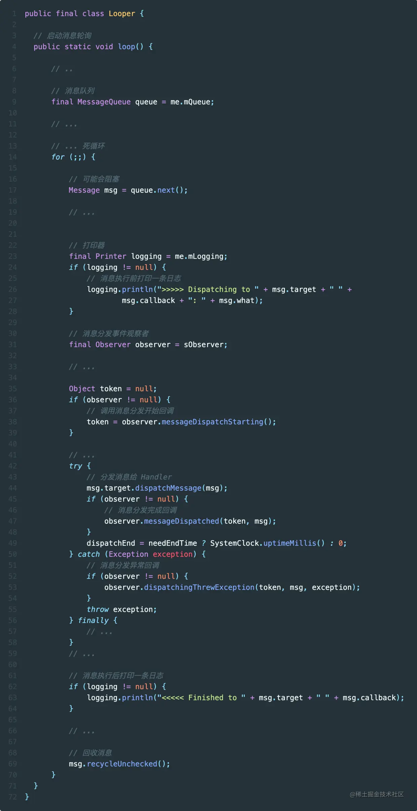

[toc]

## 01. 消息机制介绍 

### 1.1 程序之间的通信

进程和线程是对cpu资源的抽象。

进程间通信相对困难，因为进程彼此之间隔离。通常是通过系统调用将用户空间数据复制到内核空间，再通过内核来传递数据。

而线程分为同一进程内和不同进程内，不同进程间属于进程通信，同一进程内的线程通信相对简单，因为共享同一个进程的资源，因此它们可以直接访问相同的内存空间，不需要通过内核。所以线程间通信相对困难的是**同步**（防止数据竞争）和**互斥**（避免多个线程同时修改数据）。

### 1.2 为什么要有消息机制

它存在的主要原因是满足 **Android 独有的 UI 线程单线程模型**的异步和无锁的要求。

所谓UI线程的单线程模式，是指：Android 强制 UI 操作在单线程（UI 线程）中进行，不允许使用锁或信号量来让多个线程并发更新 UI。

传统的线程通信机制（如 `Lock`、`Semaphore` 等）通常用于处理竞争条件，它们通过阻塞来实现。然而，主线程承担着处理用户输入、绘制界面等核心任务，如果主线程被锁住或等待某个信号量，就会导致界面卡顿或无响应。因此，Android 避免使用可能阻塞主线程的通信机制，转而使用消息机制。

消息机制是 **同一进程内不同线程间的异步，无锁的通信机制**。异步是指：工作线程和主线程没有执行顺序要求，也就是没有同步的要求。无锁是对于主线程来说的，只有其可以从中读取消息，不存在竞争。

### 1.3 阻塞如何解决

根据上面我已经可以设计出一个消息机制了。一个主线程，死循环遍历消息队列，找到消息就处理。其它线程向消息队列中添加消息。ok，恭喜你，出不了院，继续住着吧。还缺了很关键的一步：阻塞。这种死循环会导致该线程一直工作，占据cpu。这就意味着， 当前有一个核已经满载了。如果有够多的app，那么cpu完全负担不了。

那么又有大聪明说了，我们可以隔一段时间遍历一次。可是，UI更新要求的就是及时性，这根本不符合需求。

所以引出我们这里的主角了：阻塞。消息机制通过eventfd和epoll实现阻塞机制，其中：eventfd是通知机制，用于通知事件的发送，epoll是IO多路服用机制。这些后面都有相应的介绍。

在事件循环中，监听eventfd，如果没有消息到来，那么线程睡眠在epoll的唤醒队列中。当消息到来时，发送消息的线程会写入eventfd，此时epoll监听到了这个写入动作，阻塞当前运行的线程，将主线程从自身的唤醒队列中执行调度放入cpu中执行。然后它从消息队列中取出消息执行。

如此，我们只需要付出线程切换的时间成本就可以实现及时性，阻塞性。

### 1.4 消息机制的原理

Android 的消息机制主要依赖于 **消息队列**（`MessageQueue`）、**事件循环**（`Looper`）、以及 `Handler` 三者的协同工作。其中事件循环依赖于：eventfd + epoll。

**具体流程如下**

- **消息队列的初始化**：
  主线程创建 `Looper` 和 `MessageQueue`，并启动一个事件循环。`Looper.loop()` 方法在内部调用 `MessageQueue.next()` 来获取下一条消息。如果消息队列为空，主线程会进入 `epoll` 的阻塞等待状态。
- **工作线程的消息发送**：
  比如，Binder 线程收到来自系统服务的请求后，会将该请求封装为消息，并将其插入到消息队列中。与此同时，工作线程通过 `eventfd` 写入一个事件，触发 `epoll`。
- **主线程的唤醒和消息分发**：
  当主线程中的 `epoll` 被 `eventfd` 触发，主线程从`epoll`的换线队列中从阻塞状态被苏醒，`Looper` 继续执行，检查 `MessageQueue` 中是否有新消息。如果有，`Looper` 取出消息并交由 `Handler` 处理，主线程根据消息类型来执行相应的任务。
- **消息处理**：
  `Handler` 是消息的具体处理者，通常每个 `Handler` 会关联特定的任务。它会根据传入的消息，调用相应的回调方法来处理该消息。


## 02. 前置知识

### 2.1 epoll

epoll是Linux中的IO多路复用机制，也就是允许程序同时监视多个I/O事件（如读、写、连接等）并在任意一个或多个文件描述符可操作时执行相应的操作。

它可以使单个线程/进程处理来自多个文件描述符的I/O请求，而不需要为每个请求都创建一个线程或进程，从而节省系统资源。

#### 1. epoll结构

`struct eventpoll` 结构体详解

```cpp
struct eventpoll {
    // 等待队列，用于 sys_epoll_wait()
    wait_queue_head_t wq;

    // 等待队列，用于 file->poll()
    wait_queue_head_t poll_wait;

    // 就绪文件描述符列表
    struct list_head rdllist;

    // 红黑树根节点，用于存储被监控的文件描述符
    struct rb_root_cached rbr;

    // epitm 单链表
    struct epitem *ovflist;

    // ...
};
```

1. **`wait_queue_head_t wq`**：**等待队列**，当一个进程调用 `epoll_wait()` 时，如果没有任何事件就绪，进程将进入 `wq` 等待队列中，直到有事件触发时才会被唤醒。

2. **`struct list_head rdllist`**：**就绪链表**，当某个 `fd` 发生了可读、可写或异常事件时，内核会将其加入到 `rdllist` 链表中。当进程调用 `epoll_wait()` 后，内核从 `rdllist` 中取出就绪的文件描述符，并将它们返回给用户。

3. **`struct rb_root_cached rbr`**：**红黑树**，用于存储 `epoll` 正在监听的文件描述符。当有新的 `fd` 添加到 `epoll` 监视器时，它会被插入到这棵红黑树中。

5. **`struct epitem \*ovflist`**：`ovflist` 是一个单链表，当事件过多时，它会暂时缓存溢出的文件描述符，避免丢失重要的事件。

#### 2. **`epoll` 机制的工作流程**

- **`epoll_create()`**:创建一个 `epoll` 实例
- **`epoll_ctl()`**:向 `epoll` 实例的红黑树中添加、修改或删除要监控的文件描述符。
- **`epoll_wait()`**:当你调用 `epoll_wait()` 时，内核会检查 `rdlist` 链表中是否有已就绪的文件描述符（即触发了监听事件的文件描述符）。如果有，就将这些事件返回给用户。如果没有，进程会被挂起，直到有事件触发为止。

#### 3. **`epoll` 的优势**

相比于 `select` 和 `poll`，`epoll` 的主要优势在于它将文件描述符的监听注册和实际的事件检测分离开来，它使用红黑树（`rbr`）来存储所有需要监控的文件描述符，使用就绪链表来存储发送事件的文件描述符，这样就在有事件发生时，无需遍历所有文件描述符，只需要遍历就绪链表即可获取发生的事件。

###  2.2 **`eventfd` **

event是进程或线程间事件通知机制，用来在进程间或线程间通知事件的发生。

它的本质是一个由内核管理的在内存中的**带等待队列的计数器**，它包含以下成员：

- **`wqh`（等待队列头，`__wait_queue_head`）**：
  `wqh` 是一个等待队列的头节点，它的作用是在事件尚未触发时，挂起等待事件的进程或线程。当事件发生时，会唤醒等待队列中的进程。

  `__wait_queue_head` 是一个自带自旋锁的双向链表节点，确保在多线程或多进程环境中，等待队列的访问是线程安全的。

- **`count`（计数器）**：
  `count` 是一个计数器，用于记录当前的事件计数值。当事件发生时，计数器的值会增加，进程或线程通过读取 `eventfd` 文件描述符来获知事件已经发生。

使用原理：当某个线程或进程写入 `eventfd`（通过 `write()`），计数器 `count` 的值会增加。如果有其他进程或线程在等待这个 `eventfd` 的事件（通过 `epoll_wait()` 或 `select()` 监听），这些等待的进程将会从等待队列中被唤醒。此时完成了进程间的通知机制。


## 03. 消息机制初始化

消息机制的初始化本质是创建eventfd + epoll实例，实现IO多路复用和事件通知机制，进而创建好事件循环的底层机制。

具体流程如下：


### 3.1 Looper初始化流程

之所以我们能在 Activity 中直接用 Handler 给主线程发消息 ，是因为 ActivityThread 的主函数 `main()` 中初始化了一个主线程专用的 Looper ，也正是这个 Looper 一直在轮询主线程要处理的消息。


`prepare()` 方法用于为当前线程创建一个新的 `Looper` 实例。 `Looper` 实例内其实就是调用 `MessageQueue` 构造函数创建 `MessageQueue` ，并将其与当前线程绑定。

`quitAllowed` 参数决定了是否允许该 `Looper` 被退出。


### 3.2 MessageQueue初始化

下面来看 `MessageQueue` 初始化流程

#### 1.MessageQueue 构造函数

在 `MessageQueue` 的 Java 构造函数中，有两个重要的成员变量被初始化：

```java
public final class MessageQueue {
    MessageQueue(boolean quitAllowed) {
        mQuitAllowed = quitAllowed; // 是否允许队列退出
        mPtr = nativeInit();        // 调用 JNI 方法初始化 NativeMessageQueue
    }
}
```

**`mQuitAllowed`**：用于控制 MessageQueue 是否允许退出。

**`mPtr`**：通过 `nativeInit()` 返回的 Native 层对象指针，用于关联 Java 层的 MessageQueue 和 Native 层的消息处理机制。

#### 2. `nativeInit()` 方法

`nativeInit()` 是一个 **JNI** 调用，用来初始化 **NativeMessageQueue** 对象，并返回其指针给 `mPtr`。在 Native 层的代码中，`NativeMessageQueue` 的构造函数被调用，创建了一个新的 **Looper**。

```cpp
jlong android_os_MessageQueue_nativeInit(JNIEnv* env, jclass clazz) {
    NativeMessageQueue* nativeMessageQueue = new NativeMessageQueue();
    return reinterpret_cast<jlong>(nativeMessageQueue);
}
```

- **`NativeMessageQueue`**：这是 Native 层的消息队列实现，它和 Java 层的 `MessageQueue` 对应，但工作在 Native 环境下，主要处理 Native 层的消息轮询。
- **`mPtr`**：这是一个指向 Native 层对象的指针，用于在 Java 和 Native 层之间传递数据。

#### 3. Native层MessageQueue 构造函数

```cpp
NativeMessageQueue::NativeMessageQueue() :
    mPollEnv(NULL), mPollObj(NULL), mExceptionObj(NULL) {

    mLooper = Looper::getForThread(); // 尝试为当前线程获取 Looper
    if (mLooper == NULL) {
        mLooper = new Looper(false);  // 如果没有 Looper，则为当前线程创建一个新的
        Looper::setForThread(mLooper); // 将 Looper 设置到当前线程
    }
}
```

- **`mLooper`**：Native 层的 `Looper`，类似于 Java 层的 `Looper`，负责处理消息的分发与轮询。每个线程都有一个独立的 `Looper` 实例。
- **`Looper::setForThread()`**：将当前 `Looper` 实例绑定到当前线程，这类似于 Java 层的 **ThreadLocal** 机制。

#### 4. Native层Looper 构造函数

```
cpp复制代码Looper::Looper(bool allowNonCallbacks) :
    mAllowNonCallbacks(allowNonCallbacks),
    mSendingMessage(false),
    mPolling(false),
    mEpollRebuildRequired(false),
    mNextRequestSeq(0),
    mResponseIndex(0),
    mNextMessageUptime(LLONG_MAX) {

    mWakeEventFd.reset(eventfd(0, EFD_NONBLOCK | EFD_CLOEXEC)); // 创建唤醒事件描述符
    rebuildEpollLocked(); // 重建 epoll 实例
}
```

- **`mWakeEventFd`**：这是一个文件描述符，用于线程间的唤醒机制，类似于一个信号量。当有新消息到达时，通过该描述符唤醒等待中的线程。
- **`rebuildEpollLocked()`**：调用该方法创建 `epoll` 实例，并将文件描述符加入到 `epoll` 事件监听中。

#### 5. rebuildEpollLocked 方法

```
cpp复制代码void Looper::rebuildEpollLocked() {
    mEpollFd.reset(epoll_create1(EPOLL_CLOEXEC)); // 创建 epoll 实例

    struct epoll_event eventItem;
    eventItem.events = EPOLLIN; // 监听可读事件
    int result = epoll_ctl(mEpollFd.get(), EPOLL_CTL_ADD, mWakeEventFd.get(), &eventItem); // 注册事件

    // 遍历请求列表，将每个请求的文件描述符注册到 epoll 中
    for (size_t i = 0; i < mRequests.size(); i++) {
        const Request& request = mRequests.valueAt(i);
        struct epoll_event eventItem;
        int epollResult = epoll_ctl(mEpollFd.get(), EPOLL_CTL_ADD, request.fd, &eventItem);
    }
}
```

- **`epoll_create1()`**：创建 `epoll` 实例，用于监听多个文件描述符上的事件。
- **`epoll_ctl()`**：将 `mWakeEventFd` 和请求中的文件描述符注册到 `epoll` 实例中，用于监听这些文件描述符上的可读事件。
- **`EPOLLIN`**：表示监听可读事件。当有数据可读时，`epoll` 会返回事件，触发相应的处理。

到现在我们发现了，创建一个looper，最终就是创建了eventfd和epoll实例，并把evetnfd加入到epoll监听中

#### 6.**这里有一个很困惑的地方，消息存放在哪？**

我们看如下代码：尤其关注enqueueMessage插入逻辑

`MessageQueue` 内部采用了一个简单的链表结构来管理消息

```
class MessageQueue {
    private Message mMessages;  // 链表头，代表消息队列中的第一条消息

    // 插入消息
    boolean enqueueMessage(Message msg, long when) {
        synchronized (this) {
            msg.when = when; // 设置消息的触发时间
            Message p = mMessages; // 当前的消息链表头
            if (p == null || when < p.when) {
                // 如果队列为空，或者新消息的执行时间早于当前队列中的第一条消息
                msg.next = p;
                mMessages = msg; // 新消息成为新的链表头
            } else {
                // 否则，找到合适的位置插入消息
                Message prev;
                while (true) {
                    prev = p;
                    p = p.next;
                    if (p == null || when < p.when) {
                        break;
                    }
                }
                msg.next = p;
                prev.next = msg;
            }
        }
        return true;
    }

    // 取出消息
    Message next() {
        // ... 取出链表中的消息并返回
    }
}

```

所以，消息队列是一个空的链表，并不是一开始就有内容的，而是通过程序运行过程中不断地 **插入消息** 逐渐充实的。

#### 7.消息的数据结构

`Handler` 发送的核心数据是 **`Message`** 对象。`Message` 是 Android 中用来封装数据和操作的基本单元，它包括了目标 `Handler`、要传递的数据和要执行的操作等信息。

```
java复制代码public class Message {
    public int what;            // 消息的类型
    public int arg1;            // 消息的整型参数
    public int arg2;            // 消息的整型参数
    public Object obj;          // 消息携带的任意对象
    Handler target;             // 消息的目标处理 Handler
    Runnable callback;          // 可选的 Runnable 回调
    long when;                  // 消息的执行时间
}
```

- **`what`**：消息类型，通常用于区分不同的消息。
- **`arg1` / `arg2`**：整型参数，可以携带一些附加的数值。
- **`obj`**：可选的对象参数，携带复杂的数据。
- **`target`**：该消息的目标 `Handler`，当 `Looper` 从 `MessageQueue` 中取出消息时，会调用 `target` 的 `handleMessage()` 方法来处理。
- **`callback`**：如果 `Message` 传递了一个 `Runnable` 回调，则消息处理时会优先执行该 `Runnable`。没有则调用 `target` 的 `handleMessage()` 方法来处理。
- **`when`**：消息的执行时间。


### 3.3 Handler初始化流程

#### 1. 那么Handler呢？首先我们怎么理解Handler

```
public class Handler {
    final Looper mLooper;         // Handler 所绑定的 Looper
    final MessageQueue mQueue;    // Looper 中的消息队列
    final Callback mCallback;     // 用户自定义的回调，用于处理消息
}
```

`Handler` 并不是独立存在的，它和 `Looper` 以及 `MessageQueue` 紧密关联。每个 `Handler` 都需要绑定一个 `Looper`，从而与其管理的 `MessageQueue` 关联。

Handler是可以动态注册，有很多个。Handler其实就是对一个处理函数的封装。每注册一个，代表当前looper可以处理的任务又多了一个种类。

#### 2.Handler的初始化

Handler 的初始化过程比较简单，这个过程中比较特别的两个点分别是`不能在没有调用 Looper.prepare() 的线程创建 Handler`以及`异步 Handler`。

Handler 的构造函数有一个比较特别的一个 async 参数，async 为 true 时表示该 Handler 是一个`异步消息处理器`，使用这个 Handler 发送的消息会是异步消息。


#### 3.**怎么理解：异步消息，跳过同步屏障**

**同步消息**：这是 Android 消息机制中默认的消息类型。同步消息会按照插入队列的顺序，逐个取出并处理，遵循严格的顺序执行规则。

**异步消息**：异步消息是通过异步 `Handler`（即创建 `Handler` 时 `async` 标志为 `true`）发送的消息。与同步消息不同，异步消息具有更高的优先级，能够在某些特殊情况下绕过队列中的同步消息，被优先处理。

同步屏障是 Android 的消息机制中引入的一种特殊机制，用于暂时阻止队列中普通同步消息的处理。屏障存在时，`MessageQueue` 只会处理**异步消息**。屏障机制通常用于 **界面渲染** 或 **动画** 等场景，以确保某些任务能够优先被执行，避免延迟。


## 04.消息轮询过程

##### 1. 消息轮询过程概述

消息循环过程主要是由 Looper 的 `loop()` 方法、MessageQueue 的 `next()` 方法、Native 层 Looper 的 `pollOnce()` 这三个方法组成。

消息轮询过程是从 Looper 的 loop() 方法开始的，loop() 方法中有一个死循环，死循环中会调用 MessageQueue 的 next() 方法，获取到消息后，loop() 方法就会调用 Message 的 target 的 dispatchMessage() 方法分发消息

在 MessageQueue 的 next() 方法中，首先会调用 nativePollOnce() JNI 方法检查队列中是否有新的消息要处理，没有时线程就会被阻塞。有的话就会尝试找出需要优先执行的异步线程，没有异步消息的话，就会判断消息是否到了要执行的时间，是的话就返回给 Looper 处理，否则重新计算消息的执行时间。

##### 2.Looper.loop()

前面讲到了在 ActivityThread 的 `main()` 函数中会调用 Looper 的 loop() 方法让 Looper 开始轮询消息，loop() 方法中有一个死循环，死循环中会调用 MessageQueue 的 `next()` 方法获取下一条消息，获取到消息后，loop() 方法就会调用 Message 的 target 的 `dispatchMessage()` 方法，target 其实就是发送 Message 的 `Handler` 。最后就会调用 Message 的 `recycleUnchecked()` 方法回收处理完的消息。



作者：欧少泽
链接：https://juejin.cn/post/6983598752837664781
来源：稀土掘金
著作权归作者所有。商业转载请联系作者获得授权，非商业转载请注明出处。


接下来再看看Looper.loop()

```reasonml
reasonml 代码解读复制代码/**
 * Run the message queue in this thread. Be sure to call
 * {@link #quit()} to end the loop.
 */
public static void loop() {
    //得到当前线程Looper
    final Looper me = myLooper();
    if (me == null) {
        throw new RuntimeException("No Looper; Looper.prepare() wasn't called on this thread.");
    }
    //得到当前looper的MessageQueue
    final MessageQueue queue = me.mQueue;

    // Make sure the identity of this thread is that of the local process,
    // and keep track of what that identity token actually is.
    Binder.clearCallingIdentity();
    final long ident = Binder.clearCallingIdentity();

    //开始循环
    for (;;) {
        Message msg = queue.next(); // might block
        if (msg == null) {
            // No message indicates that the message queue is quitting.
            //没有消息表示消息队列正在退出
            return;
        }

        // This must be in a local variable, in case a UI event sets the logger
        Printer logging = me.mLogging;
        if (logging != null) {
            logging.println(">>>>> Dispatching to " + msg.target + " " +
                    msg.callback + ": " + msg.what);
        }

        //将真正的处理工作交给message的target，即handler
        msg.target.dispatchMessage(msg);

        if (logging != null) {
            logging.println("<<<<< Finished to " + msg.target + " " + msg.callback);
        }

        // Make sure that during the course of dispatching the
        // identity of the thread wasn't corrupted.
        final long newIdent = Binder.clearCallingIdentity();
        if (ident != newIdent) {
            Log.wtf(TAG, "Thread identity changed from 0x"
                    + Long.toHexString(ident) + " to 0x"
                    + Long.toHexString(newIdent) + " while dispatching to "
                    + msg.target.getClass().getName() + " "
                    + msg.callback + " what=" + msg.what);
        }

        //回收消息资源
        msg.recycleUnchecked();
    }
}
```

通过这段代码可知，**调用loop方法后，Looper线程就开始真正工作了，它不断从自己的MessageQueue中取出队头的消息(或者说是任务)执行**。


提问：


4. **如何处理其他事务？**

主线程除了处理 UI 绘制和用户交互等任务外，还需要处理系统服务发来的消息。这些任务通常是通过其他线程来完成，然后将结果通过 `Handler` 发送到主线程。

核心机制：**多线程与 Handler**

- **主线程与 Binder 线程**：你提到的 `thread.attach(false)` 创建了一个 Binder 线程，该线程用于接收系统服务（如 AMS）发送来的事件。Binder 线程与主线程之间通过 `Handler` 进行通信，Binder 线程将消息发送到主线程的消息队列中，由主线程处理。
- **创建新线程**：对于耗时的任务，Android 通常会在主线程之外启动新线程来处理任务。新线程执行完任务后，可以通过 `Handler` 将结果返回给主线程。

通过这种方式，主线程能够专注于 UI 和消息的处理，而耗时的操作则交给其他线程完成，避免了主线程被阻塞。

5. **典型应用：Activity 的生命周期管理**

- `ActivityThread` 类中有一个内部类 `H`，它是 `Handler` 的子类。这个类负责处理 `Activity` 的生命周期事件，如启动、暂停、停止等。
- 当系统（如 AMS）通知应用某个 `Activity` 需要启动时，AMS 会通过 Binder 通信将消息发送到应用的主线程，`H` 会接收到这个消息，并调用 `Activity` 的相关生命周期方法进行处理。

这种设计确保了系统服务与应用主线程之间的通信是异步的，并且不会阻塞主线程的 UI 更新。


三个问题：

1. 怎么阻塞
2. 它怎么知道消息到了
3. 消息队列是存放在进程的公有空间中的吗？


