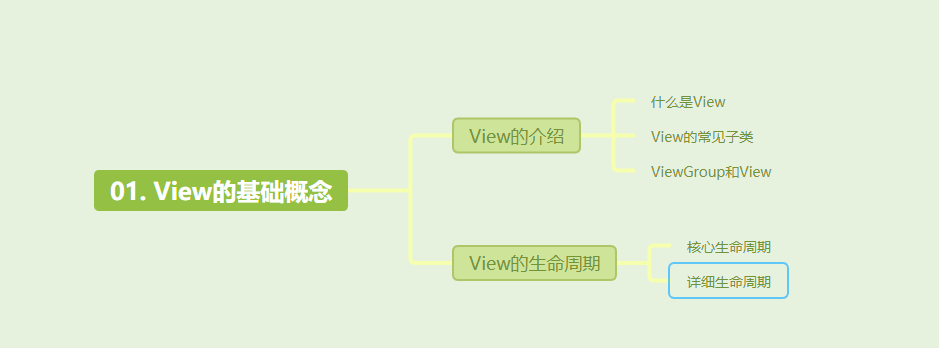
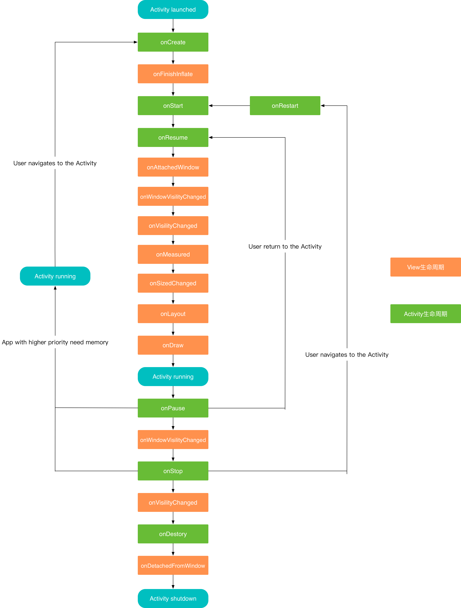

[toc]



预习

1. View和activity有什么区别？为什么都是提供视图并且与用户进行交互？

## 01. View的介绍

### 1.1 什么是View

`View` 代表了一个矩形区域，可以用来显示内容或响应用户的交互。

### 1.2 常见的View的子类

`View` 是抽象类，所有可见的 UI 元素，都是 `View` 的子类。常见的 `View` 类型包括：

- **TextView**：用于显示文本内容。
- **Button**：一个可点击的按钮。
- **ImageView**：用于显示图片。
- **EditText**：一个可以输入文本的编辑框。
- **CheckBox**：一个带勾选框的选择项。

### 1.3 View和ViewGroup

**`ViewGroup`** 是 `View` 的子类，他很特殊，不像Button那些子类一样用来显示内容，他用来充当一个 **容器**，他内部可以包含多个子 `View` 或子 `ViewGroup`，以此来实现复杂的 UI 布局。ViewGroup和View共同实现了view树，如下图：


同时`ViewGroup` 也是 Android 中布局控件的父类，所有布局类（如 `LinearLayout`、`RelativeLayout`、`FrameLayout`）都继承自 `ViewGroup`。以下是一些常见的 `ViewGroup` 子类及其功能：

- **LinearLayout**：线性布局，以水平或垂直的顺序排列子视图。
- **RelativeLayout**：相对布局，根据子视图之间的相对位置进行排列。
- **FrameLayout**：帧布局，子视图会堆叠显示，适合显示单一子视图。
- **RecyclerView**：用于显示大量数据的高性能列表，可以实现复杂的列表布局。


## 02. View 的生命周期

### 2.1 View的核心生命周期

`View` 的生命周期主要包括测量、布局、绘制等步骤。

- **onMeasure()**：测量 `View` 的宽度和高度。
- **onLayout()**：确定 `View` 的位置，尤其在 `ViewGroup` 中更为重要。
- **onDraw()**：绘制 `View` 的内容。

除此之外，View还有其它很多生命周期，比如OnSizeChanged，但是并不是主要的，在此不过多赘述。

### 2.2 View的详细生命周期

- 在View中有诸多回调方法，它们在View的不同生命周期阶段调用，常用的有以下方法。写一个简单的自定义View来观察View与Activity的生命周期变化。

  ```java
  public class CustomView extends View {
  
      private static final String TAG = "View";
  
      public CustomView(Context context) {
          super(context);
          Log.d(TAG, "CustomView()");
      }
  
      public CustomView(Context context, @Nullable AttributeSet attrs) {
          super(context, attrs);
          Log.d(TAG, "CustomView()");
      }
  
      public CustomView(Context context, @Nullable AttributeSet attrs, int defStyleAttr) {
          super(context, attrs, defStyleAttr);
          Log.d(TAG, "CustomView()");
      }
  
      /**
       * View在xml文件里加载完成时调用
       */
      @Override
      protected void onFinishInflate() {
          super.onFinishInflate();
          Log.d(TAG, "View onFinishInflate()");
      }
  
      /**
       * 测量View及其子View大小时调用
       */
      @Override
      protected void onMeasure(int widthMeasureSpec, int heightMeasureSpec) {
          super.onMeasure(widthMeasureSpec, heightMeasureSpec);
          Log.d(TAG, "View onMeasure()");
      }
  
      /**
       * 布局View及其子View大小时调用
       */
      @Override
      protected void onLayout(boolean changed, int left, int top, int right, int bottom) {
          super.onLayout(changed, left, top, right, bottom);
          Log.d(TAG, "View onLayout() left = " + left + " top = " + top + " right = " + right + " bottom = " + bottom);
      }
  
      /**
       * View大小发生改变时调用
       */
      @Override
      protected void onSizeChanged(int w, int h, int oldw, int oldh) {
          super.onSizeChanged(w, h, oldw, oldh);
          Log.d(TAG, "View onSizeChanged() w = " + w + " h = " + h + " oldw = " + oldw + " oldh = " + oldh);
      }
  
      /**
       * 绘制View及其子View大小时调用
       */
      @Override
      protected void onDraw(Canvas canvas) {
          super.onDraw(canvas);
          Log.d(TAG, "View onDraw()");
      }
  
      /**
       * 物理按键事件发生时调用
       */
      @Override
      public boolean onKeyDown(int keyCode, KeyEvent event) {
          Log.d(TAG, "View onKeyDown() event = " + event.getAction());
          return super.onKeyDown(keyCode, event);
      }
  
      /**
       * 物理按键事件发生时调用
       */
      @Override
      public boolean onKeyUp(int keyCode, KeyEvent event) {
          Log.d(TAG, "View onKeyUp() event = " + event.getAction());
          return super.onKeyUp(keyCode, event);
      }
  
      /**
       * 触摸事件发生时调用
       */
      @Override
      public boolean onTouchEvent(MotionEvent event) {
          Log.d(TAG, "View onTouchEvent() event =  " + event.getAction());
          return super.onTouchEvent(event);
      }
  
      /**
       * View获取焦点或者失去焦点时调用
       */
      @Override
      protected void onFocusChanged(boolean gainFocus, int direction, @Nullable Rect previouslyFocusedRect) {
          super.onFocusChanged(gainFocus, direction, previouslyFocusedRect);
          Log.d(TAG, "View onFocusChanged() gainFocus = " + gainFocus);
      }
  
      /**
       * View所在窗口获取焦点或者失去焦点时调用
       */
      @Override
      public void onWindowFocusChanged(boolean hasWindowFocus) {
          super.onWindowFocusChanged(hasWindowFocus);
          Log.d(TAG, "View onWindowFocusChanged() hasWindowFocus = " + hasWindowFocus);
      }
  
      /**
       * View被关联到窗口时调用
       */
      @Override
      protected void onAttachedToWindow() {
          super.onAttachedToWindow();
          Log.d(TAG, "View onAttachedToWindow()");
      }
  
      /**
       * View从窗口分离时调用
       */
      @Override
      protected void onDetachedFromWindow() {
          super.onDetachedFromWindow();
          Log.d(TAG, "View onDetachedFromWindow()");
      }
  
      /**
       * View的可见性发生变化时调用
       */
      @Override
      protected void onVisibilityChanged(@NonNull View changedView, int visibility) {
          super.onVisibilityChanged(changedView, visibility);
          Log.d(TAG, "View onVisibilityChanged() visibility = " + visibility);
      }
  
      /**
       * View所在窗口的可见性发生变化时调用
       */
      @Override
      protected void onWindowVisibilityChanged(int visibility) {
          super.onWindowVisibilityChanged(visibility);
          Log.d(TAG, "View onWindowVisibilityChanged() visibility = " + visibility);
      }
  }
  ```

### 2.3 Activity与View的生命周期

- Activity create

  ```java
  2024-08-22 13:48:02.423 31303-31303/org.jjjjjjava.freshview D/Test--View--: CustomView()
  2024-08-22 13:48:02.423 31303-31303/org.jjjjjjava.freshview D/Test--View--: View onFinishInflate()
  2024-08-22 13:48:02.618 31303-31303/org.jjjjjjava.freshview D/Test--Activity--: onCreate
  2024-08-22 13:48:02.627 31303-31303/org.jjjjjjava.freshview D/Test--Activity--: onStart
  2024-08-22 13:48:02.630 31303-31303/org.jjjjjjava.freshview D/Test--Activity--: onResume
  2024-08-22 13:48:02.670 31303-31303/org.jjjjjjava.freshview D/Test--View--: View onAttachedToWindow()
  2024-08-22 13:48:02.670 31303-31303/org.jjjjjjava.freshview D/Test--View--: View onWindowVisibilityChanged() visibility = 0
  2024-08-22 13:48:02.670 31303-31303/org.jjjjjjava.freshview D/Test--View--: View onVisibilityChanged() visibility = 0
  2024-08-22 13:48:02.687 31303-31303/org.jjjjjjava.freshview D/Test--View--: View onMeasure()
  2024-08-22 13:48:02.709 31303-31303/org.jjjjjjava.freshview D/Test--View--: View onMeasure()
  2024-08-22 13:48:02.713 31303-31303/org.jjjjjjava.freshview D/Test--View--: View onSizeChanged() w = 1080 h = 30 oldw = 0 oldh = 0
  2024-08-22 13:48:02.714 31303-31303/org.jjjjjjava.freshview D/Test--View--: View onLayout() left = 0 top = 0 right = 1080 bottom = 30
  2024-08-22 13:48:02.993 31303-31303/org.jjjjjjava.freshview D/Test--View--: View onDraw()
  2024-08-22 13:48:03.058 31303-31303/org.jjjjjjava.freshview D/Test--View--: View onWindowFocusChanged() hasWindowFocus = true
  ```

- Activity pause

  ```java
  2024-08-22 13:50:02.843 31303-31303/org.jjjjjjava.freshview D/Test--Activity--: onPause
  2024-08-22 13:50:02.866 31303-31303/org.jjjjjjava.freshview D/Test--View--: View onWindowFocusChanged() hasWindowFocus = false
  2024-08-22 13:50:03.343 31303-31303/org.jjjjjjava.freshview D/Test--View--: View onWindowVisibilityChanged() visibility = 8
  2024-08-22 13:50:03.369 31303-31303/org.jjjjjjava.freshview D/Test--Activity--: onStop
  2024-08-22 13:50:03.375 31303-31303/org.jjjjjjava.freshview D/Test--View--: View onVisibilityChanged() visibility = 4
  ```

- Activity resume

  ```java
  2024-08-22 13:50:57.229 31303-31303/org.jjjjjjava.freshview D/Test--Activity--: onStart
  2024-08-22 13:50:57.232 31303-31303/org.jjjjjjava.freshview D/Test--Activity--: onResume
  2024-08-22 13:50:57.233 31303-31303/org.jjjjjjava.freshview D/Test--View--: View onVisibilityChanged() visibility = 0
  2024-08-22 13:50:57.237 31303-31303/org.jjjjjjava.freshview D/Test--View--: View onWindowVisibilityChanged() visibility = 0
  2024-08-22 13:50:57.277 31303-31303/org.jjjjjjava.freshview D/Test--View--: View onDraw()
  2024-08-22 13:50:57.299 31303-31303/org.jjjjjjava.freshview D/Test--View--: View onWindowFocusChanged() hasWindowFocus = true
  ```

- Activity destory

  ```java
  2024-08-22 13:51:46.013 31303-31303/org.jjjjjjava.freshview D/Test--Activity--: onStop
  2024-08-22 13:51:46.014 31303-31303/org.jjjjjjava.freshview D/Test--View--: View onVisibilityChanged() visibility = 4
  2024-08-22 13:51:46.019 31303-31303/org.jjjjjjava.freshview D/Test--Activity--: onDestroy
  2024-08-22 13:51:46.020 31303-31303/org.jjjjjjava.freshview D/Test--View--: View onDetachedFromWindow()
  ```

- 来总结一下View的声明周期随着Activity生命周期变化的情况。

- 

## 其他介绍

### 01.关于我的博客

- csdn：http://my.csdn.net/qq_35829566

- 掘金：https://juejin.im/user/499639464759898

- github：https://github.com/jjjjjjava

- 简书：http://www.jianshu.com/u/92a2412be53e

- 邮箱：[934137388@qq.com](mailto:934137388@qq.com)

   
