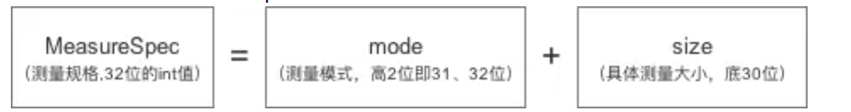

[toc]

## 01.Measure流程分析

**Measure 流程**是 View 的测量阶段，用于确定 View 的尺寸。主要包含`measure()` 和 `onMeasure()` 方法。

- 步骤为：首先调用measure()方法，进行一些逻辑处理，然后在内部调用onMeasure()方法，使用setMeasuredDimension()设定View的宽高信息，完成View的测量操作。

- measure方法：传入了两个参数 widthMeasureSpec, heightMeasureSpec 表示View的宽高的一些信息

  ```
  public final void measure(int widthMeasureSpec, int heightMeasureSpec) {
  }
  ```

- onMeasure方法：

  ```
  @Override
  protected void onMeasure(int widthMeasureSpec, int heightMeasureSpec) {
      //super.onMeasure(widthMeasureSpec, heightMeasureSpec);
      //从中获取View的宽/高
      int width = getDefaultSize(getSuggestedMinimumWidth(), widthMeasureSpec);
      int height = getDefaultSize(getSuggestedMinimumHeight(), heightMeasureSpec);
      //指定View的宽高，完成测量工作
      setMeasuredDimension(width,height);
  }
  ```

- 由上述流程来看Measure流程很简单，关键点是在于widthMeasureSpec, heightMeasureSpec这两个参数信息怎么获得？这两个参数又是什么样子？

## 02.MeasureSpec的确定

### 2.1 MeasureSpec是什么

#### 2.1 MeasureSpec是什么

- 先介绍下什么是MeasureSpec？

  - 

- MeasureSpec由两部分组成，一部分是测量模式，另一部分是测量的尺寸大小。

  - 其中，Mode模式共分为三类
    - UNSPECIFIED ：不对View进行任何限制，要多大给多大，一般用于系统内部
    - EXACTLY：表示父容器要求子 View 的大小必须是精确的值，这种模式一般出现在 LayoutParams 设置为 `match_parent` 或具体数值时。
    - AT_MOST ：表示子 View 的大小不能超过父容器允许的最大值。这种模式通常与 LayoutParams 设置为 `wrap_content` 对应。

- 那么MeasureSpec又是如何确定的？

  - 先介绍什么是顶层 View（即 DecorView）：是应用的decorview，不包含安卓系统UI，但是它是应用内容的外壳，包含我们在xml中定义的视图。

    ```
    假如有布局文件如下：
    <!-- activity_main.xml -->
    <LinearLayout xmlns:android="http://schemas.android.com/apk/res/android"
        android:layout_width="match_parent"
        android:layout_height="match_parent"
        android:orientation="vertical">
    
        <TextView
            android:id="@+id/titleText"
            android:layout_width="wrap_content"
            android:layout_height="wrap_content"
            android:text="Hello, World!"
            android:textSize="24sp" />
    
        <Button
            android:id="@+id/myButton"
            android:layout_width="wrap_content"
            android:layout_height="wrap_content"
            android:text="Click Me" />
    
    </LinearLayout>
    
    
    对应的view视图层次结构
    DecorView
    └── LinearLayout (布局文件中的根 View)
        ├── TextView
        └── Button
    ```

  - **顶层 DecorView 的 MeasureSpec 确定**
    对于 Android 应用的顶层 View（即 DecorView），系统根据屏幕的尺寸和其 LayoutParams（ `match_parent`、`wrap_content` 和具体大小设置） 确定 MeasureSpec。由于屏幕大小是固定的，DecorView 的尺寸不应超过屏幕的限制。

  - 举例：

    ```
    假设屏幕的宽度为 1080px，高度为 1920px。
    
    
    Activity 的根布局（DecorView）的 LayoutParams 设置为 match_parent。
    在这种情况下，DecorView 的宽高 MeasureSpec 为：
    宽度 MeasureSpec：EXACTLY 1080px
    高度 MeasureSpec：EXACTLY 1920px
    
    Activity 的根布局（DecorView）的 LayoutParams 设置为 wrap_content。
    在这种情况下，DecorView 的宽高 MeasureSpec 为：
    宽度 MeasureSpec：AT_MOST 1080px
    高度 MeasureSpec：AT_MOST 1920px
    
    Activity 的根布局（DecorView）的 LayoutParams 设置为具体的尺寸 500px 宽，800px 高。
    在这种情况下，DecorView 的宽高 MeasureSpec 为：
    宽度 MeasureSpec：EXACTLY 500px
    高度 MeasureSpec：EXACTLY 800px
    
    如果 LayoutParams 设置为具体的尺寸 1100px 宽，800px 高。超过了限制呢？
    在这种情况下，DecorView 的最终 MeasureSpec 为：
    宽度 MeasureSpec：EXACTLY 1080px（自动调整为屏幕的最大宽度限制）
    高度 MeasureSpec：EXACTLY 800px
    ```

  - **子 View 的 MeasureSpec 确定**
    对于其他 View（包括 ViewGroup 和普通 View），其 MeasureSpec 由**父布局的 MeasureSpec**和**自身的 LayoutParams**共同确定。

  - **从这里看出MeasureSpec的指定也是从顶层布局开始一层层往下去，父布局影响子布局。**

### 2.2 MeasureSpec静态类

- 代码如下所示：

  - 包含5个成员变量（偏移位数，掩码，3个模式的INT值），3个函数（计算MeasureSpec，获取模式，获取尺寸）。
  - MODE_SHIFT = 30，偏移量，表示32位中低30位是尺寸，高2位是模式。
  - MODE_MASK  = 0x3 << MODE_SHIFT; 表明高2位全1，低30位全0。是模式的掩码。
  - 具体MeasureSpec的计算：`return (size & ~MODE_MASK) | (mode & MODE_MASK);` 尺寸与低30位全1相与。模式与高两位全1相与。

  ```
  //view.class
  public static class MeasureSpec {
      private static final int MODE_SHIFT = 30;
      private static final int MODE_MASK  = 0x3 << MODE_SHIFT;
  
      /**
       * 这种模式不用关心
       */
      public static final int UNSPECIFIED = 0 << MODE_SHIFT;
  
      /**
       * 精确模式，对应的是match_parent和具体值，比如100dp
      public static final int EXACTLY     = 1 << MODE_SHIFT;
  
      /**
       * 最大模式，对应的就是wrap_content
       */
      public static final int AT_MOST     = 2 << MODE_SHIFT;
  
     
      public static int makeMeasureSpec(@IntRange(from = 0, to = (1 << MeasureSpec.MODE_SHIFT) - 1) int size,
                                        @MeasureSpecMode int mode) {
          if (sUseBrokenMakeMeasureSpec) {
              return size + mode;
          } else {
          //尺寸与低30为全1相与。模式与高两位全1相与。
              return (size & ~MODE_MASK) | (mode & MODE_MASK);
          }
      }
  
      /**
       * 获取测量的模式
       */
      @MeasureSpecMode
      public static int getMode(int measureSpec) {
          //noinspection ResourceType
          return (measureSpec & MODE_MASK);
      }
  
      /**
       * 获取测量到的尺寸大小
       */
      public static int getSize(int measureSpec) {
          return (measureSpec & ~MODE_MASK);
      }
  }
  ```

  