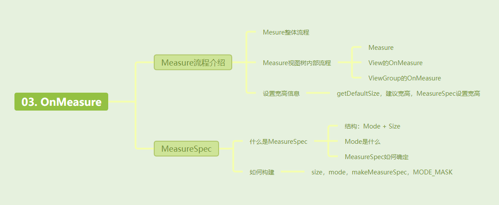
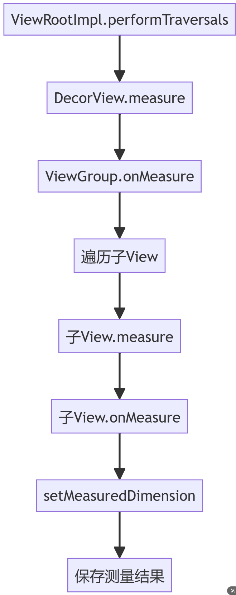
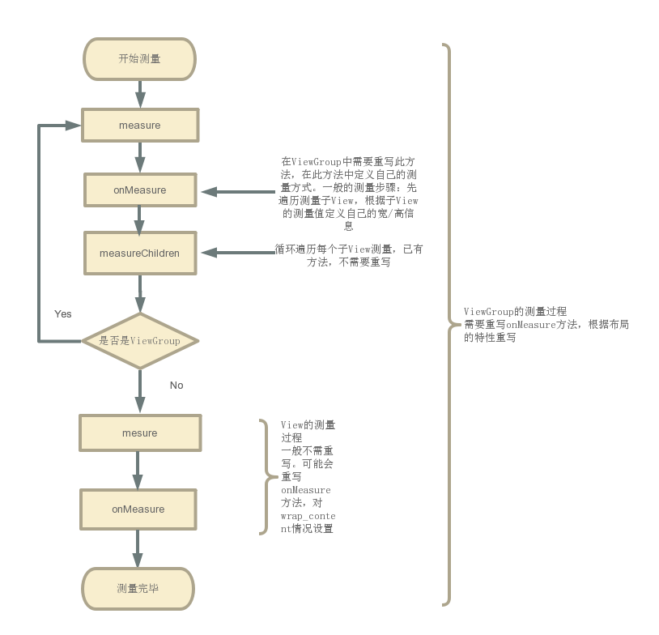

[toc]



不足：

- Measure流程分析
  - 什么是DecorView
  - Measure视图树内部流程
  - 设置宽高信息

## 01.Measure介绍

- 请问测量的本质是什么，**View是一块矩形区域**，测量就是去设置这个矩形区域的宽高。
- 那么这个宽高怎么来的？宽高有两个来源，一个是measurespec中的size，另一个是我们通过getsuggested + padding得到的desireSize。
- 我们最终通过setmeasuredemission完成设置

## 01.Measure流程分析

### 1.1 Measure整体流程

- 整体介绍Measure从ViewRootImpl到View树的调用过程

- ViewRootImpl调用performTraversals后，经过performMeasure进入到DecorView的measure过程中（也就是视图树的View过程中）。

- 到这里，可能会困惑，什么是DecorView？我日常开发中怎么没见过？确实，我们日常见到的是布局文件，其里面是Activity的View，然后我们通过setContentView设置。可是实际上上，DecorView是是Android视图树的根节点视图，也是FrameLayout的子类。我们上面通过布局文件创建的View，其实是被添加到DecorView中的一个子View中，通常是id为content的FrameLayout。因为他也是一个FrameLayout，因此其会调用自身ViewGroup的onMeasure，在内部调用布局文件中子View的Measure，在他们测量完成并最终返回后，其最终确定自身尺寸。

- ```
  ViewRootImpl.performTraversals()
      → performMeasure() 
          → DecorView.measure() 
              → FrameLayout.onMeasure() 
                  → 遍历measureChildWithMargins()测量子View 
                  → setMeasuredDimension()确定自身尺寸
  ```

- 对应如下：
- 


### 1.2 Measure视图树内部流程

- 视图树中就两个部分，一个是View，一个是ViewGroup，所以其实就是介绍View和ViewGroup的measure流程。

- 不管如何，他们都会先调用measure()方法，但是它不关键，只是进行一些逻辑处理，最终它会调用onMeasure，并在里面完成测量的逻辑。View和ViewGroup的差距关键就在于OnMeasure的执行。

  ```
  // 测量入口（final方法，不可重写）
  public final void measure(int widthMeasureSpec, int heightMeasureSpec) {
      // 1. 检查是否需要重新测量（通过PFLAG_FORCE_LAYOUT标记）
      if ((mPrivateFlags & PFLAG_FORCE_LAYOUT) != 0 || ...) {
          // 2. 调用onMeasure进行实际测量
          onMeasure(widthMeasureSpec, heightMeasureSpec);
          // 3. 设置测量完成标记
          mPrivateFlags |= PFLAG_LAYOUT_REQUIRED;
      }
      // 4. 保存父容器传递的MeasureSpec
      mOldWidthMeasureSpec = widthMeasureSpec;
      mOldHeightMeasureSpec = heightMeasureSpec;
  }
  
  ```

- 普通View的OnMeasure

  - 我们会传递给他widthMeasureSpec和heightMeasureSpec。

  - 它会通过getSuggestedMinimumWidth获取建议尺寸。

  - 最终通过getDefaultSize从传递的参数和建议尺寸中二选一，具体选择要根据传递的MeasureSpec的Mode决定。并最终通过setMeasuredDimension进行设置

  - ```
    protected void onMeasure(int widthSpec, int heightSpec) {
        /super.onMeasure(widthMeasureSpec, heightMeasureSpec);
        //从中获取View的宽/高
        int width = getDefaultSize(getSuggestedMinimumWidth(), widthMeasureSpec);
        int height = getDefaultSize(getSuggestedMinimumHeight(), heightMeasureSpec);
        //指定View的宽高，完成测量工作
        setMeasuredDimension(width,height);
    }
    
    ```

- **ViewGroup的测量**

  - ViewGroup内部可以容纳子View，所以其比较特殊

  - 其首先测量所有子View，然后根据子View的尺寸计算自身尺寸，并考虑自身padding和父容器大小限制，得到最终的尺寸。并调用setMeasuredDimension应用。

  - 具体代码如下：类似于后序遍历，先遍历完子View的大小，然后计算自身尺寸。

  - ```
    protected void onMeasure(int widthSpec, int heightSpec) {
        // 1. 测量所有子View
        measureChildren(widthSpec, heightSpec);
        
        // 2. 根据子View尺寸计算自身尺寸
        int totalWidth = 0;
        for (View child : children) {
            totalWidth += child.getMeasuredWidth();
        }
        
        // 3. 考虑自身padding
        totalWidth += getPaddingLeft() + getPaddingRight();
        
        // 4. 应用父容器限制
        int finalWidth = resolveSize(totalWidth, widthSpec);
        setMeasuredDimension(finalWidth, ...);
    }
    
    protected void measureChildren(int widthMeasureSpec, int heightMeasureSpec) {
        final int size = mChildrenCount;
        final View[] children = mChildren;
        // 遍历所有子View（包括GONE状态的View）
        for (int i = 0; i < size; ++i) {
            final View child = children[i];
            if ((child.mViewFlags & VISIBILITY_MASK) != GONE) {
                // 关键方法：计算子View的MeasureSpec
                measureChild(child, widthMeasureSpec, heightMeasureSpec);
            }
        }
    }
    
    ```

- 好，至此我们知道了Measure的流程了，其对应测量过程如下：

  - 


### 1.3 最终结果：设置宽高信息

- 我们上面最终都会通过setMeasuredDimension()来完成测量，设置自身的宽高信息，我们设置的宽高究竟是什么呢？

- 宽高通过getDefaultSize获取，该方法接收两个参数，并选择一个作为宽高。这两个参数分别是getSuggestedMinimumWidth()和MeasureSpec。具体的选择方式是：根据MeasureSpec的MODE进行选取。

  - 如果View的MODE为无限制，他的宽高将设置getSuggestedMinimumWidth() + padding；
  - 如果View的MODE为 EXACTLY 或 AT_MOST，则会被设置为从MeasureSpec中获取的specSize。

- 其具体代码如下：

  ```
  @Override
  protected void onMeasure(int widthMeasureSpec, int heightMeasureSpec) {
      //super.onMeasure(widthMeasureSpec, heightMeasureSpec);
      //从中获取View的宽/高
      int width = getDefaultSize(getSuggestedMinimumWidth(), widthMeasureSpec);
      int height = getDefaultSize(getSuggestedMinimumHeight(), heightMeasureSpec);
      //指定View的宽高，完成测量工作
      setMeasuredDimension(width,height);
  }
  
  /**
   * 为宽度获取一个建议最小值
   */
  protected int getSuggestedMinimumWidth () {
      return (mBackground == null) ? mMinWidth : max(mMinWidth , mBackground.getMinimumWidth());
  }
  /**
   * 获取默认的宽高值
   */
  public static int getDefaultSize (int size, int measureSpec) {
      int result = size;
      int specMode = MeasureSpec. getMode(measureSpec);
      int specSize = MeasureSpec. getSize(measureSpec);
      switch (specMode) {
      case MeasureSpec. UNSPECIFIED:
          result = size;
          break;
      case MeasureSpec. AT_MOST:
      case MeasureSpec. EXACTLY:
          result = specSize;
          break;
      }
      return result;
  }
  ```

- 从源码可以知道：

## 02.MeasureSpec的确定

getSuggestedMinimumWidth是给出的建议值。MeasureSpec是我们自己设置的值，那么MeasureSpec值的来源是什么？

### 2.1 MeasureSpec是什么

- 先介绍下什么是MeasureSpec？
  - 他是一个int类型，有32位大小，高两位是mode测量模式，低30位是size测量的尺寸大小。
  - 

- 其中，Mode模式共分为三类
  - UNSPECIFIED ：无限制，不对View进行任何限制，要多大给多大。
  - EXACTLY：精确尺寸，表示父容器要求子 View 的大小必须是精确的值。
  - AT_MOST ：表示子 View 的大小不能超过父容器允许的最大值。这种模式通常与 LayoutParams 设置为 `wrap_content` 对应。

### 2.2 MeasureSpec如何构建？

- 代码如下所示：

  - ```
    //view.class
    public static class MeasureSpec {
        private static final int MODE_SHIFT = 30;
        private static final int MODE_MASK  = 0x3 << MODE_SHIFT;
    
        /**
         * 这种模式不用关心
         */
        public static final int UNSPECIFIED = 0 << MODE_SHIFT;
    
        /**
         * 精确模式，对应的是match_parent和具体值，比如100dp
        public static final int EXACTLY     = 1 << MODE_SHIFT;
    
        /**
         * 最大模式，对应的就是wrap_content
         */
        public static final int AT_MOST     = 2 << MODE_SHIFT;
    
       
        public static int makeMeasureSpec(@IntRange(from = 0, to = (1 << MeasureSpec.MODE_SHIFT) - 1) int size,
                                          @MeasureSpecMode int mode) {
            if (sUseBrokenMakeMeasureSpec) {
                return size + mode;
            } else {
            //尺寸与低30为全1相与。模式与高两位全1相与。
                return (size & ~MODE_MASK) | (mode & MODE_MASK);
            }
        }
    
        /**
         * 获取测量的模式
         */
        @MeasureSpecMode
        public static int getMode(int measureSpec) {
            //noinspection ResourceType
            return (measureSpec & MODE_MASK);
        }
    
        /**
         * 获取测量到的尺寸大小
         */
        public static int getSize(int measureSpec) {
            return (measureSpec & ~MODE_MASK);
        }
    }
    ```

- 关键代码如下：

  - 构建MeasureSpec时，会传递size和mode，调用makeMeasureSpec，构建，具体构建原理如下：
  
  - (size & ~MODE_MASK) | (mode & MODE_MASK)
  
  - MODE_MASK是0x3左移30位。
  
  - ```
    // 创建MeasureSpec示例：
    int mode = MeasureSpec.EXACTLY;
    int size = 1080;
    int measureSpec = MeasureSpec.makeMeasureSpec(size, mode);
    
    // 位操作分解：
    size & ~MODE_MASK → 保留低30位（000...001111）
    mode & MODE_MASK  → 保留高2位（1100...0000）
    两者按位或 → 合并模式与尺寸
    
    // 验证结果：
    getMode(measureSpec) == EXACTLY  // true
    getSize(measureSpec) == 1080     // true
    
    ```
  

### 2.3 Measure的size和Mode如何确定？

-  MeasureSpec 由**父布局的 MeasureSpec**和**自身的 LayoutParams**共同确定。如果是DecorView，没有父布局，其根据屏幕的尺寸和 LayoutParams确定 MeasureSpec。由于屏幕大小是固定的，DecorView 的尺寸不应超过屏幕的限制。

- 举例：

  - ```
    假设屏幕的宽度为 1080px，高度为 1920px。
    
    Activity 的根布局（DecorView）的 LayoutParams 设置为具体的尺寸 500px 宽，800px 高。
    在这种情况下，DecorView 的宽高 MeasureSpec 为：
    宽度 MeasureSpec：EXACTLY 500px
    高度 MeasureSpec：EXACTLY 800px
    
    如果我们设置超过3680PX，那么还是1080PX
    ```

- 从上面可以看出MeasureSpec的指定也是从顶层布局开始一层层往下去，父布局影响子布局。

## 03. 实际案例

### 3.1 View中onMeasure方法

- 下面是真是开发案例中的代码，如下所示

  ```
  //Android7.0以后，优化了View的绘制，onMeasure和onSizeChanged调用顺序有所变化
  //Android7.0以下：onMeasure--->onSizeChanged--->onMeasure
  //Android7.0以上：onMeasure--->onSizeChanged
  @Override
  protected void onMeasure(int widthMeasureSpec, int heightMeasureSpec) {
      int heightSize = MeasureSpec.getSize(heightMeasureSpec);
      int heightMode = MeasureSpec.getMode(heightMeasureSpec);
      /*
       * onMeasure传入的widthMeasureSpec和heightMeasureSpec不是一般的尺寸数值，而是将模式和尺寸组合在一起的数值
       * MeasureSpec.EXACTLY 是精确尺寸
       * MeasureSpec.AT_MOST 是最大尺寸
       * MeasureSpec.UNSPECIFIED 是未指定尺寸
       */
  
      if (heightMode == MeasureSpec.EXACTLY) {
          heightSize = MeasureSpec.makeMeasureSpec(heightSize, MeasureSpec.EXACTLY);
      } else if (heightMode == MeasureSpec.AT_MOST && getParent() instanceof ViewGroup
              && heightSize == ViewGroup.LayoutParams.MATCH_PARENT) {
          heightSize = MeasureSpec.makeMeasureSpec(((ViewGroup) getParent()).getMeasuredHeight(), MeasureSpec.AT_MOST);
      } else {
          int heightNeeded;
          if (gravity == Gravity.CENTER) {
              if (tickMarkTextArray != null && tickMarkLayoutGravity == Gravity.BOTTOM) {
                  heightNeeded = (int) (2 * (getRawHeight() - getTickMarkRawHeight()));
              } else {
                  heightNeeded = (int) (2 * (getRawHeight() - Math.max(leftSB.getThumbScaleHeight(), rightSB.getThumbScaleHeight()) / 2));
              }
          } else {
              heightNeeded = (int) getRawHeight();
          }
          heightSize = MeasureSpec.makeMeasureSpec(heightNeeded, MeasureSpec.EXACTLY);
      }
      super.onMeasure(widthMeasureSpec, heightSize);
  }
  ```

- 下面是ImageView的源代码

  ```
  @Override
  protected void onMeasure(int widthMeasureSpec, int heightMeasureSpec) {
      resolveUri();
      int w;
      int h;
  
      // Desired aspect ratio of the view's contents (not including padding)
      float desiredAspect = 0.0f;
  
      // We are allowed to change the view's width
      boolean resizeWidth = false;
  
      // We are allowed to change the view's height
      boolean resizeHeight = false;
  
      final int widthSpecMode = MeasureSpec.getMode(widthMeasureSpec);
      final int heightSpecMode = MeasureSpec.getMode(heightMeasureSpec);
  
      if (mDrawable == null) {
          // If no drawable, its intrinsic size is 0.
          mDrawableWidth = -1;
          mDrawableHeight = -1;
          w = h = 0;
      } else {
          w = mDrawableWidth;
          h = mDrawableHeight;
          if (w <= 0) w = 1;
          if (h <= 0) h = 1;
  
          // We are supposed to adjust view bounds to match the aspect
          // ratio of our drawable. See if that is possible.
          if (mAdjustViewBounds) {
              resizeWidth = widthSpecMode != MeasureSpec.EXACTLY;
              resizeHeight = heightSpecMode != MeasureSpec.EXACTLY;
  
              desiredAspect = (float) w / (float) h;
          }
      }
  
      final int pleft = mPaddingLeft;
      final int pright = mPaddingRight;
      final int ptop = mPaddingTop;
      final int pbottom = mPaddingBottom;
  
      int widthSize;
      int heightSize;
  
      if (resizeWidth || resizeHeight) {
          /* If we get here, it means we want to resize to match the
              drawables aspect ratio, and we have the freedom to change at
              least one dimension.
          */
  
          // Get the max possible width given our constraints
          widthSize = resolveAdjustedSize(w + pleft + pright, mMaxWidth, widthMeasureSpec);
  
          // Get the max possible height given our constraints
          heightSize = resolveAdjustedSize(h + ptop + pbottom, mMaxHeight, heightMeasureSpec);
  
          if (desiredAspect != 0.0f) {
              // See what our actual aspect ratio is
              final float actualAspect = (float)(widthSize - pleft - pright) /
                                      (heightSize - ptop - pbottom);
  
              if (Math.abs(actualAspect - desiredAspect) > 0.0000001) {
  
                  boolean done = false;
  
                  // Try adjusting width to be proportional to height
                  if (resizeWidth) {
                      int newWidth = (int)(desiredAspect * (heightSize - ptop - pbottom)) +
                              pleft + pright;
  
                      // Allow the width to outgrow its original estimate if height is fixed.
                      if (!resizeHeight && !sCompatAdjustViewBounds) {
                          widthSize = resolveAdjustedSize(newWidth, mMaxWidth, widthMeasureSpec);
                      }
  
                      if (newWidth <= widthSize) {
                          widthSize = newWidth;
                          done = true;
                      }
                  }
  
                  // Try adjusting height to be proportional to width
                  if (!done && resizeHeight) {
                      int newHeight = (int)((widthSize - pleft - pright) / desiredAspect) +
                              ptop + pbottom;
  
                      // Allow the height to outgrow its original estimate if width is fixed.
                      if (!resizeWidth && !sCompatAdjustViewBounds) {
                          heightSize = resolveAdjustedSize(newHeight, mMaxHeight,
                                  heightMeasureSpec);
                      }
  
                      if (newHeight <= heightSize) {
                          heightSize = newHeight;
                      }
                  }
              }
          }
      } else {
          /* We are either don't want to preserve the drawables aspect ratio,
             or we are not allowed to change view dimensions. Just measure in
             the normal way.
          */
          w += pleft + pright;
          h += ptop + pbottom;
  
          w = Math.max(w, getSuggestedMinimumWidth());
          h = Math.max(h, getSuggestedMinimumHeight());
  
          widthSize = resolveSizeAndState(w, widthMeasureSpec, 0);
          heightSize = resolveSizeAndState(h, heightMeasureSpec, 0);
      }
  
      setMeasuredDimension(widthSize, heightSize);
  }
  ```

### 3.2 ViewGroup中onMeasure方法

- 下面是真是开发案例中LinearLayout的代码，如下所示

  ```
  @Override
  protected void onMeasure(int widthMeasureSpec, int heightMeasureSpec) {
      int myWidth = -1;
      int myHeight = -1;
  
      int width = 0;
      int height = 0;
  
      final int widthMode = MeasureSpec.getMode(widthMeasureSpec);
      final int heightMode = MeasureSpec.getMode(heightMeasureSpec);
      final int widthSize = MeasureSpec.getSize(widthMeasureSpec);
      final int heightSize = MeasureSpec.getSize(heightMeasureSpec);
  
      // Record our dimensions if they are known;
      if (widthMode != MeasureSpec.UNSPECIFIED) {
          myWidth = widthSize;
      }
  
      if (heightMode != MeasureSpec.UNSPECIFIED) {
          myHeight = heightSize;
      }
  
      if (widthMode == MeasureSpec.EXACTLY) {
          width = myWidth;
      }
  
      if (heightMode == MeasureSpec.EXACTLY) {
          height = myHeight;
      }
  
      View ignore = null;
      int gravity = mGravity & Gravity.RELATIVE_HORIZONTAL_GRAVITY_MASK;
      final boolean horizontalGravity = gravity != Gravity.START && gravity != 0;
      gravity = mGravity & Gravity.VERTICAL_GRAVITY_MASK;
      final boolean verticalGravity = gravity != Gravity.TOP && gravity != 0;
  
      int left = Integer.MAX_VALUE;
      int top = Integer.MAX_VALUE;
      int right = Integer.MIN_VALUE;
      int bottom = Integer.MIN_VALUE;
  
      boolean offsetHorizontalAxis = false;
      boolean offsetVerticalAxis = false;
  
      if ((horizontalGravity || verticalGravity) && mIgnoreGravity != View.NO_ID) {
          ignore = findViewById(mIgnoreGravity);
      }
  
      final boolean isWrapContentWidth = widthMode != MeasureSpec.EXACTLY;
      final boolean isWrapContentHeight = heightMode != MeasureSpec.EXACTLY;
  
      // We need to know our size for doing the correct computation of children positioning in RTL
      // mode but there is no practical way to get it instead of running the code below.
      // So, instead of running the code twice, we just set the width to a "default display width"
      // before the computation and then, as a last pass, we will update their real position with
      // an offset equals to "DEFAULT_WIDTH - width".
      final int layoutDirection = getLayoutDirection();
      if (isLayoutRtl() && myWidth == -1) {
          myWidth = DEFAULT_WIDTH;
      }
  
      View[] views = mSortedHorizontalChildren;
      int count = views.length;
  
      for (int i = 0; i < count; i++) {
          View child = views[i];
          if (child.getVisibility() != GONE) {
              LayoutParams params = (LayoutParams) child.getLayoutParams();
              int[] rules = params.getRules(layoutDirection);
  
              applyHorizontalSizeRules(params, myWidth, rules);
              measureChildHorizontal(child, params, myWidth, myHeight);
  
              if (positionChildHorizontal(child, params, myWidth, isWrapContentWidth)) {
                  offsetHorizontalAxis = true;
              }
          }
      }
  
      views = mSortedVerticalChildren;
      count = views.length;
      final int targetSdkVersion = getContext().getApplicationInfo().targetSdkVersion;
      
      //省略部分代码
  
      setMeasuredDimension(width, height);
  }
  ```

## 其他介绍

### 01.关于我的博客

- csdn：http://my.csdn.net/qq_35829566

- 掘金：https://juejin.im/user/499639464759898

- github：https://github.com/jjjjjjava

- 简书：http://www.jianshu.com/u/92a2412be53e

- 邮箱：[934137388@qq.com]

