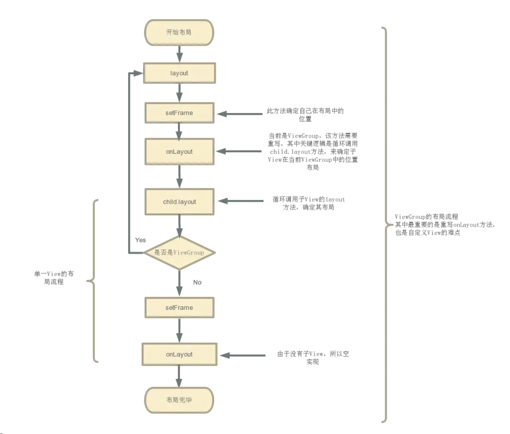

[toc]

提问：

1. View和ViewGroup的onLayout关系是什么样的？
2. layout和onlayout关系是什么样的？

## 01. Layout流程

### 1.1 ViewGroup的layout()

- 源码如下所示

  - 从源码中可以看出实际上调用的还是View的layout()方法。

  ```
  @Override
  public final void layout(int l, int t, int r, int b) {
      if (!mSuppressLayout && (mTransition == null || !mTransition.isChangingLayout())) {
          if (mTransition != null) {
              mTransition.layoutChange(this);
          }
          //内部实际上是调用View的layout()
          super.layout(l, t, r, b);
      } else {
          // record the fact that we noop'd it; request layout when transition finishes
          mLayoutCalledWhileSuppressed = true;
      }
  }
  ```

### 1.2 View的layout()

- 测量完View大小后，就需要将View布局在Window中，View的布局主要通过确定上下左右四个点来确定的。

  - **ViewGroup先在layout()中确定自己的布局，然后在onLayout()方法中再调用子View的layout()方法，让子View布局。在Measure过程中，ViewGroup一般是先测量子View的大小，然后再确定自身的大小。**

  ```
  public void layout(int l, int t, int r, int b) {  
  
      // 当前视图的四个顶点
      int oldL = mLeft;  
      int oldT = mTop;  
      int oldB = mBottom;  
      int oldR = mRight;  
  
  	// 确定视图的四个顶点
      boolean changed = isLayoutModeOptical(mParent) ?
              setOpticalFrame(l, t, r, b) : setFrame(l, t, r, b);
  
      // 调用 onLayout()测量子视图
      if (changed || (mPrivateFlags & PFLAG_LAYOUT_REQUIRED) == PFLAG_LAYOUT_REQUIRED) {  
          onLayout(changed, l, t, r, b);      
      }
    ...
  
  }
  ```

  

  - 上面看出通过 setFrame（） / setOpticalFrame（）：确定View自身的位置，通过onLayout()确定子View的布局。

## 02.OnLayout流程

### 2.1 ViewGroup的onLayout()

- 查看源码如下所示

  - ViewGroup中的onLayout方法是抽象方法，当我们的自定义View继承ViewGroup时需要我们自己去实现

  ```
  /**
  * 作用：计算该ViewGroup包含所有的子View在父容器的位置（）
  * 注：
  *    a. 定义为抽象方法，需重写，因：子View的确定位置与具体布局有关，所以onLayout（）在ViewGroup没有实现
  *    b. 在自定义ViewGroup时必须复写onLayout（）！！！！！
  *    c. 复写原理：遍历子View 、计算当前子View的四个位置值 & 确定自身子View的位置（调用子View layout（））
  * */
  @Override
  protected abstract void onLayout(boolean changed,int l, int t, int r, int b);
  ```

### 2.2 View的onLayout()

- 查看源码如下所示

  - 由于继承View的自定义控件不包含子控件，所以View的onLayout()方法是空实现。

  ```
  /**
    * onLayout（）
    * 注：对于单一View的laytou过程
    *    a. 由于单一View是没有子View的，故onLayout（）是一个空实现
    *    b. 由于在layout（）中已经对自身View进行了位置计算，所以单一View的layout过程在layout（）后就已完成了
    */ 
  protected void onLayout(boolean changed, int left, int top, int right, int bottom) {
  }  
  ```

## 03.View中的Layout和OnLayout

- 关于布局有两个重要的方法，View.layout()和View.onLayout()，这两个方法有什么关系？各自的作用是什么呢？他们都是定义在 View 中的，不同的是**layout()方法中有很长一段实现的代码，而onLayout()确实一个空的实现**，里面什么事也没做。
- 首先我们要明确布局的本质是什么，**布局就是为 View 设置四个坐标值，这四个坐标值保存在View的成员变量 mLeft、mTop、mRight、mBottom中**，方便View在绘制（onDraw）的时候知道应该在那个区域内绘制控件。而我们看到 **layout() 方法中实际上就是为这几个成员变量赋值的**，所以到底真正设置坐标的是layout()方法，那onLayout()的作用是什么呢？
- **onLayout()都是由ViewGroup的子类实现的，他的作用就是确定容器中每个子控件的位置**，由于不同的容器有不容的布局策略，所以每个容器对onLayout()方法的实现都不同，**onLayout()方法会遍历容器中所有的子控件，然后计算他们左上右下的坐标值，最后调用child.layout()方法为子控件设置坐标**；由于layout()方法中又调用了onLayout()方法，如果子控件child也是一个容器，就会继续为它的子控件计算坐标，如果child不是容器，onLayout()方法将什么也不做，这样下来，只要Activity根窗口mDecor的layout()方法执行完毕，窗口中所有的子容器、子控件都将完成布局操作。

## 04.View的布局流程

View的布局流程：

- ****

## 05.FrameLayout中Layout解析

- FrameLayout 的 onLayout 方法比较简单，这里直接通过注释的形式进行说明。

  ```java
  @Override
  //onLayout() 方法只是简单地调用了 layoutChildren()，实际的布局逻辑都在 layoutChildren() 中。
  protected void onLayout(boolean changed, int left, int top, int right, int bottom) {
      layoutChildren(left, top, right, bottom, false /* no force left gravity */);
  }
  
  void layoutChildren(int left, int top, int right, int bottom,
                                boolean forceLeftGravity) {
      final int count = getChildCount();
  
  //计算父view可使用的上下左右边界
      final int parentLeft = getPaddingLeftWithForeground();
      final int parentRight = right - left - getPaddingRightWithForeground();
      final int parentTop = getPaddingTopWithForeground();
      final int parentBottom = bottom - top - getPaddingBottomWithForeground();
  
  // 遍历每一个 view，设置每一个 view 的位置。
      for (int i = 0; i < count; i++) {
          final View child = getChildAt(i);
          // 只操作可见 view
          if (child.getVisibility() != GONE) {
              //获取子视图的LayoutParams及其测量好的宽高
              final LayoutParams lp = (LayoutParams) child.getLayoutParams();
              // width 和 height 分别是 Measure 过后的 宽和高
              final int width = child.getMeasuredWidth();
              final int height = child.getMeasuredHeight();
  
              int childLeft;
              int childTop;
  
              //从上面获取到的子视图的LayoutParams中解析其gravity属性，即：决定子视图的对齐方式（如左对齐、右对齐、居中等）。
              int gravity = lp.gravity;
              if (gravity == -1) {
                  gravity = DEFAULT_CHILD_GRAVITY;
              }
  			/*
  				获取当前布局的方向（从左到右或从右到左）。
  					View.LAYOUT_DIRECTION_LTR（0）：从左到右（默认方向）。
  					View.LAYOUT_DIRECTION_RTL（1）：从右到左（阿拉伯语、希伯来语等语言使用的布局方式）。
  				将 gravity 属性转换为绝对方向。
  					在布局方向为 RTL（从右到左）时，这一步非常重要，它可以将相对的 gravity（如 LEFT 和 RIGHT）翻译为绝对的方向。
  				提取 gravity 属性中的垂直对齐方式（与水平对齐分开处理）。
  					gravity & Gravity.VERTICAL_GRAVITY_MASK 的作用是屏蔽掉水平方向上的标志位，仅保留垂直方向的对齐规则。
  			*/
              final int layoutDirection = getLayoutDirection();
              final int absoluteGravity = Gravity.getAbsoluteGravity(gravity, layoutDirection);
              final int verticalGravity = gravity & Gravity.VERTICAL_GRAVITY_MASK;
  
  //根据 gravity 计算 left 和 top 坐标
              //水平对齐规则
              switch (absoluteGravity & Gravity.HORIZONTAL_GRAVITY_MASK) {
                  case Gravity.CENTER_HORIZONTAL:
                      // gravity 是水平居中的情况
                      // 左坐标的计算可以分为两部分
                      // 1. 可使用的父 view 的左边界范围 + 放置view的中间位置(父view可用范围 减去 view 宽度后的一半)
                      // 2. 移除右 margin 加上 左margin
                      childLeft = parentLeft + (parentRight - parentLeft - width) / 2 +
                      lp.leftMargin - lp.rightMargin;
                      break;
                  case Gravity.RIGHT:
                      // 这里主要考虑的是强制从左排列，在开发者选项中可以进行设置。
                      // 这里就先不讨论这个。
                      if (!forceLeftGravity) {
                          childLeft = parentRight - width - lp.rightMargin;
                          break;
                      }
                  case Gravity.LEFT:
                  default:
                      // 默认情况，加上左 margin 就行。
                      childLeft = parentLeft + lp.leftMargin;
              }
  //垂直对齐规则
              switch (verticalGravity) {
                  case Gravity.TOP:
                      childTop = parentTop + lp.topMargin;
                      break;
                  case Gravity.CENTER_VERTICAL:
                      // 垂直居中的情况，与上面类似，也不重复了。
                      childTop = parentTop + (parentBottom - parentTop - height) / 2 +
                      lp.topMargin - lp.bottomMargin;
                      break;
                  case Gravity.BOTTOM:
                      childTop = parentBottom - height - lp.bottomMargin;
                      break;
                  default:
                      childTop = parentTop + lp.topMargin;
              }
              // 最重要的地方，将计算得出的四个位置作为参数，设置进去。
              child.layout(childLeft, childTop, childLeft + width, childTop + height);
          }
      }
  }
  ```