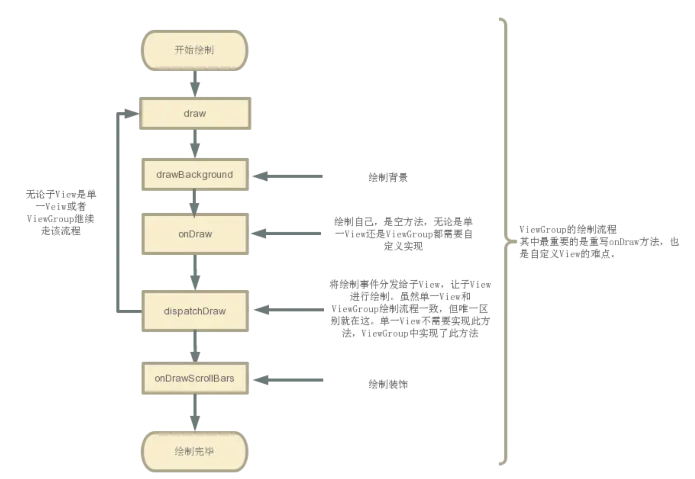

[toc]

提问：

1. 怎么理解：背景，自己，children，装饰？
2. 

## 01.Draw绘制过程

### 1.1 View的绘制过程遵循步骤

- View的绘制过程遵循如下几步：
  - ①绘制背景 background.draw(canvas)
  - ②绘制自己（onDraw）
  - ③绘制Children(dispatchDraw)
  - ④绘制装饰（onDrawScrollBars）

### 1.2 介绍

- 绘制背景：背景通常是设置在视图上的background，如纯色背景、渐变、图片等。

  - ```
    <TextView
        android:layout_width="200dp"
        android:layout_height="100dp"
        android:background="#0000FF"
        android:text="Hello World"
        android:textSize="18sp"
        android:gravity="center" />
    ```

  - 这里就是一个蓝色背景 android:background="#0000FF"

- 绘制自己：绘制视图的内容，例如文本、图形等。

  - ```
    @Override
    protected void onDraw(Canvas canvas) {
        super.onDraw(canvas);
        // TextView 的默认实现会绘制文本内容
        Paint paint = new Paint();
        paint.setColor(Color.WHITE); // 白色文字
        paint.setTextSize(18 * getResources().getDisplayMetrics().density); // 18sp
        canvas.drawText("Hello World", getWidth() / 2, getHeight() / 2, paint);
    }
    ```

  - 这里就是绘制白色的Hello world文本

  - ViewGroup是容器，不显示内容，因此无需重写该方法

- 绘制子视图：在该方法中，`ViewGroup` 会遍历所有子视图，并调用它们的 `draw()` 方法。

  - View不是容器，没有子视图，因此无需重写该方法。

- 绘制装饰：装饰是指视图的额外元素，例如滚动条等。

  - ```
    <RecyclerView
        android:layout_width="match_parent"
        android:layout_height="match_parent"
        android:scrollbars="vertical" />
    ```

  - 这是一个一个长列表控件（`RecyclerView`）带有滚动条。当内容超出可视区域时，系统会自动在 `onDrawScrollBars()` 中绘制滚动条。

## 02.View绘制流程

- 绘制流程如下图：
  - 
- 绘制注意事项：不要在View绘制和做布局操作的时候实例化数据，将创建对象等这些分配内存资源和会引起垃圾回收机制的操作在onDraw/onLayout之前进行。因为在View及其子类的onDraw方法，会实时调用以更新界面，会频繁的创建对象和进行垃圾回收，垃圾回收的GC线程会抢占CPU资源影响UI的显示性能，这样一个显示很顺畅的用户界面就会因对象分配引起的一些垃圾回收机制进行短暂的停滞。

## 03.Draw方法源码

- View类中Draw方法源码，如下所示：

  - ```java
    /**
      * 源码分析：draw（）
      * 作用：根据给定的 Canvas 自动渲染 View（包括其所有子 View）。
      * 绘制过程：
      *   1. 绘制view背景
      *   2. 绘制view内容
      *   3. 绘制子View
      *   4. 绘制装饰（渐变框，滑动条等等）
      * 注：
      *    a. 在调用该方法之前必须要完成 layout 过程
      *    b. 所有的视图最终都是调用 View 的 draw （）绘制视图（ ViewGroup 没有复写此方法）
      *    c. 在自定义View时，不应该复写该方法，而是复写 onDraw(Canvas) 方法进行绘制
      *    d. 若自定义的视图确实要复写该方法，那么需先调用 super.draw(canvas)完成系统的绘制，然后再进行自定义的绘制
      */ 
      public void draw(Canvas canvas) {
     
        ...// 仅贴出关键代码
      
        int saveCount;
     
        // 步骤1： 绘制本身View背景
            if (!dirtyOpaque) {
                drawBackground(canvas);
            }
     
        // 若有必要，则保存图层（还有一个复原图层）
        // 优化技巧：当不需绘制 Layer 时，“保存图层“和“复原图层“这两步会跳过
        // 因此在绘制时，节省 layer 可以提高绘制效率
        final int viewFlags = mViewFlags;
        if (!verticalEdges && !horizontalEdges) {
     
        // 步骤2：绘制本身View内容
            if (!dirtyOpaque) 
                onDraw(canvas);
            // View 中：默认为空实现，需复写
            // ViewGroup中：需复写
     
        // 步骤3：绘制子View
        // 由于单一View无子View，故View 中：默认为空实现
        // ViewGroup中：系统已经复写好对其子视图进行绘制我们不需要复写
            dispatchDraw(canvas);
            
        // 步骤4：绘制装饰，如滑动条、前景色等等
            onDrawScrollBars(canvas);
     
            return;
        }
        ...    
    }
     
    //下面，我们继续分析在draw（）中4个步骤调用的drawBackground（）、
    // onDraw()、dispatchDraw()、onDrawScrollBars(canvas)
    
    /**
    * 步骤1：drawBackground(canvas)
    * 作用：绘制View本身的背景
    */
    private void drawBackground(Canvas canvas) {
        // 获取背景 drawable
        final Drawable background = mBackground;
        if (background == null) {
            return;
        }
        // 根据在 layout 过程中获取的 View 的位置参数，来设置背景的边界
        setBackgroundBounds();
    
        .....
    
        // 获取 mScrollX 和 mScrollY值 
        final int scrollX = mScrollX;
        final int scrollY = mScrollY;
        if ((scrollX | scrollY) == 0) {
            background.draw(canvas);
        } else {
            // 若 mScrollX 和 mScrollY 有值，则对 canvas 的坐标进行偏移
            canvas.translate(scrollX, scrollY);
    
    
            // 调用 Drawable 的 draw 方法绘制背景
            background.draw(canvas);
            canvas.translate(-scrollX, -scrollY);
        }
    } 
    
    /**
    * 步骤2：onDraw(canvas)
    * 作用：绘制View本身的内容
    * 注：
    *   a. 由于 View 的内容各不相同，所以该方法是一个空实现
    *   b. 在自定义绘制过程中，需由子类去实现复写该方法，从而绘制自身的内容
    *   c. 谨记：自定义View中 必须 且 只需复写onDraw（）
    */
    protected void onDraw(Canvas canvas) {
      
        ... // 复写从而实现绘制逻辑
    	//下面是一个简单的view绘制本身的示例
    	Paint paint = new Paint();
        paint.setColor(Color.RED);
        canvas.drawCircle(getWidth() / 2, getHeight() / 2, 50, paint); // 绘制一个红色圆形
    }
    
    /**
    * 步骤3： dispatchDraw(canvas)
    * 作用：绘制子View
    * 注：由于单一View中无子View，故为空实现
    */
    protected void dispatchDraw(Canvas canvas) {
    
        ... // 空实现
    }
    
    /**
    * 步骤4： onDrawScrollBars(canvas)
    * 作用：绘制装饰，如 滚动指示器、滚动条、和前景等
    */
    public void onDrawForeground(Canvas canvas) {
        onDrawScrollIndicators(canvas);
        onDrawScrollBars(canvas);
    
        final Drawable foreground = mForegroundInfo != null ? mForegroundInfo.mDrawable : null;
        if (foreground != null) {
            if (mForegroundInfo.mBoundsChanged) {
                mForegroundInfo.mBoundsChanged = false;
                final Rect selfBounds = mForegroundInfo.mSelfBounds;
                final Rect overlayBounds = mForegroundInfo.mOverlayBounds;
    
                if (mForegroundInfo.mInsidePadding) {
                    selfBounds.set(0, 0, getWidth(), getHeight());
                } else {
                    selfBounds.set(getPaddingLeft(), getPaddingTop(),
                            getWidth() - getPaddingRight(), getHeight() - getPaddingBottom());
                }
    
                final int ld = getLayoutDirection();
                Gravity.apply(mForegroundInfo.mGravity, foreground.getIntrinsicWidth(),
                        foreground.getIntrinsicHeight(), selfBounds, overlayBounds, ld);
                foreground.setBounds(overlayBounds);
            }
    
            foreground.draw(canvas);
        }
    }
    ```
  
- ViewGroup中Draw源码：跟View的draw一样，只是多了一个dispatchDraw，绘制步骤一样。具体就看一下dispatchDraw方法

  - ```java
    /**
    * 源码分析：dispatchDraw（）
    * 作用：遍历子View & 绘制子View
    * 注：
    *   a. ViewGroup中：由于系统为我们实现了该方法，故不需重写该方法
    *   b. View中默认为空实现（因为没有子View可以去绘制）
    */ 
    protected void dispatchDraw(Canvas canvas) {
        ......
    
        //下面是一个简单的ViewGroup绘制子View的示例
    	for (int i = 0; i < getChildCount(); i++) {
            View child = getChildAt(i);
            drawChild(canvas, child, getDrawingTime()); // 绘制每个子视图
        }
    }
    
    /**
    * 分析1：drawChild（）
    * 作用：绘制子View
    */
    protected boolean drawChild(Canvas canvas, View child, long drawingTime) {
        // 最终还是调用了子 View 的 draw （）进行子View的绘制
        return child.draw(canvas, this, drawingTime);
    }
    ```
    
    