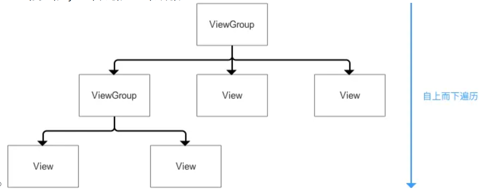

[toc]

预习：

1. 什么是viewRoot？
2. 什么是WindowManager？
3. 什么是DecorView？
4. 为什么说`ViewRootImpl` 连接了 **WindowManager**（外界窗口管理入口）和 **DecorView**（整个视图树的顶层容器）。
5. DecorView保护内容栏和标题栏，请问这是什么意思？
6. View绘制的层原理是什么？
7. 产生View卡顿的原因有哪些？

## **01.View工作流程

- View工作流程
  - View工作流程简单来说就是，先measure测量，用于确定View的测量宽高，再 layout布局，用于确定View的最终宽高和四个顶点的位置，最后 draw绘制，用于将View 绘制到屏幕上。
  - 
  - ViewRoot对应于ViewRootImpl类，它是连接WindowManager和DecorView的纽带。
  - View的绘制流程是从ViewRoot和performTraversals开始。performTraversals()依次调用performMeasure()、performLayout()和performDraw()三个方法，分别完成顶级 View的绘制。
  - 其中，performMeasure()会调用measure()，measure()中又调用onMeasure()，实现对其所有子元素的measure过程，这样就完成了一次measure过程；接着子元素会重复父容器的measure过程，如此反复至完成整个View树的遍历。layout和draw同理。
- 比较重要的概念
  - ViewRoot：连接WindowManager(外界访问Window的入口)和DecorView（顶级View）的纽带，View的三大流程均是通过ViewRoot来完成的。
  - DecorView：顶级View
    - DecorView是顶级View，本质就是一个FrameLayout
    - 包含了两个部分，标题栏和内容栏
    - 内容栏id是content，也就是activity中setContentView所设置的部分，最终将布局添加到id为content的FrameLayout中
- View的绘制是从上往下一层层迭代下来的。DecorView-->ViewGroup（--->ViewGroup）-->View ，按照这个流程从上往下，依次measure(测量),layout(布局),draw(绘制)。
  - 

## 02.View底层绘制原理

- View的绘制流程有3个步骤，分别是measure、layout和draw，它们主要运行在系统的应用框架层，而真正将数据渲染到屏幕上的则是系统Native层的SurfaceFlinger系统服务来完成的。
- 绘制过程主要由CPU来进行Measure、Layout、Draw的数据计算工作。GPU负责栅格化、渲染。CPU和GPU是通过图形驱动层来进行连接的，图形驱动层维护了一个队列，CPU在Draw阶段中将绘制逻辑转化为 Display List存入到该队列中，然后GPU从这个队列中取出数据进行绘制。
- Android系统每隔16ms发出VSYNC信号，触发对UI进行渲染，如果每次渲染都成功，这样就能够达到流畅的画面所需要的60fps，VSYNC是Vertical Synchronization（垂直同步）的缩写，是一种定时中断，一旦收到VSYNC信号，CPU就开始处理各帧数据。如果某个操作要花费30ms，超时，这样系统在得到VSYNC信号时无法进行正常的渲染，只能将当前帧将丢弃，显示上一帧内容，这就是丢帧。

## 03.View卡顿原因

View卡顿的原因主要分为：cpu阶段和gpu阶段，其中cpu阶段分为耗时和UI线程暂停。GPU阶段则是负载压力大，无法及时渲染出来。

cpu阶段：

- 布局过于复杂：布局嵌套层级过深，导致 `measure` 和 `layout` 阶段耗时过长。
- 在 UI 线程中执行耗时操作，UI 线程是单线程模型，任何耗时操作都会阻塞 UI 更新。
- GC（垃圾回收）暂停时间过长或者频繁的GC产生大量的暂停时间。（GC 暂停会暂停应用线程，影响流畅性。）

gpu阶段：

- 动画过于复杂：动画效果复杂（如高频透明度变换、大量 View 的平移或缩放），增加了 CPU 和 GPU 的渲染负担。

## 04.自定义View优化策略

为了加速你的View，你要做到符合如下要求：

- **避免在 `onDraw` 中分配对象**：这会导致频繁的内存分配和垃圾回收（GC）。
- **优化`invalidate`**：调用 `invalidate()` 会触发 `onDraw`，过于频繁的 `invalidate()` 调用会增加 CPU 和 GPU 的负担。因此要符合如下要求：
  - 避免不必要的 `invalidate()` 调用。
  - 如果只需要更新部分区域，使用带四个参数的 `invalidate(left, top, right, bottom)` 方法，限制重绘区域。
-  **自定义 ViewGroup 优化布局逻辑**：默认的 `ViewGroup` 测量逻辑会遍历所有子视图，可能造成性能浪费。我们可以 通过自定义ViewGroup的测量逻辑来优化性能
- **扁平化视图层级**：每个视图层级都会增加 `measure` 和 `layout` 的复杂度。扁平化视图层级可以减少measure和layout的调用