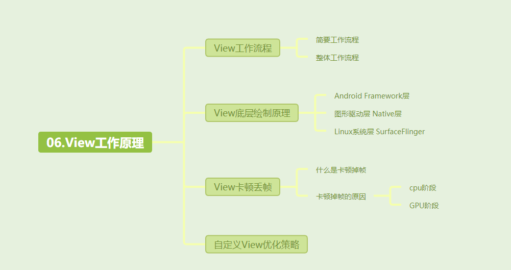
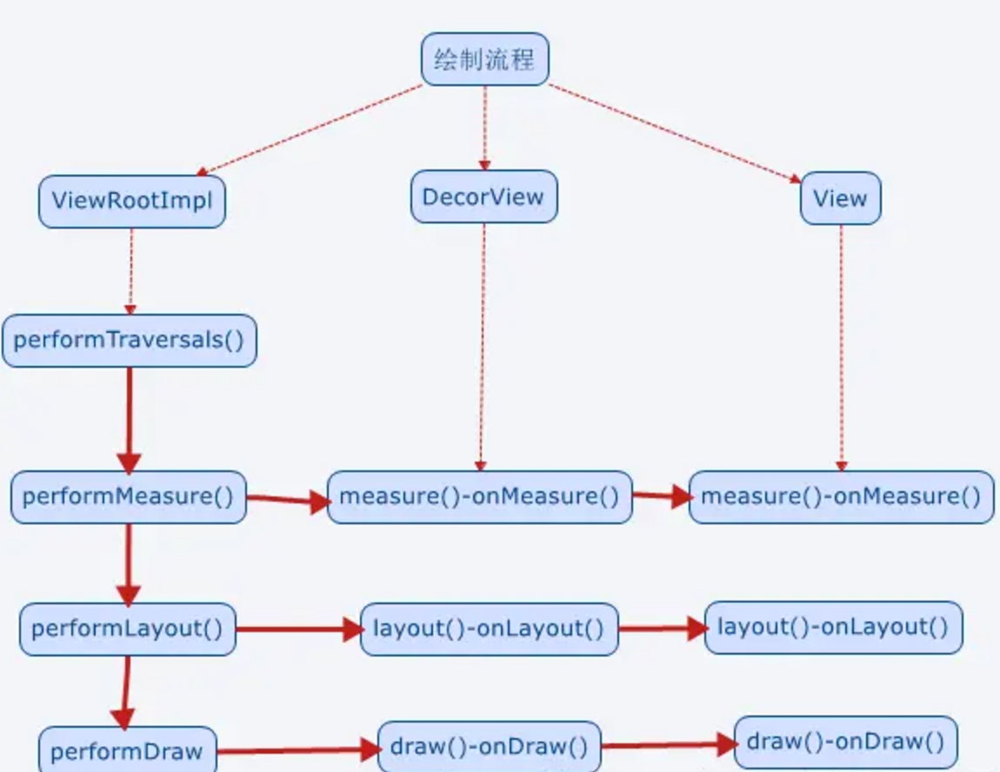

[toc]

预习：

1. 什么是viewRoot？
2. 什么是WindowManager？
3. 什么是DecorView？
4. 为什么说`ViewRootImpl` 连接了 **WindowManager**（外界窗口管理入口）和 **DecorView**（整个视图树的顶层容器）。
5. DecorView保护内容栏和标题栏，请问这是什么意思？
6. View绘制的层原理是什么？
7. 产生View卡顿的原因有哪些？

## 01.View工作流程

### 1.1 View的简要工作流程

- View工作流程简单来说就是，先measure测量，用于确定View的测量宽高，再 layout布局，用于确定View的最终宽高和四个顶点的位置，最后 draw绘制，用于将View 绘制到屏幕上。

### 1.2 View的整体工作流程

- View的整体工作流程：
  - View的绘制流程是从ViewRoot和performTraversals开始。performTraversals()依次调用performMeasure()、performLayout()和performDraw()三个方法，对于这三个方法，他们流程大致相同，我们举performMeasure例子介绍，performMeasure()会调用DecorView的measure()，进入到视图树的逻辑当中
  - 对于View树的遍历，其实就是：DecorView-->ViewGroup（--->ViewGroup）-->View ，按照这个流程从上往下，逐层迭代，依次measure(测量),layout(布局),draw(绘制)。具体是是：Decorvie的measure()中又调用onMeasure()，实现对其所有子元素的measure过程，这样就完成了DecorView的测量过程；接着View树中的子元素会重复父容器的measure过程，如此反复至完成整个View树的遍历。layout和draw同理。
  - 
  - ViewRoot对应于ViewRootImpl类，它是连接WindowManager和DecorView的纽带。
- 比较重要的概念
  - ViewRoot：连接WindowManager(外界访问Window的入口)和DecorView（顶级View）的纽带，View的三大流程均是通过ViewRoot来完成的。
  - DecorView：顶级View
    - DecorView是顶级View，本质就是一个FrameLayout
    - 包含了两个部分，标题栏和内容栏
    - 内容栏id是content，也就是activity中setContentView所设置的部分，最终将布局添加到id为content的FrameLayout中
- View的绘制是从上往下一层层迭代下来的。DecorView-->ViewGroup（--->ViewGroup）-->View ，按照这个流程从上往下，依次measure(测量),layout(布局),draw(绘制)。
  - 

## 02.View底层绘制原理

- 上述的measure、layout和draw等都是Android Framework层。但是仅凭这些可是无法完成整个绘制过程的。比如，图形怎么转化为像素，不同图层如何合成？事实上，View的绘制由三个层次的配合实现，分别是Android Framework层（Java层），图形驱动层（Native层），Linux系统层（SurfaceFlinger）
- 首先是Android Framework层（Java层）
  - 调用cpu处理View树结构，执行 `measure`、`layout` 计算任务
  - 在Draw阶段生成绘制指令（Display List），并提交Display List到图形驱动队列

- 然后是图形驱动层：
  - 从队列读取Display List
  - 栅格化（将矢量图形转为像素）
  -  执行渲染操作，并输出像素数据到帧缓冲区

- 最后是内核服务层（SurfaceFlinger）：其会合成多个图层（如应用UI、状态栏、导航栏），具体来说如下：
  -  接收各图层的像素数据
  - 进行合成操作
  - 通过硬件混合器（HWC）输出到显示设备

## 03.View卡顿丢帧原理

- 理解View绘制的底层原理后，我们就可以尝试去理解View为什么卡顿掉帧了。

- 什么是掉帧：
  - 对于60fps的显示，也就是1s内渲染60次，也就是大概每隔16ms（1000 / 60）就要渲染一次。Android系统每隔16ms发出VSYNC信号，触发对UI进行渲染，如果每次渲染都成功，这样就能够达到流畅的画面所需要的60fps，VSYNC是Vertical Synchronization（垂直同步）的缩写，是一种定时中断，一旦收到VSYNC信号，CPU就开始处理各帧数据。
  
  - 如果某个操作要花费30ms，总耗时超过 **16ms**，这样GPU无法在下一个VSYNC信号前完成渲染。系统只能丢弃当前未完成的帧，重复显示上一帧画面。这就是丢帧卡顿。
  
- View掉帧卡顿的原因主要分为：cpu阶段和gpu阶段，其中cpu阶段分为耗时和UI线程卡顿。GPU阶段则是负载压力大，无法及时渲染出来。

  - cpu阶段：
    - 耗时：
      - 布局嵌套层级过深：每个视图层级都会增加 `measure` 和 `layout` 的复杂度。过深的嵌套层级，导致 `measure` 和 `layout` 阶段耗时过长。

    - UI线程卡顿：
      - 在 UI 线程中执行耗时操作，Android中UI更新是依赖于UI单线程执行，如果在里面执行播放视频等耗时任务，会阻塞 UI线程进行UI 更新的操作。
  
      - GC（垃圾回收）暂停时间过长或者频繁的GC产生大量的暂停时间。其中GC 暂停会暂停应用线程，而频繁的GC是指比如在OnDraw中分配对象，其每次绘制都会调用，执行完成后都会回收，会导致频繁的内存分配和垃圾回收（GC）。

  - gpu阶段：

    - 动画过于复杂：动画效果复杂，过度绘制，使得GPU负载压力大，无法及时渲染出来。

## 04.自定义View优化策略

为了加速你的View，你要做到符合如下要求：

- **扁平化视图层级**：每个视图层级都会增加 `measure` 和 `layout` 的复杂度。扁平化视图层级可以减少measure和layout的调用

- **自定义 ViewGroup 优化布局逻辑**：默认的 `ViewGroup` 测量逻辑会遍历所有子视图，可能造成性能浪费。我们可以 通过自定义ViewGroup的测量逻辑来优化性能

- **避免在 `onDraw` 中分配对象**：这会导致频繁的内存分配和垃圾回收（GC）。

- **优化`invalidate`**：调用 `invalidate()` 会触发 `onDraw`，过于频繁的 `invalidate()` 调用会增加 CPU 和 GPU 的负担。因此要符合如下要求：
  
  - 避免不必要的 `invalidate()` 调用。
  - 如果只需要更新部分区域，使用带四个参数的 `invalidate(left, top, right, bottom)` 方法，限制重绘区域。
  

## 其他介绍

### 01.关于我的博客

- csdn：http://my.csdn.net/qq_35829566

- 掘金：https://juejin.im/user/499639464759898

- github：https://github.com/jjjjjjava

- 简书：http://www.jianshu.com/u/92a2412be53e

- 邮箱：[934137388@qq.com]