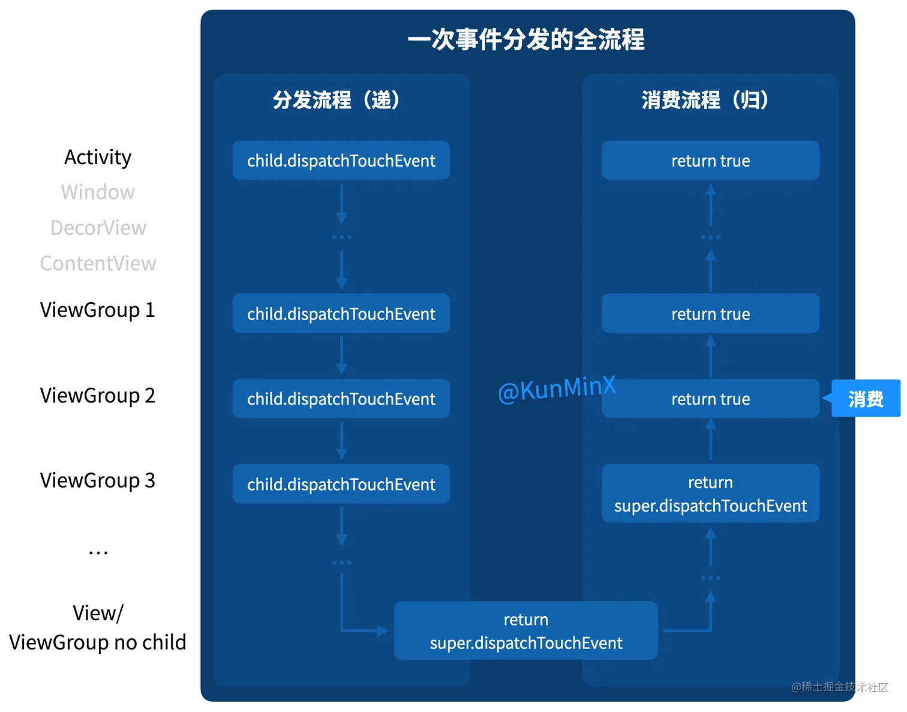
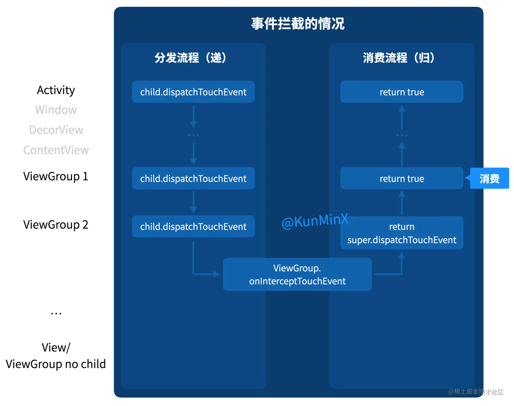

[toc]

## 00.思维树

- 事件分发的概念
  - 事件分发的对象——事件
    - 什么是事件？
    - 有哪些事件？
    - 事件列
  - 事件分发的概念（产生和分发）
  - 事件在哪些对象间传递？
  - 事件分发涉及的方法
  - 流程总结。
- 事件分发相关方法
- 事件分发案例

## 01.事件分发的概念

### 1.1事件分发的对象——事件

- 什么是事件：当用户触摸屏幕时（View或ViewGroup派生的控件），将产生点击事件（Touch事件）。
  - Touch事件相关细节（发生触摸的位置、时间、历史记录、手势动作等）被封装成MotionEvent对象

- 有哪些事件：

  ```
  ♦ 在Android中Touch事件主要包括：
  按下(ACTION_DOWN)
  移动(ACTION_MOVE)
  抬起(ACTION_UP)
  取消手势(ACTION_CANCEL)
  划出屏幕(ACTION_OUTSIDE)
  ```
  
- 主要发生的Touch事件有如下四种：

  - MotionEvent.ACTION_DOWN：用户手指的按下操作，一次按下的操作标志者一次触摸事件的开始。
  - MotionEvent.ACTION_MOVE：用户手指按压屏幕后，在松开之前，如果距离超过一定得阈值，那么会被判定为ACTION_MOVE。一般情况下，手指的轻微移动都会触发一系列的移动事件。
  - MotionEvent.ACTION_CANCEL：非人为原因结束本次事件
  - MotionEvent.ACTION_UP：用户手指离开屏幕的操作，一次抬起操作标志者一次触摸事件的结束

- Touch事件列：

  - 从手指接触屏幕至手指离开屏幕，这个过程产生的一系列事件操作的集合。
  - 任何事件列都是以DOWN事件开始，UP事件结束，中间有无数的MOVE事件
  - 

### 1.2 事件分发的本质

- 将点击事件（MotionEvent）向某个View进行传递并最终得到处理
  - 即当一个点击事件发生后，系统需要将这个事件传递给一个具体的View去处理。**这个事件传递的过程就是分发过程。**
  - Android事件分发机制的本质是要解决，点击事件由哪个对象发出，经过哪些对象，最终达到哪个对象并最终得到处理。

### 1.3 事件在哪些对象间进行传递

- Activity、ViewGroup、View
  - 一个点击事件产生后，传递顺序是：Activity（Window） -> ViewGroup -> View
  - Android的UI界面是由Activity、ViewGroup、View及其派生类组合而成的

### 1.4 事件分发过程涉及方法

- 事件分发过程由这几个方法协作完成
  - **dispatchTouchEvent() 、onInterceptTouchEvent()和onTouchEvent()**
  - 

### 1.5 Android触摸事件流程总结

- Android触摸事件流程总结
  - 1.一个事件序列从手指触摸屏幕开始，到触摸结束。同一事件序列是以ACTION_DOWN开始，中间有数量不定的ACTION_MOVE事件，最终以ACTION_UP结束
  - 2.事件传递顺序是：Activity——>Window——>View；最后顶级View接收到事件后，就会按照事件分发机制去分发事件

## 02.事件分发机制原理

### 2.1 View 事件分发本质是递归

何为递归？顾名思义，递归是一种包含 “递” 流程和 “归” 流程的算法。

当我们在找寻目标时，便是处于 “递” 流程，当我们找到目标，打算从目标出发执行事务时，便是开启 “归” 流程。

如这么说无体会，不妨结合现实案例理解递归：

> 职场任务的下发和上报，就是典型递归

领导 **自上而下**、逐级下达任务、寻找目标执行者，这就是 “递” 流程。

找到合适执行者，便开启 **自下而上** “归”流程。

若当前执行者无法让结果 OK，那么上报给他上级，由他上级执行，如上级也不 OK，那么继续向上，直到结果 OK 为止。

伪代码表示，即：

```typescript
boolean dispatch() {
  if (hasTargetChild && child.dispatch()) {
    return true;
  } else {
    return executeByMySelf();
  }
}
```

### 2.2 View 事件分发为何设计成递归？

如此设计，是为与 View 排版相呼应：

1.View 排版规则是：嵌套越深的，显示层级越高。显示层级越高，则越易覆盖层级低的、被用户看见。

```java
<LinearLayout>
  <ScrollView>
    <TextView/>
  </ScrollView>
</LinearLayout>
```

1. **“所见即所得”** 要求 “视图系统” 设计须符合用户直觉 —— “用户看到什么，触控到的也该是什么”，且嵌套越深、层级越高，触摸通常也交给层级高的来处理。

因而事件分发需设计成递归。

### 2.3 所以整个流程大致是怎样的？

首先明确 3 点：

1.每次完整的事件分发流程，都包含自上而下的 “递”，和自下而上的“归” 2 个流程。

2.每次完整的事件分发流程，都是针对一个事件（MotionEvent）完成的递归，而一个事件只对应一个 ACTION，例如 ACTION_DOWN。

3.一次用户触摸操作，我们称之为一个事件序列。一个事件序列会包含 ACTION_DOWN、ACTION_MOVE ... ACTION_MOVE、ACTION_UP 等多个事件。（其中 ACTION_MOVE 的数量是从 0 到多个不等）

也即一个事件序列，包含从 ACTION_DOWN 到 ACTION_UP 多次事件分发流程。

以下用一张图概括 View 事件分发的 “递” 和 “归” 流程。



事先分发包含 3 个重要方法：

**dispatchTouchEvent**，**onInterceptTouchEvent**，**onTouchEvent**。

故于 “递” 流程，当前层级是执行 child.dispatchTouchEvent：

- 如 child 是 ViewGroup，那么实际执行的就是 ViewGroup 重写的 dispatchTouchEvent 方法。该方法内可判断是否在当前层级拦截当前事件、或是递给下一级。
- 如 child 是不再有 child 的 View 或 ViewGroup，那么实际执行的即是 View 类实现的 super.dispatchTouchEvent 方法。该方法内可以判断，如果 View enabled 且实现了 onTouchListener 且 onTouch 返回 true，那么不执行 onTouchEvent，且直接返回onTouch 结果。否则执行 onTouchEvent。

总之，走到没有 child 的层级，即预示步入 “归” 流程，如果该层级的 super.dispatchTouchEvent 不返回 true，那么继续执行上一级的 super.dispatchTouchEvent，直到被某一级消费，也即返回 true 为止。

onInterceptTouchEvent()和onTouchEvent()都被包含在super.dispatchTouchEvent中。所以我们实际上是在里面执行消费流程。



其实在事件 “递” 流程中，ViewGroup 可在当前层级，通过设置 onInterceptTouchEvent 方法返回 true 来拦截事件下发并直接步入 “归” 流程。

正所谓 “上有正策、下有对策”。在 ViewGroup 可拦截事件下发的同时，child 也可通过 getParent.requestDisallowInterceptTouchEvent 方法，阻止上一级的下发拦截。

也正是如此，构成了 “结合对交互体验的预期来解决滑动冲突” 的现实基础


### 细节1：明确消费的概念

要将 “消费” 和 “执行” 这两个概念明确区分开。

网上内容总让人误以为，当前层级不消费，即是不执行 super.dispatchTouchEvent。

事实上，不消费，简单理解即是，“事情做了、只是结果不 OK” —— 也即在当前流程中执行了super.dispatchTouchEvent，但是返回的是false。

在归流程中，如当前层级的 super.dispatchTouchEvent return true，那么再往上的层级都不再执行自己的 super.dispatchTouchEvent，而是直接 return true。且当前层级的下级，都执行过 super.dispatchTouchEvent，只是结果返回 false 而已。

| **行为**                              | **描述**                                                     |
| ------------------------------------- | ------------------------------------------------------------ |
| **消费（`return true`）**             | 当前视图完全处理事件，分发链终止，父视图或其他视图不会再处理此事件。 |
| **执行（`dispatchTouchEvent` 调用）** | 当前视图的分发逻辑被触发，无论返回 `true` 或 `false`，都表明方法已执行。 |
| **返回 `false`**                      | 当前视图未消费事件，事件会回传到父视图，父视图尝试处理事件，直到某层级消费或到达分发链顶层。 |

- 在 “归” 流程中，唯有当前层级的 super.dispatchTouchEvent 返回 true，才认定被消费，被消费前，下级都有干活，只是结果不 OK。被消费后，上级都不需要干活，直接向上传达消费者的功。


### 细节2：明确拦截的作用

网上内容总让人误以为，当前层级拦截了，就直接在当前层级消费。

实际上，当前层级拦截了，只是提前结束了 “递” 流程，并从当前层级步入 “归” 流程而已。

具体判定是在哪个层级被消费，还需根据 <细节1> 指标：看在哪个层级的 super.dispatchTouchEvent return true。


### 细节3：拦截方法只走一次，不代表拦截只走一次

网上内容总让人误以为，本次 ACTION_DOWN 被拦截，那么往后的 ACTION_MOVE 和 ACTION_UP 都不被拦截。

实际上，是 onInterceptTouchEvent 方法只走一次，一旦走过，就会留下记号（mFirstTouchTarget == null）那么下一次直接根据这个记号来判断拦不拦截。

为何如此设计？因为一连串的事件序列，要求在几百微秒内完成。如每次都完整走一遍方法，岂不耽误事？故本着 “能省即省” 原则，凡已确认会拦截的，后续便不再走方法判断，而是直接走 “变量标记” 判断。


### 细节4：ACTION_DOWN 不执行，那么没下次了

这个很好理解，同 <细节3>。

连事件序列的第一个事件都不接了（父容器走后续事件的分发时发现 mFirstTouchTarget == null），那就意味着不接了呗 —— 那后续的活就不会交给你了（不会再走你的 super.dispatchTouchEvent 来试探），直接根据 “变量标记”（mFirstTouchTarget == null）判断，“能省即省”。