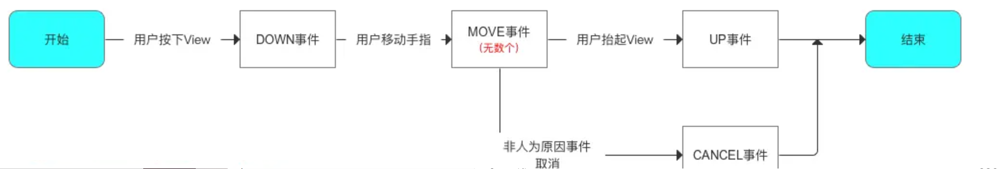
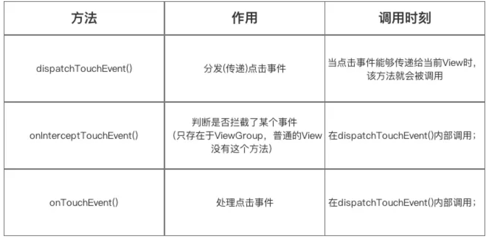

[toc]

## 00.思维树

- 事件分发的概念
  - 事件分发的对象——事件
    - 什么是事件？
    - 有哪些事件？
    - 事件列
  - 事件分发的概念（产生和分发）
  - 事件在哪些对象间传递？
  - 事件分发涉及的方法
  - 流程总结。
- 事件分发相关方法
- 事件分发案例

## 01.事件分发的概念

### 1.1 事件分发的对象——事件

- 什么是事件：当用户触摸屏幕时，将产生点击事件（Touch事件）。
  - Touch事件相关细节（发生触摸的位置、时间，手势动作等）被封装成MotionEvent对象

- 有哪些的Touch事件：

  
  - 主要有一下几种
    - MotionEvent.ACTION_DOWN：用户手指的按下操作，一次按下的操作标志者一次触摸事件的开始。
    - MotionEvent.ACTION_MOVE：用户手指按压屏幕后，移动一段超过阈值的距离，那么会产生移动事件。
    - MotionEvent.ACTION_CANCEL：非人为原因结束本次事件
    - MotionEvent.ACTION_UP：用户手指离开屏幕的操作，一次抬起操作标志者一次触摸事件的结束
  
- 事件列：

  - 从手指接触屏幕至手指离开屏幕，这个过程产生的一系列事件操作的集合。
  - 比如，用户点击屏幕，手指滑动，最后抬起。这就是一个包含DOWN事件，无数个Move事件以及一个UP事件组成的事件列。
  - 

### 1.2 什么是事件分发

- View有两个重要的功能，一个是显示UI，一个是响应用户操作。显示UI借助绘制过程实现。而响应用户操作借助事件分发实现。当用户进行点击操作后，系统需要将这个点击事件传递给一个具体的View去响应处理。

### 1.3 事件分发的过程

- 事件传递顺序是：Activity → Window → DecorView ，DecorView接收到事件后，就会进入到View树内部的事件分发机制了。也就是DecorView→ ViewGroup ... → 子View（dispatchTouchEvent）；

### 1.4 事件分发过程涉及方法

- 事件分发过程由这几个方法协作完成
  - **dispatchTouchEvent() 、onInterceptTouchEvent()和onTouchEvent()**
  - dispatchTouchEvent用于分发事件给自己的子View，onInterceptTouchEvent是事件的拦截方法，用于拦截时间，onTouchEvent是事件的消费方法，用于消费事件。
  - 

## 02.事件分发机制原理

### 2.1 View 事件分发本质是递归

何为递归？顾名思义，递归是一种包含 “递” 流程和 “归” 流程的算法。

当我们在找寻目标时，便是处于 “递” 流程，当我们找到目标，打算从目标出发执行事务时，便是开启 “归” 流程。

比如：

> 职场任务的下发和上报，就是典型递归

领导 **自上而下**、逐级下达任务、寻找目标执行者，这就是 “递” 流程。

找到合适执行者，合适者执行完成后，一层层返回结果，这就是“归”流程。

### 2.2 View 事件分发为何设计成递归？

- 如此设计，是基于两个原则，一个是View的视图规则，一个是用户的操作规则

  - View 视图规则是：嵌套越深的，显示层级越高。显示层级越高，越容易被用户看见。

    - 比如：我们仿抖音项目的推荐页，内部是一个RelativeLayout，首先是一个ImageView，match_parent显示封面，然后是和他同一层级的自定义的ControllerView。ControllerView是一个ViewGroup，内部中有位于右下角的竖直方向的LinearLayout，内部有头像，爱心，评论，分享等。那么用户看到的，就是视频封面，位于整个的最底层。然后爱心，头像等会覆盖在这个图片上方。
  
    - ```
      <LinearLayout>
        <ScrollView>
          <TextView/>
        </ScrollView>
      </LinearLayout>
      ```
  
  - 用户的操作规则：用户通常会操作他们看到的，而他们看到的通常是是嵌套层级最深的，因此需要通过递归找到深处的视图节点，由其进行响应处理。

因而事件分发需设计成递归。

### 2.3 单个View事件的分发流程

- 首先事件分发的整体流程通常从Activity开始，经过Window，到达DecorView并进入到视图树的事件分发流程中。

- 这里面关键点是视图树内部的事件分发。其通过dispatchTouchEvent代码实现。

- 在“递”流程中。
  
  - 如果你是ViewGroup，你在dispatchTouchEvent中会首先调用onInterceptTouchEvent判断是否拦截，如果不拦截，那么反向遍历子View，调用子View的dispatchTouchEvent进行子View的递的流程。如果拦截或子View都没成功消费，你会调用自身的onTouchEvent尝试处理。
  
  - ```
    if (this instanceof ViewGroup) {
            // ViewGroup逻辑
            if (!onInterceptTouchEvent(ev)) { // 判断是否拦截
                for (child in reverseChildren) { // 反向遍历子View
                    if (child.dispatchTouchEvent(ev)) {
                        consumed = true;
                        break; // 子View消费则终止循环
                    }
                }
            }
            if (!consumed) {
                consumed = onTouchEvent(ev); // 自身处理
            }
        } 
    ```
  
  - 如果你是View，因为没有子View，所以你的dispatchTouchEvent会直接处理触摸事件，不会继续分发。它是怎么处理的呢？首先，它的处理是可以被抢占的，也就是说，不一定会调用onTouchEvent，而是有可能调用你在Activity中为其注册的OnTouch回调。具体是：onTouchListener存在，其会调用onTouchListener.onTouch（这个通常是在Activity中注册的OnTouch回调），没有再调用onTouchEvent。（这也侧面说明，可以在Activity中通过为某个View设置onTouch来进行用户操作的响应，虽然最终还是通过View实现的，但是其的确在内部施加了影响）。
  
  - ```
    else {
            // View逻辑
            if (onTouchListener != null && onTouchListener.onTouch(this, ev)) {
                consumed = true;
            } else {
                consumed = onTouchEvent(ev);
            }
    ```
  
- 在“归”流程中
  - 事件的消费是在某个层级的View或ViewGroup的onTouchEvent或onTouch返回true时 ，它的父布局会break这个遍历分发的循环，然后返回consumed = true;给上级（表明任务成功处理），如果所有层级都不消费，最终会由Activity的onTouchEvent处理。

- 伪代码如下：

  - ```
    ### 2.3 单个事件的分发流程
    ```java
    // 伪代码说明核心逻辑
    public boolean dispatchTouchEvent(MotionEvent ev) {
        boolean consumed = false;
        if (this instanceof ViewGroup) {
            // ViewGroup逻辑
            if (!onInterceptTouchEvent(ev)) { // 判断是否拦截
                for (child in reverseChildren) { // 反向遍历子View
                    if (child.dispatchTouchEvent(ev)) {
                        consumed = true;
                        break; // 子View消费则终止循环
                    }
                }
            }
            if (!consumed) {
                consumed = onTouchEvent(ev); // 自身处理
            }
        } else {
            // View逻辑
            if (onTouchListener != null && onTouchListener.onTouch(this, ev)) {
                consumed = true;
            } else {
                consumed = onTouchEvent(ev);
            }
        }
        return consumed;
    }
    
    ```

### 2.4 View事件列的流程

- 那么至此，事件分发就完成了吗？我们对于每个类型的触摸事件，都执行相同的操作吗？比如用户的一个完整操作，按下，滑动，抬起。就都是依次执行这个流程？可是假如一个View响应了Motion_Event_Down操作，这就代表我希望让他或它的子View处理这个完整的事件列流程啊，那我还要这样来回分发吗？不，当然不是的，View事件列的执行可以有更好的性能优化测试，我们可以通过 `mFirstTouchTarget` 标记避免重复判断。
- 我们上面已经介绍过View事件列的概念了
  - 一次用户触摸操作，我们称之为一个事件序列。一个事件序列会包含 ACTION_DOWN、ACTION_MOVE ... ACTION_MOVE、ACTION_UP 等多个事件。（其中 ACTION_MOVE 的数量是从 0 到多个不等）
- ACTION_DOWN 是事件序列的起点, 对于首个消费ACTION*_DOWN*事件的View，其会被标记为mFirstTouchTarget，后续事件（MOVE/UP）到达时，会直接传递到mFirstTouchTarget指向的View ，由其进行分发和消费。
- 同理，*若某View的 `onTouchEvent()` 未消费ACTION_*DOWN → 标记为未处理（`mFirstTouchTarget = null`） ，后续事件（MOVE/UP）将直接跳过该View及其子View，直接由父容器处理 ，若所有层级均未消费 → 事件最终传递到Activity的 `onTouchEvent()`

## 其他介绍

### 01.关于我的博客

- csdn：http://my.csdn.net/qq_35829566

- 掘金：https://juejin.im/user/499639464759898

- github：https://github.com/jjjjjjava

- 简书：http://www.jianshu.com/u/92a2412be53e

- 邮箱：[934137388@qq.com]


