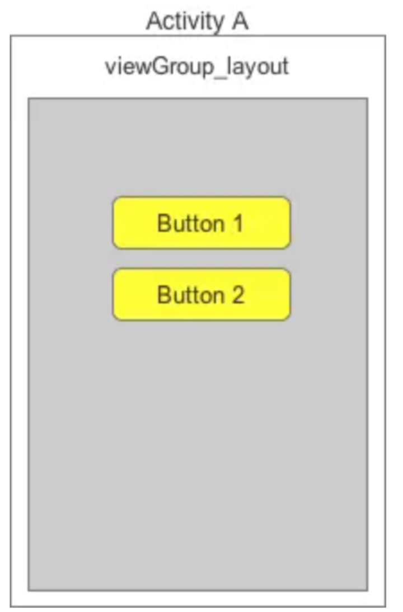
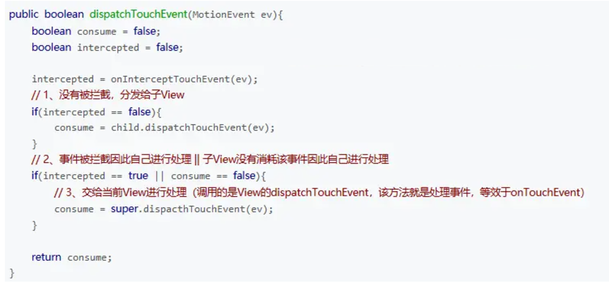

[toc]

## 00.思维树

1. Activity的分发机制是什么样的？
2. ViewGroup的分发机制是什么样的？
3. View的分发机制是什么样的？

## 01.Android中事件分发顺序

- Android中事件分发顺序：
  - **Activity（Window） -> ViewGroup -> View**
- 其中：super：调用父类方法，用于执行和消费事件，其返回值如下：
  - true：消费事件，即事件不继续往下传递
  - false：不消费事件，事件继续往下传递 / 交由给父控件onTouchEvent（）处理
- 充分理解Android分发机制，本质上是要理解：
  - Activity对点击事件的分发机制
  - ViewGroup对点击事件的分发机制
  - View对点击事件的分发机制

## 02.Activity的事件分发机制

- Activity：不消费，不拦截，只是将事件经过Window和DecorView的`superDispatchTouchEvent`方法传递到了 ViewGroup。
- ViewGroup：使用onInterceptTouchEvent()拦截事件，如果不拦截，使用child.dispatchTouchEvent()将事件分发给子视图，如果没有子视图，则通过`super.dispatchTouchEvent` 调用 View 中的事件消费，让 `ViewGroup` 作为普通的 `View` 自己处理事件。
- View：不拦截，不分发，只消费。`dispatchTouchEvent()` 是消费入口方法，从而进入 `onTouchListener` 和 `onTouchEvent()` 的逻辑。 如果消费失败，那么事件会向上传递。

### 2.1 源码分析

- 当一个点击事件发生时，事件最先传到Activity的dispatchTouchEvent()进行事件分发

  - 具体是由Activity的Window来完成

- 我们来看下Activity的dispatchTouchEvent()的源码

  ```
  public boolean dispatchTouchEvent(MotionEvent ev) {
      //第一步
      //一般事件列开始都是DOWN，所以这里基本是true
      if (ev.getAction() == MotionEvent.ACTION_DOWN) {
          //第二步
          onUserInteraction();
      }
      //第三步
      if (getWindow().superDispatchTouchEvent(ev)) {
          return true;
      }
      return onTouchEvent(ev);
  }
  ```

- 第一步

  - 一般事件列开始都是DOWN（按下按钮），所以这里返回true，执行onUserInteraction()

- 第二步

  - 先来看下onUserInteraction()源码

  ```
  public void onUserInteraction() { 
  }
  ```

  - 从源码可以看出：
    - 该方法为空方法
    - 从注释得知：前 `Activity` 位于栈顶（即正在前台活动）时，**按下系统按键**（如 Home、Back、Menu 等）。会触发该方法
    - 系统通常以**无交互时长**为依据启动屏保。，onUserInteraction()主要用于重置无操作计时器，重置屏保

- 第三步

  - Window类是抽象类，且PhoneWindow是Window类的唯一实现类
  - superDispatchTouchEvent(ev)是抽象方法
  - 通过PhoneWindow类中看一下superDispatchTouchEvent()的作用

  ```
  @Override
  public boolean superDispatchTouchEvent(MotionEvent event) {
      return mDecor.superDispatchTouchEvent(event);
      //mDecor是DecorView的实例
      //DecorView是视图的顶层view，继承自FrameLayout，是所有界面的父类
  }
  ```

- 接下来我们看mDecor.superDispatchTouchEvent(event)：

  ```
  public boolean superDispatchTouchEvent(MotionEvent event) {
      return super.dispatchTouchEvent(event);
      //DecorView继承自FrameLayout
      //那么它的父类就是ViewGroup
      而super.dispatchTouchEvent(event)方法，其实就应该是ViewGroup的dispatchTouchEvent()
  }
  ```
  
- 得出结果

  - **执行getWindow().superDispatchTouchEvent(ev)实际上是执行了ViewGroup.dispatchTouchEvent(event)**
  - 这样事件就从 Activity 经过Window和DecorView的`superDispatchTouchEvent`方法传递到了 ViewGroup

### 2.2 点击事件调用顺序

- 当一个点击事件发生时，调用顺序如下
  - 1.事件最先传到Activity的dispatchTouchEvent()进行事件分发
  - 2.调用Window类实现类PhoneWindow的superDispatchTouchEvent()
  - 3.调用DecorView的superDispatchTouchEvent()
  - 4.最终调用DecorView父类的dispatchTouchEvent()，**即ViewGroup的dispatchTouchEvent()**

### 2.3 得出结论

- 当一个点击事件发生时，事件最先传到Activity的dispatchTouchEvent()进行事件分发，最终是调用了ViewGroup的dispatchTouchEvent()方法
- 这样事件就从 Activity 传递到了 ViewGroup

## 03.ViewGroup事件的分发机制

### 3.1 看一下这个案例

- 布局如下：
  - 
- 结果测试
  - 只点击Button，发现执行顺序：btn1，btn2
  - 再点击空白处，发现执行顺序：btn1，btn2，viewGroup
- 从上面的测试结果发现：
  - 当点击Button时，执行Button的onClick()，但ViewGroupLayout注册的onTouch（）不会执行
  - 只有点击空白区域时才会执行ViewGroupLayout的onTouch（）;
  - 结论：Button的onClick()将事件消费掉了，因此事件不会再继续向下传递。

### 3.2 源码分析

- ViewGroup的dispatchTouchEvent()源码分析,该方法比较复杂，截取几个重要的逻辑片段进行介绍，来解析整个分发流程。
- 伪代码如下：
- 

#### 1.拦截

- 代码如下：

```
//intercepted 是一个标志位，用于记录父视图是否拦截当前事件。
final boolean intercepted;

//发生ACTION_DOWN事件 或者 如果子视图已经接收了事件，才进入此区域，主要功能是拦截器。
if (actionMasked == MotionEvent.ACTION_DOWN|| mFirstTouchTarget != null) {

	/*
	**disallowIntercept：是否禁用事件拦截的功能(默认是false),即不禁用
	**可以在子View通过调用requestDisallowInterceptTouchEvent方法对这个值进行修改，不让该View拦截事件
	*/
    final boolean disallowIntercept = (mGroupFlags & FLAG_DISALLOW_INTERCEPT) != 0;
    
    //未禁用拦截功能
    if (!disallowIntercept) {
        //调用拦截方法，返回 true 表示父视图决定拦截事件，false 表示继续将事件传递给子视图。
        intercepted = onInterceptTouchEvent(ev); 
        ev.setAction(action);
    } else {
        intercepted = false;
    }
} else {
    // 当前事件既不是 ACTION_DOWN，也没有子视图接收触摸事件，父视图默认拦截事件，进行兜底处理，避免事件丢失。
    intercepted = true;
}
```

#### 2.分发和执行

- 代码如下：

```
  /* 从最底层的父视图开始遍历，
   ** 找寻newTouchTarget，即上面的mFirstTouchTarget
   ** 如果已经存在找寻newTouchTarget，说明正在接收触摸事件，则跳出循环。
    */
for (int i = childrenCount - 1; i >= 0; i--) {
    final int childIndex = customOrder
      ? getChildDrawingOrder(childrenCount, i) : i;
    final View child = (preorderedList == null)
      ? children[childIndex] : preorderedList.get(childIndex);

    // 如果当前视图无法获取用户焦点，则跳过本次循环
    if (childWithAccessibilityFocus != null) {
      if (childWithAccessibilityFocus != child) {
          continue;
      }
      childWithAccessibilityFocus = null;
      i = childrenCount - 1;
    }
    //如果view不可见，或者触摸的坐标点不在view的范围内，则跳过本次循环
    if (!canViewReceivePointerEvents(child) 
      || !isTransformedTouchPointInView(x, y, child, null)) {
    ev.setTargetAccessibilityFocus(false);
    continue;
    }

    newTouchTarget = getTouchTarget(child);
    // 已经开始接收触摸事件,并退出整个循环。
    if (newTouchTarget != null) {
       newTouchTarget.pointerIdBits |= idBitsToAssign;
       break;
    }

    //重置取消或抬起标志位
    //如果触摸位置在child的区域内，则把事件分发给子View或ViewGroup
    if (dispatchTransformedTouchEvent(ev, false, child, idBitsToAssign)) {
        // 获取TouchDown的时间点
        mLastTouchDownTime = ev.getDownTime();
        // 获取TouchDown的Index
        if (preorderedList != null) {
           for (int j = 0; j < childrenCount; j++) {
               if (children[childIndex] == mChildren[j]) {
                    mLastTouchDownIndex = j;
                    break;
                }
            }
        }
      } else {
          mLastTouchDownIndex = childIndex;
      }

    //获取TouchDown的x,y坐标
    mLastTouchDownX = ev.getX();
    mLastTouchDownY = ev.getY();
    //添加TouchTarget,则mFirstTouchTarget != null。
    newTouchTarget = addTouchTarget(child, idBitsToAssign);
    //表示以及分发给NewTouchTarget
    alreadyDispatchedToNewTouchTarget = true;
    break;
}
```

- `dispatchTransformedTouchEvent()`方法实际就是调用子元素child的`dispatchTouchEvent()`方法。

- 其中`dispatchTransformedTouchEvent()`方法的重要逻辑如下：

- ```
  if (child == null) {
      handled = super.dispatchTouchEvent(event);
  } else {
      handled = child.dispatchTouchEvent(event);
  }
  ```

  - 如果分发的目标child不为空，那么会调用子元素的dispatchTouchEvent()。如果子元素的dispatchTouchEvent()方法返回true，那么mFirstTouchTarget就会被赋值，同时跳出for循环。对应如下代码：

    - ```
      //记录事件的处理者，将消费事件的子视图加入 mFirstTouchTarget。mFirstTouchTarget != null 表示事件已被某个子视图处理。
      newTouchTarget = addTouchTarget(child, idBitsToAssign);
       //表示以及分发给NewTouchTarget
       alreadyDispatchedToNewTouchTarget = true;
      ```
  
    - 其中在`addTouchTarget(child, idBitsToAssign);`内部完成mFirstTouchTarget赋值。
  
  - 如果mFirstTouchTarget为空，将会让ViewGroup默认拦截所有操作。如果遍历所有子View或ViewGroup，都没有消费事件。ViewGroup会自己处理事件。
  
  - 如果分发的目标child为空，那么执行父类的dispatchTouchEvent(event)方法，也就是当前viewGroup的父类view的相关方法

### 3.3 得出结论

- Android事件分发是先传递到ViewGroup，再由ViewGroup传递到子View或当前ViewGroup的View父类（有子view，就传递，没有则传递到父类）。
- 在ViewGroup中通过onInterceptTouchEvent()对事件传递进行拦截
  - 1.onInterceptTouchEvent方法返回true代表拦截事件，即不允许事件继续向子View传递；
  - 2.返回false代表不拦截事件，即允许事件继续向子View传递；（默认返回false）
  - 3.子View中如果将传递的事件消费掉，ViewGroup中将无法接收到任何事件。

## 04.View事件的分发机制

### 4.1 源码分析

#### 1.View中dispatchTouchEvent()的源码分析

- ```
  public boolean dispatchTouchEvent(MotionEvent event) {  
      if (mOnTouchListener != null && (mViewFlags & ENABLED_MASK) == ENABLED &&  
              mOnTouchListener.onTouch(this, event)) {  
          return true;  
      }  
      return onTouchEvent(event);  
  }
  ```

- 从上面可以看出：

  - 只有以下三个条件都为真，dispatchTouchEvent()才返回true；否则执行onTouchEvent(event)方法

  ```
  第一个条件：mOnTouchListener != null；
  第二个条件：(mViewFlags & ENABLED_MASK) == ENABLED；
  第三个条件：mOnTouchListener.onTouch(this, event)；
  ```

- 下面，我们来看看下这三个判断条件：

  - **第一个条件：mOnTouchListener!= null**

  ```
  //mOnTouchListener是在View类下setOnTouchListener方法里赋值的
  public void setOnTouchListener(OnTouchListener l) { 
  
  //即只要我们给控件注册了Touch事件，mOnTouchListener就一定被赋值（不为空）
      mOnTouchListener = l;  
  }
  ```

  - **第二个条件：(mViewFlags & ENABLED_MASK) == ENABLED**
  
    - 该条件是判断当前点击的控件是否enable
    - 由于很多View默认是enable的，因此该条件恒定为true
  
  - **第三个条件：mOnTouchListener.onTouch(this, event)**
  
    - 回调控件注册Touch事件时的onTouch方法
  
    - ```
      //手动调用设置
      button.setOnTouchListener(new OnTouchListener() {  
          @Override  
          public boolean onTouch(View v, MotionEvent event) {  
              return false;  
          }  
      });
      ```
  
    - 如果在onTouch方法返回true，就会让上述三个条件全部成立，从而整个方法直接返回true。
  
    - 如果在onTouch方法里返回false，就会去执行onTouchEvent(event)方法。
  

#### 2.onTouchEvent(event)源码分析

```
public boolean onTouchEvent(MotionEvent event) {  
    final int viewFlags = mViewFlags;  
    if ((viewFlags & ENABLED_MASK) == DISABLED) {  
        // A disabled view that is clickable still consumes the touch  
        // events, it just doesn't respond to them.  
        return (((viewFlags & CLICKABLE) == CLICKABLE ||  
                (viewFlags & LONG_CLICKABLE) == LONG_CLICKABLE));  
    }  
    if (mTouchDelegate != null) {  
        if (mTouchDelegate.onTouchEvent(event)) {  
            return true;  
        }  
    }  
     //如果该控件是可以点击的就会进入到下两行的switch判断中去；

    if (((viewFlags & CLICKABLE) == CLICKABLE ||  
            (viewFlags & LONG_CLICKABLE) == LONG_CLICKABLE)) {  
    //如果当前的事件是抬起手指，则会进入到MotionEvent.ACTION_UP这个case当中。

        switch (event.getAction()) {  
            case MotionEvent.ACTION_UP:  
                boolean prepressed = (mPrivateFlags & PREPRESSED) != 0;  
               // 在经过种种判断之后，会执行到关注点1的performClick()方法。
               //请往下看关注点1
                if ((mPrivateFlags & PRESSED) != 0 || prepressed) {  
                    // take focus if we don't have it already and we should in  
                    // touch mode.  
                    boolean focusTaken = false;  
                    if (isFocusable() && isFocusableInTouchMode() && !isFocused()) {  
                        focusTaken = requestFocus();  
                    }  
                    if (!mHasPerformedLongPress) {  
                        // This is a tap, so remove the longpress check  
                        removeLongPressCallback();  
                        // Only perform take click actions if we were in the pressed state  
                        if (!focusTaken) {  
                            // Use a Runnable and post this rather than calling  
                            // performClick directly. This lets other visual state  
                            // of the view update before click actions start.  
                            if (mPerformClick == null) {  
                                mPerformClick = new PerformClick();  
                            }  
                            if (!post(mPerformClick)) {  
            //关注点1
            //请往下看performClick()的源码分析
                                performClick();  
                            }  
                        }  
                    }  
                    if (mUnsetPressedState == null) {  
                        mUnsetPressedState = new UnsetPressedState();  
                    }  
                    if (prepressed) {  
                        mPrivateFlags |= PRESSED;  
                        refreshDrawableState();  
                        postDelayed(mUnsetPressedState,  
                                ViewConfiguration.getPressedStateDuration());  
                    } else if (!post(mUnsetPressedState)) {  
                        // If the post failed, unpress right now  
                        mUnsetPressedState.run();  
                    }  
                    removeTapCallback();  
                }  
                break;  
            case MotionEvent.ACTION_DOWN:  
                if (mPendingCheckForTap == null) {  
                    mPendingCheckForTap = new CheckForTap();  
                }  
                mPrivateFlags |= PREPRESSED;  
                mHasPerformedLongPress = false;  
                postDelayed(mPendingCheckForTap, ViewConfiguration.getTapTimeout());  
                break;  
            case MotionEvent.ACTION_CANCEL:  
                mPrivateFlags &= ~PRESSED;  
                refreshDrawableState();  
                removeTapCallback();  
                break;  
            case MotionEvent.ACTION_MOVE:  
                final int x = (int) event.getX();  
                final int y = (int) event.getY();  
                // Be lenient about moving outside of buttons  
                int slop = mTouchSlop;  
                if ((x < 0 - slop) || (x >= getWidth() + slop) ||  
                        (y < 0 - slop) || (y >= getHeight() + slop)) {  
                    // Outside button  
                    removeTapCallback();  
                    if ((mPrivateFlags & PRESSED) != 0) {  
                        // Remove any future long press/tap checks  
                        removeLongPressCallback();  
                        // Need to switch from pressed to not pressed  
                        mPrivateFlags &= ~PRESSED;  
                        refreshDrawableState();  
                    }  
                }  
                break;  
        }  
//如果该控件是可以点击的，就一定会返回true
        return true;  
    }  
//如果该控件是不可以点击的，就一定会返回false
    return false;  
}
```

- 关注点1：

  - performClick()的源码分析

  ```
  public boolean performClick() {  
      sendAccessibilityEvent(AccessibilityEvent.TYPE_VIEW_CLICKED);  
  
      if (mOnClickListener != null) {  
          playSoundEffect(SoundEffectConstants.CLICK);  
          mOnClickListener.onClick(this);  
          return true;  
      }  
      return false;  
  }
  ```

  - 只要mOnClickListener不为null，就会去调用onClick方法；

- 那么，mOnClickListener又是在哪里赋值的呢？请继续看：

  ```
  public void setOnClickListener(OnClickListener l) {  
      if (!isClickable()) {  
          setClickable(true);  
      }  
      mOnClickListener = l;  
  }
  ```

  - 当我们通过调用setOnClickListener方法来给控件注册一个点击事件时，就会给mOnClickListener赋值（不为空），即会回调onClick（）。

### 4.2 onTouch()、onTouchEvent()和onClick()

- onTouch()、onTouchEvent()和onClick()关系是怎样的，哪一个先执行？
  - onTouch->onTouchEvent->onClick
    - 当一个View需要处理事件时，如果它设置了OnTouchListener，那么OnTouchListener的onTouch方法会被回调。
    - 这时事件如何处理还得看onTouch的返回值，如果返回false，则当前View的onTouchEvent方法会被调用；如果返回true，那么onTouchEvent方法将不会被调用。由此可见，给View设置的onTouchListener，其优先级比onTouchEvent要高。
    - 如果当前方法中设置了onClickListener，那么它的onClick方法会被调用。可以看出，常用的OnClickListener，其优先级别最低。

## 05.思考一下

### 5.1 onTouch()和onTouchEvent()的区别

- 这两个方法都是在View的dispatchTouchEvent中调用，但onTouch优先于onTouchEvent执行。

- 如果在onTouch方法中返回true将事件消费掉，onTouchEvent()将不会再执行。

- 特别注意：请看下面代码

  ```
  //&&为短路与，即如果前面条件为false，将不再往下执行
  //所以，onTouch能够得到执行需要两个前提条件：
  //1. mOnTouchListener的值不能为空
  //2. 当前点击的控件必须是enable的。
  mOnTouchListener != null && (mViewFlags & ENABLED_MASK) == ENABLED &&  
          mOnTouchListener.onTouch(this, event)
  ```

- 因此如果你有一个控件是非enable的，那么给它注册onTouch事件将永远得不到执行。对于这一类控件，如果我们想要监听它的touch事件，就必须通过在该控件中重写onTouchEvent方法来实现。

### 5.2 Touch事件的后续事件（MOVE、UP）层级传递

- 如果给控件注册了Touch事件，每次点击都会触发一系列action事件（ACTION_DOWN，ACTION_MOVE，ACTION_UP等）
- 当dispatchTouchEvent在进行事件分发的时候，只有前一个事件（如ACTION_DOWN）返回true，才会收到后一个事件（ACTION_MOVE和ACTION_UP）
  - 即如果在执行ACTION_DOWN时返回false，后面一系列的ACTION_MOVE和ACTION_UP事件都不会执行
- 从上面对事件分发机制分析知：
  - dispatchTouchEvent()和 onTouchEvent()消费事件、终结事件传递（返回true）
  - 而onInterceptTouchEvent 并不能消费事件，它相当于是一个分叉口起到分流导流的作用，对后续的ACTION_MOVE和ACTION_UP事件接收起到非常大的作用
  - 请记住：接收了ACTION_DOWN事件的函数不一定能收到后续事件（ACTION_MOVE、ACTION_UP）
- 这里给出ACTION_MOVE和ACTION_UP事件的传递结论：
  - 如果在某个对象（Activity、ViewGroup、View）的dispatchTouchEvent()消费事件（返回true），那么收到ACTION_DOWN的函数也能收到ACTION_MOVE和ACTION_UP
  - 如果在某个对象（Activity、ViewGroup、View）的onTouchEvent()消费事件（返回true），那么ACTION_MOVE和ACTION_UP的事件从上往下传到这个View后就不再往下传递了，而直接传给自己的onTouchEvent()并结束本次事件传递过程。

## 其他介绍

### 01.关于我的博客

- csdn：http://my.csdn.net/qq_35829566

- 掘金：https://juejin.im/user/499639464759898

- github：https://github.com/jjjjjjava

- 简书：http://www.jianshu.com/u/92a2412be53e

- 邮箱：[934137388@qq.com]

