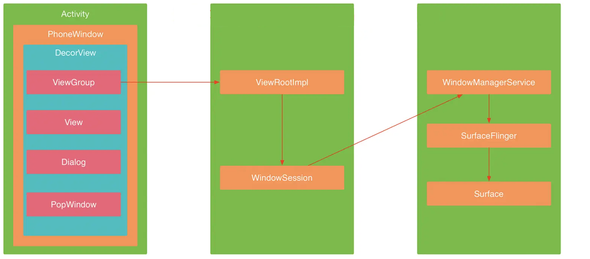

[toc]


## 01.Window窗口管理介绍

### 1.1 核心角色和组件

1. **WindowManager**
   - **作用**：`WindowManager` 是应用与窗口管理服务 `WindowManagerService` 交互的接口。它提供了窗口操作的高层 API，用于应用中创建、显示、更新和关闭窗口。
   - **位置**：位于应用进程中，是应用与系统窗口管理服务之间的桥梁。
2. **WindowManagerService**
   - **作用**：`WindowManagerService` 是窗口管理服务，继承于 `IWindowManager.Stub`，它是一个服务端，负责在系统中管理所有窗口的创建、更新、移动等操作。这个服务运行在 Android 的 `SystemServer` 进程中，因此它与 `WindowManager` 的交互是通过 IPC（进程间通信）进行的。
   - **位置**：位于系统进程中，负责整个系统的窗口管理。
3. **SurfaceFlinger**
   - **作用**：`SurfaceFlinger` 是 Android 系统中的一个服务，负责管理帧缓冲区（Frame Buffer），即 Android 设备的显示屏。在 Android 中，每个显示界面（窗口）都是一个 `Surface`，而 `SurfaceFlinger` 将不同窗口的内容绘制到屏幕上。它负责对帧缓冲区的写入操作，最终决定如何将应用程序的 UI 渲染到屏幕上。
   - **位置**：`SurfaceFlinger` 运行在系统进程中，负责图形渲染。
4. **Surface**
   - **作用**：每个窗口在显示时都有一个对应的 `Surface`，这是一个图形缓冲区，用来承载该窗口的 UI 渲染内容。`Surface` 通过 `SurfaceFlinger` 来与屏幕进行交互。
   - **位置**：每个窗口的界面都与一个 `Surface` 相关联，这个 `Surface` 会通过 `SurfaceFlinger` 渲染到屏幕上。
5. **PhoneWindowManager**
   - **作用**：`PhoneWindowManager` 负责实现窗口的各种策略。例如，它可以控制窗口的优先级、是否允许屏幕旋转、是否显示键盘等行为。
   - **位置**：位于系统中，作为 `WindowManagerService` 的一部分。
6. **Choreographer**
   - **作用**：`Choreographer` 是一个用于控制窗口动画、屏幕旋转等操作的组件。它与 UI 渲染周期同步，确保动画和界面的更新按照正确的时序进行。
   - **位置**：位于应用进程中，与主线程的 UI 更新密切相关。
7. **DisplayContent**
   - **作用**：`DisplayContent` 用于描述与显示相关的内容，特别是在多屏输出的场景中，`DisplayContent` 会描述如何在不同屏幕上呈现窗口。
   - **位置**：与窗口管理系统和多显示屏处理相关，运行在系统进程中。
8. **WindowState**
   - **作用**：`WindowState` 用于描述窗口的状态信息，并负责与 `WindowManagerService` 进行通信。每个窗口通常会有一个对应的 `WindowState`，它保存了该窗口的状态（例如窗口是否可见、窗口的类型、大小等）。
   - **位置**：与窗口的状态管理密切相关，存在于 `WindowManagerService` 内部。
9. **WindowToken**
   - **作用**：`WindowToken` 用于表示窗口的标识符，在窗口与窗口管理服务的通信过程中使用。它是 Binder 通信的一部分，确保窗口操作的正确性。
   - **位置**：系统层，用于标识窗口。
10. **Session**
    - **作用**：`Session` 是应用进程与 `WindowManagerService` 之间通信的桥梁。应用进程通过创建 `Session` 的代理对象（`IWindowSession`）来与窗口管理服务进行交互，执行窗口的操作。
    - **位置**：应用进程中，代理 `IWindowSession` 进行 IPC 通信。



### 1.2 窗口创建与通信流程

1. **应用进程与 `WindowManagerService` 的通信**
   - `WindowManager` 与 `WindowManagerService` 的交互是通过 IPC 进行的。每次应用需要创建、显示或更新窗口时，它通过 `WindowManager` 接口与 `WindowManagerService` 进行通信。
   - `WindowManagerService` 负责接收到的请求进行处理，并与 `SurfaceFlinger` 等服务交互，将窗口的内容绘制到屏幕上。
2. **`Activity` 与窗口管理**
   - `Activity` 持有一个 `Window` 对象，这个对象通常是 `PhoneWindow` 类型。`PhoneWindow` 负责显示 `Activity` 的 UI。
   - `PhoneWindow` 还会持有 `WindowManagerImpl` 对象，后者实现了 `WindowManager` 接口，用于与 `WindowManagerService` 进行通信。
   - `Activity` 通过主线程和 `Handler` 来管理视图的显示和交互。
3. **`ViewRootImpl` 与 `WindowManagerService` 的交互**
   - 每次调用 `WindowManager.addView()` 来添加窗口时，都会创建一个 `ViewRootImpl` 对象。`ViewRootImpl` 是与 `WindowManagerService` 进行交互的核心对象，负责管理 `DecorView` 与 `WindowManagerService` 之间的通信。
   - `ViewRootImpl` 会持有 `IWindowSession` 对象，作为与 `Session` 进行通信的代理对象，所有窗口操作（如添加、更新、删除窗口）都需要通过这个代理来进行。
4. **`Session` 对象**
   - 每个应用进程通过 `Session` 与 `WindowManagerService` 建立连接。`Session` 是 `WindowManagerService` 的代理，用于窗口相关的所有 IPC 通信。

### 1.3 WindowManager介绍

- 窗口的操作被定义WindowManager中，WindowManager是一个接口，继承于ViewManager，实现类是WindowManagerImpl，实际上我们常用的功能，也是定义在ViewManager里的。

  ```
  public interface ViewManager{
      //添加View
      public void addView(View view, ViewGroup.LayoutParams params);
      //更新View
      public void updateViewLayout(View view, ViewGroup.LayoutParams params);
      //删除View
      public void removeView(View view);
  }
  ```

- WindowManager可以通过Context来获取，WindowManager也会和其他服务一样在开机时注册到ContextImpl里的map容器里，然后通过他们的key来获取。

  ```
  windowManager = (WindowManager) getSystemService(Context.WINDOW_SERVICE);
  ```

- WindowManager的实现类是WindowManagerImpl，在WindowManagerImpl内部实际的功能是有WindowManagerGlobal来完成的，我们直接来分析它里面这三个方法的实现。

## 02.Window的添加流程

### 2.1 addView

- 具体看一下下面的代码

  ```
  public final class WindowManagerGlobal {
      
       public void addView(View view, ViewGroup.LayoutParams params,
                  Display display, Window parentWindow) {
              //校验参数的合法性
              
              //ViewRootImpl封装了View与WindowManager的交互
              ViewRootImpl root;
              View panelParentView = null;
      
              synchronized (mLock) {
                  // Start watching for system property changes.
                  if (mSystemPropertyUpdater == null) {
                      mSystemPropertyUpdater = new Runnable() {
                          @Override public void run() {
                              synchronized (mLock) {
                                  for (int i = mRoots.size() - 1; i >= 0; --i) {
                                      mRoots.get(i).loadSystemProperties();
                                  }
                              }
                          }
                      };
                      SystemProperties.addChangeCallback(mSystemPropertyUpdater);
                  }
      
                  int index = findViewLocked(view, false);
                  if (index >= 0) {
                      if (mDyingViews.contains(view)) {
                          // Don't wait for MSG_DIE to make it's way through root's queue.
                          mRoots.get(index).doDie();
                      } else {
                          throw new IllegalStateException("View " + view
                                  + " has already been added to the window manager.");
                      }
                      // The previous removeView() had not completed executing. Now it has.
                  }
      
                  // If this is a panel window, then find the window it is being
                  // attached to for future reference.
                  if (wparams.type >= WindowManager.LayoutParams.FIRST_SUB_WINDOW &&
                          wparams.type <= WindowManager.LayoutParams.LAST_SUB_WINDOW) {
                      final int count = mViews.size();
                      for (int i = 0; i < count; i++) {
                          if (mRoots.get(i).mWindow.asBinder() == wparams.token) {
                              panelParentView = mViews.get(i);
                          }
                      }
                  }
      
                  //通过上下文构建ViewRootImpl
                  root = new ViewRootImpl(view.getContext(), display);
      
                  view.setLayoutParams(wparams);
      
                  //mViews存储着所有Window对应的View对象
                  mViews.add(view);
                  //mRoots存储着所有Window对应的ViewRootImpl对象
                  mRoots.add(root);
                  //mParams存储着所有Window对应的WindowManager.LayoutParams对象
                  mParams.add(wparams);
              }
      
              // do this last because it fires off messages to start doing things
              try {
                  //调用ViewRootImpl.setView()方法完成Window的添加并更新界面
                  root.setView(view, wparams, panelParentView);
              } catch (RuntimeException e) {
                  // BadTokenException or InvalidDisplayException, clean up.
                  synchronized (mLock) {
                      final int index = findViewLocked(view, false);
                      if (index >= 0) {
                          removeViewLocked(index, true);
                      }
                  }
                  throw e;
              }
          }
      
  }
  ```

- 在这个方法里有三个重要的成员变量：

  - mViews存储着所有Window对应的View对象
  - mRoots存储着所有Window对应的ViewRootImpl对象
  - mParams存储着所有Window对应的WindowManager.LayoutParams对象
  - 这里面提到了一个不是很熟悉的类ViewRootImpl，它其实就是一个封装类，封装了View与WindowManager的交互方式，它是View与WindowManagerService通信的桥梁。最后也是调用ViewRootImpl.setView()方法完成Window的添加并更新界面

### 2.2 setView

- 来看看这个方法的实现。

  ```java
  public final class ViewRootImpl implements ViewParent,
          View.AttachInfo.Callbacks, ThreadedRenderer.HardwareDrawCallbacks {
      
       public void setView(View view, WindowManager.LayoutParams attrs, View panelParentView) {
              synchronized (this) {
                  if (mView == null) {
                      mView = view;
      
                      //参数校验与预处理
                      ...
      
                      // Schedule the first layout -before- adding to the window
                      // manager, to make sure we do the relayout before receiving
                      // any other events from the system.
                      
                      //1. 调用requestLayout()完成界面异步绘制的请求
                      requestLayout();
                      if ((mWindowAttributes.inputFeatures
                              & WindowManager.LayoutParams.INPUT_FEATURE_NO_INPUT_CHANNEL) == 0) {
                          mInputChannel = new InputChannel();
                      }
                      mForceDecorViewVisibility = (mWindowAttributes.privateFlags
                              & PRIVATE_FLAG_FORCE_DECOR_VIEW_VISIBILITY) != 0;
                      try {
                          mOrigWindowType = mWindowAttributes.type;
                          mAttachInfo.mRecomputeGlobalAttributes = true;
                          collectViewAttributes();
                          //2. 创建WindowSession并通过WindowSession请求WindowManagerService来完成Window添加的过程
                          //这是一个IPC的过程。
                          res = mWindowSession.addToDisplay(mWindow, mSeq, mWindowAttributes,
                                  getHostVisibility(), mDisplay.getDisplayId(),
                                  mAttachInfo.mContentInsets, mAttachInfo.mStableInsets,
                                  mAttachInfo.mOutsets, mInputChannel);
                      } catch (RemoteException e) {
                          mAdded = false;
                          mView = null;
                          mAttachInfo.mRootView = null;
                          mInputChannel = null;
                          mFallbackEventHandler.setView(null);
                          unscheduleTraversals();
                          setAccessibilityFocus(null, null);
                          throw new RuntimeException("Adding window failed", e);
                      } finally {
                          if (restore) {
                              attrs.restore();
                          }
                      }
                      ...
              }
          }    
  }
  ```

- 这个方法主要做了两件事：

  - 1.调用requestLayout()完成界面异步绘制的请求,requestLayout()会去调用scheduleTraversals()来完成View的绘制，scheduleTraversals()方法将一个TraversalRunnable提交到工作队列中执行View的绘制。而TraversalRunnable最终调用了performTraversals()方法来完成实际的绘制操作。
  - 2.创建WindowSession并通过WindowSession请求WindowManagerService来完成Window添加的过程这是一个IPC的过程，WindowManagerService作为实际的窗口管理者，窗口的创建、删除和更新都是由它来完成的，它同时还负责了窗口的层叠排序和大小计算等工作。

- 关于performTraversals()方法的实现，这里我们再简单提一下：

  - 1.获取Surface对象，用于图形绘制。
  - 2.调用performMeasure()方法测量视图树各个View的大小。
  - 3.调用performLayout()方法计算视图树各个View的位置，进行布局。
  - 4.调用performMeasure()方法对视图树的各个View进行绘制。

### 2.3 DecorView与WMS的跨进程通信

- 既然提到WindowManager与WindowManagerService的跨进程通信，我们再讲一下它们的通信流程。Android的各种服务都是基于C/S结构来设计的，系统层提供服务，应用层使用服务。WindowManager也是一样，它与 WindowManagerService的通信是通过WindowSession来完成的。

  - 1.首先调用ServiceManager.getService("window")获取WindowManagerService，该方法返回的是IBinder对象，然后调用IWindowManager.Stub.asInterface()方法将WindowManagerService转换为一个IWindowManager对象。
  - 2.然后调用openSession()方法与WindowManagerService建立一个通信会话，方便后续的跨进程通信。这个通信会话就是后面我们用到的WindowSession。

- 基本上所有的Android系统服务都是基于这种方式实现的，它是一种基于AIDL实现的IPC的过程。

  ```java
  public final class WindowManagerGlobal {
      
      public static IWindowSession getWindowSession() {
          synchronized (WindowManagerGlobal.class) {
              if (sWindowSession == null) {
                  try {
                      InputMethodManager imm = InputMethodManager.getInstance();
                      
                      //获取WindowManagerService对象，并将它转换为IWindowManager类型
                      IWindowManager windowManager = getWindowManagerService();
                      //调用openSession()方法与WindowManagerService建立一个通信会话，方便后续的
                      //跨进程通信。
                      sWindowSession = windowManager.openSession(
                              new IWindowSessionCallback.Stub() {
                                  @Override
                                  public void onAnimatorScaleChanged(float scale) {
                                      ValueAnimator.setDurationScale(scale);
                                  }
                              },
                              imm.getClient(), imm.getInputContext());
                      
                  } catch (RemoteException e) {
                      throw e.rethrowFromSystemServer();
                  }
              }
              return sWindowSession;
          }
      }
      
      public static IWindowManager getWindowManagerService() {
          synchronized (WindowManagerGlobal.class) {
              if (sWindowManagerService == null) {
                  //调用ServiceManager.getService("window")获取WindowManagerService，该方法返回的是IBinder对象
                  //，然后调用IWindowManager.Stub.asInterface()方法将WindowManagerService转换为一个IWindowManager对象
                  sWindowManagerService = IWindowManager.Stub.asInterface(
                          ServiceManager.getService("window"));
                  try {
                      sWindowManagerService = getWindowManagerService();
                      ValueAnimator.setDurationScale(sWindowManagerService.getCurrentAnimatorScale());
                  } catch (RemoteException e) {
                      throw e.rethrowFromSystemServer();
                  }
              }
              return sWindowManagerService;
          }
      }
   }
  ```