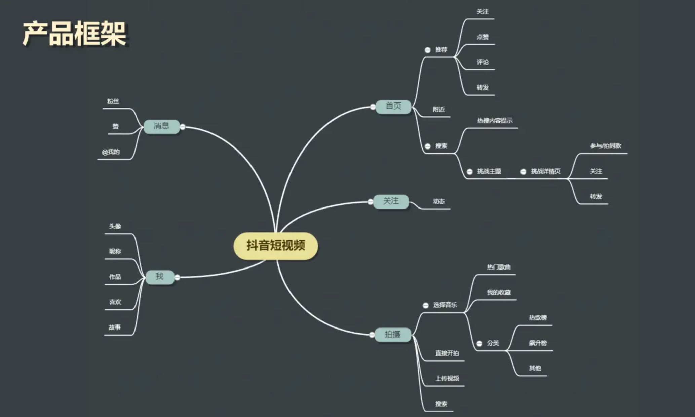
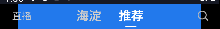
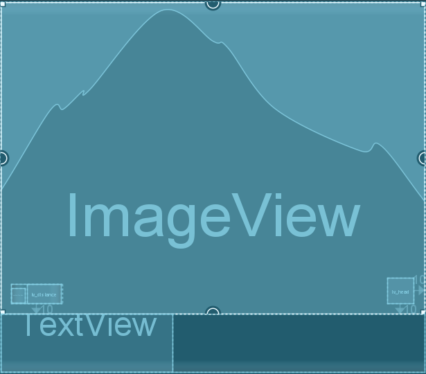

[toc]

## 项目由来

我们有个安卓上的爱智app，这个是西安方面的。然后领导希望能够在里面加上短视频播放的功能，就像抖音一样。因此把这个任务分发到我这。

经过一系列的分析，需求分析，可行性分析之后，我需要做出一个验证性的方案来给领导体验。我采用了MVC架构。

## 00. 项目介绍

- 我的项目是仿抖音TikTok项目
- 项目整体结构：
  - 项目分为启动页，首页和个人主页。

  - 启动页显示启动图标，并进行数据的初始化。

  - 首页中包含推荐页，可以在里面观看视频，暂停视频，双击屏幕显示爱心也可以关注作者，点赞显示动画，查看评论，查看转发。也可以点击作者的圆形头像进入其个人主页。

  - 首页中还包含附近的人，可以在里面查看附近用户发布视频的缩略图，并且可以点进去播放。

  - 个人主页可以查看用户的个人信息：头像，昵称，年龄啊，以及它的作品的缩略图。

  - 


## 02. 项目技术点：

- 首先是用户的圆形头像，通过自定义CircleImageView，显示圆形的用户头像以及头像按压效果。

- 然后是LikeView在推荐页的双击位置上方显示点赞动画。

- 接着是用户爱心按钮的点赞动画，采用LottieAnimationView去加载JSON动画。

- ExoPlayer进行视频的播放。

- 推荐页中上下滚动的视图采用RecyclerView + ViewHolder 管理滚动列表中列表项的显示和数据绑定，并通过DifUtil进行条目级别视图的更新。

- 各组件间采用RxBus进行通信。

  > “RxBus 是进程内的线程间通信机制，核心是通过一个全局的 `Subject`（如 `PublishSubject`）管理观察者列表。我们注册时，会向这个**观察者（Observer）列表**中添加自身。当调用 `post(event)` 时，会遍历观察者链表，调用他们的next方法，将消息分发给他们进行处理。开发者可通过 `observeOn()` 指定接收线程，实现跨线程通信。
  
  

## 03. 项目整体流程：

### 3.1 启动流程

- 启动流程：用户点击桌面图标，启动程序，启动SplashActivity

### 3.2 SplashActivity

- 视图：SplashActivity内部是一个黑色背景的RelativeLayout，内部有一个固定大小的ImageView，其centerInParent，用于显示启动界面。
- 代码逻辑：调用init方法进行本地数据的初始化（因为我没有网络，自己构造的视频列表数据和用户列表数据）。并通过计时器等待启动图标显示300ms后启动MainActivity主Activity。

### 3.3 MainActivity

- 视图：MainActivity是一个RelativeLayout，内部是一个ViewPager，容纳两个Fragment。分别是首页和个人主页。
- 代码逻辑：
  - 我们通过创建pagerAdapter为ViewPager填充两个fragment。
  - 因为我们播放视频的逻辑是在首页的推荐页中的，那么当我们从首页切换到个人主页，我们需要进行视频播放的暂停。从个人主页切回来，我们需要继续视频的播放。所以我们要在PageChangeListener页面切换监听器的onPageSelected逻辑中根据页面位置通过RxBus发送一个PauseVideoEvent（用户在推荐首页中会订阅该事件，调用VideoPlayer进行播放和暂停）
  - 另一个，用户可能在在推荐页中点击头像来切换到个人主页，因此我们要在这里通过RxBus订阅 MainPageChangeEvent 类型的事件，当事件到来时，我们在内部设置ViewPager的curItem来进行页面的切换，以显示个人主页。
  - 最后是双击返回键的逻辑。
    - 在onBackPressed方法中我们记录上次点击返回按键的时间，判断两次点击返回键是否超过时间阈值，没超过退出应用。超过则返回第一个页面或弹窗再按一次退出。

### 3.4 MainFragment

- MainFragment是首页。
- 视图：由RelativeLayout包裹的，分为三个部分，上方导航，底部导航，match_parent的ViewPager。
  - 上方导航是RelativeLayout水平布局，最左侧的直播TextView，最右侧的搜索ImageView。中间的是一个XTabLayout。并在XTabLayout设置了选中反馈，被选中的选项卡的文字颜色为白色。未被选中的为灰色。
  - 底部导航是RealtiveLayout水平布局，内部包裹一个XTabLayout，中间一个发布视频的ImageView。
  - 还有一个match_parent的ViewPager容纳两个Fragment。分别是推荐页和附近的人页。
- 代码逻辑：
  - 我们通过创建pagerAdapter为ViewPager填充两个fragment。
  - 接着，假如我们要在内部进行页面切换，从推荐页切换到附近的人页时，也要进行推荐页中视频的播放和暂停流程，这个跟上面是一样。
  - 然后为顶部的TabLayout添加广州和推荐这两个标题。 并通过TabLayout的setupWithViewPager将这两个标题和ViewPager管理起来，使得选项卡可以随着 ViewPager 的页面变化而更新，同时也可以通过点击 TabLayout 的选项卡来切换 ViewPager 的页面。
  - 最后是为下面的TabLayout添加五个标题，不过暂时没有对应的逻辑实现，只是为了模仿抖音的视图。

### 3.5 CurrentLocationFragment

- 视图：附近的人页是一个由SwipeRefreshLayout（下拉刷新视图）布局类包裹的RecyclerView。
- 代码逻辑：
  - 设置布局管理器为两列垂直。
  - 我们通过创建RecyclerView.adapter适配器为RecyclerView填充子条目。
  - 处理下拉刷新操作，我们这里是简单模拟刷新操作，给下拉刷新视图注册setOnRefreshListener，并在内部设置一个定时器，定时1000ms，在定时器结束时将binding.refreshLayout的isRefreshing属性设置为false，停止刷新。
- 子条目视图逻辑：其内部是垂直方向的LinearLayout，被LinearLayout包裹的布局如下：
  - 上方一个RelativeLayout和下方一个TextView。
  - 下方的TextView用于显示视频简介。

  - 上方的RelativeLayout内部分为左下的 LinearLayout， 右下自定义的CircleImageView和作为背景的match_parent的ImageView。

    - 其中ImageView用于显示视频封面，是match_parent
    - 自定义的CircleImageView用于在右下角显示用户头像。
    - LinearLayout内部包含两个IconFontTextView图标字体通过用来显示距离图标和距离文字。是wrap_content。
  - 

​		

- 子条目逻辑：
  - onCreateViewHolder阶段创建子条目类型。
  
  - 在onBindViewHolder阶段，我们会进行ViewHolder的复用。
    - 首先通过Glide提取视频首帧作为封面图。
    - 然后设置视频文案，距离，用户头像。
    
    > 这些数据从哪来的呢？
    >
    > 这些数据是我们之前在SplashActivity阶段初始化的本地数据。
    >
    > 通过adapter?.appendList(DataCreate.datas)让adapter持有它的引用。
    >
    > 然后就可以通过这些引用访问到本地数据为其赋值了。
    
    - 最后通过 `setOnClickListener` 设置子条目的点击事件，其启动一个PlayListActivity进行视频的播放，同时传递一个  position 作为视频播放的位置。
  
- PlayListActivity：
  - 他是一个单独的Activity，内部有一个FrameLayout。启动时会执行init方法，调用supportFragmentManager的add方法将一个RecommendFragment添加到这个FrameLayout中，具体的播放逻辑由RecommendFragment执行。

### 3.6 RecommendFragment

- 视图：推荐页是一个由SwipeRefreshLayout布局类包裹的ViewPager2
- 代码逻辑：其会在onViewCreated阶段执行初始化操作，具体是：

  - 我们通过创建RecyclerView.adapter适配器为ViewPager2中的RecyclerView填充子条目。
  - 为ViewPager2设置布局管理器，垂直，预加载1个页面，滚到到指定条目位置。（这里如果直接启动，那么默认条目是0，如果通过PlayListActivity启动，那么就是用户点击附近的人页中的条目）。
  - 处理下拉刷新操作，跟上面一样简单的模拟刷新操作。
  - 因为需要视频播放器播放视频，所以初始化推荐页内部的视频播放器。
  - 之前有页面切换导致的暂停事件播放逻辑，我们订阅之前页面切换时产生的PauseVideoEvent事件，调用VideoPlayer.play或pause，控制视频的暂停和播放。

  - 我们希望下滑的视频可以自动播放，因此注册ViewPager2的registerOnPageChangeCallback页面改变回调，当上下滑动导致子条目变更时通过playCurVideo自动播放当前视频。
- 子条目视图：其内部是RelativeLayout，被RelativeLayout包裹的布局如下：

  - ivCover_ImageView显示视频封面，其match_parent.
  - 继承自RelativeLayout的自定义视图LikeView，用于在双击位置上方显示点赞动画，其match_parent.
  - 继承自RelativeLayout的自定义视图ControllerView，用于显示view_controller视图，也就是抖音推荐页左下角和右下角的视图，左下角是昵称，视频文案和跑马灯；右下角的是头像，爱心，评论，分享。其match_parent.，具体后面介绍。
  - ivPlay_ImageView显示播放按钮，显示在视图中央。
- 子条目逻辑：

  - onCreateViewHolder阶段创建子条目类型。
  - 在onBindViewHolder阶段，我们会进行ViewHolder的复用。
    - 首先设置controllerView自定义视图的显示数据
    - 通过Glide提取视频首帧作为封面图。
    - 设置播放按钮的透明度为半透明 `holder.binding.ivPlay.alpha = 0.4f`
    - 设置点赞监听器，这里是为LikeView设置自定义的点赞监听方法 `this.onLikeListener = onLikeListener`，其最终会在onDoubleTap的时候调用addLike为触点上方添加爱心动画 之后 调用该方法 执行 `holder?.binding?.controller!!.like()`，也就是controllerView的ivlike的点击动画。也就是说，我们双击点赞不仅会出现点赞动画，还会触发爱心按钮的点击动画。
    - 调用 buildMediaSource 预加载当前子条目的媒体资源 `mList[position].mediaSource = buildMediaSource(mList[position].videoRes)`
  - 使用DiffUtil进行条目级别数据的更新。
- 接下来推荐页面中视频自动播放，用户可以单击进行暂停或播放。也可以双击在触点上方添加爱心动画，并触发ivLike的动画。也可以点击头像进入个人主页，点击ivlike触发爱心动画，点击评论查看评论弹窗，点击分享触发分享弹窗。

### 3.7 PersonalHomeFragment

- 就是一个简单的LinearLayout，包含头像，昵称，年龄等视图组件，从本地数据中获取并设置，没有特别多可以讲的。

## 待解答

- 本地数据中图片资源在哪？为什么？

- onCreateViewHolder的调用原理。

- PlayListActivity怎么定位到播放第几个视频呢？

  - RecommendFragment在初始化阶段会调用setViewPagerLayoutManager设置布局管理器，在内部我们通过scrollToPosition：滚动到初始化的位置，也就是上面的initPos。

  - ```
    holder?.binding?.root?.setOnClickListener { v: View? ->              
        PlayListActivity.initPos = position              
        context.startActivity(Intent(context, PlayListActivity::class.java))
    }
    
    class PlayListActivity : BaseBindingActivity<ActivityPlayListBinding>({ActivityPlayListBinding.inflate(it)}) {
        /**
         * initPos：一个静态变量，用于记录播放列表的初始位置。它可以在其他类中通过 PlayListActivity.initPos 访问和修改。
         */
        companion object {
            var initPos = 0
        }
    }
    
    
    private fun setViewPagerLayoutManager() {
        with(binding.recyclerView) {
            orientation = ViewPager2.ORIENTATION_VERTICAL
            offscreenPageLimit = 1
            registerOnPageChangeCallback(pageChangeCallback)
            (binding.recyclerView.getChildAt(0) as RecyclerView).scrollToPosition(PlayListActivity.initPos)
        }
    }
    ```

- RxBus两个组件间通信原理。

- ViewPager2和RecyclerView间区别。


## 01. 启动流程

- 用户在手机上看到的是一个图表，用户点击图表，Launcher通过Binder IPC向ActivityManagerService发送`START_ACTIVITY`请求。AMS通过socket请求Zygote fork自身产生新的应用程序。Zygote孵化新进程后，执行该程序的`ActivityThread.main()`入口
- 此时进入到应用程序的结构了。其在资源加载后会创建**SplashActivity**，启动界面Activity。进入其生命周期中，为什么会执行SplashActivity呢？因为我通过在<intent-filter>中设置其为MAIN，标识其为入口Activity。


## 02.SplashActivity流程

- 那么什么是SplashActivity呢？为什么我把他当作入口Activity呢？因为它是启动界面，我在里面进行一些数据的初始化和启动界面的显示操作。

- SplashActivity继承自BaseBindingActivity，BaseBindingActivity则继承自BaseActivity类，BaseBindingActivity是抽象类，主要是用于统一Activity中视图绑定的规范。BaseActivity用于统一Activity类的创建，初始化和退出的规范。
- BaseBindingActivity如何实现视图绑定：
  - 其在内部设计了双binding变量，一个是private的私有变量_binding，一个是protected的变量`binding`。私有的bingding只能自己访问，protected的bingding它的子类可以访问。protected的变量`binding`实际上是通过get获取私有binding副本，我们每次使用它都会重新获取，这样我们在子类中对这个binding修改不会影响到上面一个，这就保证了数据的安全性
  - 它在构造函数中通过一个变量block，用其接收布局初始化逻辑的lambda表达式，在onCreate阶段使用该逻辑为私有binding初始化，并通过setContentView设置布局界面。这里的布局逻辑其实举例为：ActivitySplashBinding调用的inflate。ActivitySplashBinding是由ViewBinding解析SplashActivity的xml布局文件生成的视图绑定类。

- SplashActivity内部其实就是一个ImageView，在经过视图绑定后，其将启动界面加载出来，也就是抖音的启动界面，背景全黑，中间一个都有的图标。
- 然后它会通过super.onCreate调用，BaseActivity中的OnCreate，并在里面调用init方法，也就是自身重写的init方法。其在init方法中进行数据的初始化，并通过计时器等待显示界面显示300ms后启动MainActivity并关闭SplashActivity
  - 因为我们没有网络接口提供视频和用户信息，所以采用本地数据。用VideoBean表示视频实体类（比如：点赞数，转发数，视频播放资源）。UserBean表示用户实体类（比如：昵称，头像url，获赞数等）。UserBean是VideoBean的内部类，表示视频是由该用户发布的。我们初始化了几个视频和它的发布者，将它们分别加入到ArrayList数据集中。

- 在完成数据的初始化后，我们通过计时器启动了MainActivity并关闭了SplashActivity。

> 提问：为什么使用ViewBinding，传统的视图绑定是什么样的？ViewBinding有什么进步的地方。
>
> 传统的逻辑中：调用setContentView设置布局文件后，再通过findViewById(R.id.view_id)来获取每个视图的引用。这种方法的问题在于需要为每个视图编写大量的代码
>
> ViewBinding是Android官方推荐的视图绑定解决方案。它的工作原理是在编译时为每个XML布局文件生成一个绑定类，这个类包含了所有在布局中声明了id的视图的直接引用。这样，就无需使用findViewById一个个获取了，简化了代码，提高了安全性。

## 03.MainActivity逻辑

- MainActivity内部是一个ViewPager，容纳两个fragment。分别是首页和个人主页。
- 首先是ViewPager内容的填充，我们通过pagerAdapter为ViewPager填充两个fragment。具体是：
  - 将这两个fragment的实例加入到ArrayList数据集中。
  - 调用PagerAdapter的构造函数，传递这个数据集作为参数。
  - 通过binding.viewPager!!.adapter = pagerAdapter为ViewPager设置适配器。
  - 然后适配器自动进行内容的填充。

> 怎么理解这个适配器呢？
>
> - 适配器：现在有视图，视图中需要显示内容，如果我们有多个内容，怎么吧这个放到这个视图里呢？要一个个放吗？当然不，我们可以倚赖适配器，具体来说我们给适配器传递内容数据，将适配器绑定到这个视图上，这样适配器会自动进行视图内容的管理填充。

- 接着，为了完成ViewPager内部的Fragment的切换，我们还在init中使用RxBus订阅 MainPageChangeEvent 类型的事件，并通过设置ViewPager的当前项来进行页面的切换。

> RxBus原理

- 然后是页面切换时暂停和恢复视频播放。当用户在ViewPager中进行滑动，导致Fragment从视频播放页切换到用户主页，那么我们要暂停视频的播放。当切入到视频播放页，我们要继续视频的播放。请问此时我们该怎么处理？

  - 简要来说是在PageChangeListener页面切换监听器的onPageSelected逻辑中根据页面位置通过RxBus发送一个PauseVideoEvent，步骤如下：

  - viewPager注册addOnPageChangeListener页面切换监听器
  - 页面切换监听器的onPageSelected页面选中方法中，判断页面改变后是否为0（视频播放页），如果不是，那么通过RxBus发送一个PauseVideoEvent事件，参数为false，表示暂停视频。如果是，那么发送一个参数为true的PauseVideoEvent事件表示继续视频的播放。

- 还有用户可能需要通过点击进行界面返回或应用程序退出的逻辑

  - 我们通过覆写Activity类中onBackPressed方法实现，具体来说，我们记录上次点击返回键的时间，并给出一个连续按返回键退出的阈值时间
  - 我们每次点击时检测当前时间与上次按下返回键的时间差是否超过了设定的阈值 EXIT_TIME。

  - 如果没超过，那么直接关闭程序。

  - 如果超过，并且 ViewPager 当前显示的是第二个页面（个人主页），将 ViewPager 切换回第一个页面（首页）。

  - 如果超过，但是当前页面是第一个界面，弹出一个 Toast 提示用户再次按下返回键以退出应用，并更新 lastTime 为当前时间。


## 04.MainFragment

> 什么是Fragment？

- MainFragment是首页Fragment，它同样继承自BaseBindingFragment，进行视图绑定的规范化操作。

- 首页内部是推荐页和附近的人页，他们同样通过ViewPager容纳。

- 除了ViewPager之外，我们还有顶部和底部导航。

  - 顶部导航是一个RelativeLayout，内部有最左侧的直播TextView，最右侧的搜索ImageView。中间的是一个XTabLayout包含附近的人和推荐栏目。通过如下代码设置选中反馈。

  - ```
    - app:xTabSelectedTextColor="@color/white"：选中标签的文字颜色为白色。
    
    - app:xTabTextColor="#CCCCCC"：未选中标签的文字颜色为浅灰色。
    ```

  - 

  - 底部导航同样，一个XTabLayout包含首页，好友，消息，我的栏目，中间一个发布视频的ImageView

  - 

  > XTabLayout是什么？

- 代码内部逻辑为：onViewCreated阶段调用setFragments和setMainMenu
  
  - setFragments：
    - 内部设置ViewPager的pageadapter，和上面一样。
    - 然后为顶部的TabLayout添加广州和推荐两个tab。 
    - 然后通过TabLayout的setupWithViewPager将这两个标题组件和ViewPager管理起来，使得其可以随着 ViewPager 的页面变化而更新，同时也可以通过点击 TabLayout 的选项卡来切换 ViewPager 的页面。
    - 设置默认页为推荐页。
    - 最后还设置了页面切换时视频的播放和暂停流程，跟上面一样，不过上面的是首页和个人主页之间的，这里是首页内部的推荐页和附近的人页。
  - setMainMenu
    - 为下面的TabLayout添加五个标题，不过没有对应的逻辑实现，只是单纯的显示。

## 05.CurrentLocationFragment

- 附近的人页是一个由SwipeRefreshLayout布局类包裹的RecyclerView。
  - SwipeRefreshLayout （滑动刷新）是一个布局类，用于实现下拉刷新功能。当用户下拉时，会显示一个刷新指示器，并触发OnRefreshListener 的 onRefresh() 刷新回调方法。

> 这里上面和下面有没有可以深挖的？

- 它在onViewCreated阶段执行init操作。具体是：
  - 设置布局管理器为两列垂直。
  - 设置RecyclerView.adapter适配器
  - 处理下拉刷新操作，我们这里是简单模拟刷新操作，在 binding.refreshLayout.setOnRefreshListener内部设置一个定时器，定时1000ms，在定时器结束时将binding.refreshLayout的isRefreshing属性设置为false，停止刷新。
  
    - ```
      binding.refreshLayout.setOnRefreshListener {
              object : CountDownTimer(1000, 1000) {
                  override fun onTick(millisUntilFinished: Long) {}
                  override fun onFinish() {
                      binding.refreshLayout!!.isRefreshing = false
                  }
              }.start()
          }
      ```
- 这里的关键点是RecyclerView.adapter，它不像之前的PagerAdapter一样简单。
  - 首先什么是RecyclerView.adapter？要想理解RecyclerAdapter，你需要先理解RecyclerView，其是一个ViewGroup，内部有多个相同样式的子View，还有布局方式（子View在RecyclerView中的排列方式），数据集合（子View通过绑定数据集合中的数据来显示内容。）
  - 因此对于RecyclerAdapter，其有以下关键组件。
    - RecyclerView.Adapter - 自动化处理数据集合并负责绑定视图
    - ViewHolder - 持有所有的用于绑定数据的View
    - LayoutManager - 负责摆放视图等相关操作 
    - 当然还有**ItemDecoration** 绘制分割线等，在此不做过多赘述。

  - > 那么，ViewHolder是什么：
    >
    > - ViewHolder核心作用是实现视图复用。它身是条目视图（子View）的容器。容纳条目视图。
    >
    >   - 考虑一个没有ViewHolder的情况，对于RecyclerView，其是一个ViewGroup，内部包含多个子View。我们进行滑动操作，如果没有ViewHolder，那么每次滑动到新的，我们需要手动在adapter逻辑中创建一个View实例，并将adapter中的数据源输入到布局中。同时旧的会被销毁。而有了ViewHolder，其可以容纳子View，又因为新旧他们的布局逻辑都一样，所以只需要通过onBindViewHolder更新旧的中的数据即可。
    >
    > - 若无 ViewHolder 机制，每次列表滑动导致新条目进入屏幕时，系统会：
    >
    >   - 📉 **频繁调用 `inflate()`**：XML 解析和 View 对象创建（耗时操作）
    >   - 📉 **重复执行 `findViewById()`**：遍历视图树查找子 View（CPU 密集型）

  - ok，我们在onCreateViewHolder阶段创建RecylerView的子条目类型。这里的子条目类型View的样式为：

    - 上方一个RelativeLayout和下方一个TextView。

    - 下方的TextView用于显示视频简介。

    - 上方的RelativeLayout内部分为ImageView， LinearLayout， 自定义的CircleImageView。

      - 其中ImageView用于显示视频封面
      - 自定义的CircleImageView用于在右下角显示用户头像。
      - LinearLayout内部包含两个IconFontTextView用来显示距离图标和距离文字。

    - 

    - > IconFontTextView是什么？怎么显示距离图标？
      >
      > 
      >
      > 图标字体是一种特殊的字体文件（如 .ttf, .otf），它将矢量图形映射到 Unicode 字符上。
      >
      > IconFontTextView是一个 TextView，但它通过图标字体（IconFont 技术将特定的 Unicode 字符渲染为图形，从而实现了类似图片的效果。
      >
      > 例如：Unicode 字符 &#xe621; 在普通字体中可能显示为乱码，但在图标字体中会被渲染为某个图形（如评论图标）。
      >
      > 这里通过typeface = Typeface.createFromAsset(context.assets, "iconfont.ttf")加载图标字体资源，然后直接使用Unicode ，最后会被自动渲染为对应图形。

    - 我们自定义的CircleImageView是什么？参考笔记。
  
  
  - 接着，在onBindViewHolder阶段，我们会进行ViewHolder的复用。
  
    - 首先是Glide提取视频首帧作为封面图。
  
    - > Glide如何提取视频首帧？代码如下：
      >
      > ```
      > Glide.with(context)
      >                 .asBitmap()
      >                 .load(it.videoRes)
      >                 .apply(RequestOptions.frameOf(0))  // 从第一帧开始
      >                 .into(holder.binding.ivCover)
      > ```
      >
      > 逻辑如下：
      >
      > - Glide组件会启动后台线程通过load加载视频资源
      > - 然后通过apply(RequestOptions.frameOf(0))，我们定位到这个视频的0ms位置
      > - 并通过asBitmap将当前视频的0ms位置输出为位图（图片的形式）
      > - 最后通过into设置到目标ImageView。
      > - 
  
    - 然后设置视频文案，距离，用户头像
  
    - 最后设置子View的点击事件，其启动一个PlayListActivity进行视频的播放。
  
    - > PlayListActivity是什么？
      >
      > 他是一个单独的Activity，内部有一个FrameLayout。启动时会执行内部覆写的init方法，将一个RecommendFragment添加到ID为framelayout的容器中。
      >
      > ```
      > override fun init() {
      >     supportFragmentManager.beginTransaction( ).add(R.id.framelayout, RecommendFragment()).commit()
      > }
      > ```
      >
      > 所以，我们点击本地页面网格视图的视频缩略时，实际上时创建一个新的PlayListActivity，其在内部执行RecommendFragment，所以可以理解为跳转到新Activity中的RecommendFragment下播放对应视频。

## 06.RecommendFragment

- 推荐页是一个由SwipeRefreshLayout布局类包裹的ViewPager2。

- 在经过视图绑定后，其会在onViewCreated阶段执行初始化操作，具体是：
  - 为ViewPager2设置布局管理器
  - 为ViewPager2内部的recyclerView设置RecyclerView.adapter适配器。
  - 处理下拉刷新操作，跟上面一样简单的模拟刷新操作。
  - 初始化推荐页内部的视频播放器。
  - 订阅PauseVideoEvent事件，控制视频的暂停和播放。

- 首先是为ViewPager2设置布局管理器

  - 设置其为垂直滑动

  - 预加载前后各一个界面

  - 监听页面切换，当页面切换时，在`onPageSelected`中触发播放当前页视频。具体是调用playCurVideo，我们在另外笔记中说

  - 设置默认播放页为0，也就是第一个视频。

  - ```
    private fun setViewPagerLayoutManager() {
        with(binding.recyclerView) { 
            orientation = ViewPager2.ORIENTATION_VERTICAL // 设置为垂直滑动
            offscreenPageLimit = 1 // 预加载前后各1个页面
            registerOnPageChangeCallback(pageChangeCallback) // 绑定页面监听
            // 滚动到初始位置（注意：特殊操作）
            (binding.recyclerView.getChildAt(0) as RecyclerView).scrollToPosition(PlayListActivity.initPos)
        }
    }
    private val pageChangeCallback = object: OnPageChangeCallback() {
        override fun onPageSelected(position: Int) {
            playCurVideo(position) // 核心播放逻辑
        }
    }
    ```

  > 怎么理解这里的(binding.recyclerView.getChildAt(0) as RecyclerView).scrollToPosition(initPos)滚动到指定位置？
  >
  > **ViewPager2 的内部**：ViewPager2 底层实际是通过 **RecyclerView + LinearLayoutManager** 实现的（系统源码可见）
  >
  > - `binding.recyclerView`：虽然变量名是recyclerView，但实际指向的是ViewPager2控件（命名不规范）
  > - `getChildAt(0)`：获取ViewPager2内部包裹的 **RecyclerView实例**（ViewPager2源码中的私有成员`mRecyclerView`）
  > - `as RecyclerView`：Kotlin的类型强制转换（等同于Java的`(RecyclerView)`）
  > - `scrollToPosition(initPos)`：让内部RecyclerView直接滚动到指定位置

- 为ViewPager2内部的recyclerView设置RecyclerView.adapter适配器。其布局管理器逻辑详见笔记。

- 初始化推荐页内部的视频播放器。视频播放器逻辑详见笔记。

- 订阅PauseVideoEvent事件，控制视频的暂停和播放。

  - 通过`toObservable()`创建事件观察者，订阅`PauseVideoEvent`类的事件。

    > PauseVideoEvent事件谁会发出？
    >
    > - 这里的 PauseVideoEvent 事件是在MainActivity和MainFragment的OnPageChangeListener阶段发出的
    >
    > - 页面为0，发送播放视频，进行视频的播放。
    >
    > ```
    > //MainActivity中逻辑
    > override fun onPageSelected(position: Int) {
    >         Log.d("pan","Parent onPageSelected, position: $position" );
    >         curMainPage = position
    >         if (position == 0) {
    >             RxBus.getDefault().post(PauseVideoEvent(true))
    >         } else if (position == 1) {
    >             RxBus.getDefault().post(PauseVideoEvent(false))
    >         }
    >     }
    >     
    > //MainFragment中逻辑 
    > override fun onPageSelected(position: Int) {
    >             Log.d("pan", "child onPageSelected")
    >             curPage = position
    >             if (position == 1) {
    >                 //继续播放
    >                 RxBus.getDefault().post(PauseVideoEvent(true))
    >             } else {
    >                 //切换到其他页面，需要暂停视频
    >                 RxBus.getDefault().post(PauseVideoEvent(false))
    >             }
    >         }
    > ```
    >
    > 
  
  - 创建了一个Action1的实例来处理接收到的事件。
  
  - 当接收到`PauseVideoEvent`事件时，根据`event.isPlayOrPause`的值来决定是调用`videoView!!.play()`还是`videoView!!.pause()`。
  
  - ```
    private fun observeEvent() {
        subscribe = RxBus.getDefault().toObservable(PauseVideoEvent::class.java)
            .subscribe(Action1 { event: PauseVideoEvent ->
                if (event.isPlayOrPause) {
                    videoView!!.play() // 非空断言播放
                } else {
                    videoView!!.pause() // 非空断言暂停
                }
            } as Action1<PauseVideoEvent>)
    }
    
    ```
  
  - > RxBus原理？

- 至此，整个的播放逻辑主页逻辑已经完成，我们缺少的是
