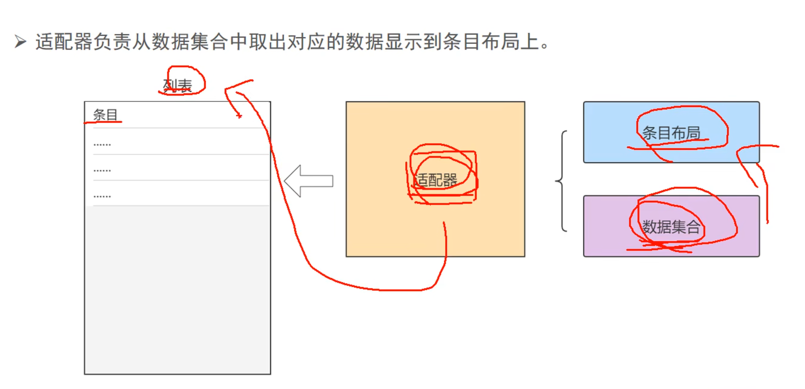

## 1.PagerAdapter和RecyclerAdapter

### 1.1 整体介绍

- PagerAdapter通常用于ViewPager，管理多个页面的切换，而RecyclerAdapter用于RecyclerView，负责滚动列表中列表项的显示和数据处理。
- **PagerAdapter**会复用相邻页面复用（默认保留左右各1页），RecyclerAdapter则通过ViewHolder机制进行视图复用

### 1.2 RecyclerAdapter整体结构

- 要想理解RecyclerAdapter，你需要先理解RecyclerView，其有ViewGroup，有布局方式，有子View，有数据集合。
  - 通过布局方式设置子View在ViewGroup的显示方式。而子View通过绑定数据集合中的数据来显示内容。
- 因此对于RecyclerAdapter，其有以下关键组件。
  - RecyclerView.Adapter - 自动化处理数据集合并负责绑定视图
  - ViewHolder - 持有所有的用于绑定数据的View
  - LayoutManager - 负责摆放视图等相关操作
- 当然还有**ItemDecoration** 绘制分割线等，在此不做过多赘述。
  - 
- ok，我们说了RecyclerAdapter的关键组件，那么我们该怎么理解他们之间的关系或者说工作模式呢？
  - 具体如下：RecyclerView是整体的列表，视作一个ViewGroup。里面的每个条目都是其一个子View，条目由ViewHolder容纳。view需要绑定数据，我们将数据集合传递给Adapter。在其内部的onBindViewHolder逻辑中，设置单条数据如何填充单个ViewHolder条目。列表通过LayoutManager 管理条目布局。
  - 举例：对于当前一个网格屏幕，里面分两排，垂直显示6个视频。这是通过LayoutManager 管理条目布局。这每个视频就是一个子View，是一个ViewHolder。他们显示在这个大的RecyclerView这个ViewGroup上。每个视频要有视频来源，简介等，这些被存放在数据集合中，我们把数据结合传递给Adapter，在其内部的onBindViewHolder逻辑中，设置单条数据如何填充单个ViewHolder条目。。

### 1.3 ViewHolder作用

- ViewHolder核心作用是实现视图复用。它身是条目视图的容器。容纳条目视图。

  - 考虑一个没有ViewHolder的情况，对于RecyclerView，其是一个ViewGroup，内部包含多个子View。我们进行滑动操作，如果没有ViewHolder，那么每次滑动到新的，我们需要手动在adapter逻辑中创建一个View实例，并将adapter中的数据源输入到布局中。同时旧的会被销毁。而有了ViewHolder，其可以容纳子View，又因为新旧他们的布局逻辑都一样，所以只需要通过onBindViewHolder更新旧的中的数据即可。

- 若无 ViewHolder 机制，每次列表滑动导致新条目进入屏幕时，系统会：

  - 📉 **频繁调用 `inflate()`**：XML 解析和 View 对象创建（耗时操作）
  - 📉 **重复执行 `findViewById()`**：遍历视图树查找子 View（CPU 密集型）
  - 📉 **内存抖动**：大量临时 View 对象的创建和 GC 回收影响流畅度

- **ViewHolder 的解决方案**

  - ✅复用视图对象：通过缓存已创建的 View 实例，避免重复inflate()和findViewById

    ```
    // 无 ViewHolder 的伪代码（低效）
    fun getView(position: Int) {
        val view = inflate(R.layout.item) // 每次创建新对象
        val textView = view.findViewById<TextView>(R.id.tv)
        textView.text = data[position]
        return view
    }
    ```

  - ✅缓存子 View 引用：ViewHolder 内部保存findViewById结果，避免重复查找

    ```
    class ViewHolder(itemView: View) {
        // 只执行一次 findViewById
        val textView: TextView = itemView.findViewById(R.id.tv)
    }
    ```

  - **RecyclerView 的实际流程**
    滑动时处理逻辑：

    ```
    // Adapter 核心方法
    override fun onCreateViewHolder(...): ViewHolder {
        // 仅当无缓存可用时触发（低频）
        val itemView = LayoutInflater.inflate(R.layout.item, ...)
        return ViewHolder(itemView) // 初始化时执行一次 findViewById
    }
    
    override fun onBindViewHolder(holder: ViewHolder, position: Int) {
        // 高频调用，但只需更新数据
        holder.textView.text = data[position]
    }
    ```

- **关键对比**：

  | **场景**     | 无 ViewHolder             | 有 ViewHolder                  |
  | ------------ | ------------------------- | ------------------------------ |
  | 视图创建     | 每次滑动新建 View         | 复用缓存 View                  |
  | 子 View 查找 | 每次滑动执行 findViewById | 仅在 ViewHolder 创建时执行一次 |
  | 内存效率     | 低（频繁 GC）             | 高（对象复用）                 |

## 02.DiffUtil

- 再看一个新的问题，假如用户在当前子View中进行了点赞操作，导致后台数据库中视频列表的点赞数更新，那么我们如何更新这个子View呢？是使用notifyDataSetChanged回调吗？这不是最笨的方法吗？有其它更好的吗？有的，我们通过DiffUtil 类实现。类内部有两个方法

  - `areItemsTheSame()`通过比较 `userBean.uid` 的相等性，判断两个 Item 是否代表 **同一个对象**（例如，是否对应同一个用户）。

  - `areContentsTheSame()`在确认是同一个 Item 后，判断同一数据实体的内容是否有变化（是否需要更新 UI）。

  - ```
    class VideoDiff : DiffUtil.ItemCallback<VideoBean>() {
        override fun areItemsTheSame(oldItem: VideoBean, newItem: VideoBean): Boolean {
            return (oldItem.userBean!!.uid == newItem.userBean!!.uid)
        }
    
        override fun areContentsTheSame(oldItem: VideoBean, newItem: VideoBean): Boolean {
            return (oldItem.videoRes == newItem.videoRes && oldItem.userBean!!.uid == newItem.userBean!!.uid)
        }
    }
    ```

  - 假设数据集从 `oldList` 变为 `newList`，DiffUtil 会按以下步骤对比：

    - **遍历新旧列表**，通过 `areItemsTheSame` 判断是否为同一 Item。
    - 若为同一 Item，调用 `areContentsTheSame` 检查是否需要更新 UI。
    - 最终生成一个差异报告 (`DiffResult`)，包含插入、删除、移动、更新的位置信息。
    - Adapter 根据 `DiffResult` 调用 `notifyItemRangeInserted` 等方法局部更新。

- **DiffUtil闪光点**：

  - 首先从notifyDataSetChanged更改为VideoDiff，每次数据更新都触发完整的onBindViewHolder。

  - 全局notifyDataSetChanged是什么样的？为什么使用VideoDiff相对于它的提升这么大？

    - DiffUtil只涉及条目级别的更新，以及使用payload进行更细粒度的更新。需要举例说明，比如一个有1000项的列表，只有一项变化时，DiffUtil只会更新那一项，而notifyDataSetChanged会触发全部1000项的重新绑定。

  - 再优化：通过getChangePayload，实现仅更新点赞数字，而不重绘整个Item

  - ```
    // 在 VideoDiff 中添加
    override fun getChangePayload(oldItem: VideoBean, newItem: VideoBean): Any? {
        return if (oldItem.likeCount != newItem.likeCount) {
            Bundle().apply { putInt("LIKE_COUNT", newItem.likeCount) }
        } else {
            super.getChangePayload(oldItem, newItem)
        }
    }
    
    // 在 Adapter 中处理局部更新
    override fun onBindViewHolder(holder: ViewHolder, position: Int, payloads: List<Any>) {
        if (payloads.isNotEmpty()) {
            (payloads[0] as? Bundle)?.getInt("LIKE_COUNT")?.let { 
                holder.updateLikeCount(it) // 仅更新点赞数视图
            }
        } else {
            super.onBindViewHolder(holder, position, payloads)
        }
    }
    ```

  - | **刷新方式**                | 1000 条数据刷新耗时 | 内存波动 |
    | --------------------------- | ------------------- | -------- |
    | 全局 `notifyDataSetChanged` | 120 ms              | 高       |
    | 使用 `VideoDiff`            | 15 ms               | 低       |
